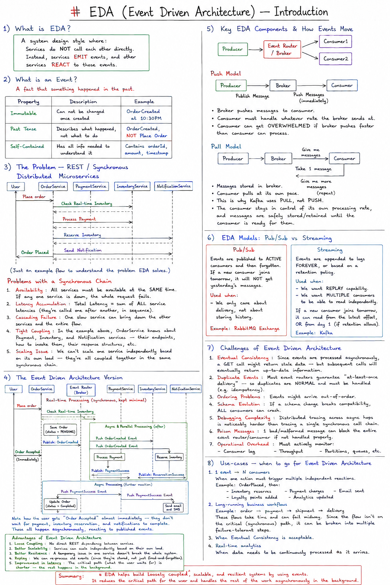
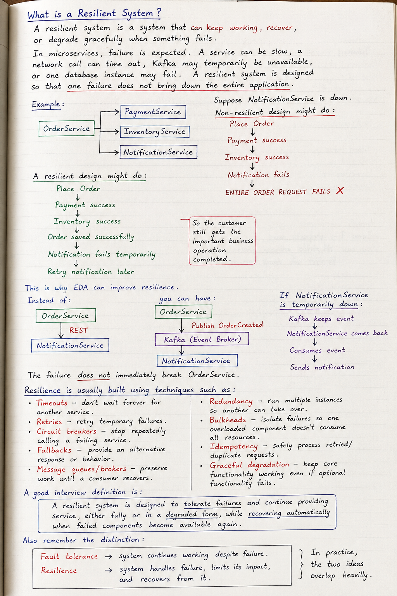
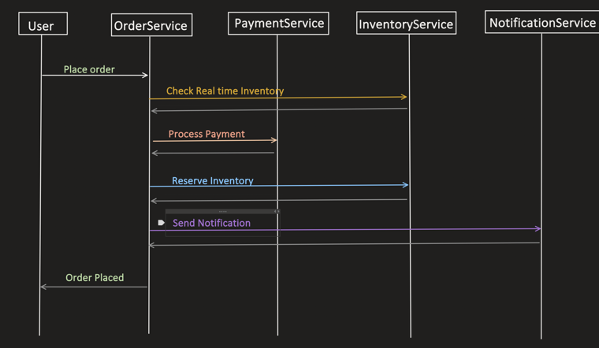
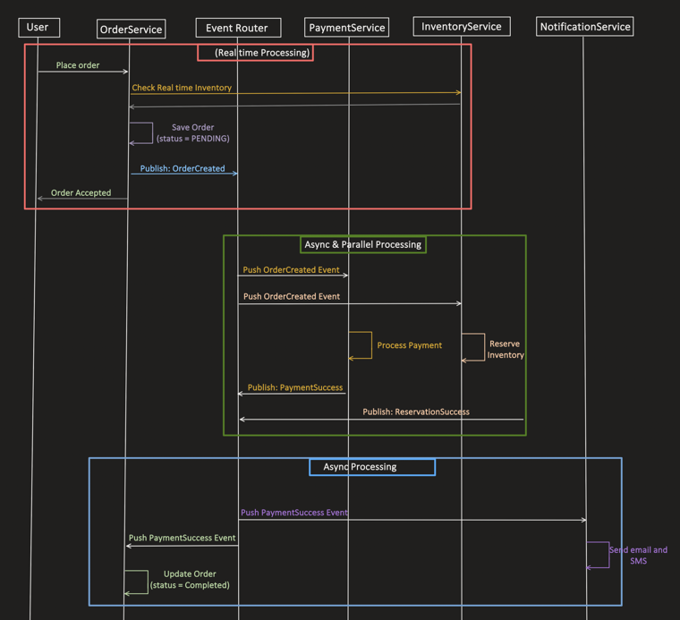
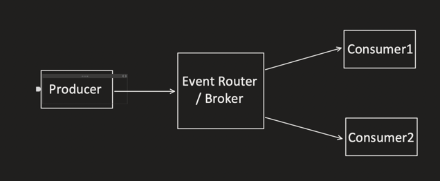
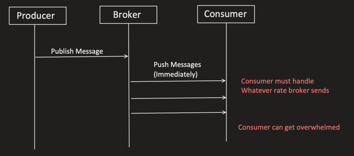
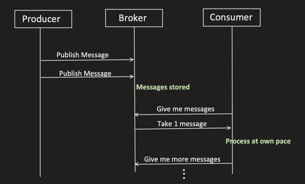

## What is EDA?

```
A system design style where:
  Services do NOT call each other directly.
  Instead, services EMIT events, and other services REACT to those events.
```

## What is an Event?

```
A fact that something happened in the past.
```

| Property | Description | Example |
|---|---|---|
| Immutable | Can not be changed once created | `OrderCreated at 10:30PM` |
| Past Tense | Describes what happened, not what to do | `OrderCreated`, NOT `Place Order` |
| Self-Contained | Has all info needed to understand it | Contains `orderId`, `amount`, `timestamp` |

---

## The problem — REST / Synchronous Distributed Microservices



```
User → OrderService:      Place order
OrderService → PaymentService, InventoryService, NotificationService:
  Check Real-time Inventory → response
  Process Payment          → response
  Reserve Inventory        → response
  Send Notification        → response
OrderService → User: Order Placed
```

(Just an example flow to understand the problem EDA solves.)

### Problems with a Synchronous Chain

```
1. Availability
   All services must be available at the SAME time. If any one service
   is down, the whole request fails.

2. Latency Accumulation
   Total Latency = sum of ALL service latencies (they're called one
   after another, in sequence).

3. Cascading Failure
   One slow service can bring down the other services and the entire
   flow.

4. Tight Coupling
   In the example above, OrderService knows about Payment, Inventory,
   and Notification services — their endpoints, how to invoke them,
   their response structures, etc.

5. Scaling Issue
   We can't scale one service independently based on its own load —
   they're all coupled together in the same synchronous chain.
```

---

## The Event Driven Architecture version



```
Real-time Processing (synchronous, kept minimal):
  User → OrderService: Place order
  OrderService → Event Router: Check Real-time Inventory → response
  OrderService: Save Order (status = PENDING)
  OrderService → Event Router: Publish "OrderCreated"
  OrderService → User: Order Accepted (immediately, doesn't wait for
                        payment/inventory/notification to finish)

Async & Parallel Processing (happens after, in parallel, via events):
  Event Router → PaymentService:    Push OrderCreated Event
  Event Router → InventoryService:  Push OrderCreated Event
  PaymentService:    Process Payment    → Publish: PaymentSuccess
  InventoryService:  Reserve Inventory  → Publish: ReservationSuccess

Async Processing (a further reaction to PaymentSuccess):
  Event Router → OrderService: Push PaymentSuccess Event
  OrderService: Update Order (status = Completed)
  Event Router → NotificationService: Send email and SMS
```

```
Note how the user gets "Order Accepted" almost immediately — they don't
wait for payment, inventory reservation, and notifications to complete.
Those all happen asynchronously, reacting to published events.
```

### Advantages of Event Driven Architecture

```
1. Loose Coupling
   No direct REST dependency between services.

2. Better Scalability
   Services can scale independently based on their own load.

3. Better Resilience
   A temporary issue in one service doesn't break the whole system.

4. Replay
   We can re-process old events (since they're stored, not just
   fired-and-forgotten).

5. Improvement in latency
   The critical path (what the user waits for) is shorter — the rest
   happens in the background.
```

---

## Key EDA Components & how events move



```
Producer → Event Router / Broker → Consumer1
                                 → Consumer2
```

### Push model



```
Producer → Broker: Publish Message
Broker → Consumer: Push Messages (immediately), one after another

Consumer must handle whatever rate the broker sends at.
Consumer can get OVERWHELMED if the broker pushes faster than the
consumer can process.
```

### Pull model



```
Producer → Broker: Publish Message (x2)
Broker: Messages stored
Consumer → Broker: "Give me messages"
Broker → Consumer: Take 1 message
Consumer processes at its OWN pace
Consumer → Broker: "Give me more messages" (repeat)
```

```
This is why Kafka uses PULL, not PUSH — the consumer stays in control
of its own processing rate, and messages are safely stored/retained
until the consumer is ready for them.
```

---

## EDA Models: Pub/Sub vs Streaming

### Pub/Sub

```
Events are published to ACTIVE consumers and then forgotten.
If a new consumer joins tomorrow, it will NOT get yesterday's messages.

Used when:
  - We only care about delivery, not about storing history.

Example: RabbitMQ Exchange
```

### Streaming

```
Events are appended to logs FOREVER, or based on a retention policy.

Used when:
  - We want REPLAY capability.
  - We want MULTIPLE consumers to be able to read independently.

If a new consumer joins tomorrow, it can read from the latest offset,
OR from day 1 (if retention allows).

Example: Kafka
```

---

## Challenges of Event Driven Architecture

```
1. Eventual Consistency
   Since events are processed asynchronously, a GET call might return
   stale data — but subsequent calls will eventually return up-to-date
   information.

2. Duplicate Events
   Most event routers guarantee "at-least-once delivery" — so
   duplicates are NORMAL and must be handled (e.g. idempotency).

3. Ordering Problems
   Events might arrive out-of-order.

4. Schema Evolution
   If a schema change breaks compatibility, ALL consumers can crash.

5. Debugging Complexity
   Distributed tracing across async hops is noticeably harder than
   tracing a single synchronous call chain.

6. Poison Messages
   1 bad/malformed message can block the entire event router/consumer
   if not handled properly.

7. Operational Overhead
   Must actively monitor:
     - Consumer lag
     - Throughput
     - Partitions, queues, etc.
```

---

## Use-cases — when to go for Event Driven Architecture

```
1. 1 event → N consumers
   When one action must trigger multiple independent reactions.

   Example: OrderPlaced, then:
     - Inventory reserves
     - Payment charges
     - Email sent
     - Loyalty points added
     - Analytics updated

2. Long-running business workflows
   Example: order → payment → shipment → delivery
   These flows take time and can fail midway. Since the flow isn't on
   the critical (synchronous) path, it can be broken into multiple
   failure-tolerant steps.

3. When Eventual Consistency is acceptable.

4. Real-time analytics
   When data needs to be continuously processed as it arrives.
```
