## Event-Driven Architecture (EDA)

Event-Driven Architecture is a design pattern where components communicate by **producing and consuming events** rather than calling each other directly. Components are loosely coupled — the producer doesn't know or care who's listening.

### Core Concepts

**Event** — A record of something that happened (e.g., `OrderPlaced`, `UserRegistered`)

**Producer** — Publishes events when something occurs

**Consumer** — Listens and reacts to events

**Event Bus / Broker** — The channel that routes events between producers and consumers


## What is an Event?

An **event** is simply a **record that something happened** in your system — a fact about the past, captured as an object.

Think of it like a notification: *"Hey, this thing just occurred."*

---

### Real-World Analogy

> When you place an order on Amazon:
> - Amazon doesn't directly call the warehouse, email team, and billing team one by one.
> - Instead, it fires an **`OrderPlaced`** event.
> - Each department *listens* and reacts independently.

The event is just the **message** carrying the facts: *what happened, when, and with what data.*

---

### In Java — An Event is Just a Class

```java
// Minimal event — just a POJO or record
public record OrderPlacedEvent(
    String orderId,
    String customerId,
    double totalAmount,
    LocalDateTime occurredAt   // when it happened
) {}
```

That's it. No logic. No methods. Just **data describing what happened.**

---

### Anatomy of a Good Event

```java
public record UserRegisteredEvent(
    String eventId,        // unique ID for this event
    String userId,         // who it's about
    String email,          // relevant data
    LocalDateTime at       // when it happened
) {}
```

| Field | Purpose |
|---|---|
| `eventId` | Uniquely identify this event |
| `userId` | The subject of the event |
| `email` | Data needed by consumers |
| `at` | Timestamp — events describe the **past** |

---

### Key Characteristics of an Event

**1. Immutable** — Events describe something that already happened; you can't change the past
```java
// Use record (immutable by default) — preferred
public record PaymentFailedEvent(String paymentId, String reason) {}
```

**2. Named in past tense** — Convention makes intent clear
```
✅  OrderPlaced, UserRegistered, PaymentFailed
❌  PlaceOrder, RegisterUser, FailPayment  ← these are commands, not events
```

**3. Self-contained** — Carries all the data a listener needs
```java
// Bad — consumer has to go fetch more data
public record OrderPlacedEvent(String orderId) {}

// Good — carries enough context
public record OrderPlacedEvent(String orderId, String customerId, double amount) {}
```

**4. Describes the past, not intent** — An event says *"this happened"*, not *"please do this"*

---

### Event vs Command vs Query

| | Command | Event | Query |
|---|---|---|---|
| **Example** | `PlaceOrder` | `OrderPlaced` | `GetOrderById` |
| **Intent** | Do something | Something happened | Fetch data |
| **Direction** | One target | Many listeners | One responder |
| **Tense** | Imperative | Past tense | Question |

---

### Summary

> An **event** = an **immutable, named, past-tense fact** about something that occurred in your system, packaged as a data object and broadcast so interested parties can react.

It's the foundation of EDA — everything else (producers, consumers, buses) exists just to create and handle events.


---

### Simple In-Memory Example (Pure Java)

```java
// 1. Define an Event
public record OrderPlacedEvent(String orderId, double amount) {}

// 2. Define a Consumer (Listener) interface
@FunctionalInterface
public interface EventListener<T> {
    void onEvent(T event);
}

// 3. Simple Event Bus
public class EventBus {
    private final Map<Class<?>, List<EventListener<?>>> listeners = new HashMap<>();

    public <T> void subscribe(Class<T> eventType, EventListener<T> listener) {
        listeners.computeIfAbsent(eventType, k -> new ArrayList<>()).add(listener);
    }

    @SuppressWarnings("unchecked")
    public <T> void publish(T event) {
        List<EventListener<?>> eventListeners = listeners.getOrDefault(event.getClass(), List.of());
        for (EventListener<?> listener : eventListeners) {
            ((EventListener<T>) listener).onEvent(event);
        }
    }
}

// 4. Wire it together
public class Main {
    public static void main(String[] args) {
        EventBus bus = new EventBus();

        // Subscribe consumers
        bus.subscribe(OrderPlacedEvent.class, e ->
            System.out.println("Email sent for order: " + e.orderId()));

        bus.subscribe(OrderPlacedEvent.class, e ->
            System.out.println("Inventory updated for: " + e.orderId()));

        // Publish an event
        bus.publish(new OrderPlacedEvent("ORD-001", 199.99));
    }
}
```

**Output:**
```
Email sent for order: ORD-001
Inventory updated for: ORD-001
```

---

### With Spring (Most Common in Production)

Spring makes EDA very clean with `@EventListener` and `ApplicationEventPublisher`.

```java
// 1. Event class
public record PaymentProcessedEvent(String paymentId, String userId) {}

// 2. Producer Service
@Service
public class PaymentService {

    private final ApplicationEventPublisher publisher;

    public PaymentService(ApplicationEventPublisher publisher) {
        this.publisher = publisher;
    }

    public void processPayment(String userId) {
        // ... payment logic ...
        publisher.publishEvent(new PaymentProcessedEvent("PAY-123", userId));
    }
}

// 3. Consumer Services (completely decoupled from producer!)
@Service
public class NotificationService {
    @EventListener
    public void onPayment(PaymentProcessedEvent event) {
        System.out.println("Notify user: " + event.userId());
    }
}

@Service
public class AuditService {
    @EventListener
    public void onPayment(PaymentProcessedEvent event) {
        System.out.println("Audit log: " + event.paymentId());
    }
}
```

For **async** handling (non-blocking), just add `@Async`:
```java
@Async
@EventListener
public void onPayment(PaymentProcessedEvent event) { ... }
```

---

### With Kafka (Distributed / Microservices)

For events that need to cross service boundaries:


## Events Crossing Service Boundaries

This means: **two completely separate applications/microservices need to communicate.**

---

### What is a "Service Boundary"?

Imagine your system is split into independent services, each with its own:
- Codebase
- Database
- Server / JVM process

```
┌─────────────────┐        ┌──────────────────────┐
│   Order Service │        │  Inventory Service    │
│   (Java App 1)  │        │  (Java App 2)         │
│   Port: 8081    │        │  Port: 8082           │
│   Its own DB    │        │  Its own DB           │
└─────────────────┘        └──────────────────────┘
```

These two apps **cannot share memory** — they run in separate JVM processes. So Spring's `@EventListener` (which works in-memory) **won't work here.**

---

### The Problem Without EDA

The naive solution is a **direct HTTP call:**

```java
// Order Service directly calling Inventory Service
@Service
public class OrderService {
    public void placeOrder(Order order) {
        // Tight coupling! Order Service must KNOW about Inventory Service
        restTemplate.post("http://inventory-service/reserve", order);
        restTemplate.post("http://notification-service/notify", order);
        restTemplate.post("http://billing-service/charge", order);
        // If ANY of these fail or are slow, the whole thing breaks
    }
}
```

**Problems:**
- ❌ Order Service is tightly coupled to 3 other services
- ❌ If Inventory Service is down, Order placement fails
- ❌ Hard to add a new service later

---

### The Solution — A Message Broker (e.g. Kafka)

A **broker sits in the middle** and decouples the services completely:

```
┌─────────────────┐        ┌─────────┐       ┌────────────────────┐
│  Order Service  │──────▶ │  Kafka  │──────▶│  Inventory Service │
│  (Producer)     │publishes│ (Broker)│consume│  (Consumer)        │
└─────────────────┘  event └─────────┘       └────────────────────┘
                                │
                                │─────────────▶ Notification Service
                                │
                                └─────────────▶ Billing Service
```

- Order Service **publishes once** to Kafka
- Every other service **independently consumes** the event
- Services don't know about each other at all

---

### In Code

**Order Service (App 1) — Producer:**
```java
@Service
public class OrderService {
    private final KafkaTemplate<String, String> kafka;

    public void placeOrder(Order order) {
        // Just fire the event and forget
        // Doesn't know or care who's listening
        kafka.send("order-events", order.getId(), toJson(order));
    }
}
```

**Inventory Service (App 2) — Consumer:**
```java
// Completely separate Spring Boot application
@Service
public class InventoryService {

    @KafkaListener(topics = "order-events", groupId = "inventory-group")
    public void handleOrder(String payload) {
        System.out.println("Reserving stock for: " + payload);
    }
}
```

**Notification Service (App 3) — Also a Consumer:**
```java
// Another separate Spring Boot application
@Service
public class NotificationService {

    @KafkaListener(topics = "order-events", groupId = "notification-group")
    public void handleOrder(String payload) {
        System.out.println("Sending email for: " + payload);
    }
}
```

---

### Why Kafka Specifically?

| Feature | Why it helps across boundaries |
|---|---|
| **Persistent log** | Events are stored; consumers can replay them |
| **Multiple consumers** | Many services read the same event independently |
| **Async** | Producer doesn't wait for consumers to finish |
| **Resilient** | Consumer can be down and catch up later |

---

### Simple Summary

> **Within one app** → use Spring `@EventListener` (in-memory)
>
> **Across separate apps** → use a broker like **Kafka or RabbitMQ** as the middleman, so services never directly talk to each other.

```java
// Producer (Order Service)
@Service
public class OrderService {
    private final KafkaTemplate<String, String> kafka;

    public void placeOrder(Order order) {
        kafka.send("order-events", order.getId(), toJson(order));
    }
}

// Consumer (Inventory Service — completely separate app)
@Service
public class InventoryService {
    @KafkaListener(topics = "order-events", groupId = "inventory-group")
    public void handleOrder(String payload) {
        System.out.println("Reserving stock for: " + payload);
    }
}
```

---

### Key Benefits

| Benefit | Why it matters |
|---|---|
| **Loose coupling** | Services don't reference each other |
| **Scalability** | Consumers scale independently |
| **Resilience** | One consumer failing doesn't break others |
| **Extensibility** | Add new listeners without changing producers |
| **Auditability** | Events form a natural history log |

---

### When to Use It

✅ **Good fit:** Microservices, async workflows, notifications, audit logging, real-time updates

❌ **Avoid when:** You need immediate response/return values, simple CRUD apps, or tight transactional consistency is required across steps

The most common Java stack for EDA is **Spring Boot + Apache Kafka** for distributed systems, or **Spring Events** for within a single application.


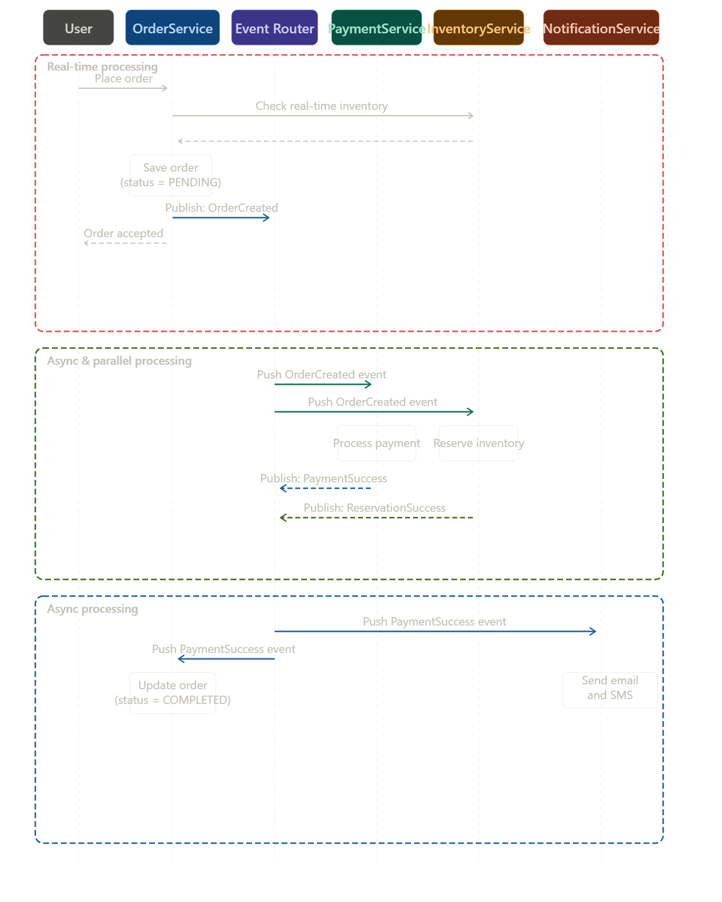

Here's the full sequence diagram combined into one image, matching both your screenshots. It shows all three phases:

- **Red box** — Real-time processing: the user places an order, inventory is checked synchronously, the order is saved as PENDING, and `OrderCreated` is published. The user gets an immediate "Order Accepted" response.
- **Green box** — Async & parallel processing: the Event Router pushes the `OrderCreated` event to both PaymentService and InventoryService simultaneously. They process in parallel and each publish their success events back.
- **Blue box** — Async processing (completion): the Event Router pushes the `PaymentSuccess` event to NotificationService (sends email/SMS) and back to OrderService (updates status to COMPLETED).


## Real time processing 


**Real-time processing** = the part that happens **synchronously, while the user is still waiting**. The user clicked "Place Order" and is staring at a loading spinner — this phase must finish before they get a response.

Here's what happens step by step inside that red box:

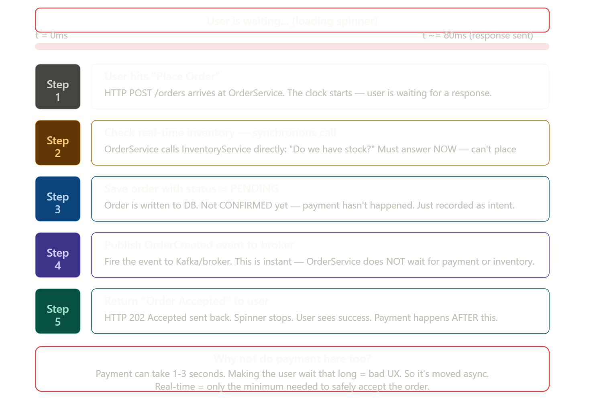

### The core idea in one line

> Real-time processing = **everything that MUST happen before you can reply to the user.** Nothing more, nothing less.

---

### Why only those 3 steps synchronously?

The system asks: *"What is the minimum work we must do before telling the user their order is accepted?"*

Step 2 (inventory check) **must** be synchronous — you can't accept an order for something you don't have in stock. That's a business rule that needs an immediate answer.

Step 3 (save as PENDING) **must** be synchronous — you need a record of the order before firing any events about it.

Step 4 (publish event) is done before responding, but it's just a fire-and-forget push to the broker — it takes microseconds.

Payment, email, inventory reservation — none of those **need** to block the user. They happen in the green and blue boxes after the user has already seen "Order Accepted."

---

### Real-world analogy

Think of ordering food at a restaurant:

> The waiter comes to your table, takes your order, checks "is that dish available today?" (inventory check), writes it down (save as PENDING), hands the ticket to the kitchen (publish event), and says *"Great, your order is placed!"* — all within 30 seconds while you watch.

The kitchen cooking the food, the cashier preparing your bill, the manager logging the sale — all of that happens **after** the waiter has already walked away. You don't wait for it. That's async processing.


## Why two async boxes??


Great observation! Both ARE async — but they represent **two different phases of async work** that happen at different times and for different reasons.

Think of it like this:

> Green box = **"start the work"** → Blue box = **"finish the work after results come back"**### The real reason for two boxes — different triggers

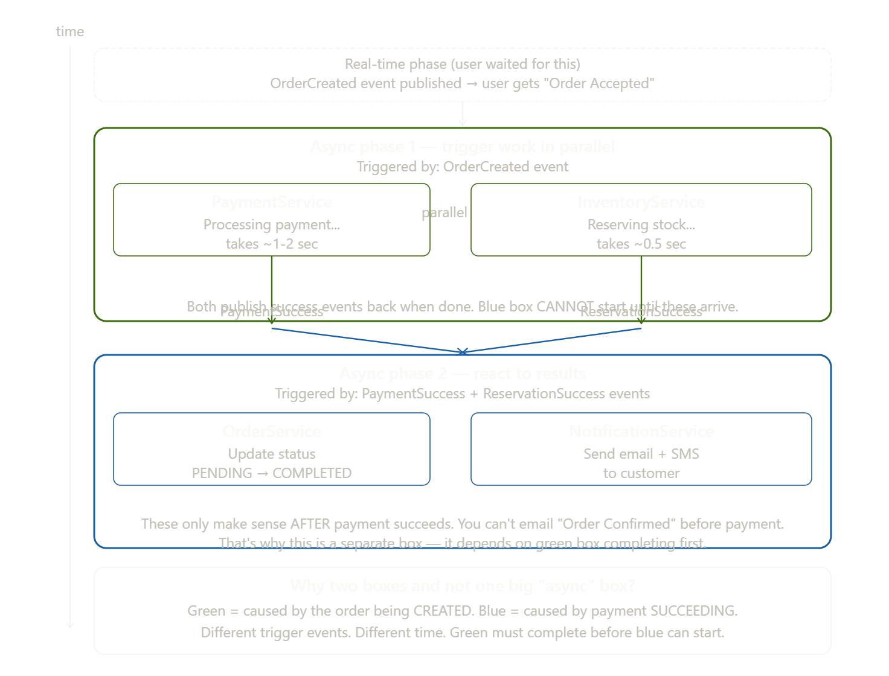

Both are async, yes. But they are triggered by **completely different events** at **different points in time:**

| | Green box | Blue box |
|---|---|---|
| Triggered by | `OrderCreated` event | `PaymentSuccess` event |
| Starts when | Order is accepted | Payment is confirmed |
| Can run before green? | Yes — it IS first | No — impossible |

---

### The dependency is the key

The blue box **cannot start** until the green box finishes. You absolutely cannot send a "Your order is confirmed!" email before you know if payment succeeded. That would be a disaster.

```
Green box runs → PaymentSuccess event fires → Blue box starts

If you merged them into one box:
"Here's what's async... payment, inventory, email, order update"
— you'd lose the fact that email DEPENDS ON payment result
```

---

### Think of it like cooking a meal

> Green box = putting the chicken in the oven (async — you walk away and do other things)
>
> Blue box = plating the food and calling guests to the table (also async — you're not standing there waiting)
>
> But blue **cannot happen** before green. You don't plate raw chicken. The two phases are separate because one **depends on the result** of the other.

So the two boxes aren't just "async vs async" — they show that **async work can itself have sequential dependencies**, and the diagram makes that dependency visible with two separate labeled phases.


In EDA, **Push** and **Pull** are two different ways consumers receive events from the broker.

## Push vs Pull in EDA

The core difference is simple: **who initiates the data transfer?**

**Push** — the broker sends events to the consumer automatically as soon as they arrive. The consumer just waits and reacts.

**Pull** — the consumer goes to the broker and asks "do you have anything for me?" on its own schedule.

Here are the two models side by side:### Push — broker drives delivery

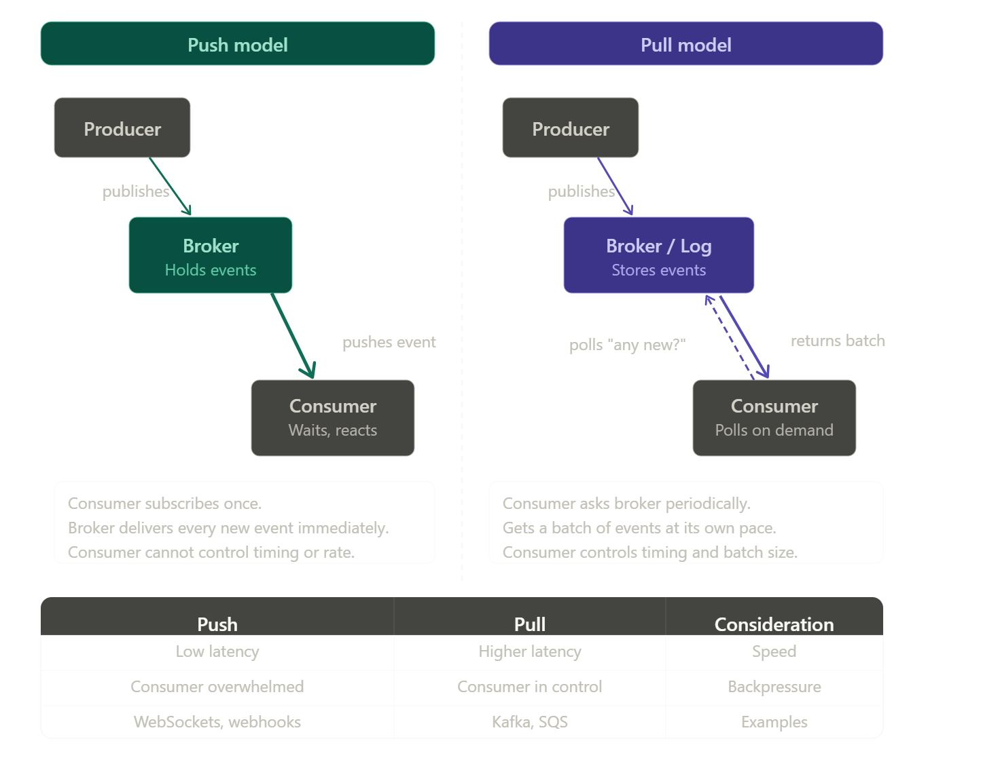


The broker actively delivers events to the consumer the moment they arrive. The consumer just listens.

```java
// Kafka with Push-style via Spring @KafkaListener
// Consumer registers once — broker pushes events to it automatically
@KafkaListener(topics = "order-events", groupId = "payment-group")
public void handleOrder(String event) {
    // broker called this — you didn't ask for it
    processPayment(event);
}
```

Real-world analogy: like getting an email notification. You don't check your inbox — the server pushes the alert to your phone the moment it arrives.

---

### Pull — consumer drives delivery

The consumer periodically asks the broker "do you have anything for me?" and fetches a batch on its own schedule. Kafka actually uses pull internally — `KafkaConsumer.poll()` is the key method.

```java
// Raw Kafka Consumer — Pull model
KafkaConsumer<String, String> consumer = new KafkaConsumer<>(props);
consumer.subscribe(List.of("order-events"));

while (true) {
    // Consumer ASKS the broker — "give me up to 100ms worth of records"
    ConsumerRecords<String, String> records = consumer.poll(Duration.ofMillis(100));

    for (ConsumerRecord<String, String> record : records) {
        processOrder(record.value());
    }
    // Consumer decides when to poll again — full control
}
```

Real-world analogy: like manually refreshing your inbox. You decide when to check, and you get everything that accumulated since your last check.

---

### When to use which

Use push when you need real-time reaction and your consumer can keep up — notifications, live dashboards, fraud detection. Use pull when your consumer needs to control its own pace — batch processing, slow downstream services, or when you want to replay old events from a specific offset (Kafka's killer feature).

In practice, Kafka is fundamentally pull-based, while AWS SNS and WebSockets are push-based. Spring's `@KafkaListener` hides the polling loop from you, but under the hood it's still pull.

# Pub/sub vs streaming

 These are two fundamental patterns in EDA that are often confused.

**Pub/Sub** — fire and forget. Events are delivered to subscribers and then gone. Think notifications.

**Streaming** — events are stored in an ordered log permanently (or for a set time). Consumers can replay, rewind, and process at their own pace.

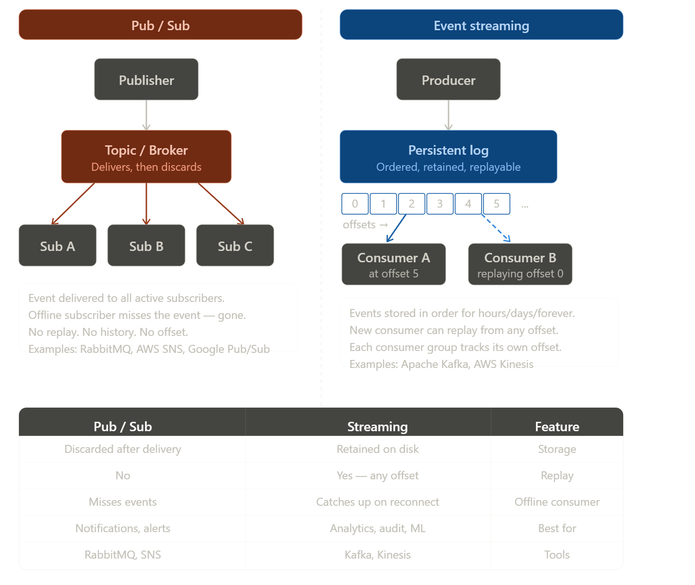

### The key difference in one line

> Pub/Sub says *"here's the event, catch it or miss it."* Streaming says *"here's the event, stored at offset 42 — read it whenever you want."*

---

### In Java code

**Pub/Sub with RabbitMQ** — message is gone once delivered:
```java
// Publisher fires and forgets
rabbitTemplate.convertAndSend("order.exchange", "order.created", event);

// Subscriber — if it's offline when message arrives, it's lost
@RabbitListener(queues = "order.queue")
public void handleOrder(OrderEvent event) {
    // got it — but only if we were online
}
```

**Streaming with Kafka** — events live in a log, consumers track their own offset:
```java
// Consumer A — processing live, currently at offset 150
@KafkaListener(topics = "orders")
public void handleLive(ConsumerRecord<String, String> record) {
    System.out.println("Offset: " + record.offset()); // e.g. 150
}

// Consumer B — brand new service, replays ALL history from the beginning
consumer.seekToBeginning(consumer.assignment()); // rewind to offset 0
// now processes every order ever placed — pub/sub can never do this
```

---

### When to choose which

Use **pub/sub** when the event only matters right now — sending a notification, triggering a webhook, alerting a dashboard. If the subscriber missed it, that's fine.

Use **streaming** when the event has lasting value — audit logs, analytics pipelines, ML training data, financial records, or any new service that needs to catch up on history. Kafka's ability to let any consumer replay from offset 0 is its superpower over pub/sub.

In many real systems you actually use both — Kafka for the durable event log, and something like SNS/RabbitMQ for lightweight real-time fan-out to things like mobile push notifications.


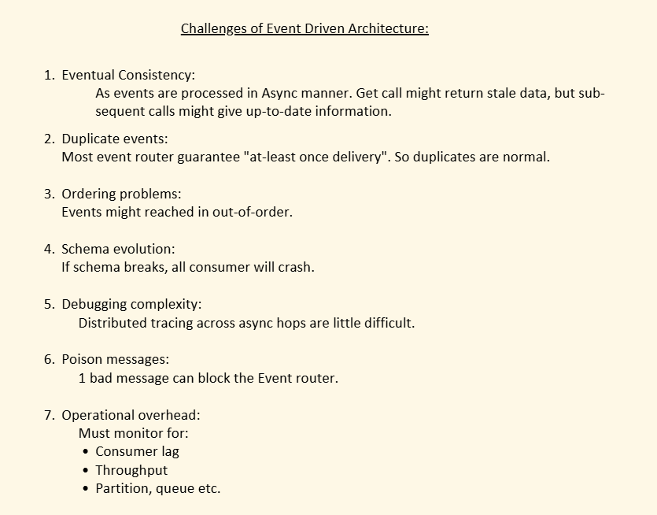


## Ordering problem 


 Ordering is one of the trickiest problems in EDA. Let me first show you **why** the problem happens, then walk through each solution.

### Why ordering breaks in EDANow let's look at each solution with real Java code.

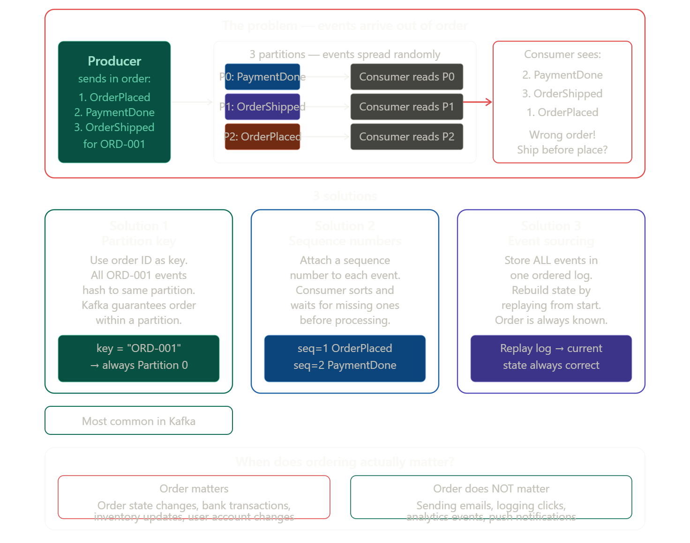
---

### Solution 1 — Partition Key (most common, use this first)

The idea: **same key = same partition = guaranteed order**. Kafka orders events within a partition, so pin all events for one entity to one partition using its ID as the key.

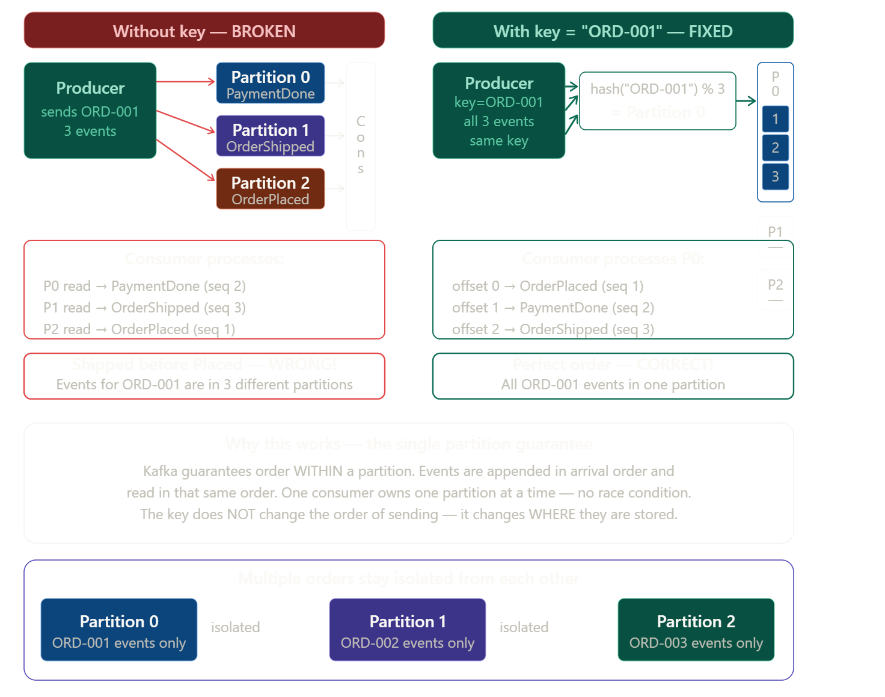


The ordering problem **only happens when events for the same order land in different partitions**. The partition key solution fixes exactly that — by ensuring all 3 events for `ORD-001` go to the **same partition**, so they are always read in the order they were written.You were actually misunderstanding **where** the ordering problem comes from. Let me make it crystal clear:

### The ordering problem is NOT about the events being different

The problem is NOT that `OrderPlaced`, `PaymentDone`, `OrderShipped` have different data. The problem is that **without a key, Kafka spreads them across different partitions** — and different partitions are read by different consumers in parallel, so they race against each other.

```
WITHOUT key — Kafka does round-robin across partitions:

Event 1 → OrderPlaced  → Partition 0  ← Consumer A reads this
Event 2 → PaymentDone  → Partition 1  ← Consumer B reads this (faster!)
Event 3 → OrderShipped → Partition 2  ← Consumer C reads this (fastest!)

Result: Consumer sees PaymentDone before OrderPlaced. Disaster.

─────────────────────────────────────────────

WITH key = "ORD-001" — Kafka hashes key to ONE partition:

Event 1 → OrderPlaced  → Partition 0  ←
Event 2 → PaymentDone  → Partition 0  ← ONE consumer reads all 3, in order
Event 3 → OrderShipped → Partition 0  ←

Result: OrderPlaced → PaymentDone → OrderShipped. Correct.
```

### The partition is like a single queue

Think of a partition as a **single queue at a checkout counter**. Everyone in that queue is served in the exact order they arrived. The key just makes sure all of ORD-001's events join **the same queue** instead of splitting across three different queues where anyone could get served first.

```java
// Without key — Kafka decides partition randomly (round-robin)
kafka.send("order-events", toJson(event)); // ← dangerous

// With key — same orderId always = same partition
kafka.send("order-events", "ORD-001", toJson(event)); // ← safe
kafka.send("order-events", "ORD-001", toJson(event)); // same partition
kafka.send("order-events", "ORD-001", toJson(event)); // same partition
```

### As a bonus — different orders run in parallel

The beauty of this approach is that while `ORD-001` events are all in Partition 0 in perfect order, `ORD-002` events are all in Partition 1 and `ORD-003` in Partition 2 — so **different orders still process in parallel**, you just never mix events from different orders in the same partition. Best of both worlds.

```java
// Producer — always use the order ID as the key
@Service
public class OrderService {

    private final KafkaTemplate<String, String> kafka;

    public void orderPlaced(Order order) {
        kafka.send("order-events", order.getId(), toJson(new OrderPlacedEvent(order)));
        // key = "ORD-001" → always hashes to Partition 0
    }

    public void paymentDone(Order order) {
        kafka.send("order-events", order.getId(), toJson(new PaymentDoneEvent(order)));
        // key = "ORD-001" → same Partition 0 → AFTER OrderPlaced
    }

    public void orderShipped(Order order) {
        kafka.send("order-events", order.getId(), toJson(new OrderShippedEvent(order)));
        // key = "ORD-001" → same Partition 0 → AFTER PaymentDone
    }
}
```

The consumer on Partition 0 always sees: `OrderPlaced → PaymentDone → OrderShipped`. Correct order, guaranteed.


The trade-off: one very busy order ID (like a flash sale) can overwhelm one partition. But for most use cases this is fine.

---

### Solution 2 — Sequence Numbers

When you can't control partitioning, **embed a version/sequence number** in each event. The consumer buffers and reorders before processing.

```java
// Event with sequence number
public record OrderEvent(
    String orderId,
    String type,
    int sequence,      // 1=Placed, 2=PaymentDone, 3=Shipped
    LocalDateTime at,
    Object payload
) {}

// Consumer that reorders before processing
@Service
public class OrderConsumer {

    // Buffer: orderId → list of out-of-order events
    private final Map<String, TreeMap<Integer, OrderEvent>> buffer = new ConcurrentHashMap<>();

    @KafkaListener(topics = "order-events")
    public void consume(OrderEvent event) {
        // Store in a sorted map by sequence number
        buffer
            .computeIfAbsent(event.orderId(), k -> new TreeMap<>())
            .put(event.sequence(), event);

        processInOrder(event.orderId());
    }

    private void processInOrder(String orderId) {
        TreeMap<Integer, OrderEvent> events = buffer.get(orderId);
        int expected = 1;

        while (events.containsKey(expected)) {
            process(events.remove(expected)); // process seq=1, then 2, then 3
            expected++;
        }
        // if seq=2 arrives before seq=1, it waits in the buffer
    }
}
```

---

### Solution 3 — Event Sourcing

Instead of trying to order events at consumption time, **store all events in a single ordered log and replay them** to rebuild state. The order is baked into the log itself.

```java
// Every state change is an event — never update a record directly
@Service
public class OrderEventStore {

    private final OrderEventRepository repo; // append-only table

    // Instead of: UPDATE orders SET status='PAID' WHERE id='ORD-001'
    // You do:
    public void recordPayment(String orderId, double amount) {
        repo.save(new OrderEvent(orderId, "PAYMENT_DONE", amount, LocalDateTime.now()));
    }

    // Rebuild current state by replaying ALL events in order
    public OrderState rebuildState(String orderId) {
        List<OrderEvent> events = repo.findByOrderIdOrderByTimestamp(orderId);

        OrderState state = new OrderState();
        for (OrderEvent e : events) {
            state.apply(e); // apply each event in sequence
        }
        return state; // always correct, always in order
    }
}
```

This is the most powerful solution but also the most complex to build.

---

### Which solution to use

In practice, **Solution 1 (partition key) solves 90% of ordering problems** in Kafka and should always be your first choice. Use Solution 2 when you have no control over partition assignment, and Solution 3 when you need a full audit trail and the ability to rebuild state from scratch at any point in time.


## Duplicate events

 Duplicates are one of the most common real-world problems in EDA. Let me first show you **why** duplicates happen, then walk through the solutions.

### Why duplicates happenNow here's how to actually fix it in Java code.

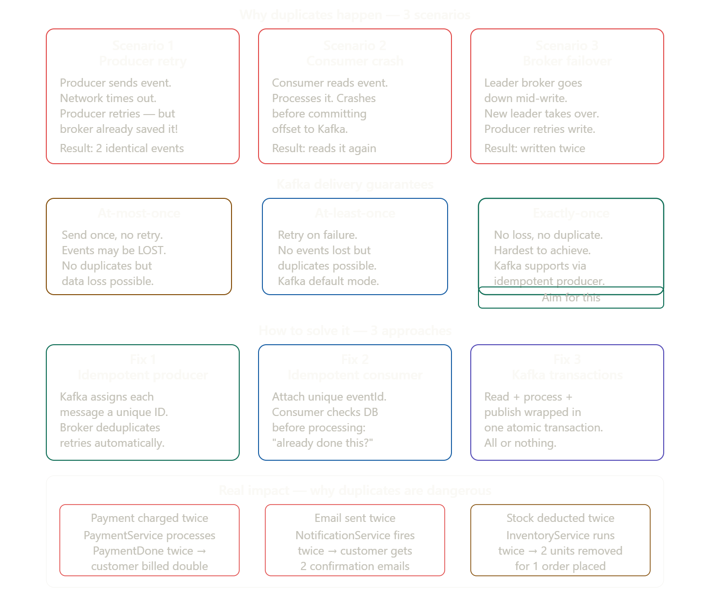
---

### Fix 1 — Idempotent Producer (stops duplicates at the source)

Turn on one property and Kafka handles producer retries automatically. The broker assigns each message a sequence number and silently drops retried duplicates.

```java
// application.properties
spring.kafka.producer.properties.enable.idempotence=true
spring.kafka.producer.acks=all
spring.kafka.producer.retries=3

// That's it — Kafka now guarantees exactly-once delivery from producer to broker
// Even if the network drops and producer retries, broker sees the duplicate
// sequence number and discards it silently
```

---

### Fix 2 — Idempotent Consumer (most practical, handles all cases)

This is the most important fix. The idea: **before processing any event, check if you've already processed it.** Store the `eventId` in your DB the first time you process it, and skip it if you see it again.

```java
// Every event carries a unique ID
public record OrderPlacedEvent(
    String eventId,      // "evt-uuid-001" — unique per event
    String orderId,
    double amount
) {}

// Consumer checks before processing
@Service
public class PaymentService {

    private final ProcessedEventRepository processedEvents;
    private final PaymentRepository payments;

    @KafkaListener(topics = "order-events")
    @Transactional
    public void onOrderPlaced(OrderPlacedEvent event) {

        // Check: have we already processed this event?
        if (processedEvents.existsById(event.eventId())) {
            log.info("Duplicate event {} — skipping", event.eventId());
            return; // safely ignore — already done
        }

        // Process the event
        payments.charge(event.orderId(), event.amount());

        // Mark as processed — if we crash after this line,
        // next retry sees the record and skips cleanly
        processedEvents.save(new ProcessedEvent(event.eventId()));
    }
}

// Simple table to track processed events
@Entity
public class ProcessedEvent {
    @Id
    private String eventId;       // UUID from the event
    private LocalDateTime processedAt;
}
```

The `@Transactional` is critical — the payment and the `processedEvents.save()` happen in one DB transaction. Either both succeed or neither does. No half-processed state.

---

### Fix 3 — Kafka Transactions (exactly-once across read + process + publish)

When your consumer reads an event, processes it, AND publishes a new event — you want all three to happen atomically. Kafka transactions wrap the whole thing.

```java
@Service
public class OrderProcessor {

    private final KafkaTemplate<String, String> kafka;

    @Transactional("kafkaTransactionManager")
    @KafkaListener(topics = "order-events")
    public void process(OrderPlacedEvent event) {
        // Step 1: read from order-events   ─┐
        // Step 2: do business logic          │ all atomic
        chargePayment(event);                 │
        // Step 3: publish to payment-events ─┘
        kafka.send("payment-events", event.orderId(), toJson(result));

        // If anything fails — the offset is NOT committed
        // and payment-events message is rolled back
        // Consumer will retry the whole thing from scratch
        // No partial state, no orphaned events
    }
}

// application.properties
spring.kafka.producer.transaction-id-prefix=tx-
```

---

### Which fix to use in practice

In real systems you typically combine Fix 1 and Fix 2 together:

```
Fix 1 (idempotent producer)  → stops duplicates entering Kafka from the producer side
Fix 2 (idempotent consumer)  → stops duplicates being processed on the consumer side
Fix 3 (transactions)         → only when you need atomic read + publish across topics
```

Fix 2 alone is enough for most teams. It's simple, works regardless of what the broker or producer does, and handles the most dangerous case — the consumer crash scenario where Kafka itself delivers the same event twice. If charging a customer twice would be a disaster (and it would be!), always implement Fix 2.


## Schema change

If there is schema chnage then it needs to be told across all the consumers

## Bad event

 "Bad event" is vague — let me make it very concrete. A bad event is any event that causes a consumer to throw an exception when it tries to process it. 
 
 There are 4 types:
 
 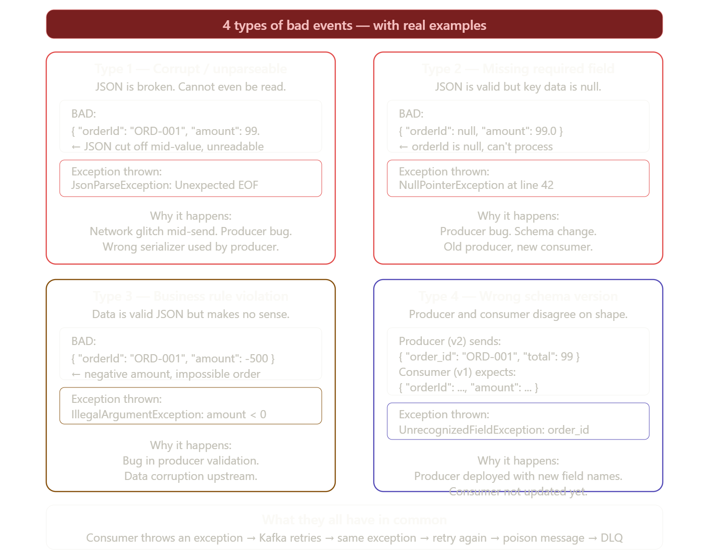
 
 Here is every type shown as actual Java code so you can see exactly what blows up:

---

### Type 1 — Corrupt / unparseable JSON

```java
// What the producer accidentally sent (network cut mid-send):
// { "orderId": "ORD-001", "amount": 99.      ← broken JSON

@KafkaListener(topics = "order-events")
public void onOrder(String raw) {

    // This line explodes — JSON is broken, cannot even be read
    OrderEvent event = objectMapper.readValue(raw, OrderEvent.class);
    //                 ↑ throws JsonParseException: Unexpected end-of-input

    processOrder(event); // never reaches here
}
```

The consumer cannot even get past the first line. Every retry hits the same wall.

---

### Type 2 — Missing required field

```java
// What the producer sent:
// { "orderId": null, "amount": 99.0 }
//              ↑ null — producer had a bug

@KafkaListener(topics = "order-events")
public void onOrder(OrderEvent event) {

    // Event parsed fine — but orderId is null
    String upper = event.orderId().toUpperCase();
    //                   ↑ NullPointerException here — orderId is null

    saveOrder(upper, event.amount());
}
```

---

### Type 3 — Business rule violation

```java
// What the producer sent:
// { "orderId": "ORD-001", "amount": -500.0 }
//                                   ↑ negative — makes zero business sense

@KafkaListener(topics = "order-events")
public void onOrder(OrderEvent event) {

    // Validation throws — amount is negative
    if (event.amount() <= 0) {
        throw new IllegalArgumentException(
            "Amount must be positive, got: " + event.amount()
        );
        // ↑ thrown every single retry — this is a poison message
    }

    chargeCustomer(event.amount());
}
```

---

### Type 4 — Wrong schema version

```java
// Producer (v2) deployed a renamed field:
// { "order_id": "ORD-001", "total": 99.0 }   ← new field names

// Consumer (v1) still expects:
public record OrderEvent(
    String orderId,   // ← expects "orderId" not "order_id"
    double amount     // ← expects "amount" not "total"
) {}

@KafkaListener(topics = "order-events")
public void onOrder(OrderEvent event) {
    // Jackson throws because "order_id" doesn't map to any field
    // UnrecognizedPropertyException: order_id
    // orderId and amount will both be null/0
    // Any null check downstream → NullPointerException
}
```

This type 4 is especially dangerous because it can silently corrupt your data — Jackson might not throw but gives you `null` values, and your code proceeds with wrong data without realising.

---

### The pattern in all 4 types

```
Good event  → consumer processes it → happy path
Bad event   → consumer throws exception → Kafka retries
            → same exception again → retry again
            → same exception again → max retries hit
            → sent to DLQ → partition unblocked
```

The event itself is the problem — no amount of retrying will fix it. The data is wrong, and the consumer code has no way to handle it. That is what makes it a "poison" message — it poisons the queue and stops everything behind it.


## Poison Message

 A poison message is one of the most sneaky problems in EDA.

 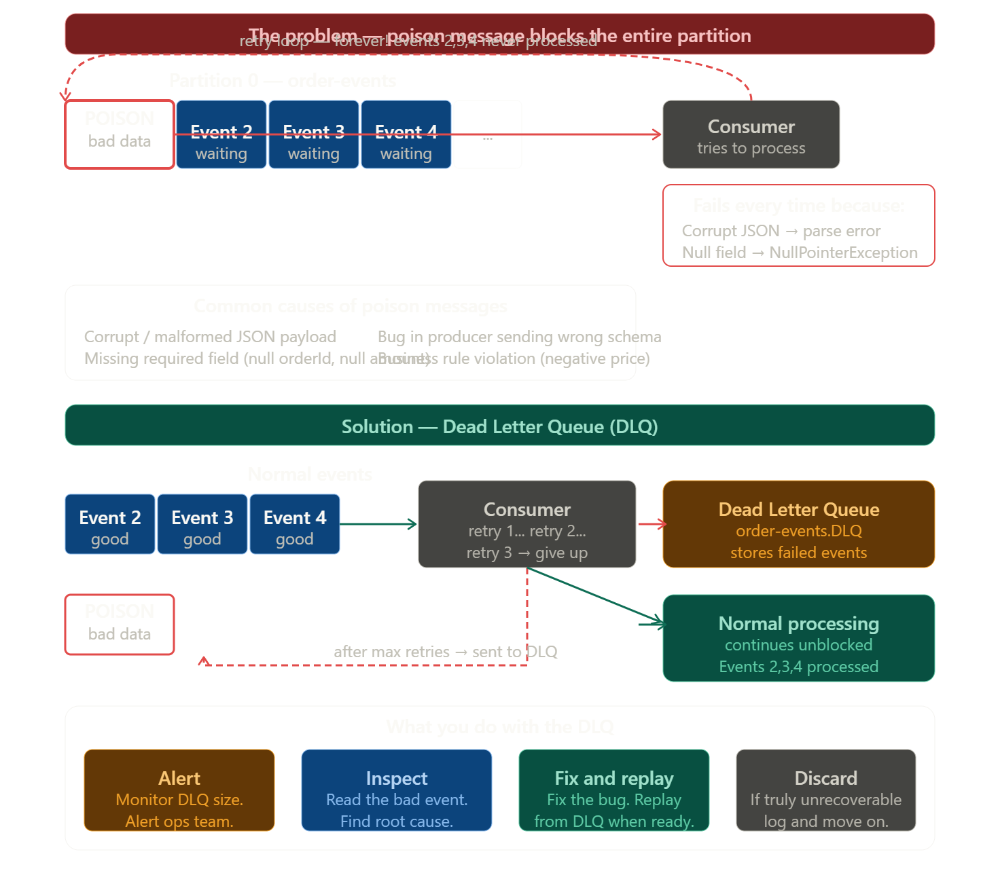

**A poison message is an event that a consumer can never successfully process** — it keeps failing every time, gets retried forever, and blocks all other events behind it.Now here's the complete Java code to handle this with Spring Kafka:

---

### Step 1 — The poison message scenario

```java
// This event has a bug — orderId is null
// Producer accidentally sent: { "orderId": null, "amount": 99.0 }

@KafkaListener(topics = "order-events")
public void onOrderPlaced(OrderPlacedEvent event) {

    // This throws NullPointerException every single time
    String id = event.orderId().toUpperCase(); // ← orderId is null → BOOM

    processOrder(id);
}
// Kafka retries this forever → partition is blocked
// Events behind it never get processed
```

---

### Step 2 — Configure retries + Dead Letter Queue

```java
@Configuration
public class KafkaConfig {

    @Bean
    public DefaultErrorHandler errorHandler(KafkaTemplate<String, String> kafka) {

        // Retry 3 times with 1 second between each attempt
        FixedBackOff backOff = new FixedBackOff(1000L, 3);

        // After 3 retries → send to Dead Letter Topic automatically
        DeadLetterPublishingRecoverer recoverer =
            new DeadLetterPublishingRecoverer(kafka,
                (record, ex) -> new TopicPartition(
                    record.topic() + ".DLQ",  // order-events.DLQ
                    record.partition()
                )
            );

        return new DefaultErrorHandler(recoverer, backOff);
    }
}
```

---

### Step 3 — Consumer with proper error handling

```java
@Service
@Slf4j
public class OrderConsumer {

    @KafkaListener(topics = "order-events", groupId = "order-group")
    public void onOrderPlaced(OrderPlacedEvent event) {
        try {
            // Validate before processing
            if (event.orderId() == null || event.amount() <= 0) {
                throw new IllegalArgumentException(
                    "Invalid event — orderId or amount missing: " + event
                );
            }
            processOrder(event);

        } catch (Exception e) {
            log.error("Failed to process event: {}", event, e);
            throw e; // rethrow — lets Spring retry then DLQ
        }
    }
}

// Separate listener on the DLQ — for inspection and alerting
@KafkaListener(topics = "order-events.DLQ", groupId = "dlq-monitor")
public void onDeadLetter(ConsumerRecord<String, String> record) {
    log.error("DEAD LETTER — topic: {}, partition: {}, offset: {}, value: {}",
        record.topic(),
        record.partition(),
        record.offset(),
        record.value()
    );
    // Send alert to Slack / PagerDuty / email
    alertService.notifyOpsTeam(record);
}
```

---

### Step 4 — Replay from DLQ after fixing the bug

Once you fix the root cause (the null orderId bug), you can replay all the failed events from the DLQ back into the main topic:

```java
@Service
public class DlqReplayService {

    private final KafkaTemplate<String, String> kafka;
    private final KafkaConsumer<String, String> dlqConsumer;

    public void replayAll() {
        dlqConsumer.subscribe(List.of("order-events.DLQ"));

        ConsumerRecords<String, String> records =
            dlqConsumer.poll(Duration.ofSeconds(5));

        for (ConsumerRecord<String, String> record : records) {
            // Republish back to the original topic
            // Now the bug is fixed so it will process correctly
            kafka.send("order-events", record.key(), record.value());
            log.info("Replayed event from DLQ: offset {}", record.offset());
        }
    }
}
```

---

### The full lifecycle in one line

```
Event fails → retry 1 → retry 2 → retry 3 → DLQ
                                              ↓
                              Ops team alerted → bug fixed
                                              ↓
                              Replay from DLQ → processed successfully
```

The DLQ is the safety net. Without it, one bad message can bring your entire consumer to a halt and cause a cascade of delays across every downstream service that depends on it.


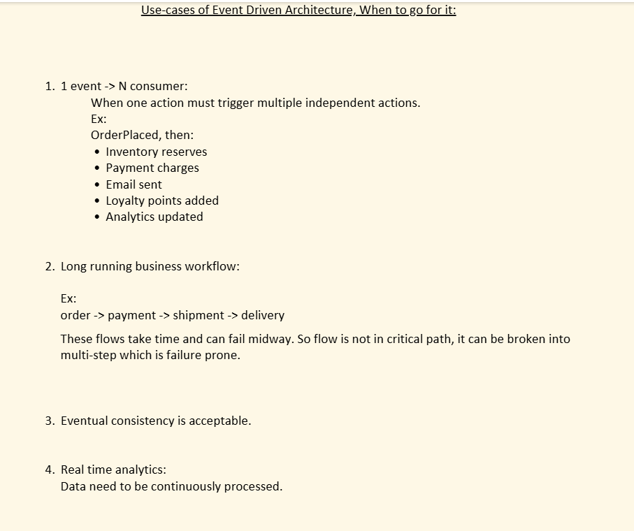

1 event multiple consumers is best use  case of EDA as we cannot call multiple services ,instead just publish event and let service pick up themself!!

eventual consitency is good hint for usage of EDA.


A **broker** is the middleman that sits between producers and consumers — it receives events, stores them, and delivers them. Neither side talks to each other directly; everything goes through the broker.


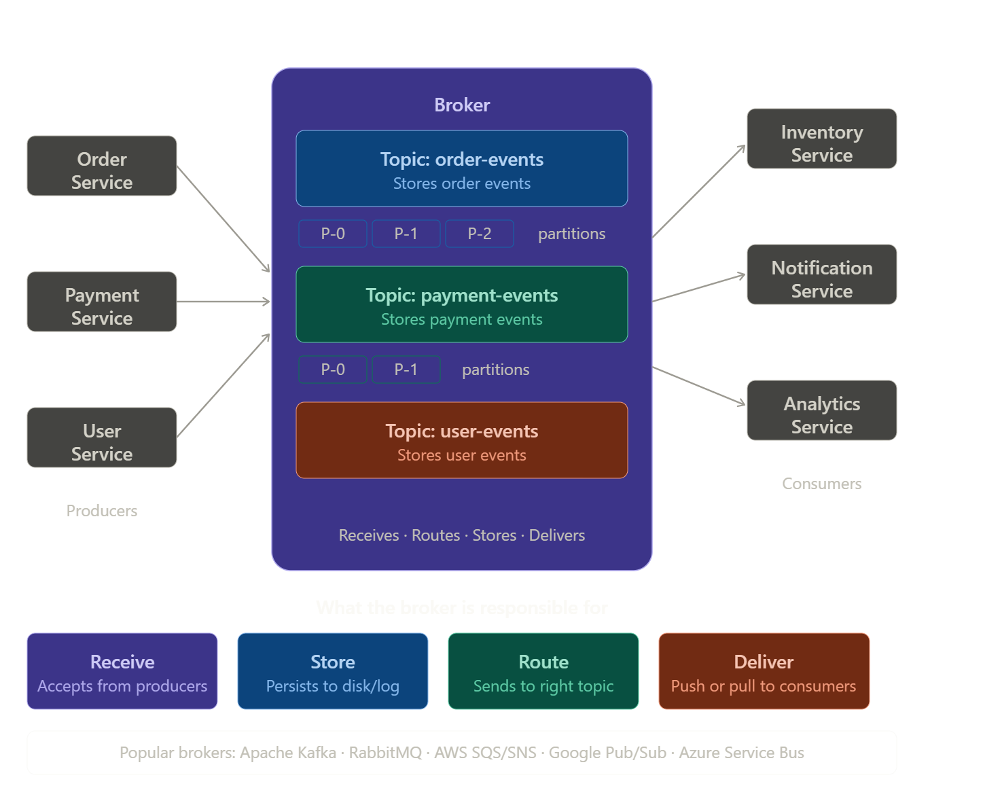


**Real world analogy:** Think of a broker like a **post office**. The sender (producer) drops a letter there. The post office (broker) stores it and delivers it to the right recipient (consumer). The sender doesn't need to know where the recipient lives, and the recipient doesn't need to be home when the letter arrives.### The broker's 4 jobs

**1. Receive** — accepts events from any producer. The producer just says "here's an event for the `order-events` topic" and moves on.

**2. Store** — holds the event in a topic (Kafka stores to disk; RabbitMQ holds in memory by default). This is what allows consumers to be offline and still get the event later.

**3. Route** — figures out which topic the event belongs to and which consumers have subscribed to it.

**4. Deliver** — sends the event to the right consumers, either by pushing it to them or waiting for them to pull it.

---

### Without a broker (the problem)

```java
// Without broker — OrderService must know about EVERYONE
public void placeOrder(Order order) {
    inventoryService.reserve(order);      // tight coupling
    notificationService.notify(order);    // what if it's down?
    analyticsService.track(order);        // adding new service = change this code
    billingService.charge(order);         // 4 direct dependencies!
}
```

### With a broker (the solution)

```java
// With broker — OrderService knows about NO ONE
public void placeOrder(Order order) {
    broker.publish("order-events", order); // that's it. done.
    // inventory, notification, analytics all get it independently
    // adding a new service = zero changes here
}
```

---

### Popular brokers and when to use them

| Broker | Best for |
|---|---|
| **Apache Kafka** | High-volume streaming, replay, audit logs |
| **RabbitMQ** | Simple task queues, routing rules |
| **AWS SQS/SNS** | Cloud-native apps on AWS |
| **Google Pub/Sub** | Cloud-native apps on GCP |

The broker is the heart of every EDA system — everything else (push/pull, pub/sub, streaming) is just about *how* the broker stores and delivers events.


