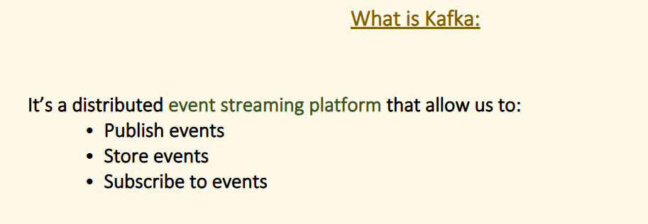


**"Distributed event streaming platform that allows us to publish, store, and subscribe to events"**### Word by word

**Distributed** — Kafka doesn't run on one server. It runs as a cluster of multiple brokers. If one crashes, the others keep going. This is what makes it reliable at scale.

**Event** — a record of something that happened in your system. `OrderPlaced`, `UserSignedUp`, `PaymentFailed`. Immutable — once written, never changed.

**Streaming** — events flow continuously in real time, not in scheduled batches. The moment OrderService publishes an event, InventoryService can start consuming it — not 5 minutes later.

**Platform** — it's not just a queue library. It's a full system with brokers, topics, partitions, consumer groups, replication, and APIs all built in and managed together.


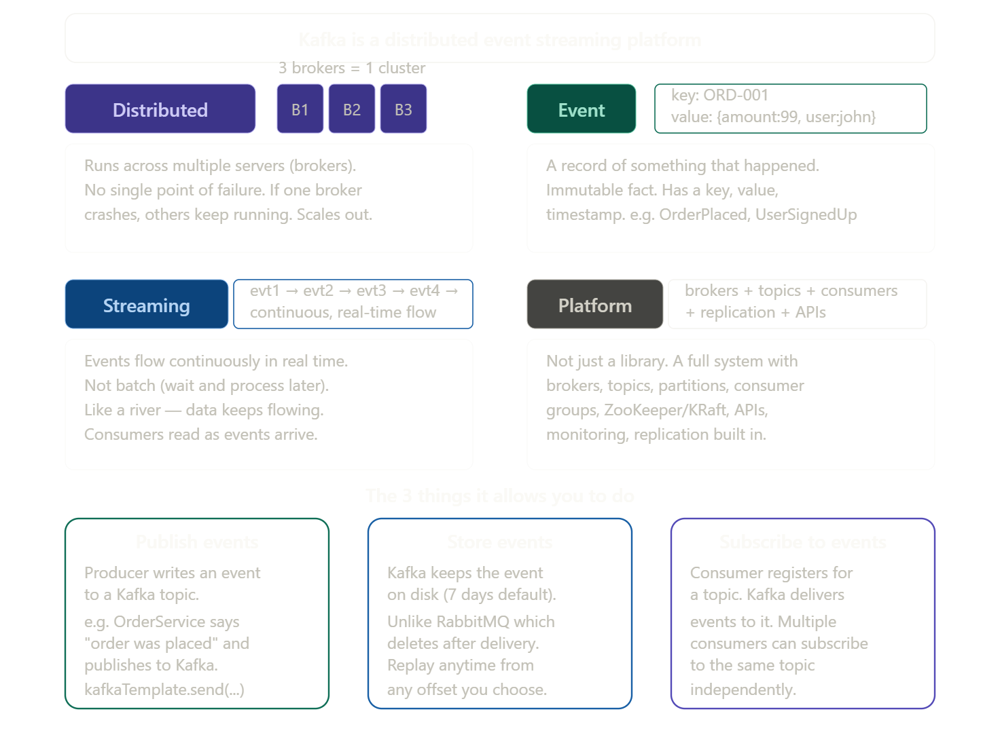
---

### The 3 capabilities mapped to code

```java
// 1. PUBLISH — producer writes event to Kafka
kafkaTemplate.send("order-events", "ORD-001", toJson(event));

// 2. STORE — Kafka keeps it on disk at offset 42, Partition 0
// /kafka-logs/order-events-0/segment.log
//   offset=42  key=ORD-001  value={orderId, amount, userId}
//   stays here for 7 days — replayable any time

// 3. SUBSCRIBE — consumer reads it whenever it's ready
@KafkaListener(topics = "order-events", groupId = "inventory-group")
public void onOrder(OrderEvent event) {
    reserveStock(event); // reacts to the event
}
```

---

### One sentence summary

Your slide's definition is spot on. If someone asks you "what is Kafka?" you can say:

> *"Kafka is a distributed system that runs across multiple servers, where services can publish events, Kafka stores them in an ordered log on disk, and any number of other services can subscribe to read and react to those events — all in real time."*

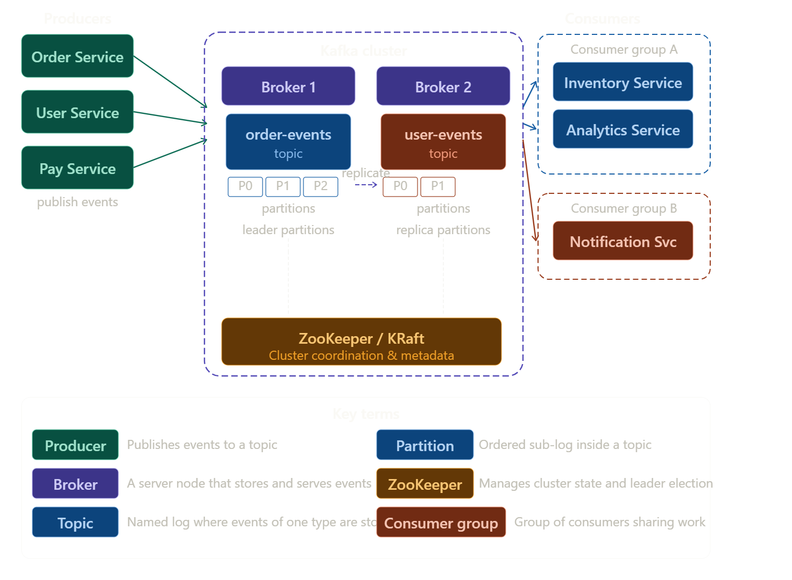

**Diagram 1** shows the big picture — all the key actors and how they relate. Then we'll zoom into partitions and offsets, and finally consumer groups.


Now let's zoom into the most important internal concept — **partitions and offsets**. This is what makes Kafka different from every other broker.


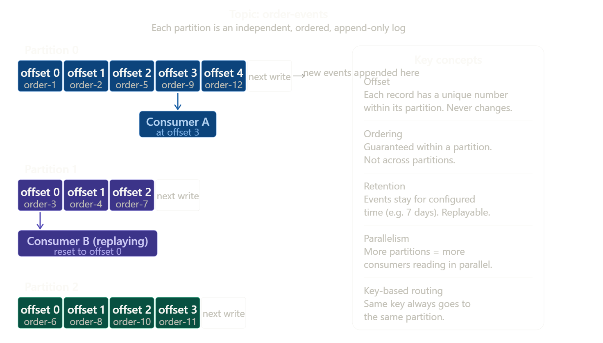


Finally, **consumer groups** — the mechanism that lets Kafka scale consumers horizontally without duplicating work.Here's a summary of every term shown across the three diagrams:

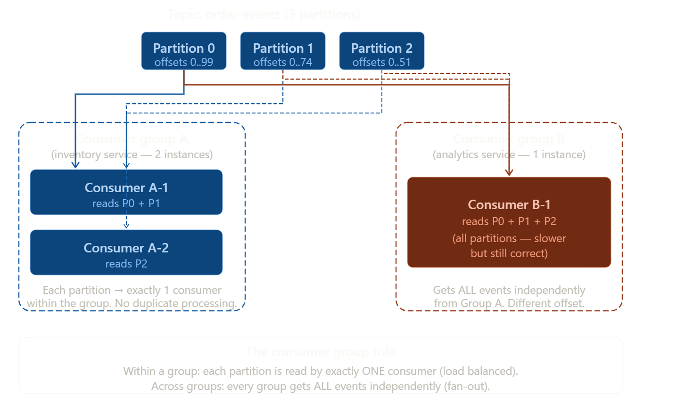
---

### Core Kafka terms

**Producer** — any service that writes events to Kafka. It picks a topic, optionally a partition key, and calls `send()`.

**Topic** — a named category of events, like a folder. All `order-events` go into one topic, all `user-events` into another. A topic lives across one or more brokers.

**Partition** — a topic is split into partitions, each an independent ordered log. This is what enables parallelism. Events with the same key always go to the same partition, guaranteeing order for that key.

**Offset** — the position number of an event within a partition. Offsets are immutable and permanent. Offset 5 in Partition 0 is always the same event, forever.

**Broker** — a single Kafka server. A cluster has multiple brokers for redundancy. Each broker holds some partitions as leader, and some as replicas.

**Replica / Leader** — each partition has one leader broker (handles reads/writes) and N replica brokers (copies for fault tolerance). If the leader dies, a replica is elected.

**ZooKeeper / KRaft** — manages cluster metadata: which broker is the leader, which consumers are alive, what topics exist. Modern Kafka (2.8+) is replacing ZooKeeper with its own KRaft protocol.

**Consumer** — any service that reads events from a topic by polling Kafka and tracking its offset.

**Consumer group** — a named group of consumers that share reading a topic. Kafka ensures each partition goes to exactly one consumer in the group — this is how you scale consumers horizontally without duplicating work.

**Consumer offset** — each consumer group tracks *its own* offset per partition. Two groups reading the same topic each have independent offsets — they never interfere with each other.

# can i say kafka is like a DB which stores events instead of Records?

Yes — that's a great mental model! And you're closer to the truth than you might think. Let me sharpen it:

**Kafka is like a database, but built for events, with some key differences.**

Here's a side-by-side to make it concrete:### Where your analogy is exactly right

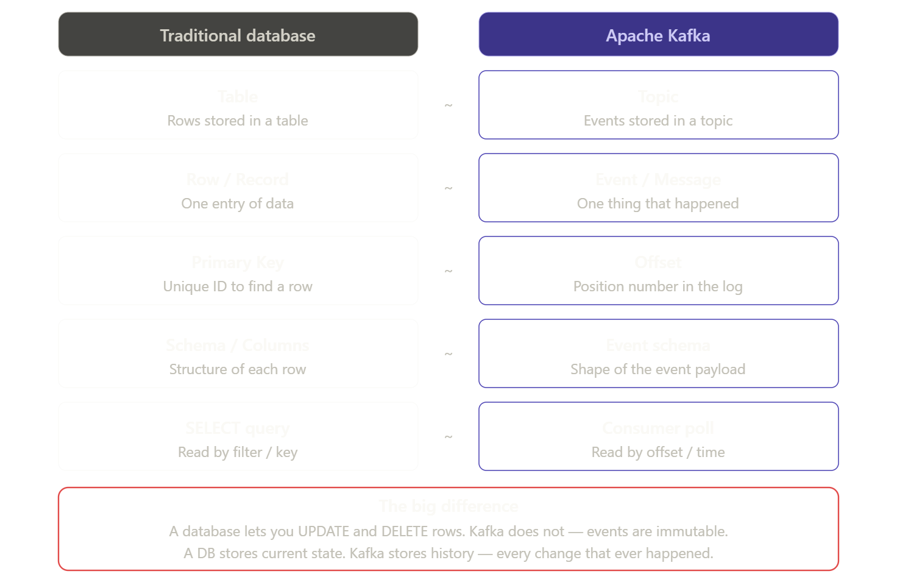

| Database | Kafka |
|---|---|
| Table | Topic |
| Row | Event |
| Primary key | Offset |
| Schema | Event schema |
| Query | Consumer poll |

Kafka even has configurable **retention** (like a DB keeping old data), and tools like **ksqlDB** let you run SQL-style queries directly on Kafka topics. So yes — Kafka genuinely behaves like a database in many ways.

---

### Where it breaks down — the crucial difference

A database stores **current state**. Kafka stores **history**.

```
Database — what IS:
┌──────────┬────────┬─────────┐
│ order_id │ status │ amount  │
├──────────┼────────┼─────────┤
│ ORD-001  │ SHIPPED│ $99.00  │  ← only the latest value
└──────────┴────────┴─────────┘

Kafka — what HAPPENED:
offset 0: OrderPlaced   { id: ORD-001, amount: $99 }
offset 1: PaymentDone   { id: ORD-001 }
offset 2: OrderShipped  { id: ORD-001 }   ← full history preserved
```

The database row says "the order is shipped." Kafka's log says "first it was placed, then paid, then shipped." You can **replay** that history at any time and rebuild any view of the data you want.

---

### The one-liner to remember

> A database answers *"what is the current state?"*
> Kafka answers *"what has happened, and in what order?"*

Your mental model is solid — just add "immutable append-only history" to it and you've got the full picture.


 When you install Kafka on your laptop, it runs on a single machine — just one broker. That is perfectly fine for development and learning.

Here is how single-node vs multi-node looks:

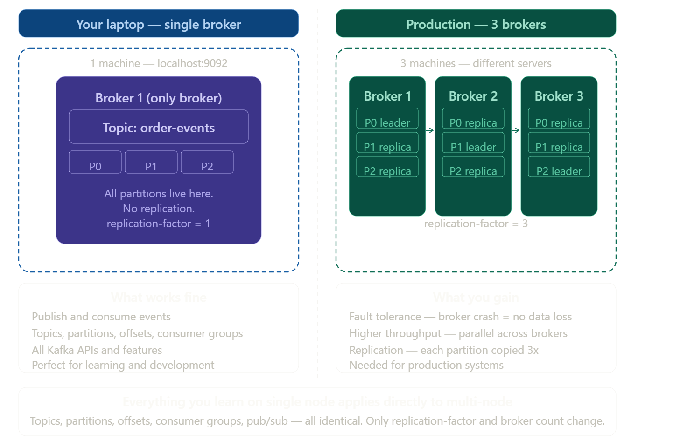

### Yes — and here is the only config difference

```yaml
# Your laptop (single broker — development)
spring.kafka.bootstrap-servers=localhost:9092

# Create topic with replication-factor=1
# (can't replicate when there's only 1 broker)
bin/kafka-topics.sh --create \
  --topic order-events \
  --partitions 3 \
  --replication-factor 1    # ← must be 1 on single node
  --bootstrap-server localhost:9092
```

```yaml
# Production (3 brokers — distributed)
spring.kafka.bootstrap-servers=broker1:9092,broker2:9092,broker3:9092

# Create topic with replication-factor=3
bin/kafka-topics.sh --create \
  --topic order-events \
  --partitions 3 \
  --replication-factor 3    # ← each partition copied to all 3 brokers
  --bootstrap-server broker1:9092
```

That is the only real difference. Your producer and consumer code stays **100% identical**.

---

### What single-node cannot do

The only thing you lose on a single broker is **fault tolerance**:

```
Single broker (laptop):
  Broker crashes → Kafka is down → all events lost

3 brokers (production):
  Broker 1 crashes → Broker 2 takes over as leader → zero downtime
```

But for learning, coding, and testing — single node is completely fine and is exactly how every developer starts with Kafka. The concepts of topics, partitions, offsets, consumer groups, publish, subscribe — all work identically on one broker.

---

### Easiest way to run it on your laptop

```yaml
# docker-compose.yml — one command, Kafka running locally
version: '3'
services:
  kafka:
    image: confluentinc/cp-kafka:latest
    ports:
      - "9092:9092"
    environment:
      KAFKA_BROKER_ID: 1
      KAFKA_ZOOKEEPER_CONNECT: zookeeper:2181
      KAFKA_ADVERTISED_LISTENERS: PLAINTEXT://localhost:9092

  zookeeper:
    image: confluentinc/cp-zookeeper:latest
    ports:
      - "2181:2181"
```

```bash
docker-compose up -d   # Kafka running on localhost:9092
```

Single broker, your laptop, fully functional Kafka — ready to learn everything we've discussed in this conversation.

# Zookeeper/Kraft

 These are both about the same problem — **who manages the Kafka cluster itself?**### The problem they both solve

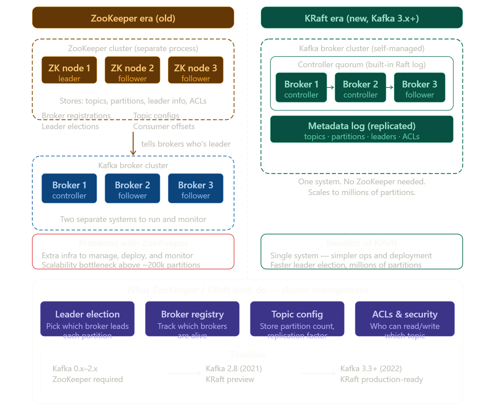

When you have a Kafka cluster with 10 brokers and 500 topics, someone needs to answer questions like:

- Which broker is the leader for partition 3 of `order-events`?
- Broker 2 just crashed — who takes over?
- What topics exist? What are their settings?

That "someone" is either ZooKeeper or KRaft.

---

### ZooKeeper (the old way)

ZooKeeper is a completely **separate distributed system** — originally built by Apache for coordinating distributed apps. Kafka borrowed it to manage cluster metadata.

```
Your infrastructure had to run TWO things:
  ZooKeeper cluster (3 or 5 nodes)   ← just for Kafka's bookkeeping
       +
  Kafka broker cluster (3+ nodes)
```

This worked but caused real pain — double the infra, double the monitoring, and ZooKeeper became a bottleneck above ~200,000 partitions.

---

### KRaft (the new way — Kafka 3.3+)

KRaft stands for **Kafka Raft** — Kafka now manages its own metadata using the **Raft consensus algorithm** built directly into the brokers. No external system needed.

```
Your infrastructure runs ONE thing:
  Kafka broker cluster
  (some brokers act as "controllers" — they run the Raft log internally)
```

A few brokers are designated as **controllers** and form a quorum. They vote on who's leader, store metadata in a replicated log, and handle failures — all inside Kafka itself.

---

### Simple analogy

> ZooKeeper is like hiring a **separate manager** to run your office — extra cost, extra person to manage.
>
> KRaft is like **promoting someone from within** — the team manages itself, no outside manager needed.

---

### What to use today

If you're starting a new Kafka project in 2024+, use **KRaft** — it's production-ready since Kafka 3.3, simpler to operate, and ZooKeeper support is being removed in Kafka 4.0. ZooKeeper is only relevant if you're maintaining an older Kafka cluster.


Let me walk you through a complete real example — one event's full journey from producer to consumer inside Kafka.Now here's the actual Java code that matches every step in that diagram:

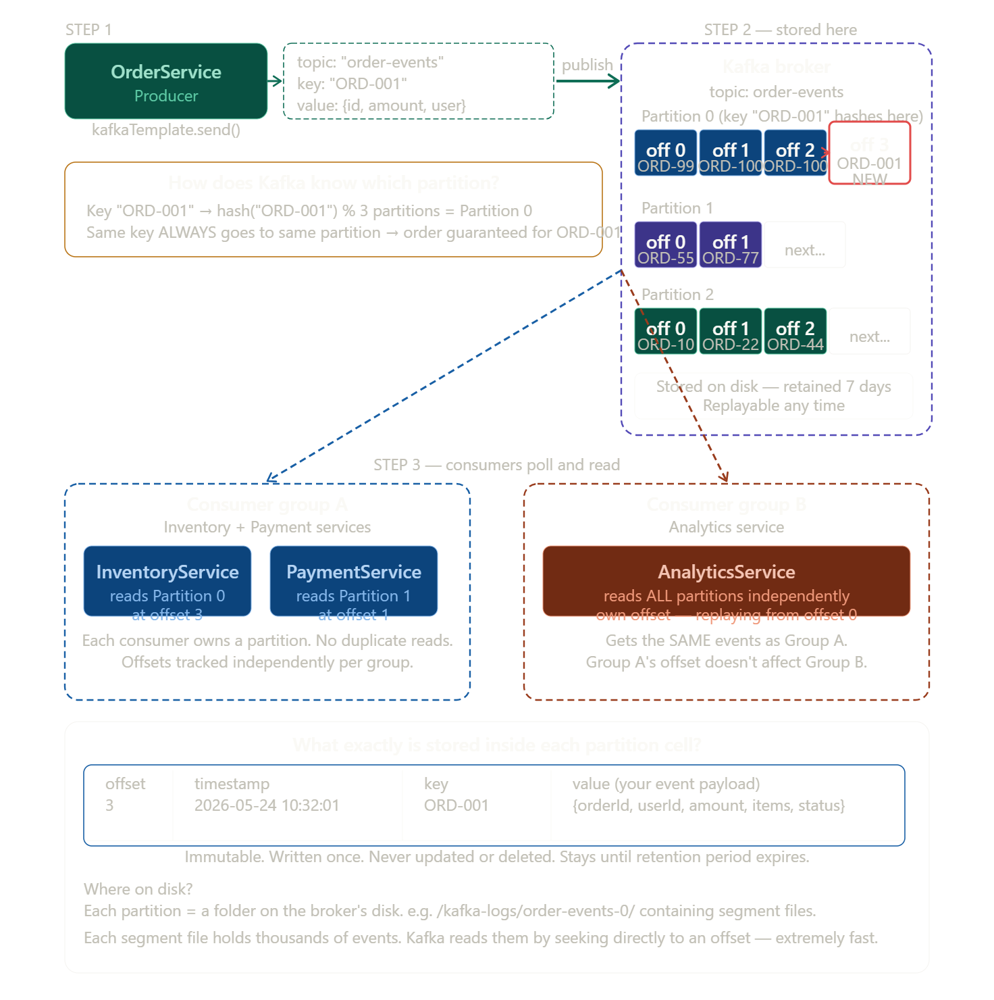

### Step 1 — Producer publishes the event

```java
// OrderService.java
@Service
public class OrderService {

    private final KafkaTemplate<String, String> kafkaTemplate;

    public void placeOrder(Order order) {
        String event = toJson(order); // { orderId, userId, amount }

        kafkaTemplate.send(
            "order-events",   // topic
            order.getId(),    // key   → "ORD-001" (decides partition)
            event             // value → the actual event payload
        );

        // Kafka stores this at offset 3, Partition 0
        // Producer's job is done — fire and forget
    }
}
```

---

### Step 2 — Where Kafka stores it

Kafka writes the event to a **segment file on disk** inside the broker:

```
/kafka-logs/
  order-events-0/          ← Partition 0 folder
    00000000000000000000.log   ← segment file
      offset=0  key=ORD-99   value={...}
      offset=1  key=ORD-100  value={...}
      offset=2  key=ORD-100  value={...}
      offset=3  key=ORD-001  value={...}  ← your new event, appended here

  order-events-1/          ← Partition 1 folder
    00000000000000000000.log
      offset=0  key=ORD-55  value={...}
      offset=1  key=ORD-77  value={...}

  order-events-2/          ← Partition 2 folder
    ...
```

The key `"ORD-001"` is hashed: `hash("ORD-001") % 3 = 0` → always lands in Partition 0. Every future event for `ORD-001` also lands in Partition 0, so **all events for one order stay in order**.

---

### Step 3 — Consumers poll and read

```java
// InventoryService.java — Consumer Group A
@Service
public class InventoryService {

    @KafkaListener(topics = "order-events", groupId = "inventory-group")
    public void onOrderCreated(ConsumerRecord<String, String> record) {
        System.out.println("Partition : " + record.partition()); // 0
        System.out.println("Offset    : " + record.offset());    // 3
        System.out.println("Key       : " + record.key());       // ORD-001
        System.out.println("Value     : " + record.value());     // {orderId...}

        reserveStock(record.value());

        // Kafka saves: inventory-group read up to offset 3 on Partition 0
        // Next poll starts from offset 4
    }
}

// AnalyticsService.java — Consumer Group B (completely independent)
@Service
public class AnalyticsService {

    @KafkaListener(topics = "order-events", groupId = "analytics-group")
    public void onOrderCreated(ConsumerRecord<String, String> record) {
        // Gets the SAME offset-3 event
        // Its own offset pointer — doesn't know or care about inventory-group
        trackOrderMetrics(record.value());
    }
}
```

---

### The three things to remember

**Where is the event stored?** On the broker's disk, inside a partition folder, appended to a segment log file. It stays there until the retention period expires (default 7 days).

**How does Kafka know which partition?** It hashes the key and takes `hash(key) % numPartitions`. Same key = same partition = guaranteed ordering for that key.

**How do consumers track where they are?** Each consumer group keeps its own offset per partition. Group A at offset 3 and Group B at offset 0 are completely independent — neither affects the other.


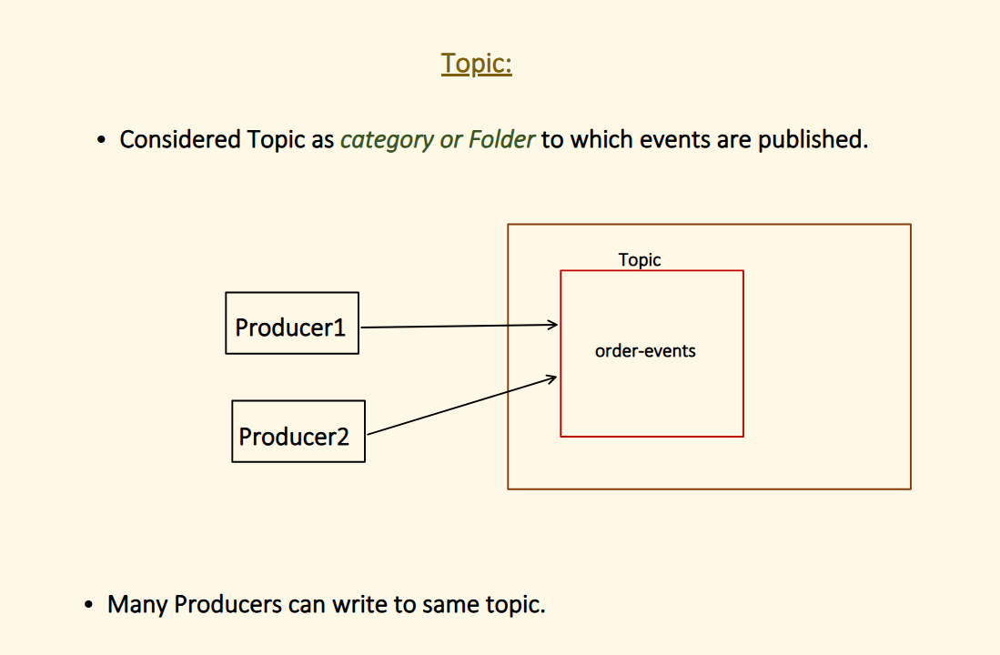

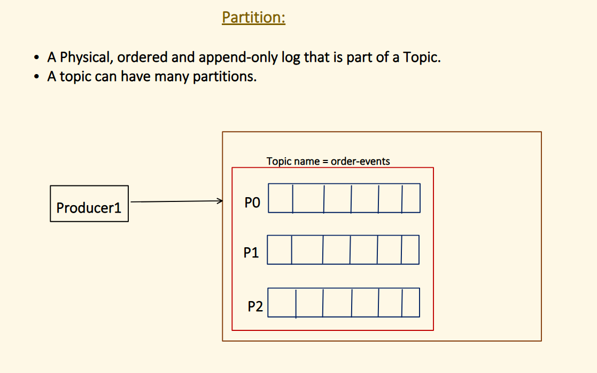

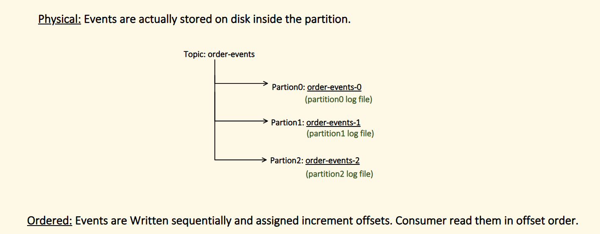

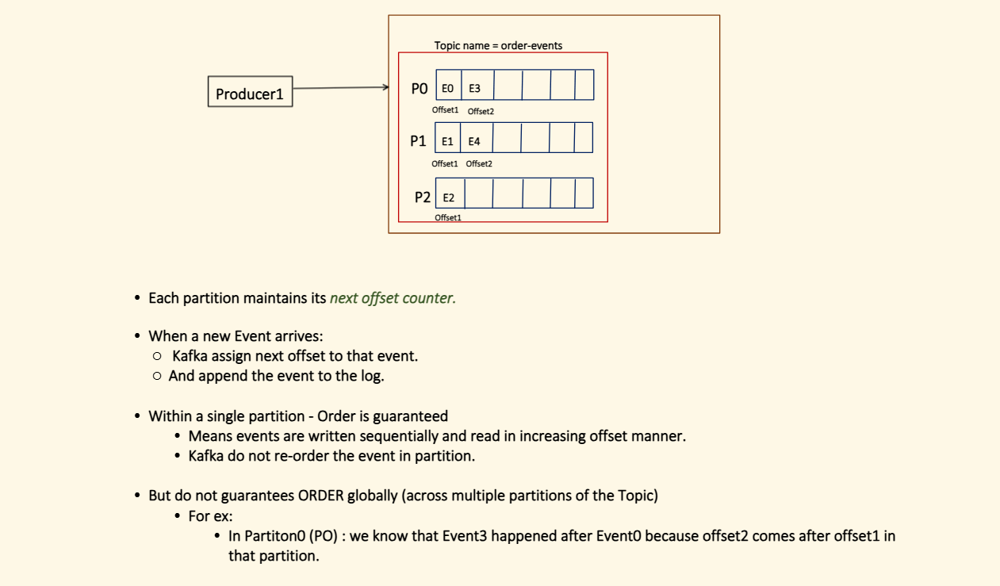

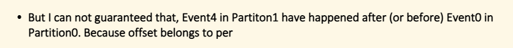

Different partition ordering is not there in Kafka.

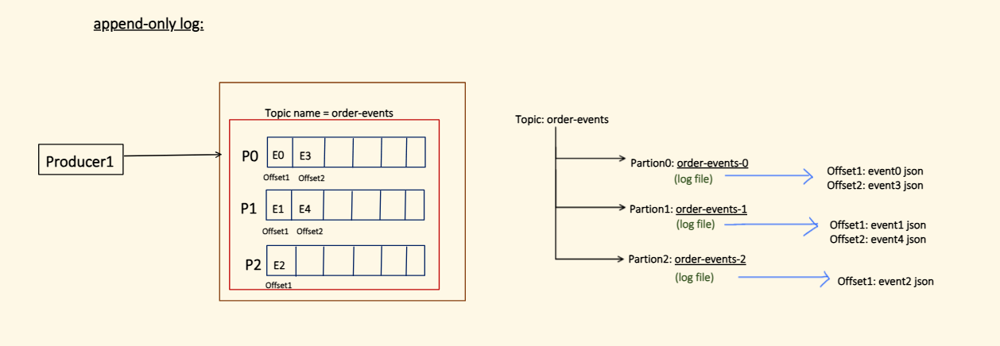


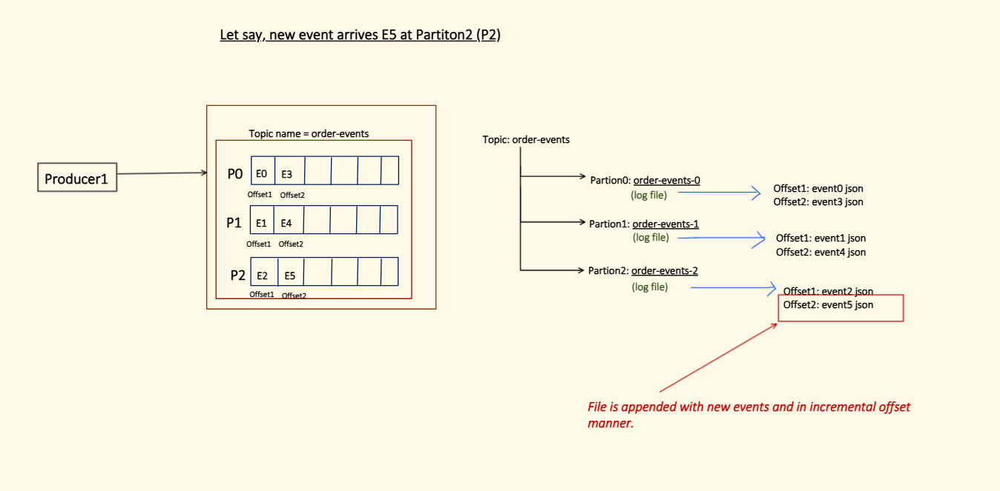

In log file of partition-2  E5 is apended!!

Topic is like a folder ,you can say partition is like a subfolder and then we have segment log files which has log data for particular offset range!!

That is a **perfect analogy!** You have understood it exactly right. Let me confirm and extend it visually.Your analogy maps perfectly. Here is the exact folder structure you would see on your laptop after running Kafka:

```
kafka-logs/                          ← Kafka data directory
│
└── order-events/                    ← TOPIC  (your "folder")
    │
    ├── order-events-0/              ← PARTITION 0  (your "subfolder")
    │     ├── 00000000000000000000.log   ← segment: offsets 0 → 999,999
    │     ├── 00000000000001000000.log   ← segment: offsets 1,000,000 → 1,999,999
    │     ├── 00000000000002000000.log   ← segment: offsets 2,000,000 → now
    │     └── 00000000000000000000.index ← index file (fast offset lookup)
    │
    ├── order-events-1/              ← PARTITION 1  (your "subfolder")
    │     ├── 00000000000000000000.log
    │     └── 00000000000001000000.log
    │
    └── order-events-2/              ← PARTITION 2  (your "subfolder")
          └── 00000000000000000000.log
```

---

### Why Kafka splits into multiple segment files

A partition does not use one giant file. It splits into segments because:

```
One giant file problem:
  - Can't delete old events (retention) without rewriting everything
  - Slow to search through millions of records

Segment files solution:
  - Old segment expired? Just delete that one file. Fast.
  - Kafka reads the index file to jump directly to any offset
  - Active segment = the last file, append-only writes at the end
```

Think of it like a logbook — instead of one massive book, you use one book per month. When January's book is old, you throw it away without touching February or March.

---

### The naming tells you the offset range

```
00000000000000000000.log  ← starts at offset 0
00000000000001000000.log  ← starts at offset 1,000,000
00000000000002000000.log  ← starts at offset 2,000,000

The file name IS the first offset in that segment.
Kafka uses this to instantly find which file contains offset 1,500,000
→ must be in 00000000000001000000.log
```

So your mental model is exactly right:

> **Topic = folder → Partition = subfolder → Segment file = a chunk of the log → Offset = a specific line inside that chunk**

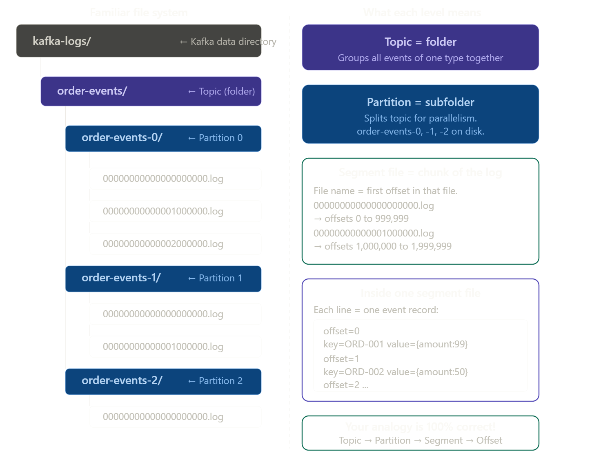

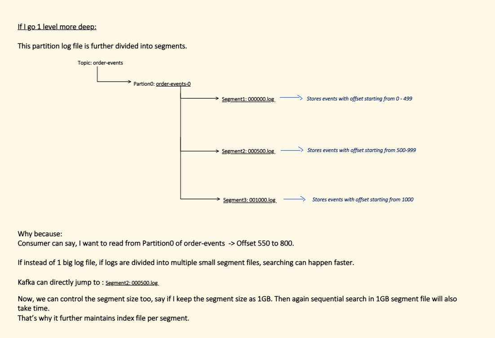


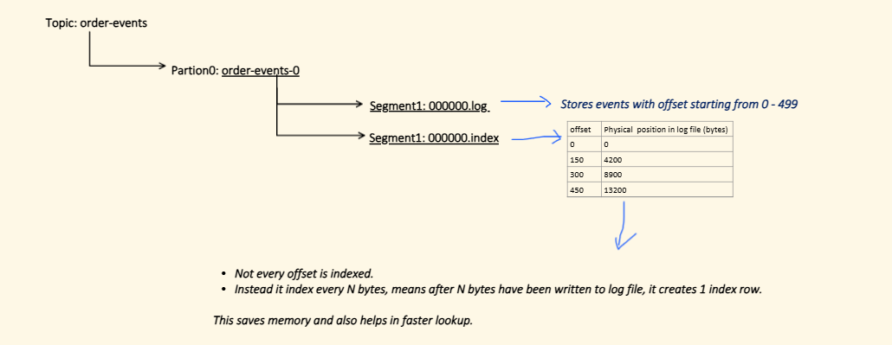


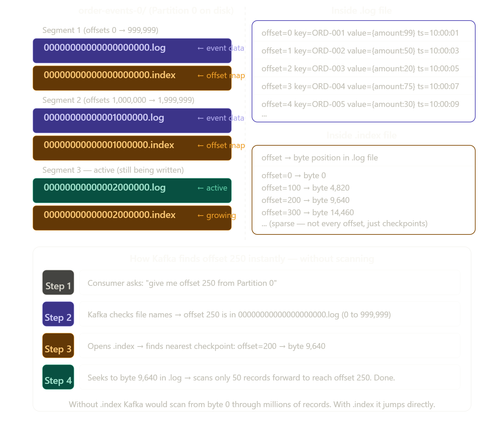

Every segment has a matching `.index` file alongside the `.log` file. Great catch! The index file is what makes Kafka **blazing fast** at finding any offset.### The complete file pair per segment

Every segment on disk is always **two files together** — never one without the other:

```
order-events-0/
  ├── 00000000000000000000.log      ← actual event data
  ├── 00000000000000000000.index    ← offset → byte position map
  ├── 00000000000000000000.timeindex ← timestamp → offset map (bonus!)
  │
  ├── 00000000000001000000.log
  ├── 00000000000001000000.index
  ├── 00000000000001000000.timeindex
  │
  ├── 00000000000002000000.log      ← active segment (writes happen here)
  ├── 00000000000002000000.index    ← grows as new events arrive
  └── 00000000000002000000.timeindex
```

There is also a `.timeindex` file — same idea but maps **timestamp → offset** instead of offset → byte. This is how Kafka lets you seek by time: `consumer.seekToTimestamp("2026-05-24 10:00:00")`.

---

### Why the index is sparse (not every offset)

```
offset=0    → byte 0
offset=100  → byte 4,820      ← checkpoint every ~100 offsets
offset=200  → byte 9,640
offset=300  → byte 14,460

NOT:
offset=0   → byte 0
offset=1   → byte 48          ← this would make the index huge
offset=2   → byte 96
...
```

Storing every single offset in the index would make it massive. Instead Kafka stores a checkpoint every few kilobytes. So the worst case is a tiny sequential scan of maybe 50-100 records after jumping to the nearest checkpoint — still essentially instant.

---

### Your complete mental model is now fully correct

```
kafka-logs/
└── order-events/              ← Topic     (folder)
    └── order-events-0/        ← Partition (subfolder)
        ├── 0000...0000.log    ← Segment   (chunk of event data)
        ├── 0000...0000.index  ← Index     (offset → byte map for fast lookup)
        └── 0000...0000.timeindex  ← Time index (timestamp → offset map)
```

Topic → Partition → Segment → Index. You have built the complete picture from the ground up.

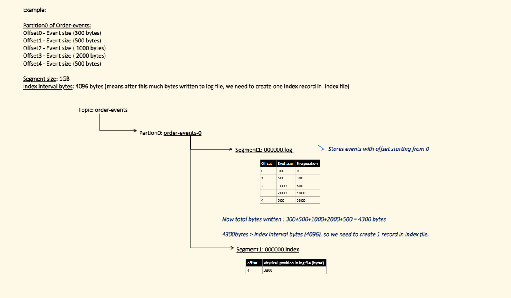


# How producer picks up a partition of a topic??


 The producer does not randomly pick a partition — it follows a specific algorithm. 
 
 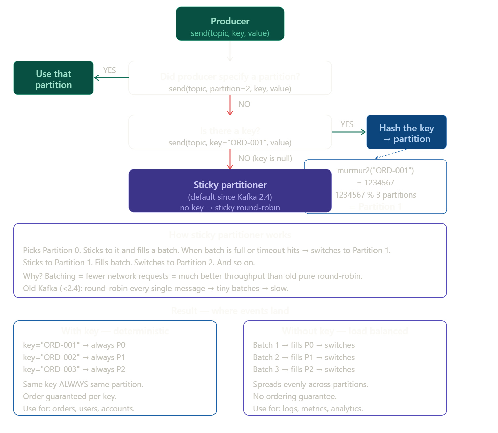
 
 There are **3 rules in order of priority:**Here is the exact algorithm in Java code:

---

### Rule 1 — Explicit partition (you decide)

```java
// You manually tell Kafka exactly which partition to use
// Kafka skips all logic and sends directly there
kafkaTemplate.send("order-events", 2, "ORD-001", toJson(event));
//                                 ↑ partition=2 hardcoded

// Rarely used in practice — you'd have to manage this yourself
// Only useful when you have very specific routing logic
```

---

### Rule 2 — Key present → hash it (most common)

```java
// Producer sends with a key
kafkaTemplate.send("order-events", "ORD-001", toJson(event));
//                                  ↑ key

// Kafka internally does:
int partition = murmur2("ORD-001") % numberOfPartitions;
//              ↑ murmur2 is the hash function Kafka uses
//              always produces the same number for "ORD-001"
//              so same key ALWAYS goes to same partition

// "ORD-001" → hash=1234567 → 1234567 % 3 = Partition 1  ← always
// "ORD-002" → hash=8901234 → 8901234 % 3 = Partition 0  ← always
// "ORD-003" → hash=5678901 → 5678901 % 3 = Partition 2  ← always
```

---

### Rule 3 — No key → sticky partitioner

```java
// Producer sends with NO key (key is null)
kafkaTemplate.send("order-events", toJson(event));
//                                 ↑ no key

// Kafka's sticky partitioner does this:
// 1. Pick Partition 0. Keep sending there until batch is full (16KB default)
// 2. Batch full → switch to Partition 1. Fill it.
// 3. Batch full → switch to Partition 2. Fill it.
// 4. Repeat.

// WHY sticky instead of pure round-robin per message?

// OLD round-robin (bad):
// msg1 → P0, msg2 → P1, msg3 → P2, msg4 → P0 ...
// Every message = its own tiny batch = lots of network calls = slow

// NEW sticky (good):
// 1000 msgs → P0 (one big batch), 1000 msgs → P1, 1000 msgs → P2
// Big batches = fewer network calls = fast
```

---

### You can also write your own partitioner

```java
// Custom partitioner — your own routing logic
public class PriorityPartitioner implements Partitioner {

    @Override
    public int partition(String topic, Object key, byte[] keyBytes,
                         Object value, byte[] valueBytes, Cluster cluster) {

        int numPartitions = cluster.partitionCountForTopic(topic);
        OrderEvent event = deserialize(valueBytes);

        // VIP orders → always Partition 0 (dedicated, fast consumer)
        if (event.isVip()) return 0;

        // Normal orders → spread across remaining partitions
        return (murmur2(keyBytes) % (numPartitions - 1)) + 1;
    }
}

// Register it in config
props.put(ProducerConfig.PARTITIONER_CLASS_CONFIG,
          PriorityPartitioner.class.getName());
```

---

### The decision in one table

| Scenario | Rule used | Partition result |
|---|---|---|
| `send(topic, 2, key, value)` | Explicit | Always Partition 2 |
| `send(topic, "ORD-001", value)` | Key hash | Always same partition for that key |
| `send(topic, null, value)` | Sticky | Fills one partition then switches |
| Custom partitioner configured | Your logic | Whatever you return |

The most important thing to remember — **use a key whenever ordering matters**. No key means no ordering guarantee, but better load distribution across partitions.


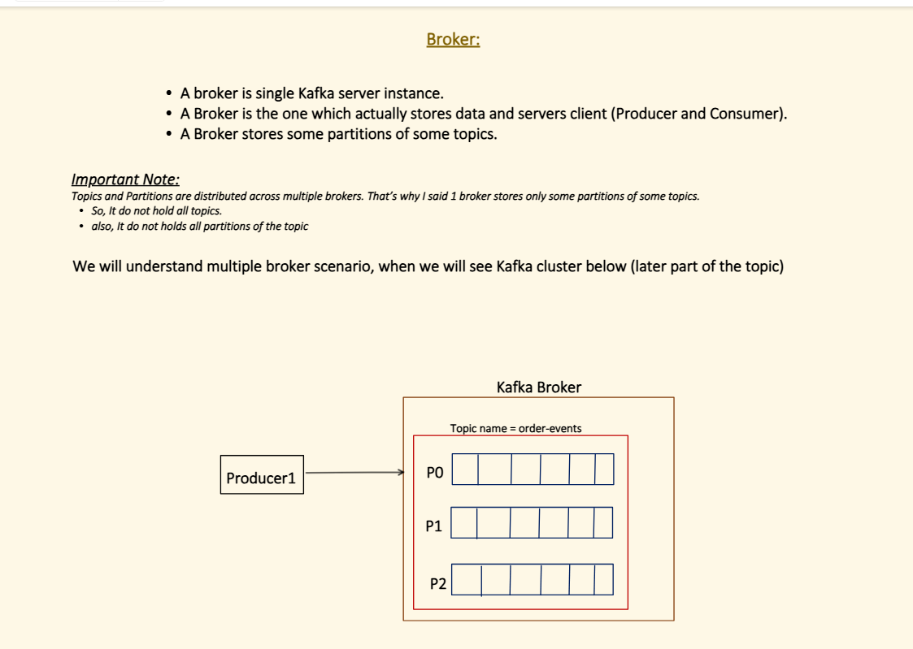


 This diagram shows a **single broker** setup — one Kafka server holding all 3 partitions of the `order-events` topic. 
 
 
 Let me extend this into the full multi-broker picture your notes promise to cover later.Your notes are spot on.
 
 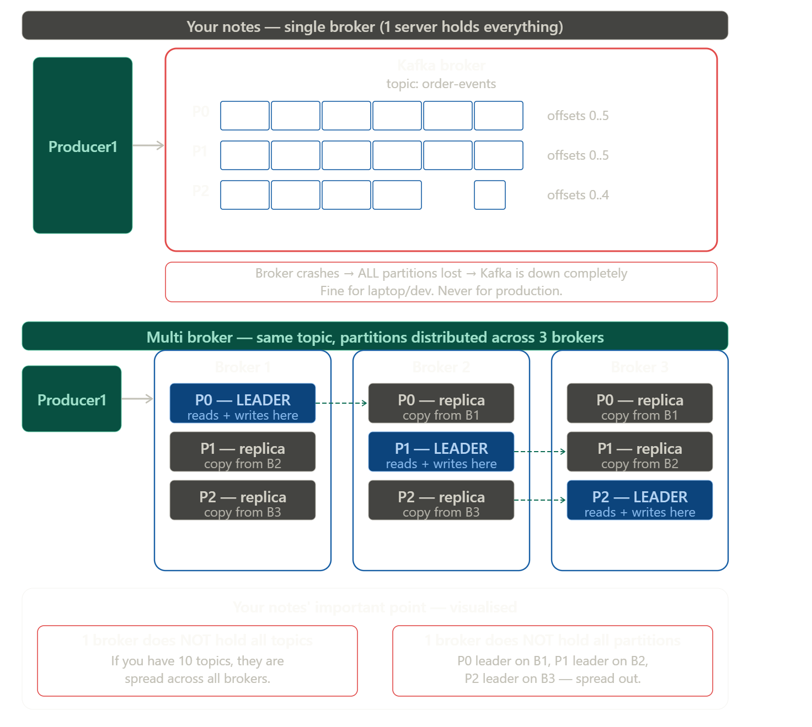
 
  Here is a summary of exactly what they say, with the full picture added:

---

### What your notes say — confirmed

**"A broker is a single Kafka server instance"** — correct. One running Java process on one machine, listening on port 9092.

**"A broker stores and serves clients"** — correct. It stores partition data on disk and responds to both producer writes and consumer reads.

**"A broker stores SOME partitions of SOME topics"** — this is the key insight. Not all, just some. Here is why:

```
You have:  3 topics × 3 partitions each = 9 partitions total
           3 brokers in the cluster

Kafka spreads them:
  Broker 1 → P0 of topic-A (leader), P1 of topic-B (leader), P2 of topic-C (leader) ...
  Broker 2 → P1 of topic-A (leader), P2 of topic-B (leader), P0 of topic-C (leader) ...
  Broker 3 → P2 of topic-A (leader), P0 of topic-B (leader), P1 of topic-C (leader) ...

Each broker holds leaders for some partitions + replicas for others.
No single broker holds everything.
```

---

### The one thing to add to your notes

Every partition has one **leader** and N **replicas**:

- **Leader** — the broker that handles all reads and writes for that partition
- **Replica** — copies on other brokers for fault tolerance

When Broker 1 crashes, Broker 2's replica of P0 is promoted to leader automatically. Zero data loss. That is exactly why partitions are distributed — so no single broker failure takes anything down.

Your diagram in the notes shows the single broker case perfectly. The multi-broker case is just that diagram split across 3 servers with replication added.


