first what a consumer is, then why consumer groups exist, and then the critical partition assignment rules.Now the full picture in code:

---

### What a consumer is

```java
// A consumer is any service that calls poll() on Kafka
@Service
public class InventoryService {

    @KafkaListener(
        topics = "order-events",
        groupId = "inventory-group"   // ← which group it belongs to
    )
    public void onOrder(ConsumerRecord<String, String> record) {
        System.out.println("Partition : " + record.partition());
        System.out.println("Offset    : " + record.offset());
        System.out.println("Value     : " + record.value());

        reserveStock(record.value());

        // Kafka auto-commits offset after this method returns
        // Next poll starts from offset+1
    }
}
```

---

### Consumer group — multiple consumers sharing work

```java
// All 3 instances belong to the SAME group → share partitions
// Run 3 instances of this app → each gets 1 partition

@KafkaListener(topics = "order-events", groupId = "inventory-group")
public void onOrder(String event) {
    // Instance 1 → always reads P0
    // Instance 2 → always reads P1
    // Instance 3 → always reads P2
    // Each event processed by exactly ONE instance
}

// Completely separate group → gets ALL events independently
@KafkaListener(topics = "order-events", groupId = "analytics-group")
public void onOrderAnalytics(String event) {
    // Gets same events as inventory-group
    // Has its own offset — totally independent
}
```

---

### The 3 golden rules

```
Rule 1 — consumers < partitions:
  2 consumers, 3 partitions → one consumer gets 2 partitions
  Works but unbalanced

Rule 2 — consumers = partitions:  ← IDEAL
  3 consumers, 3 partitions → each gets exactly 1
  Maximum parallelism, perfectly balanced

Rule 3 — consumers > partitions:  ← WASTEFUL
  4 consumers, 3 partitions → one consumer sits idle
  Never add more consumers than partitions
  Want more parallelism? Increase partitions instead
```

---

> multiple consumer in same partition cannot read same partition!!

### Rebalance — the automatic handoff

```
Normal:     C1→P0   C2→P1   C3→P2

C2 crashes: Kafka detects missed heartbeat (10s)
            Rebalance triggered
After:      C1→P0+P1   C3→P2   (C1 takes C2's work)

C2 comes back: Rebalance again
After:      C1→P0   C2→P1   C3→P2   (back to normal)
```

The key rule to always remember is — **number of consumers in a group can never exceed number of partitions**. That is the ceiling of parallelism. If you want to process faster, add more partitions first, then add more consumers to match.


`consumer_offsets` is topic created by kafka internally!!


 **why does each consumer group maintain its own offset independently?** Let me explain with a real scenario.

The answer is simple: **different consumer groups do different jobs and work at different speeds.** It would be wrong to force them to share a position.### The answer in one line


> Because different consumer groups do **different jobs at different speeds** — forcing them to share one offset would either **skip events** or **duplicate events** for one of them.

---

### Your notes table — explained row by row

```
(consumer group,  topic,         partition)  → committed offset

(notification,    order-events,  P0)  → 105   ← notification is fast, already at 105
(notification,    order-events,  P1)  → 98    ← P1 has slightly fewer events processed
(analytics,       order-events,  P0)  → 60    ← analytics is slow, only at 60
(analytics,       order-events,  P1)  → 45    ← analytics P1 even slower
```

Both groups are reading the **exact same events** from the **exact same partition** — but each is at a completely different position because they work at different speeds.

---

### Real world analogy

Think of it like two people reading the same book:

> You (notification) read fast — you are on page 105.
> Your friend (analytics) reads slowly — they are on page 60.
>
> The book (Kafka partition) doesn't care. It just sits there.
> Each person has their own **bookmark** (offset).
> Neither bookmark affects the other.

If you shared one bookmark — whoever moves it first ruins the other person's place. That is exactly why Kafka gives **every consumer group its own bookmark per partition**.

---

### Where Kafka physically stores these offsets

```java
// Kafka stores offsets in a hidden internal topic: __consumer_offsets
// You never write to it directly — Kafka manages it automatically

// After consumer processes an event, it commits:
// key:   (notification-group, order-events, partition=0)
// value: offset=105

// Next time notification-group starts up (even after a crash):
// Kafka looks up this key → finds 105 → starts reading from 106
// Analytics starts from 61 — completely independent
```

This is also why Kafka consumers are **stateless** — they don't need to remember where they were. Kafka remembers for them, per group, per partition.


**Kafka stores offset per (Consumer Group + Topic + Partition) — never per individual consumer instance.**

That's it. The individual consumer inside the group is never tracked. Here's why visually:### The one line

> **Kafka stores offset per Consumer Group** — specifically keyed as `(group + topic + partition)`. The individual consumer instance is never mentioned anywhere.

---

### Why this makes perfect sense

The consumer instance is **temporary**. It can crash, restart, scale up or down at any time. So tying an offset to a consumer instance would be fragile and useless.

The consumer **group** is **permanent** — it has a fixed name like `inventory-group` that never changes. So Kafka ties the offset to the group.

```
inventory-group + order-events + P0 → 42   ← permanent, survives crashes
inventory-group + order-events + P1 → 38   ← permanent, survives crashes

C1 (the actual consumer instance)           ← temporary, dies anytime
```

When C1 crashes and C2 takes over P0 — C2 just asks Kafka:
> *"What is the offset for `inventory-group + order-events + P0`?"*
> Kafka says `42`. C2 starts from `43`. Done. No data loss.


 When a consumer reads an event, Kafka doesn't automatically mark it as "done" — you have to **commit** the offset to tell Kafka "I have successfully processed up to here." The strategy you choose decides **when** that commit happens.Now the actual Java code for each strategy:


---

### Strategy 1 — Auto Commit (default, risky)

```java
# application.properties
spring.kafka.consumer.enable-auto-commit=true
spring.kafka.consumer.auto-commit-interval=5000  # every 5 seconds

@KafkaListener(topics = "order-events")
public void onOrder(String event) {
    process(event);
    // Kafka auto-commits every 5 seconds regardless
    // You process 100 events in 4 seconds
    // Crash at second 4 — none committed yet
    // Restart → reprocesses all 100 → DUPLICATES
}
```

---

### Strategy 2 — Manual Sync Commit (safe, slow)

```java
# application.properties
spring.kafka.consumer.enable-auto-commit=false

@KafkaListener(topics = "order-events")
public void onOrder(String event, Acknowledgment ack) {

    process(event);         // process first

    ack.acknowledge();      // THEN commit — blocks until broker confirms
    // Only moves to next event after broker says "offset saved"
    // 100% safe — but slow because it waits for broker every time
}
```

---

### Strategy 3 — Manual Async Commit (fast, slight risk)

```java
@KafkaListener(topics = "order-events")
public void onOrder(String event, Acknowledgment ack) {

    process(event);

    // Sends commit to broker but does NOT wait for confirmation
    // Immediately moves to next event → fast!
    ack.acknowledge();

    // If broker never got the commit (network blip)
    // and consumer crashes → re-reads same event → duplicate
    // Fix this by also making consumer idempotent
}
```

---

### Strategy 4 — Async + Sync on shutdown (best practice)

```java
@Service
public class OrderConsumer {

    private KafkaConsumer<String, String> consumer;

    public void start() {
        while (running) {
            ConsumerRecords<String, String> records =
                consumer.poll(Duration.ofMillis(100));

            for (ConsumerRecord<String, String> record : records) {
                process(record);
            }

            // Async during normal run — fast, non-blocking
            consumer.commitAsync((offsets, exception) -> {
                if (exception != null) {
                    log.error("Commit failed", exception);
                }
            });
        }

        // On shutdown — sync to guarantee last batch is committed
        try {
            consumer.commitSync();   // wait for broker confirmation
        } finally {
            consumer.close();
        }
    }
}
```

---

### The golden rule

```
Read event
    ↓
Process it fully (save to DB, call API, etc.)
    ↓
Commit offset  ← NEVER commit before processing is done

If you commit BEFORE processing → event lost on crash
If you commit AFTER processing  → duplicate on crash (safer, fixable with idempotency)
```

Always commit **after** processing. A duplicate you can handle. A lost event you cannot.

# Kafka Cluster


Great topic! A Kafka cluster is simply **multiple brokers working together as one system.** Let me build it up step by step.### What a Kafka cluster is

```
Single broker  = one server, one point of failure
Kafka cluster  = multiple brokers, looks like ONE system to producers and consumers
```

Producer doesn't say "send to Broker 1". It says "send to topic `order-events`" and the cluster figures out which broker handles that partition.

---

### The 3 key concepts inside a cluster

**Leader and Replica**

Every partition has exactly one **leader** broker that handles all reads and writes. The other brokers hold **replicas** — silent copies that stay in sync.

```
P0 leader  → Broker 1  (producer writes here, consumer reads here)
P0 replica → Broker 2  (silent copy, waits in case B1 dies)
P0 replica → Broker 3  (silent copy, waits in case B1 dies)
```

**Replication Factor**

How many copies of each partition exist across the cluster.

```
replication-factor = 1  → no copies, single point of failure (laptop only)
replication-factor = 2  → can survive 1 broker failure
replication-factor = 3  → can survive 2 broker failures (production standard)
```

**ISR — In Sync Replicas**

```
ISR = the set of replicas that are fully caught up with the leader

Leader:   B1 at offset 100
Replica:  B2 at offset 100  ← in sync ✓ (ISR member)
Replica:  B3 at offset  97  ← lagging  ✗ (removed from ISR temporarily)

If B1 dies → only ISR members can be elected as new leader
B3 cannot become leader because it is 3 events behind
```

---

### Connecting to a cluster in Java

```java
# application.properties
# You don't connect to ONE broker — you give a bootstrap list
# Kafka uses this to discover all other brokers automatically
spring.kafka.bootstrap-servers=broker1:9092,broker2:9092,broker3:9092

# Even if broker1 is down when you start —
# broker2 or broker3 will respond and give the full cluster info
# Your app never needs to know all broker addresses
```

---

### What happens on Broker 1 crash — step by step

```
1. Broker 1 goes down (hardware failure, OOM, network)

2. KRaft/ZooKeeper detects missed heartbeat within seconds

3. Controller broker calls election:
   "P0 needs a new leader — who is in the ISR?"
   Broker 2 is in ISR → elected as new P0 leader

4. Cluster metadata updated:
   P0 leader → Broker 2  (was Broker 1)

5. Producers and consumers automatically redirect to Broker 2
   They retry internally — you see maybe 1-2 seconds of latency
   Zero data loss because replica was fully in sync

6. Broker 1 comes back → rejoins as replica
   Catches up on missed events → added back to ISR
```

---

### One sentence summary

> A Kafka cluster is a group of brokers where every partition has one leader handling traffic and N replicas on other brokers for fault tolerance — so the cluster keeps running even when individual brokers fail, and looks like one system to your producers and consumers.


## Controller

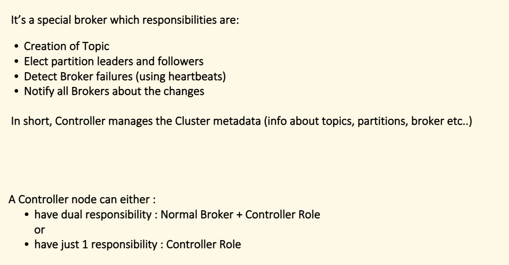

 The **controller** is a special broker inside the Kafka cluster that acts as the **manager/brain** of the whole cluster.### The one line answer

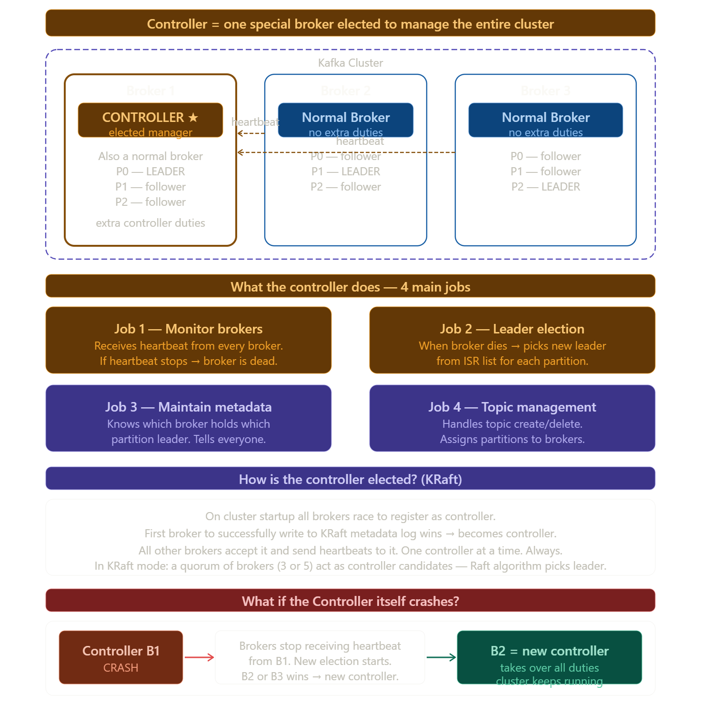

> **Controller = one broker in the cluster elected to be the manager** — it monitors other brokers, runs leader elections, and maintains cluster metadata. It is still a normal broker too — just with extra management responsibilities.

---

### Key distinction — controller vs leader

This is the most common confusion:

```
Leader      = manages ONE partition
              "I handle reads/writes for P0"
              Every partition has its own leader

Controller  = manages the ENTIRE cluster
              "I monitor all brokers and run elections"
              Only ONE controller in the whole cluster at any time
```

Think of it like an office:

> **Leader** = team lead of one specific team (manages their team's work)
> **Controller** = the office manager (manages ALL teams, decides who leads what)

---

### The controller's most important job — leader election

```
Normal state:
  B1 = controller + P0 leader
  B2 = P1 leader
  B3 = P2 leader

B2 crashes:
  Controller (B1) detects: B2 missed heartbeat
  Controller checks ISR for P1: [B1, B3]
  Controller picks B3 → new P1 leader
  Controller updates metadata: P1 leader = B3
  Controller notifies all brokers: "P1 is now on B3"
  Producer and consumer redirect → done in seconds
```

---

### Controller in code — you never touch it directly

```java
// You never talk to the controller directly in your code
// It works completely behind the scenes

// The only place you see controller effects is bootstrap config
spring.kafka.bootstrap-servers=broker1:9092,broker2:9092,broker3:9092
// ↑ Kafka uses this to find the controller
//   controller then gives your client the full cluster metadata
//   so your client knows which broker holds which partition leader

// After that — your producer/consumer talks directly to
// partition leaders — NOT the controller
```

---

### Controller vs ZooKeeper vs KRaft

```
Old Kafka (before 3.3):
  ZooKeeper managed controller election externally
  Brokers register in ZooKeeper → first one wins → controller
  Problem: extra system to manage, slow election

New Kafka (KRaft, 3.3+):
  No ZooKeeper needed
  3 or 5 brokers designated as "controller quorum"
  They run Raft consensus algorithm internally
  One wins → active controller
  Others = standby controllers (ready to take over instantly)
  Much faster election — milliseconds not seconds
```

The controller is what makes Kafka **self-healing** — without it, a broker crash would leave its partitions leaderless forever. With it, recovery is automatic and takes seconds.


## Leader follower partition

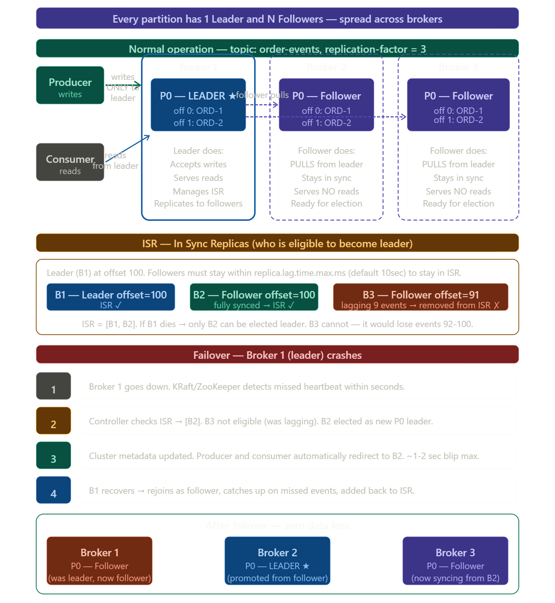


This is the heart of how Kafka achieves both **reliability** and **performance** in a cluster. Let me build it from scratch.### The core idea in one line

> **Leader = does all the work. Followers = silent copies waiting to take over.**

---

### Leader responsibilities

```
Producer writes → ONLY to leader
Consumer reads  → ONLY from leader
Replication     → leader manages it, followers pull from leader

Followers never serve producers or consumers directly.
They exist for ONE reason — fault tolerance.
```

---

### How follower replication works

Followers do not wait for the leader to push data. They **actively pull** from the leader just like a consumer does:

```java
// Internally Kafka follower does this continuously:
while (true) {
    // Pull new events from leader since my last offset
    List<Records> newRecords = fetchFromLeader(myCurrentOffset);

    // Write them to my local partition log
    appendToLog(newRecords);

    // Update my offset
    myCurrentOffset += newRecords.size();

    // Report back to leader: "I am now at offset X"
    // Leader uses this to maintain ISR list
}
```

---

### ISR — the eligibility list for leadership

```
ISR = In Sync Replicas = followers that are close enough to the leader

Leader decides ISR based on:
  replica.lag.time.max.ms = 10000 (10 seconds default)

If follower hasn't caught up within 10 seconds → removed from ISR
If follower catches up again → added back to ISR

Only ISR members can be elected as new leader.
This guarantees: new leader has ALL committed events. Zero data loss.
```

---

### Producer acks — how safe do you want writes to be?

```java
# application.properties

# acks=0 — producer doesn't wait for ANY confirmation
# Fastest. Events can be lost if leader crashes mid-write.
spring.kafka.producer.acks=0

# acks=1 — producer waits for LEADER to confirm
# Fast. Safe unless leader crashes before replicating.
spring.kafka.producer.acks=1

# acks=all — producer waits for ALL ISR members to confirm
# Slowest. Guaranteed no data loss even if leader crashes.
spring.kafka.producer.acks=all   ← production standard
```

```
acks=all flow:

Producer → writes to Leader
Leader   → replicates to B2, B3 (ISR members)
B2, B3   → confirm "I have it"
Leader   → sends ACK back to producer
Producer → "write confirmed" ✓

Now even if leader crashes immediately after —
B2 or B3 have the event and can serve it as new leader.
```

---

### The key difference — leader vs follower

| | Leader | Follower |
|---|---|---|
| **Serves producer writes** | Yes | Never |
| **Serves consumer reads** | Yes | Never |
| **Replication** | Manages it | Pulls from leader |
| **Count per partition** | Always 1 | replication-factor - 1 |
| **On broker crash** | New one elected from ISR | Becomes leader if in ISR |
| **Lives on** | One specific broker | All other brokers |

The elegance of this design is that **every broker is a leader for some partitions and a follower for others** — so the load is naturally balanced across the entire cluster.

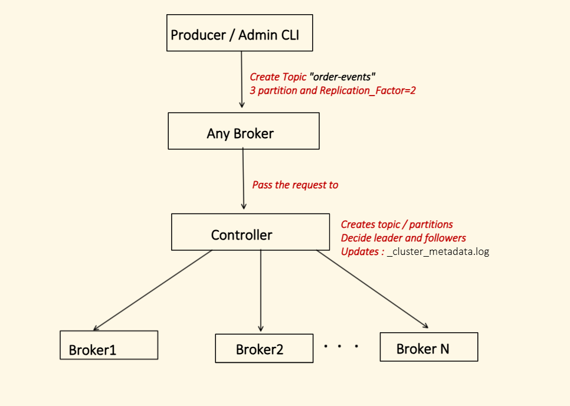


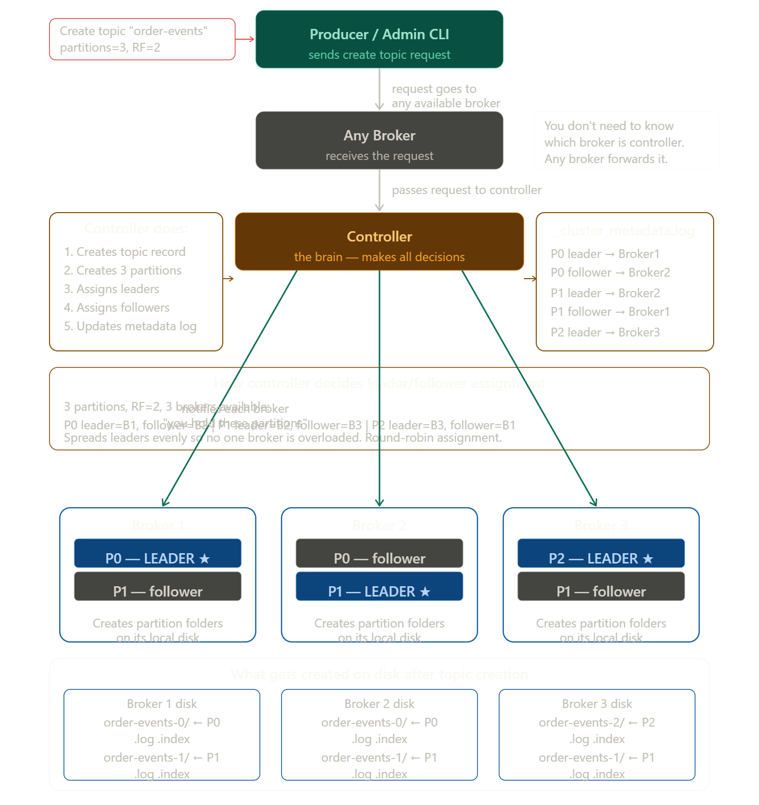


Your diagram is **perfect**! It shows exactly what happens when you create a topic. Let me explain every step in this flow in detail.Your diagram is 100% correct. Here is the complete explanation of each step:

---

### Step 1 — Producer / Admin CLI sends request

```bash
# Admin CLI command — matches your diagram exactly
kafka-topics.sh --create \
  --topic order-events \
  --partitions 3 \
  --replication-factor 2 \
  --bootstrap-server localhost:9092
```

Or from Java:

```java
@Configuration
public class KafkaTopicConfig {

    @Bean
    public NewTopic orderEventsTopic() {
        return TopicBuilder.name("order-events")
            .partitions(3)
            .replicas(2)       // replication factor = 2
            .build();
        // Spring auto-creates this on startup
    }
}
```

---

### Step 2 — Any broker receives it

You connect to **any** broker — you don't need to know which one is the controller. Every broker knows who the controller is and forwards the request automatically.

```
bootstrap-servers=broker1:9092,broker2:9092,broker3:9092
         ↓
Your client connects to broker1 (or whichever responds first)
         ↓
Broker1 knows: "controller is Broker2, forwarding request"
```

---

### Step 3 — Controller takes over (the key step)

The controller does 5 things in order:

```
1. Validates request
   → is replication-factor ≤ number of brokers? (RF=2, brokers=3 ✓)

2. Creates topic record
   → topic "order-events" now officially exists

3. Creates 3 partitions
   → P0, P1, P2

4. Assigns leader + follower for each partition (round-robin)
   → P0: leader=B1, follower=B2
   → P1: leader=B2, follower=B3
   → P2: leader=B3, follower=B1

5. Updates _cluster_metadata.log
   → permanent record of who holds what
```

---

### Step 4 — Controller notifies each broker

```
Controller → Broker 1: "You hold P0 as leader, P2 as follower"
Controller → Broker 2: "You hold P1 as leader, P0 as follower"
Controller → Broker 3: "You hold P2 as leader, P1 as follower"

Each broker immediately creates the partition folders on disk:
  Broker1/kafka-logs/order-events-0/  ← empty, ready for events
  Broker1/kafka-logs/order-events-0/00000000000000000000.log
  Broker1/kafka-logs/order-events-0/00000000000000000000.index
```

---

### Why RF=2 means each partition appears on 2 brokers

```
RF = 2 means every partition has 2 copies total (1 leader + 1 follower)

P0 → exists on Broker1 (leader) AND Broker2 (follower) → 2 copies ✓
P1 → exists on Broker2 (leader) AND Broker3 (follower) → 2 copies ✓
P2 → exists on Broker3 (leader) AND Broker1 (follower) → 2 copies ✓

If RF = 3:
P0 → Broker1 (leader) + Broker2 (follower) + Broker3 (follower) → 3 copies
Can survive 2 broker failures. Production standard.
```

Your notes diagram captures this flow perfectly — the controller truly is the brain that makes all the decisions about who holds what.

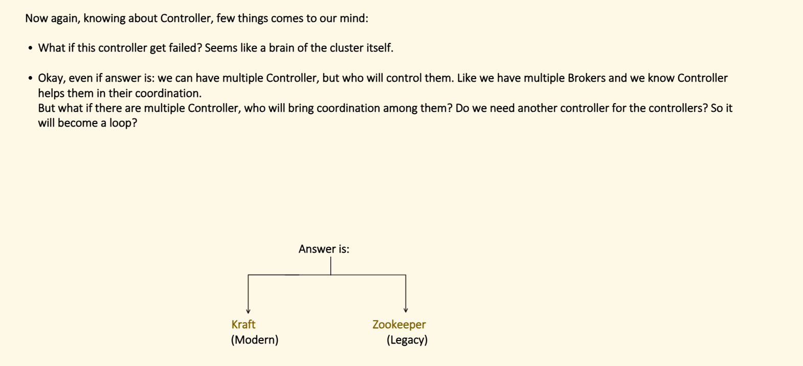


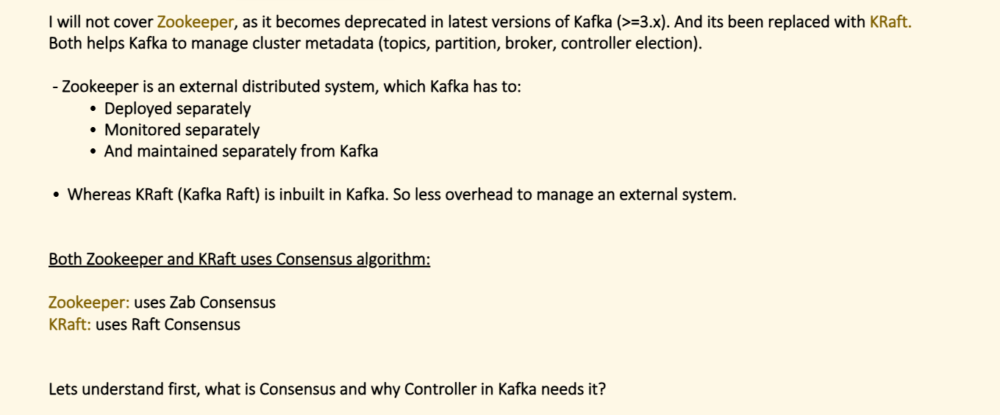


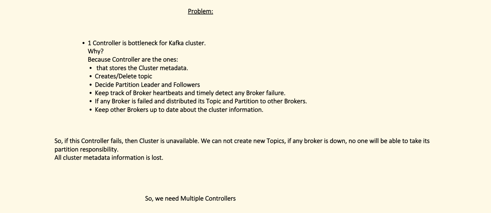

Consensus comes up when we talk about KRaft. Let me explain it from scratch with a real analogy first.

**Consensus = a group of nodes agreeing on one truth, even when some members are unavailable or disagree.**

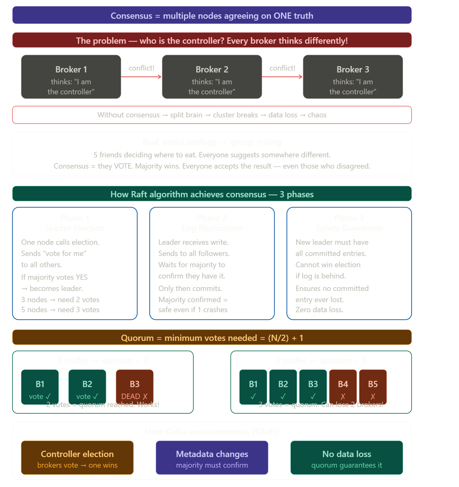

### The simplest explanation

Imagine 3 friends need to agree on one answer. If they don't have a system — all 3 shout different answers at the same time. Nothing gets decided. This is the **distributed system problem**.

**Consensus** is the algorithm that says:
> "Let's vote. Whoever gets more than half the votes — that's the answer. Everyone accepts it."

---

### Why Kafka needs it

```
Without consensus:
  Broker 1 thinks it's the controller → creates topic on B1, B2
  Broker 2 also thinks it's the controller → creates topic on B2, B3
  Two controllers = split brain = data corrupted = cluster broken

With consensus (KRaft):
  All brokers vote → B1 gets 2/3 votes → B1 is controller
  Everyone agrees → one truth → cluster works perfectly
```

---

### Raft in Kafka — voting example

```
3 brokers startup. All want to be controller.

B1 says: "Vote for me! My log is up to date."
B2 says: "OK, I vote for B1"      ← yes
B3 says: "OK, I vote for B1"      ← yes

B1 gets 2 out of 3 votes → majority → B1 is controller
B2 and B3 accept this. No argument.

Now if someone asks "who is the controller?" —
ALL brokers give the same answer: B1.
That is consensus.
```

---

### Quorum — why odd numbers of brokers

```
Quorum = minimum votes to make a decision = (N/2) + 1

3 brokers → quorum = 2  → can lose 1 broker
5 brokers → quorum = 3  → can lose 2 brokers
7 brokers → quorum = 4  → can lose 3 brokers

Why NOT 4 brokers?
4 brokers → quorum = 3
Lose 2 brokers → only 2 left → cannot reach quorum of 3 → cluster stalls
Same as 3 brokers but costs more. Useless!

Always use odd numbers: 3, 5, 7
```


How the **controller election** works. Let me show you the full picture.

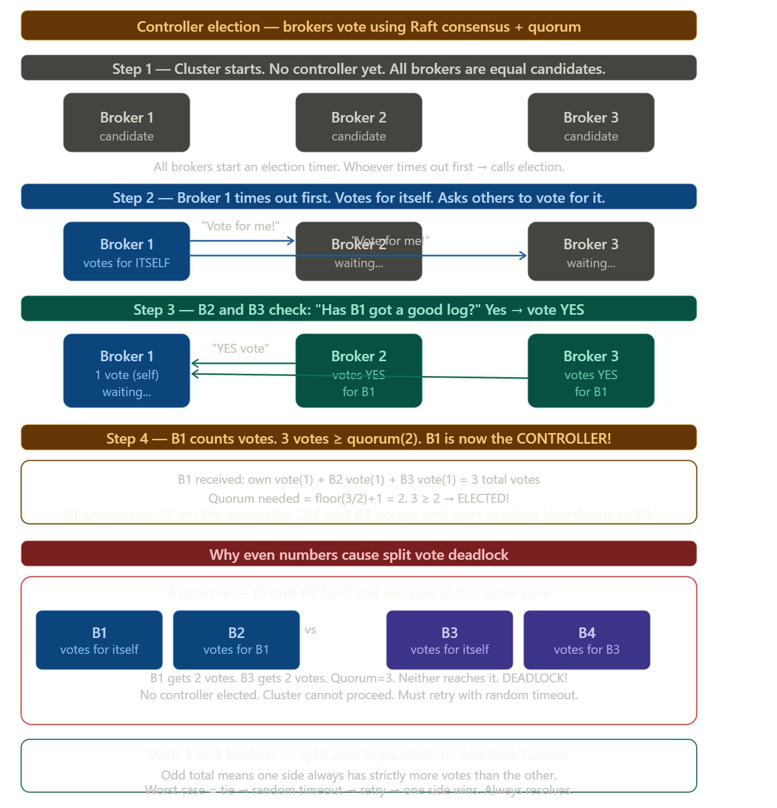

### The direct answer


The quorum number IS the voting threshold for controller election:

```
3 brokers → quorum = 2
To become controller → need 2 votes out of 3
B1 votes for itself (1) + B2 votes for B1 (1) = 2 ≥ 2 → B1 is controller

5 brokers → quorum = 3
To become controller → need 3 votes out of 5
B1 needs any 2 others to vote for it → becomes controller
```

---

### The full election flow in steps

```
1. Cluster starts — no controller exists

2. Each broker starts a random timer
   (random so they don't all fire at same time)

3. Whoever times out FIRST:
   → increments term number (election round)
   → votes for itself
   → sends "RequestVote" to all others

4. Other brokers receive the request:
   → "Is this broker's log at least as up to date as mine?"
   → If YES → send vote back
   → If NO  → reject (stale candidate can't win)

5. Candidate counts votes:
   → reached quorum? → declares itself controller
   → not reached?    → wait, retry next round

6. Winner broadcasts: "I am controller, term=5"
   → all others accept, send heartbeats to it
```

---

### Why the "log check" matters in step 4

```java
// Broker only votes YES if candidate's log is up to date
// This prevents a stale broker becoming controller and losing data

Broker 2 checks:
  candidate B1 last log index = 500
  my last log index           = 498

B1's log is ahead of mine → B1 is a good candidate → VOTE YES

If B1's log was at 400 and mine at 498:
  B1 is behind → if it becomes controller, events 401-498 could be lost
  → VOTE NO → B1 cannot win
```

---

### Why odd numbers prevent permanent deadlock

```
Even (4 brokers) — can deadlock:
  B1 gets 2 votes ← exactly half
  B3 gets 2 votes ← exactly half
  Neither reaches quorum(3)
  No controller elected
  Cluster stuck!

Odd (3 brokers) — can never permanently deadlock:
  B1 gets 2 votes → 2 ≥ quorum(2) → wins immediately
  OR
  B1 gets 1, B2 gets 1, B3 gets 1 → no winner this round
  → all brokers randomly wait different times → retry
  → one fires first → gets 2 votes → wins
  Always resolves because you can't split odd into two equal halves
```

---

### One line summary

> The quorum number is the **exact vote count a broker must reach to win the controller election** — and odd broker counts guarantee someone always wins because you can never split an odd number into two perfectly equal halves.
---

### One line summary

> Consensus = **a voting algorithm where the majority decision becomes the one agreed truth** — so even if some nodes crash or disagree, the cluster always knows exactly one answer for "who is the controller?" and "what data is committed?"


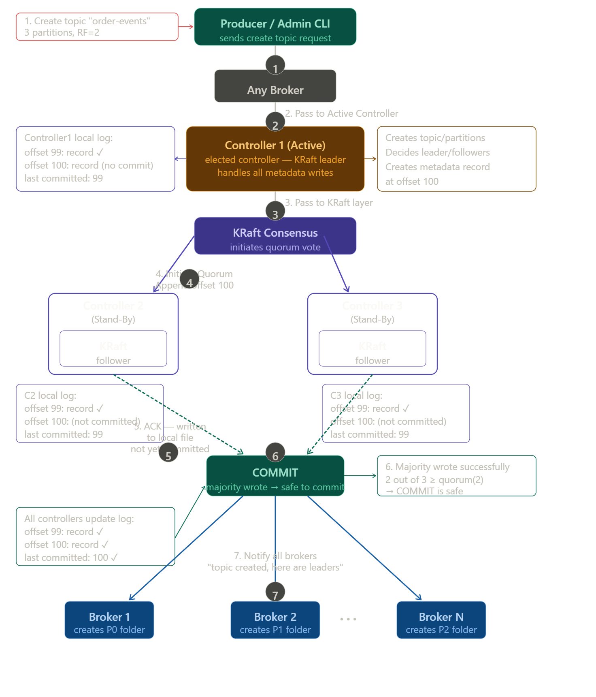


Now let me explain every step in detail:

---

### Step 1 — Producer / Admin CLI sends request

```bash
kafka-topics.sh --create --topic order-events \
  --partitions 3 --replication-factor 2
```

Simple create topic command. Goes to any available broker.

---

### Step 2 — Any broker forwards to Active Controller

```
You connect to any broker (B4, B5, doesn't matter)
That broker knows: "Controller1 is the active KRaft leader"
Forwards the request to Controller1
```

---

### Step 3 — Controller1 (Active) processes it

Controller1 does three things:
- Creates the topic and partition records
- Decides leader/follower assignments
- **Writes a new metadata record at offset 100** to its local log

```
Controller1 local log BEFORE commit:
  offset 99: previous record  ← committed ✓
  offset 100: new record      ← written but NOT committed yet
  last committed offset: 99
```

This is like a database write that hasn't been committed yet — unsafe to act on.

---

### Step 4 — KRaft layer initiates quorum

Controller1 passes the offset 100 record to the KRaft layer which sends it to both standby controllers (C2 and C3):

```
"Hey C2, C3 — please append offset 100 to your local logs"

C2 local log:
  offset 99: record ✓
  offset 100: record ← appended, NOT committed
  last committed: 99

C3 local log:
  offset 99: record ✓
  offset 100: record ← appended, NOT committed
  last committed: 99
```

---

### Step 5 — Standby controllers ACK back

Both C2 and C3 reply:
```
"ACK — I have written offset 100 to my local file.
 But I have NOT committed it yet."
```

This is the key — written to disk but not yet official.

---

### Step 6 — Majority reached → COMMIT

```
Controller1 checks:
  C1 wrote it ✓  (itself)
  C2 wrote it ✓  (ACK received)
  C3 wrote it ✓  (ACK received)

3 out of 3 wrote it.
Quorum = 2. We have 3 ≥ 2 → SAFE TO COMMIT!

Now ALL controllers update their log:
  offset 99: record ✓
  offset 100: record ✓  ← now officially committed
  last committed: 100   ← moved from 99 to 100
```

---

### Step 7 — Notify all brokers

```
Controller1 broadcasts to every broker:
"Topic order-events created.
 P0 leader = Broker1, follower = Broker2
 P1 leader = Broker2, follower = Broker3
 P2 leader = Broker3, follower = Broker1"

Each broker creates the partition folders on disk:
  Broker1: kafka-logs/order-events-0/  ← P0
  Broker2: kafka-logs/order-events-1/  ← P1
  Broker3: kafka-logs/order-events-2/  ← P2
```

---

### The most important thing your diagram shows

```
Why does Kafka wait for majority before committing?

Scenario: Controller1 writes offset 100 and immediately commits
          without telling C2 and C3.
          Controller1 then CRASHES.

KRaft elects C2 as new controller.
C2's log: last committed = 99
C2 has no idea about offset 100.
The topic creation is LOST!

With quorum commit:
  Even if C1 crashes after commit —
  C2 and C3 both have offset 100.
  C2 becomes new controller.
  C2 sees offset 100 committed → topic still exists.
  ZERO data loss.
```

This is exactly why KRaft exists — **no metadata is ever considered real until the majority has it safely written.**


## Quoram

You are pointing out the formula. Let me be precise — there are **two versions** of this formula depending on whether N is odd or even, and people often write it loosely.

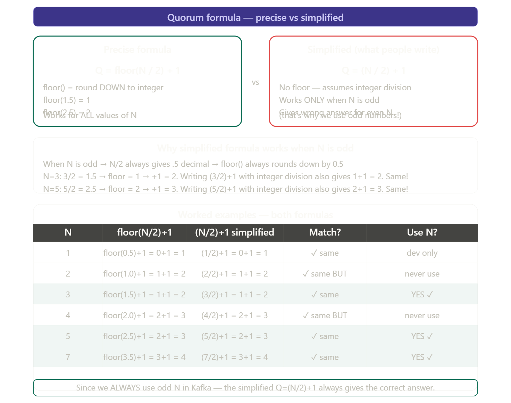
### The precise answer

```
Technically correct:   Q = floor(N/2) + 1
What people write:     Q = (N/2) + 1

They give the SAME answer for odd N.
Since Kafka always uses odd N — both are fine to write.
```

---

### Why they match for odd numbers

```
N=3:
  Precise:    floor(3/2) + 1 = floor(1.5) + 1 = 1 + 1 = 2
  Simplified: (3/2) + 1      = 1 + 1           = 2       ← integer division drops .5 anyway

N=5:
  Precise:    floor(5/2) + 1 = floor(2.5) + 1 = 2 + 1 = 3
  Simplified: (5/2) + 1      = 2 + 1           = 3       ← same

N=7:
  Precise:    floor(7/2) + 1 = floor(3.5) + 1 = 3 + 1 = 4
  Simplified: (7/2) + 1      = 3 + 1           = 4       ← same
```

When N is odd, dividing by 2 always gives a `.5` decimal. Both `floor()` and integer division drop that `.5`. So both formulas produce the same result.

---

### One line

> **Q = (N/2) + 1** is the simplified version that works perfectly — because we only ever use odd N in Kafka, where integer division and floor division give the same result.


