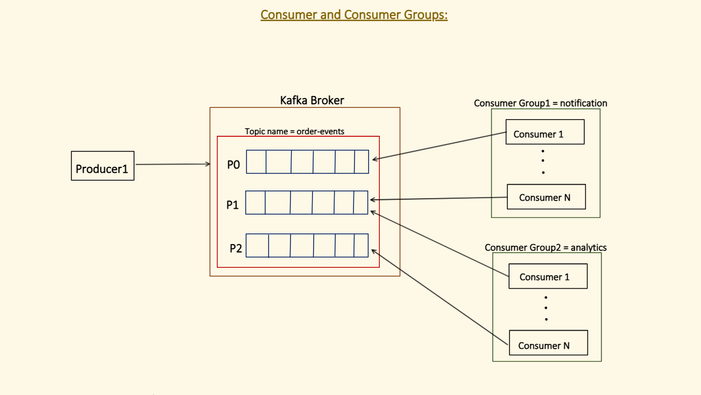
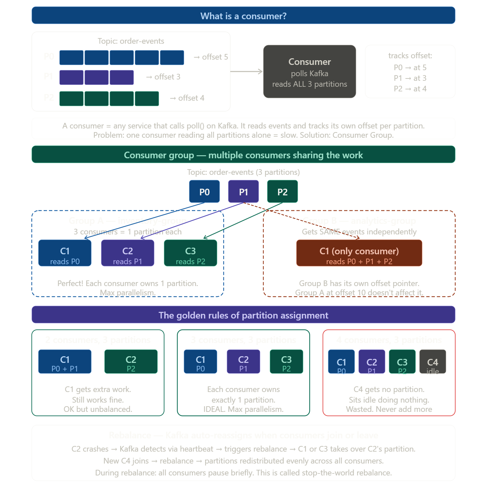
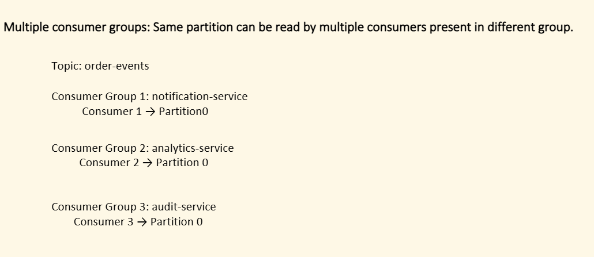
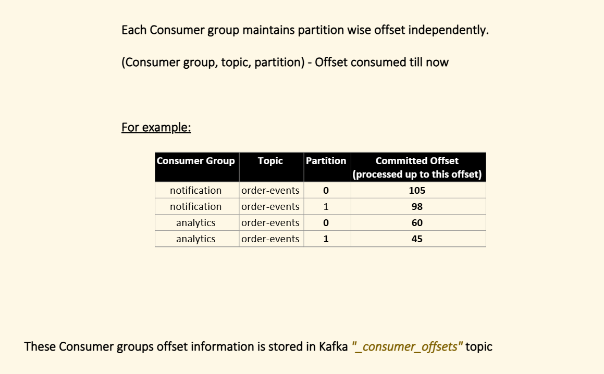
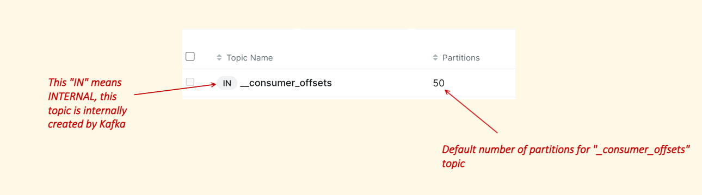
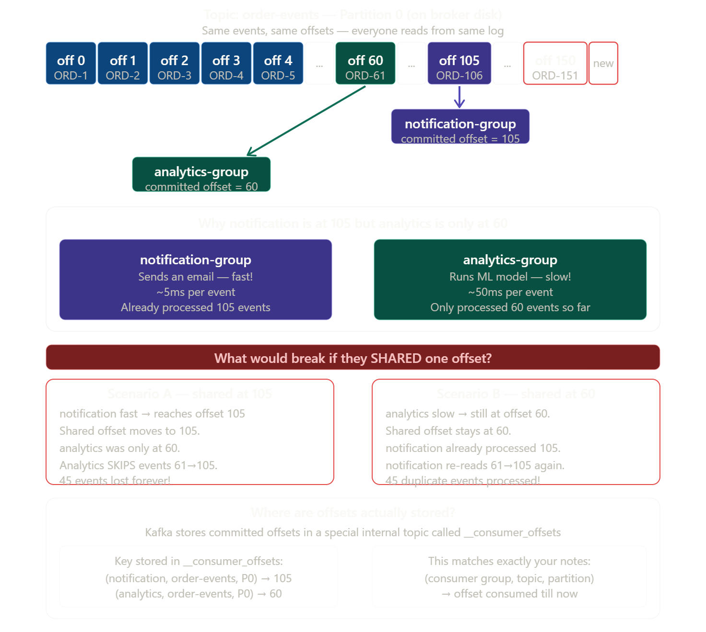
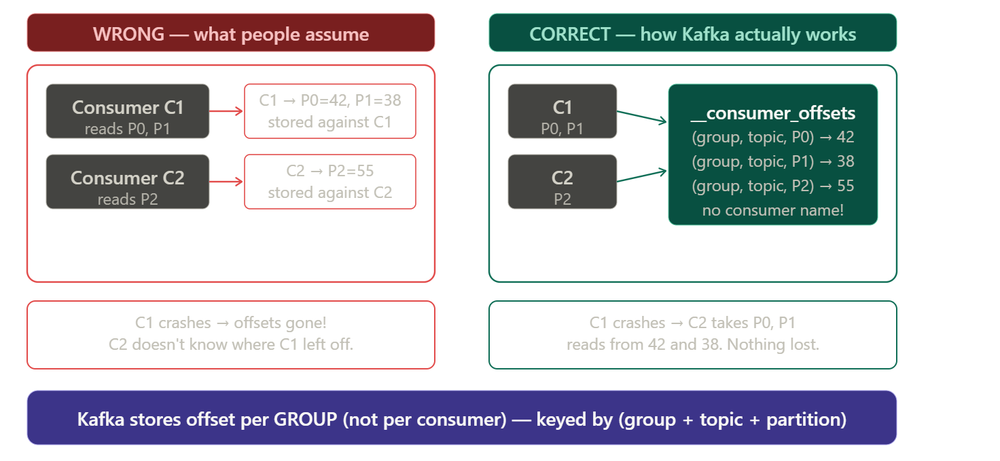
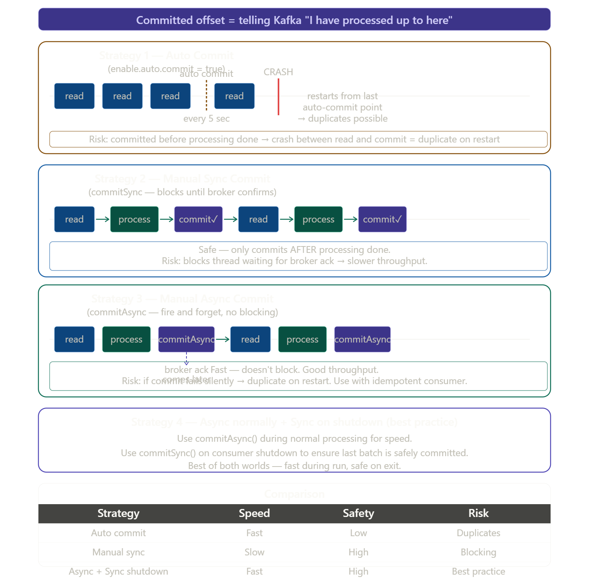
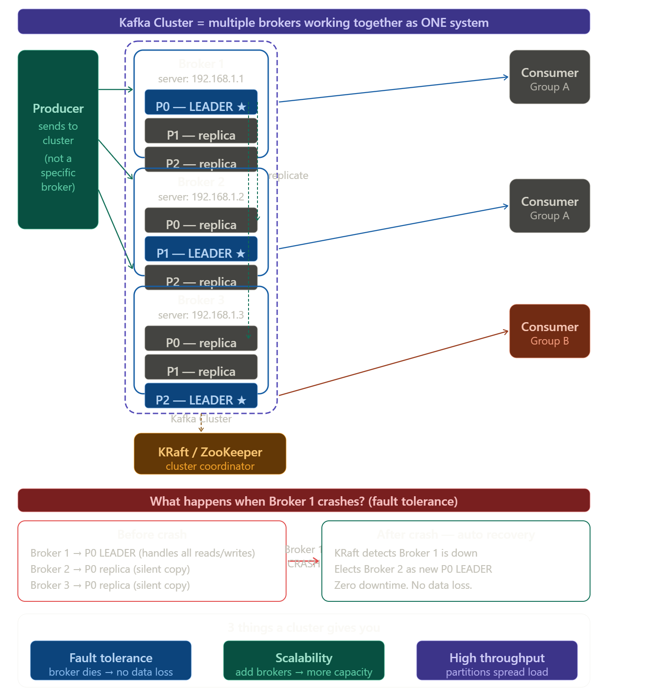

**Source video:** [Kafka Architecture - Part2](https://www.youtube.com/watch?v=75iKJ0sISKU) (30:33)

*Timestamps below were added after watching the video (at the player's max available speed, 3x — 4x wasn't offered) to verify these notes against it. Nothing existing was removed, only annotated. Important: this notes file turns out to span more than one lesson —*

```

- The "Consumer and Consumer Groups" section through the "Leader follower
  partition" section IS this video (Part2) — timestamps added below.

- The "## Controller" section and everything from the Raft/Consensus/Quorum
  images onward do NOT appear in Part2 either — Part2 ends with an unanswered
  cliffhanger ("who decides which broker hosts which partition/leader?") that
  Part3 goes on to answer. This tail content matches what's already verified
  and timestamped against the real Part3 video in
  "004 kafka-3 controller/000notes.md" — it looks like it was carried into
  this file too, likely duplicated across sessions.
```






*`[Part2 starts here — 0:00]` Everything from here down through the "Leader follower partition" section (before the ISR/acks table) is confirmed as this video's content.*

first what a consumer is, then why consumer groups exist, and then the critical partition assignment rules.Now the full picture in code:

---

### What a consumer is `[Part2 ~0:00–1:30]`

```java
// A consumer is any service that calls poll() on Kafka
@Service
public class InventoryService {

    @KafkaListener(
        topics = "order-events",
        groupId = "inventory-group"   // ← which group it belongs to
    )
    public void onOrder(ConsumerRecord<String, String> record) {
        System.out.println("Partition : " + record.partition());
        System.out.println("Offset    : " + record.offset());
        System.out.println("Value     : " + record.value());

        reserveStock(record.value());

        // Kafka auto-commits offset after this method returns
        // Next poll starts from offset+1
    }
}
```

---

### Consumer group — multiple consumers sharing work `[Part2 ~1:30–2:15]`

```java
// All 3 instances belong to the SAME group → share partitions
// Run 3 instances of this app → each gets 1 partition

@KafkaListener(topics = "order-events", groupId = "inventory-group")
public void onOrder(String event) {
    // Instance 1 → always reads P0
    // Instance 2 → always reads P1
    // Instance 3 → always reads P2
    // Each event processed by exactly ONE instance
}

// Completely separate group → gets ALL events independently
@KafkaListener(topics = "order-events", groupId = "analytics-group")
public void onOrderAnalytics(String event) {
    // Gets same events as inventory-group
    // Has its own offset — totally independent
}
```

---

### The 3 golden rules `[Part2 ~2:15–2:45]`

```
Rule 1 — consumers < partitions:
  2 consumers, 3 partitions → one consumer gets 2 partitions
  Works but unbalanced

Rule 2 — consumers = partitions:  ← IDEAL
  3 consumers, 3 partitions → each gets exactly 1
  Maximum parallelism, perfectly balanced

Rule 3 — consumers > partitions:  ← WASTEFUL
  4 consumers, 3 partitions → one consumer sits idle
  Never add more consumers than partitions
  Want more parallelism? Increase partitions instead
```

---

> multiple consumer in same partition cannot read same partition!!

### Rebalance — the automatic handoff `[Part2 ~2:45–3:03]`

```
Normal:     C1→P0   C2→P1   C3→P2

C2 crashes: Kafka detects missed heartbeat (10s)
            Rebalance triggered
After:      C1→P0+P1   C3→P2   (C1 takes C2's work)

C2 comes back: Rebalance again
After:      C1→P0   C2→P1   C3→P2   (back to normal)
```

The key rule to always remember is — **number of consumers in a group can never exceed number of partitions**. That is the ceiling of parallelism. If you want to process faster, add more partitions first, then add more consumers to match.








`consumer_offsets` is topic created by kafka internally!! `[Part2 ~3:03–6:06]`


 **why does each consumer group maintain its own offset independently?** Let me explain with a real scenario.

The answer is simple: **different consumer groups do different jobs and work at different speeds.** It would be wrong to force them to share a position.### The answer in one line



> Because different consumer groups do **different jobs at different speeds** — forcing them to share one offset would either **skip events** or **duplicate events** for one of them.

---

### Your notes table — explained row by row `[Part2 ~3:03]`

```
(consumer group,  topic,         partition)  → committed offset

(notification,    order-events,  P0)  → 105   ← notification is fast, already at 105
(notification,    order-events,  P1)  → 98    ← P1 has slightly fewer events processed
(analytics,       order-events,  P0)  → 60    ← analytics is slow, only at 60
(analytics,       order-events,  P1)  → 45    ← analytics P1 even slower
```

Both groups are reading the **exact same events** from the **exact same partition** — but each is at a completely different position because they work at different speeds.

---

### Real world analogy `[Part2 ~6:06–9:13]`

Think of it like two people reading the same book:

> You (notification) read fast — you are on page 105.
> Your friend (analytics) reads slowly — they are on page 60.
>
> The book (Kafka partition) doesn't care. It just sits there.
> Each person has their own **bookmark** (offset).
> Neither bookmark affects the other.

If you shared one bookmark — whoever moves it first ruins the other person's place. That is exactly why Kafka gives **every consumer group its own bookmark per partition**.

---

### Where Kafka physically stores these offsets `[Part2 ~6:06–15:16]`

```java
// Kafka stores offsets in a hidden internal topic: __consumer_offsets
// You never write to it directly — Kafka manages it automatically

// After consumer processes an event, it commits:
// key:   (notification-group, order-events, partition=0)
// value: offset=105

// Next time notification-group starts up (even after a crash):
// Kafka looks up this key → finds 105 → starts reading from 106
// Analytics starts from 61 — completely independent
```

*Added from video `[Part2 ~9:13–12:13]` — not in the original notes: `__consumer_offsets` itself has 50 partitions by default, and which of those 50 partitions a given group's offsets land in is decided the same way a regular partition is picked — by hashing the group id:*

```
Compute the partition = hash(consumer_group_id) % 50

Example: hash("notification_group_id") % 50 = 23
→ All offset updates for the "notification" consumer group go to
  Partition 23 of the internal topic __consumer_offsets

Published record shape:
{
  "__consumer_offsets",
  notification_group_id,
  message: (notification_group_id, topic, partition, committed_offset)
}

Same group id → hash always lands on the same partition → 23 mod 50
never changes for that group, so its offsets are always found in the
same place.
```

The `__consumer_offsets` topic itself is marked `IN` (INTERNAL) in the topic list — meaning it's created and managed by Kafka itself, not something you create.

This is also why Kafka consumers are **stateless** — they don't need to remember where they were. Kafka remembers for them, per group, per partition.


In above pic ,it is kafka server/Broker!!Consumer group stores offset related information!!




**Kafka stores offset per (Consumer Group + Topic + Partition) — never per individual consumer instance.** `[Part2 ~12:13–15:16]`

That's it. The individual consumer inside the group is never tracked. Here's why visually:### The one line

> **Kafka stores offset per Consumer Group** — specifically keyed as `(group + topic + partition)`. The individual consumer instance is never mentioned anywhere.

---

### Why this makes perfect sense

The consumer instance is **temporary**. It can crash, restart, scale up or down at any time. So tying an offset to a consumer instance would be fragile and useless.

The consumer **group** is **permanent** — it has a fixed name like `inventory-group` that never changes. So Kafka ties the offset to the group.

```
inventory-group + order-events + P0 → 42   ← permanent, survives crashes
inventory-group + order-events + P1 → 38   ← permanent, survives crashes

C1 (the actual consumer instance)           ← temporary, dies anytime
```

When C1 crashes and C2 takes over P0 — C2 just asks Kafka:
> *"What is the offset for `inventory-group + order-events + P0`?"*
> Kafka says `42`. C2 starts from `43`. Done. No data loss.


 When a consumer reads an event, Kafka doesn't automatically mark it as "done" — you have to **commit** the offset to tell Kafka "I have successfully processed up to here." The strategy you choose decides **when** that commit happens. `[Part2 ~15:16–16:09]` Now the actual Java code for each strategy:



---

### Strategy 1 — Auto Commit (default, risky) `[Part2 ~16:09]`

```java
# application.properties
spring.kafka.consumer.enable-auto-commit=true
spring.kafka.consumer.auto-commit-interval=5000  # every 5 seconds

@KafkaListener(topics = "order-events")
public void onOrder(String event) {
    process(event);
    // Kafka auto-commits every 5 seconds regardless
    // You process 100 events in 4 seconds
    // Crash at second 4 — none committed yet
    // Restart → reprocesses all 100 → DUPLICATES
}
```

---

### Strategy 2 — Manual Sync Commit (safe, slow) `[Part2 ~16:09–18:20]`

```java
# application.properties
spring.kafka.consumer.enable-auto-commit=false

@KafkaListener(topics = "order-events")
public void onOrder(String event, Acknowledgment ack) {

    process(event);         // process first

    ack.acknowledge();      // THEN commit — blocks until broker confirms
    // Only moves to next event after broker says "offset saved"
    // 100% safe — but slow because it waits for broker every time
}
```

---

### Strategy 3 — Manual Async Commit (fast, slight risk) `[Part2 ~18:20–21:23, not densely re-checked]`

```java
@KafkaListener(topics = "order-events")
public void onOrder(String event, Acknowledgment ack) {

    process(event);

    // Sends commit to broker but does NOT wait for confirmation
    // Immediately moves to next event → fast!
    ack.acknowledge();

    // If broker never got the commit (network blip)
    // and consumer crashes → re-reads same event → duplicate
    // Fix this by also making consumer idempotent
}
```

---

### Strategy 4 — Async + Sync on shutdown (best practice) `[Part2 ~18:20–21:23, not densely re-checked]`

```java
@Service
public class OrderConsumer {

    private KafkaConsumer<String, String> consumer;

    public void start() {
        while (running) {
            ConsumerRecords<String, String> records =
                consumer.poll(Duration.ofMillis(100));

            for (ConsumerRecord<String, String> record : records) {
                process(record);
            }

            // Async during normal run — fast, non-blocking
            consumer.commitAsync((offsets, exception) -> {
                if (exception != null) {
                    log.error("Commit failed", exception);
                }
            });
        }

        // On shutdown — sync to guarantee last batch is committed
        try {
            consumer.commitSync();   // wait for broker confirmation
        } finally {
            consumer.close();
        }
    }
}
```

---

### The golden rule `[Part2 ~18:20–21:23]`

```
Read event
    ↓
Process it fully (save to DB, call API, etc.)
    ↓
Commit offset  ← NEVER commit before processing is done

If you commit BEFORE processing → event lost on crash
If you commit AFTER processing  → duplicate on crash (safer, fixable with idempotency)
```

Always commit **after** processing. A duplicate you can handle. A lost event you cannot.

# Kafka Cluster `[Part2 ~21:23]`



Great topic! A Kafka cluster is simply **multiple brokers working together as one system.** Let me build it up step by step.

### What a Kafka cluster is `[Part2 ~21:23–24:26]`

```
Single broker  = one server, one point of failure
Kafka cluster  = multiple brokers, looks like ONE system to producers and consumers
```

Producer doesn't say "send to Broker 1". It says "send to topic `order-events`" and the cluster figures out which broker handles that partition.

---

### The 3 key concepts inside a cluster `[Part2 ~24:26–27:30]`

**Leader and Replica**

Every partition has exactly one **leader** broker that handles all reads and writes. The other brokers hold **replicas** — silent copies that stay in sync.

```
P0 leader  → Broker 1  (producer writes here, consumer reads here)
P0 replica → Broker 2  (silent copy, waits in case B1 dies)
P0 replica → Broker 3  (silent copy, waits in case B1 dies)
```

**Replication Factor**

How many copies of each partition exist across the cluster.

```
replication-factor = 1  → no copies, single point of failure (laptop only)
replication-factor = 2  → can survive 1 broker failure
replication-factor = 3  → can survive 2 broker failures (production standard)
```

**ISR — In Sync Replicas**

```
ISR = the set of replicas that are fully caught up with the leader

Leader:   B1 at offset 100
Replica:  B2 at offset 100  ← in sync ✓ (ISR member)
Replica:  B3 at offset  97  ← lagging  ✗ (removed from ISR temporarily)

If B1 dies → only ISR members can be elected as new leader
B3 cannot become leader because it is 3 events behind
```

---

### Connecting to a cluster in Java `[Part2 ~27:30, partition/broker hashing example]`

```java
# application.properties
# You don't connect to ONE broker — you give a bootstrap list
# Kafka uses this to discover all other brokers automatically
spring.kafka.bootstrap-servers=broker1:9092,broker2:9092,broker3:9092

# Even if broker1 is down when you start —
# broker2 or broker3 will respond and give the full cluster info
# Your app never needs to know all broker addresses
```

---

### What happens on Broker 1 crash — step by step `[Video check: not confirmed in Part2 — by ~28:41 the video has moved on to Leader/Follower responsibilities and never returns to a broker-crash walkthrough before ending; this content may belong to Part3, which covers broker-failure recovery in detail (see 004 kafka-3 controller/000notes.md).]`

```
1. Broker 1 goes down (hardware failure, OOM, network)

2. KRaft/ZooKeeper detects missed heartbeat within seconds

3. Controller broker calls election:
   "P0 needs a new leader — who is in the ISR?"
   Broker 2 is in ISR → elected as new P0 leader

4. Cluster metadata updated:
   P0 leader → Broker 2  (was Broker 1)

5. Producers and consumers automatically redirect to Broker 2
   They retry internally — you see maybe 1-2 seconds of latency
   Zero data loss because replica was fully in sync

6. Broker 1 comes back → rejoins as replica
   Catches up on missed events → added back to ISR
```

---

### One sentence summary

> A Kafka cluster is a group of brokers where every partition has one leader handling traffic and N replicas on other brokers for fault tolerance — so the cluster keeps running even when individual brokers fail, and looks like one system to your producers and consumers.


*`[Video check]` The Controller section below does not appear to be in Part2 — Part2 ends at ~30:33 with an unanswered "who decides which broker hosts which partition/leader?" cliffhanger, right after Leader/Follower responsibilities (~28:41–29:19). This Controller content matches Part3, which is already verified and timestamped in "004 kafka-3 controller/000notes.md" (see e.g. its "Controller responsibilities" and "Key distinction — controller vs leader" sections). Leaving it here as-is since nothing should be deleted.*

## Controller


 The **controller** is a special broker inside the Kafka cluster that acts as the **manager/brain** of the whole cluster.
 
 ### The one line answer


> **Controller = one broker in the cluster elected to be the manager** — it monitors other brokers, runs leader elections, and maintains cluster metadata. It is still a normal broker too — just with extra management responsibilities.

---

### Key distinction — controller vs leader

This is the most common confusion:

```
Leader      = manages ONE partition
              "I handle reads/writes for P0"
              Every partition has its own leader

Controller  = manages the ENTIRE cluster
              "I monitor all brokers and run elections"
              Only ONE controller in the whole cluster at any time
```

Think of it like an office:

> **Leader** = team lead of one specific team (manages their team's work)
> **Controller** = the office manager (manages ALL teams, decides who leads what)

---

### The controller's most important job — leader election

```
Normal state:
  B1 = controller + P0 leader
  B2 = P1 leader
  B3 = P2 leader

B2 crashes:
  Controller (B1) detects: B2 missed heartbeat
  Controller checks ISR for P1: [B1, B3]
  Controller picks B3 → new P1 leader
  Controller updates metadata: P1 leader = B3
  Controller notifies all brokers: "P1 is now on B3"
  Producer and consumer redirect → done in seconds
```

---

### Controller in code — you never touch it directly

```java
// You never talk to the controller directly in your code
// It works completely behind the scenes

// The only place you see controller effects is bootstrap config
spring.kafka.bootstrap-servers=broker1:9092,broker2:9092,broker3:9092
// ↑ Kafka uses this to find the controller
//   controller then gives your client the full cluster metadata
//   so your client knows which broker holds which partition leader

// After that — your producer/consumer talks directly to
// partition leaders — NOT the controller
```

---

### Controller vs ZooKeeper vs KRaft

```
Old Kafka (before 3.3):
  ZooKeeper managed controller election externally
  Brokers register in ZooKeeper → first one wins → controller
  Problem: extra system to manage, slow election

New Kafka (KRaft, 3.3+):
  No ZooKeeper needed
  3 or 5 brokers designated as "controller quorum"
  They run Raft consensus algorithm internally
  One wins → active controller
  Others = standby controllers (ready to take over instantly)
  Much faster election — milliseconds not seconds
```

The controller is what makes Kafka **self-healing** — without it, a broker crash would leave its partitions leaderless forever. With it, recovery is automatic and takes seconds.


## Leader follower partition `[Part2 ~28:41–29:19 — confirmed: matches this video's "Leader Responsibility" / "Follower Responsibility" bullet lists closely]`


This is the heart of how Kafka achieves both **reliability** and **performance** in a cluster. Let me build it from scratch.

### The core idea in one line

> **Leader = does all the work. Followers = silent copies waiting to take over.**

---

### Leader responsibilities

```
Producer writes → ONLY to leader
Consumer reads  → ONLY from leader
Replication     → leader manages it, followers pull from leader

Followers never serve producers or consumers directly.
They exist for ONE reason — fault tolerance.
```

---

### How follower replication works

Followers do not wait for the leader to push data. They **actively pull** from the leader just like a consumer does:

```java
// Internally Kafka follower does this continuously:
while (true) {
    // Pull new events from leader since my last offset
    List<Records> newRecords = fetchFromLeader(myCurrentOffset);

    // Write them to my local partition log
    appendToLog(newRecords);

    // Update my offset
    myCurrentOffset += newRecords.size();

    // Report back to leader: "I am now at offset X"
    // Leader uses this to maintain ISR list
}
```

---

*`[Video check]` The remaining subsections below (ISR, Producer acks, the Leader vs Follower table) were not densely re-verified minute-by-minute against Part2 — they read consistently with what's shown around ~28:41–29:19 but the video moves on quickly and I didn't confirm every line. Leaving as-is since nothing should be deleted.*

### ISR — the eligibility list for leadership

```
ISR = In Sync Replicas = followers that are close enough to the leader

Leader decides ISR based on:
  replica.lag.time.max.ms = 10000 (10 seconds default)

If follower hasn't caught up within 10 seconds → removed from ISR
If follower catches up again → added back to ISR

Only ISR members can be elected as new leader.
This guarantees: new leader has ALL committed events. Zero data loss.
```

---

### Producer acks — how safe do you want writes to be?

```java
# application.properties

# acks=0 — producer doesn't wait for ANY confirmation
# Fastest. Events can be lost if leader crashes mid-write.
spring.kafka.producer.acks=0

# acks=1 — producer waits for LEADER to confirm
# Fast. Safe unless leader crashes before replicating.
spring.kafka.producer.acks=1

# acks=all — producer waits for ALL ISR members to confirm
# Slowest. Guaranteed no data loss even if leader crashes.
spring.kafka.producer.acks=all   ← production standard
```

```
acks=all flow:

Producer → writes to Leader
Leader   → replicates to B2, B3 (ISR members)
B2, B3   → confirm "I have it"
Leader   → sends ACK back to producer
Producer → "write confirmed" ✓

Now even if leader crashes immediately after —
B2 or B3 have the event and can serve it as new leader.
```

---

### The key difference — leader vs follower

| | Leader | Follower |
|---|---|---|
| **Serves producer writes** | Yes | Never |
| **Serves consumer reads** | Yes | Never |
| **Replication** | Manages it | Pulls from leader |
| **Count per partition** | Always 1 | replication-factor - 1 |
| **On broker crash** | New one elected from ISR | Becomes leader if in ISR |
| **Lives on** | One specific broker | All other brokers |

The elegance of this design is that **every broker is a leader for some partitions and a follower for others** — so the load is naturally balanced across the entire cluster.


---


