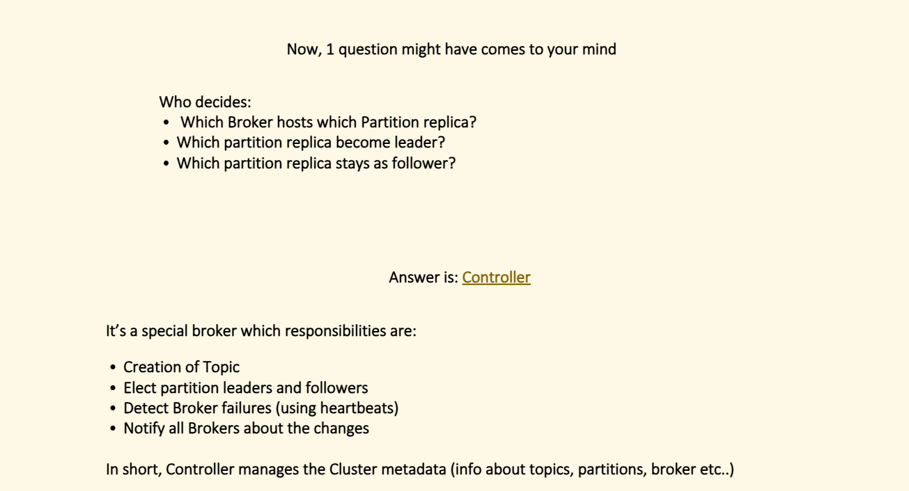

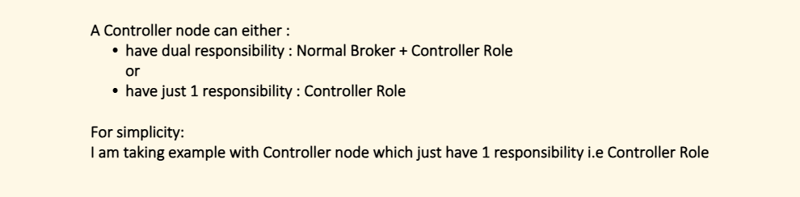



---

**Source video:** [Kafka Architecture - Part3](https://www.youtube.com/watch?v=TQLGDfJdXrQ) (33:29)

*Timestamps below were added after watching the video at 3x speed to verify these notes against it. Nothing existing was removed — only timestamps and one small verified addition (the dedicated-vs-dual-role controller note) were made. Two sections — "controllers can say NO / term number" and "High Watermark" — are flagged below because they read as supplementary explanations rather than a literal narrated segment of this video; see the notes at those sections.*

### 1. Creation of Topic `[Part3 ~0:27–0:56]`

When you run `kafka-topics.sh --create`, the request reaches the controller. It creates the topic record, splits it into N partitions, and decides which broker hosts which partition — all written to `_cluster_metadata.log`.

---

### 2. Elect partition leaders and followers `[Part3 ~0:27–0:56]`

For every partition the controller decides:

```
P0 → Broker1 = LEADER,  Broker2 = follower
P1 → Broker2 = LEADER,  Broker3 = follower
P2 → Broker3 = LEADER,  Broker1 = follower
```

It spreads leaders evenly so no single broker is overloaded. Also re-runs this election whenever a broker dies or comes back.

---

### 3. Detect broker failures — via heartbeats `[Part3 ~0:27–0:56]`

```
Every broker sends a heartbeat to the controller every few seconds.

Broker 2 → ♥ ♥ ♥ ♥  → controller says "B2 is alive"
Broker 3 → ♥ ♥ . . . → controller says "B3 missed heartbeat → DEAD"
```

Once controller detects failure it immediately triggers a new leader election for all partitions that had B3 as leader.

---

### 4. Notify all brokers about changes `[Part3 ~0:27–0:56]`

After any change (new topic, broker crash, leader change) the controller broadcasts the updated metadata to every broker in the cluster:

```
"Broker 3 is down.
 P2's new leader is Broker1.
 Update your routing tables."

All brokers now know where to send P2 traffic.
Producers and consumers automatically redirect.
```

---

### Controller node: dedicated vs dual-role `[Part3 ~0:56–1:57]` *(added from video — not in original notes)*

```
A Controller node can either:
  - have DUAL responsibility: Normal Broker role + Controller role (same process does both)
  or
  - have JUST 1 responsibility: Controller role only (dedicated controller node)

For simplicity, the rest of the explanation assumes a dedicated
Controller node (just the Controller role, no broker duties).
```

---

### Your notes' summary line — exactly right

> **Controller manages cluster metadata** = the single source of truth about:

```
_cluster_metadata.log
├── Topics      → what topics exist
├── Partitions  → how many, on which brokers
├── Leaders     → which broker is leader for each partition
└── Brokers     → which brokers are alive right now
```

Every broker in the cluster has a copy of this metadata. The controller is the only one who **writes** to it. Everyone else reads from it.


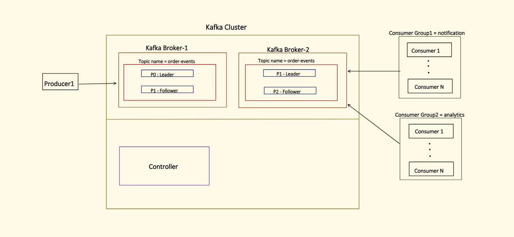

Here controller has only one responsibility i.e. Controlling the broker!!All clsuter info is stored in `cluster_metadata.log`


## RF--> Replication factor `[Part3 ~1:57–4:44]`

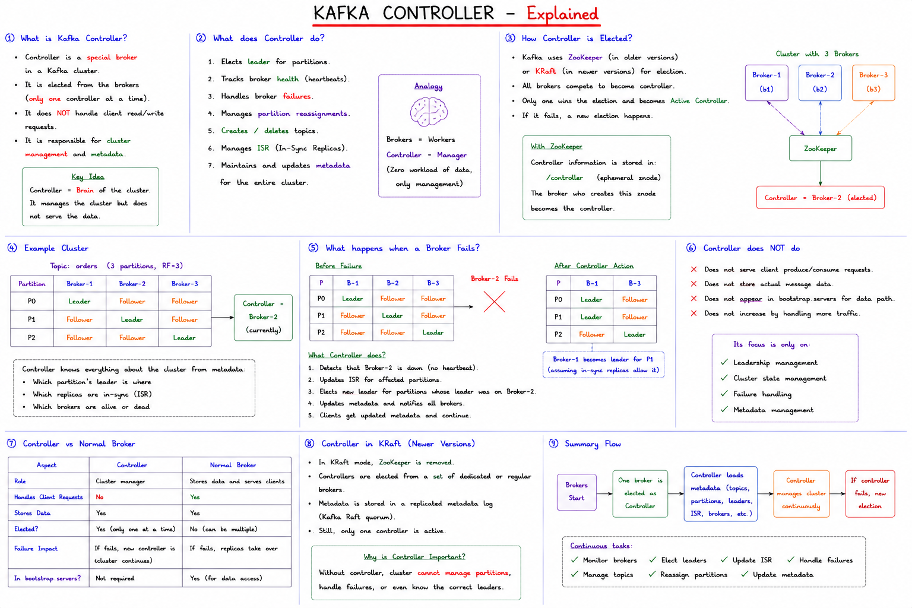


**Replication Factor = how many copies of each partition exist across the cluster.**### The one line definition

> **Replication Factor = how many total copies of each partition exist** across the cluster. 1 copy is the leader, the rest are followers.

---

### In code — where you set it

```bash
# When creating a topic via CLI
kafka-topics.sh --create \
  --topic order-events \
  --partitions 3 \
  --replication-factor 3    # ← set RF here
  --bootstrap-server localhost:9092
```

```java
// Or via Spring Boot
@Bean
public NewTopic orderEventsTopic() {
    return TopicBuilder.name("order-events")
        .partitions(3)
        .replicas(3)          // ← replication factor = 3
        .build();
}
```

---

### The critical rule

```
RF cannot be greater than number of brokers

RF=3, brokers=3 → OK ✓ (each partition on a different broker)
RF=3, brokers=2 → ERROR ✗
  "Replication factor: 3 larger than available brokers: 2"

You need AT LEAST RF brokers in your cluster.
```

---

### RF vs fault tolerance

```
Fault tolerance = RF - 1

RF=1 → can lose 0 brokers → useless for production
RF=2 → can lose 1 broker  → risky (losing 1 of 2 = 50% gone)
RF=3 → can lose 2 brokers → production standard
RF=5 → can lose 4 brokers → mission critical systems

Most companies use RF=3. It is the sweet spot between
safety and storage cost (3x data stored vs 1x).
```

---

### Connection to ISR

```
RF=3 means each partition has 3 copies
ISR tracks which of those 3 are fully caught up

RF=3, all in sync:    ISR = {B1, B2, B3}  → any can be elected leader
RF=3, B3 lagging:     ISR = {B1, B2}      → only B1 or B2 can be leader
RF=3, B2+B3 lagging:  ISR = {B1}          → only B1 can be leader
                                            (cluster still works but at risk)
```

Replication factor is the **promise** of how many copies exist. ISR is the **reality** of how many are actually ready to use at any moment.


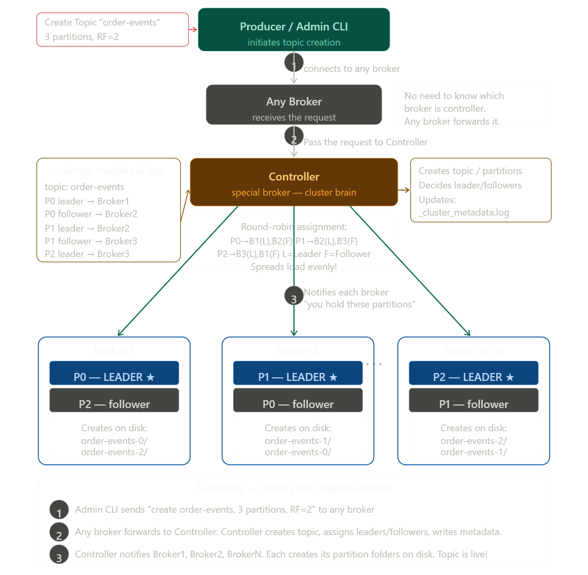
 Here is the full explanation matching every part of it:

---

### Step 1 — Producer / Admin CLI `[Part3 ~4:44]`

```bash
# This is what your diagram's red text shows
kafka-topics.sh --create \
  --topic order-events \
  --partitions 3 \
  --replication-factor 2 \
  --bootstrap-server localhost:9092
```
Or from Java:

```java
@Configuration
public class KafkaTopicConfig {

    @Bean
    public NewTopic orderEventsTopic() {
        return TopicBuilder.name("order-events")
            .partitions(3)
            .replicas(2)       // replication factor = 2
            .build();
        // Spring auto-creates this on startup
    }
}
```
You don't need to know which broker is the controller. You just connect to **any** broker.

---

### Step 2 — Any Broker → Controller `[Part3 ~4:44–6:41]`

You connect to **any** broker — you don't need to know which one is the controller. Every broker knows who the controller is and forwards the request automatically.

```
bootstrap-servers=broker1:9092,broker2:9092,broker3:9092
         ↓
Your client connects to broker1 (or whichever responds first)
         ↓
Broker1 knows: "controller is Broker2, forwarding request"
```


```
You → Broker4 (random)
Broker4 knows: "Controller is Broker1"
Broker4 forwards request → Controller
```

Every broker always knows who the current controller is via the cluster metadata.

---

### Step 3 — Controller does 3 things `[Part3 ~4:44–6:41]`

```
1. Creates topic record
   topic "order-events" now exists in _cluster_metadata.log

2. Decides leader + follower (RF=2 means 1 leader + 1 follower per partition)
   P0 → Broker1 LEADER,  Broker2 follower
   P1 → Broker2 LEADER,  Broker3 follower
   P2 → Broker3 LEADER,  Broker1 follower

3. Notifies every broker
   "Broker1 — you hold P0 as leader, P2 as follower"
   "Broker2 — you hold P1 as leader, P0 as follower"
   "Broker3 — you hold P2 as leader, P1 as follower"
```

The controller does 5 things in order:

```
1. Validates request
   → is replication-factor ≤ number of brokers? (RF=2, brokers=3 ✓)

2. Creates topic record
   → topic "order-events" now officially exists

3. Creates 3 partitions
   → P0, P1, P2

4. Assigns leader + follower for each partition (round-robin)
   → P0: leader=B1, follower=B2
   → P1: leader=B2, follower=B3
   → P2: leader=B3, follower=B1

5. Updates _cluster_metadata.log
   → permanent record of who holds what
```

### Step 4 — Controller notifies each broker

```
Controller → Broker 1: "You hold P0 as leader, P2 as follower"
Controller → Broker 2: "You hold P1 as leader, P0 as follower"
Controller → Broker 3: "You hold P2 as leader, P1 as follower"

Each broker immediately creates the partition folders on disk:
  Broker1/kafka-logs/order-events-0/  ← empty, ready for events
  Broker1/kafka-logs/order-events-0/00000000000000000000.log
  Broker1/kafka-logs/order-events-0/00000000000000000000.index
```

---

### Why RF=2 means each partition appears on 2 brokers

```
RF = 2 means every partition has 2 copies total (1 leader + 1 follower)

P0 → exists on Broker1 (leader) AND Broker2 (follower) → 2 copies ✓
P1 → exists on Broker2 (leader) AND Broker3 (follower) → 2 copies ✓
P2 → exists on Broker3 (leader) AND Broker1 (follower) → 2 copies ✓

If RF = 3:
P0 → Broker1 (leader) + Broker2 (follower) + Broker3 (follower) → 3 copies
Can survive 2 broker failures. Production standard.
```

---

### After step 3 — what gets created on each broker disk

```
Broker1/kafka-logs/
  order-events-0/   ← P0 LEADER
  order-events-2/   ← P2 follower (copy from Broker3)

Broker2/kafka-logs/
  order-events-1/   ← P1 LEADER
  order-events-0/   ← P0 follower (copy from Broker1)

Broker3/kafka-logs/
  order-events-2/   ← P2 LEADER
  order-events-1/   ← P1 follower (copy from Broker2)
```

Topic is now live. Producer can start sending events.

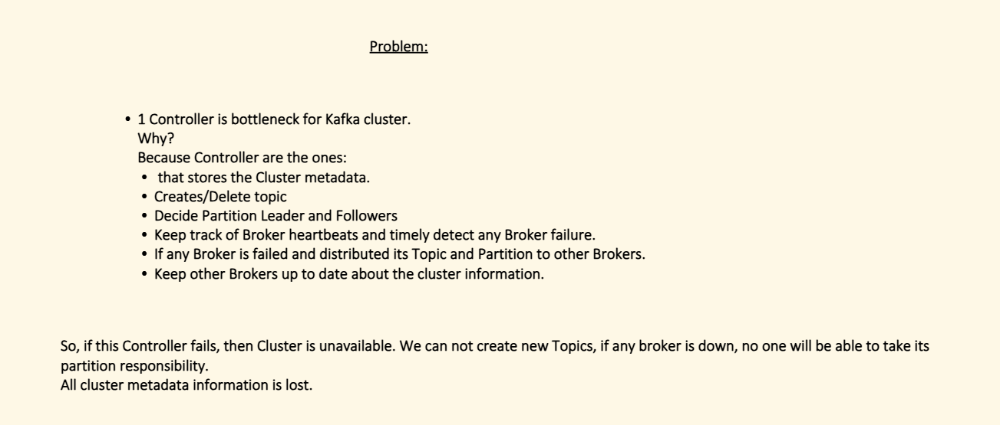

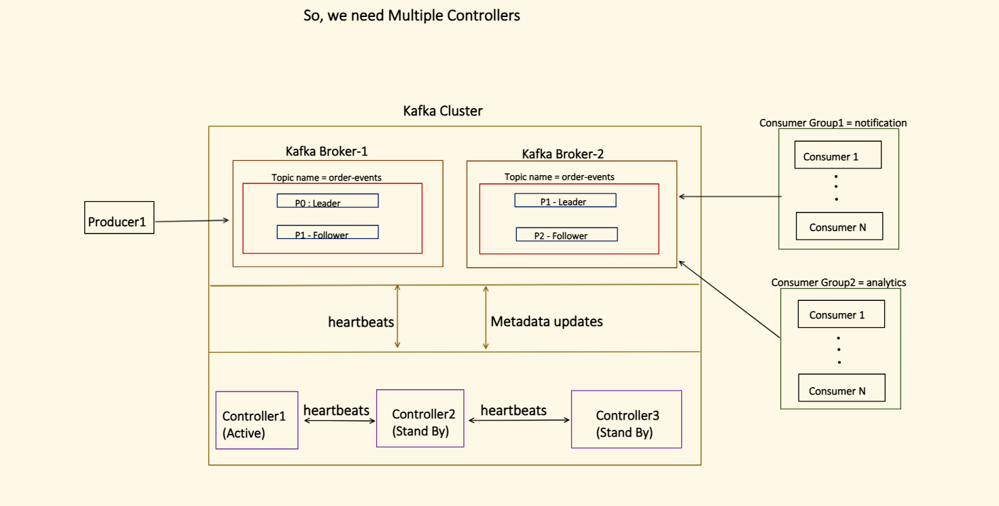

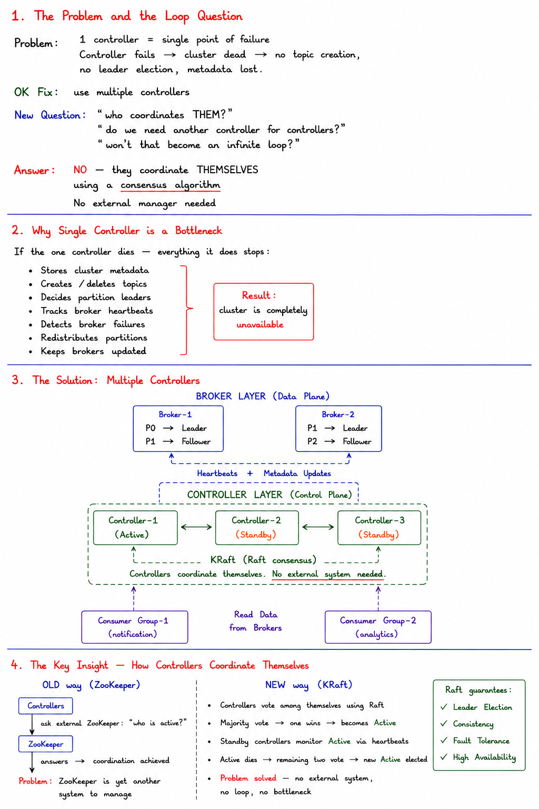


---

### Image 1 — The problem and the loop question `[Part3 ~6:41–8:20]`

Your notes ask the right question:

```
Problem:  1 controller = single point of failure
          Controller fails → cluster dead → no topic creation,
          no leader election, metadata lost

OK fix: use multiple controllers
New question: "who coordinates THEM?"
              "do we need another controller for controllers?"
              "won't that become an infinite loop?"

Answer: NO — they coordinate THEMSELVES
        using a consensus algorithm
        No external manager needed
```

---

### Image 2 — ZooKeeper vs KRaft `[Part3 ~8:20–10:02]`

KRaft is inside Controller only but zookeper was a separate service

Both solve the same problem — controller coordination — but differently:

```
ZooKeeper (Legacy):              KRaft (Modern):
External system                  Built into Kafka
Deploy separately                Zero extra deployment
Monitor separately               Zero extra monitoring
Maintain separately              Zero extra maintenance
Uses ZAB consensus               Uses Raft consensus
Deprecated in Kafka 3.x          Default since Kafka 3.3+
```

---

### Image 3 — Why single controller is a bottleneck `[Part3 ~10:02]`

If the one controller dies — everything it does stops:

```
Stores cluster metadata          → lost
Creates/deletes topics           → impossible
Decides partition leaders        → impossible
Tracks broker heartbeats         → impossible
Detects broker failures          → impossible
Redistributes partitions         → impossible
Keeps brokers updated            → impossible

Result: cluster is completely unavailable
```

---

### Image 4 — The solution: Multiple controllers `[Part3 ~10:02–13:23]`

Your diagram shows the full picture perfectly:

```
BROKER LAYER (top half of cluster):
  Broker-1: P0 Leader + P1 follower
  Broker-2: P1 Leader + P2 follower
  ↕ heartbeats + metadata updates ↕

CONTROLLER LAYER (bottom half of cluster):
  Controller1 (Active) ←→ Controller2 (Standby) ←→ Controller3 (Standby)
       ↑                        ↑                         ↑
       └────────── KRaft Raft consensus ──────────────────┘
       All 3 coordinate themselves. No external system needed.

Consumer Group1 (notification) and Consumer Group2 (analytics)
read from brokers independently.
```

---

### The key insight — how controllers coordinate themselves `[Part3 ~10:02–13:23]`

```
OLD way (ZooKeeper):
  Controllers → ask external ZooKeeper → "who is active?"
  ZooKeeper → answers → coordination achieved
  Problem: ZooKeeper is yet another system to manage

NEW way (KRaft):
  Controllers → vote among themselves using Raft
  Majority vote → one wins → becomes Active
  Standby controllers monitor Active via heartbeats
  Active dies → remaining two vote → new Active elected
  Problem solved — no external system, no loop, no bottleneck
```

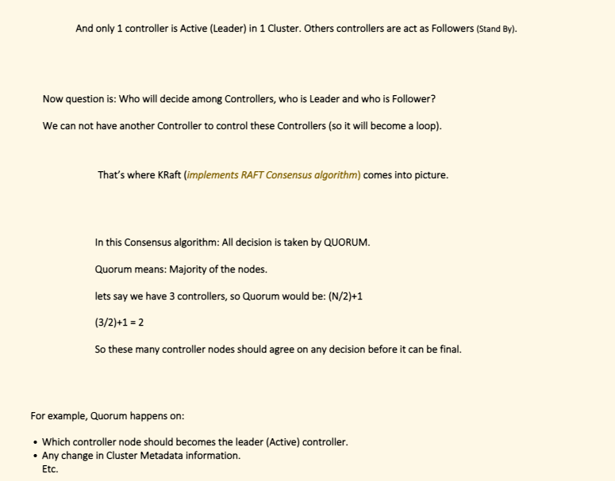

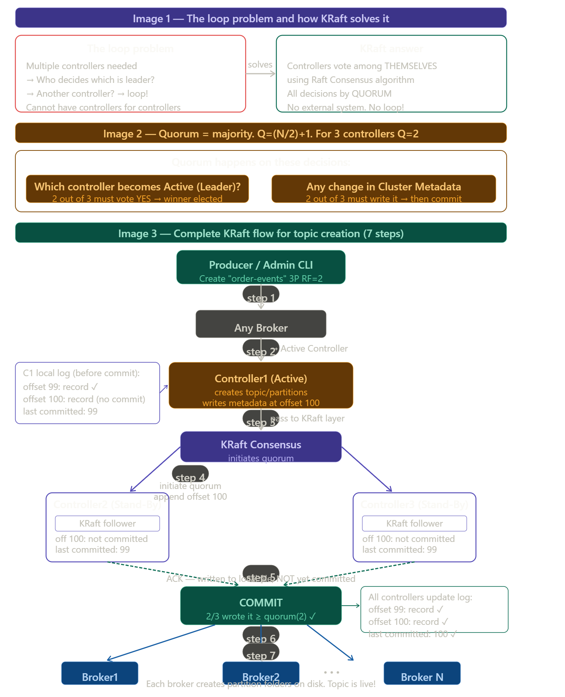


 Here is the complete explanation:

---

### Image 1 — The loop problem and KRaft answer `[Part3 ~13:23]`

Your notes ask exactly the right question:

```
Problem:  multiple controllers needed for fault tolerance
Question: who decides which controller is Active (Leader)?
Naive answer: another controller!
Problem:  who controls THAT controller?
          → infinite loop!

Real answer: KRaft — controllers vote among THEMSELVES
             No external manager. No loop.
             All decisions by QUORUM = majority vote.

3 controllers → Q = (3/2)+1 = 2
→ any 2 must agree before decision is final
```

---

>Quoram means majority of nodes.

### Image 2 — When quorum is used `[Part3 ~13:23]`

```
Quorum fires for TWO types of decisions:

1. Controller election
   "Which controller becomes Active?"
   → all 3 vote → first to get 2 votes wins → Active controller

2. Any cluster metadata change
   "Topic created, partition leader changed, broker died"
   → Active controller writes → sends to standbys
   → 2 out of 3 must confirm write → then commit
   → only then is the change official
```

---

### Image 3 — The full 7-step flow explained `[Part3 ~13:23–19:52]`

```
Step 1: Admin CLI sends "create order-events, 3P, RF=2"

Step 2: Any broker receives it → forwards to Active Controller1

Step 3: Controller1:
        → creates topic/partitions record
        → decides leaders/followers
        → writes to local log at offset 100
        → C1 log: offset 99 ✓, offset 100 (NO COMMIT YET)
        → last committed = 99
        → passes to KRaft layer

Step 4: KRaft sends offset 100 record to C2 and C3
        "please append this to your local log"
        C2 log: offset 100 written, NOT committed, last committed = 99
        C3 log: offset 100 written, NOT committed, last committed = 99

Step 5: C2 and C3 ACK back to KRaft
        "written to my local file — but NOT yet committed"

Step 6: KRaft checks → 3/3 wrote it → 3 ≥ quorum(2) → SAFE!
        COMMIT fires
        ALL controllers update: offset 100 ✓, last committed = 100

Step 7: Active Controller notifies ALL brokers
        "topic created, here are your partition assignments"
        Broker1, Broker2, BrokerN create partition folders on disk
        Topic is now LIVE
```

---

### The key insight from your notes `[Part3 ~13:23–19:52]`

```
Why wait for quorum before committing?

If C1 commits offset 100 alone and then crashes:
  C2 and C3 have last committed = 99
  New Active (C2) thinks topic was never created
  Topic creation is LOST!

With quorum commit (2/3 must write first):
  Even if C1 crashes after commit —
  C2 already has offset 100
  New Active sees it → topic still exists
  ZERO metadata loss — ever
```

This is the entire reason KRaft exists — **no single controller crash can ever lose cluster metadata.**


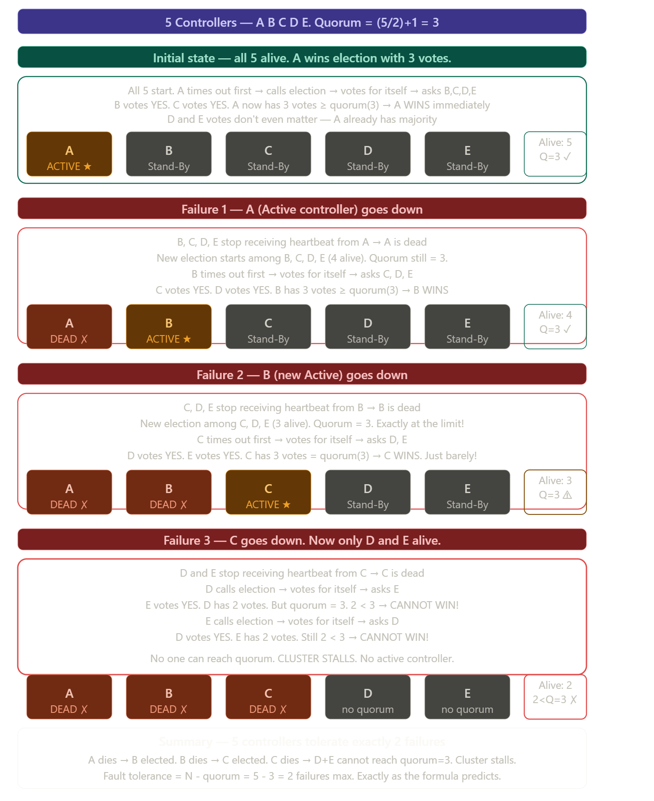

*`[Video check]` This 5-controller A/B/C/D/E cascading-failure walkthrough is an illustrative extension of the quorum concept, not a segment I could find narrated in the video itself. The video does cover quorum and the concrete 3-controller election/commit flow in detail around `[Part3 ~13:23–19:52]`, but not this specific multi-failure scenario — this image/explanation looks like supplementary material generated to answer a follow-up question, so treat the content as correct but not video-timestamped.*

 You are thinking deeply. YES — controllers **can and do say NO**. Let me explain exactly when a controller votes NO and why.
 
 ### The 3 rules that decide YES or NO

```
A controller votes YES only if ALL 3 rules pass:

Rule 1: "Have I already voted this election round?"
        If YES → vote NO immediately (one vote per round per node)

Rule 2: "Is candidate's term number ≥ mine?"
        If NO  → candidate is from old era → vote NO

Rule 3: "Is candidate's log at least as up to date as mine?"
        If NO  → candidate is behind → would lose data → vote NO

All 3 pass → vote YES
Any 1 fails → vote NO
```

---

### Why in our A,B,C,D,E scenario everyone said YES

```
It was a fresh startup scenario:
  All logs empty (offset 0) → Rule 3 ✓ (all equal)
  All term = 0             → Rule 2 ✓ (candidate increments to 1)
  No one voted yet         → Rule 1 ✓

So ALL rules passed → everyone said YES → winner elected instantly

In REAL production it is not always this clean.
Two controllers can call election simultaneously → split votes → retry
```

---

### What happens when NO votes block a winner

```
5 controllers A,B,C,D,E. A and C both call election simultaneously:

A asks B → B votes YES for A (1 for A)
C asks D → D votes YES for C (1 for C)
A asks D → D says NO (already voted for C) ← Rule 1 violation
C asks B → B says NO (already voted for A) ← Rule 1 violation
A asks E → E votes YES for A (2 for A)
C asks E → E says NO (already voted for A) ← Rule 1 violation

Result: A has 3 votes (self + B + E) → wins!
        C has 2 votes → loses → becomes Stand-By
        C accepts A as leader and resets
```

---

### The term number — prevents zombie leaders

```
Term number = election round counter. Increments every election.

B becomes leader at term=2.
A was isolated, still at term=1. A reconnects, calls election.
Everyone sees A's term=1 < current term=2 → Rule 2 fails → all vote NO
A gets 0 votes → cannot win → accepts B as leader → updates its term to 2

This prevents a previously dead controller from
coming back and thinking it is still the leader.
```




*`[Video check]` The presenter does say the words "high watermark" once in passing around `[Part3 ~16:43]`, while walking through the commit flow, but doesn't stop for a dedicated High Watermark explanation at that point in this video — no on-screen HW analogy/example/LEO comparison like this was found elsewhere in Part3 either. This section reads as supplementary material (correct and worth keeping), just not tied to one exact video timestamp.*

 High watermark is one of the most important concepts in Kafka — it decides **which events consumers are allowed to read**.

**High Watermark = the highest offset that has been replicated to ALL brokers in the ISR.**### The one line definition

> **High Watermark = the highest offset that has been safely replicated to ALL brokers in the ISR. Consumers can ONLY read up to this point.**

---

### Simple analogy

Think of it like a **newspaper printing press**:

```
Editor writes articles (Leader writes events)
Printers in 3 cities must print each edition (followers replicate)

You can only READ a published edition when ALL printers have printed it
If City B printer is slow → you wait → only read editions ALL cities printed

High Watermark = the latest edition ALL printers have printed
LEO            = the latest edition the main editor has written
```

---

### In code — how it affects consumers

```java
// Producer sends events 0-9 to leader
kafkaTemplate.send("order-events", "ORD-001", event);  // offset 9

// Consumer tries to read
@KafkaListener(topics = "order-events")
public void onOrder(ConsumerRecord<String, String> record) {
    // Can only read up to offset 6 (the HW)
    // Offsets 7,8,9 are INVISIBLE to consumer
    // Even though they exist on the leader!

    // Once B2,B3 replicate 7,8,9 → HW moves to 9
    // Consumer automatically sees them on next poll
}
```

---

### HW vs LEO — the key difference

```
LEO (Log End Offset) = where each broker currently is
HW  (High Watermark) = where ALL ISR members are (the minimum)

Example:
  B1 (Leader)  LEO = 9   ← wrote up to 9
  B2 (Follower) LEO = 6  ← replicated up to 6
  B3 (Follower) LEO = 6  ← replicated up to 6

  HW = min(9, 6, 6) = 6

  Consumer reads: 0 → 6 ✓
  Consumer waits for: 7, 8, 9 (not yet safe)
```

---

### Why this is critical for data consistency

```
Without HW:
  Consumer reads offset 9 from leader
  Leader crashes → B2 becomes leader → only has offset 6
  Consumer asks "give me from offset 10" → B2 says "I only have up to 6"
  Consumer is confused → data gap → inconsistency

With HW:
  Consumer only read up to 6
  Leader crashes → B2 becomes leader → has 0-6
  Consumer asks "give me from offset 7" → B2 serves it correctly
  Perfect continuity. Zero confusion.
```

High Watermark is the **safety guarantee** that what the consumer reads will always be available even after a leader crash. It is the contract between Kafka and the consumer: *"I will never show you something that could disappear."*

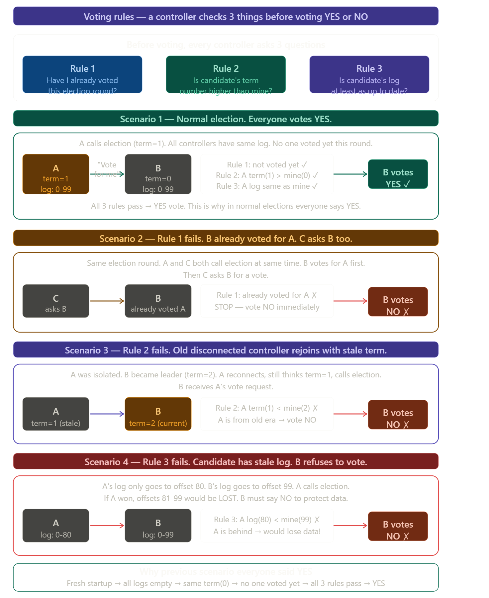


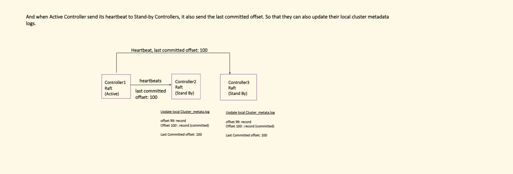


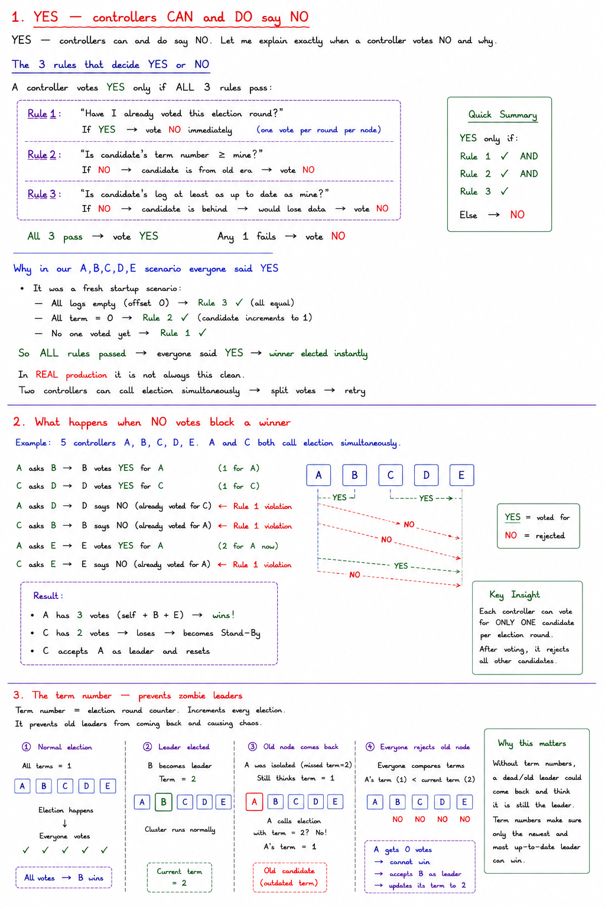


Your notes show a crucial detail — the **heartbeat carries the last committed offset**. This is how standby controllers stay in sync after the commit. Let me visualize this clearly.Your notes captured something very important. Here is the full explanation:

---

### What happens in the heartbeat `[Part3 ~19:52–20:04]`

The heartbeat is not just a "I am alive" ping. It carries a **payload**:

```
Normal heartbeat (just alive check):
  { type: "heartbeat" }

KRaft heartbeat (alive + sync):
  { type: "heartbeat", lastCommittedOffset: 100 }
```

The standby controllers use this `lastCommittedOffset` to update their local logs.

---

### Before heartbeat — the gap

```
After quorum commit (step 6):
  Controller1 (Active):   last committed = 100 ✓
  Controller2 (Stand-By): offset 100 written BUT last committed = 99 ✗
  Controller3 (Stand-By): offset 100 written BUT last committed = 99 ✗

C2 and C3 know they HAVE offset 100 on disk.
But they don't yet know it is officially COMMITTED.
```

---

### After heartbeat — all in sync

```
C1 sends heartbeat → "lastCommittedOffset: 100"

C2 receives it → updates: last committed = 100 ✓
C3 receives it → updates: last committed = 100 ✓

Now ALL three controllers:
  offset 99:  record ✓
  offset 100: record ✓ (committed)
  last committed: 100 ✓
```

---

### Why this matters for failover

```
If Controller1 crashes RIGHT NOW:

WITHOUT heartbeat sync:
  C2 last committed = 99
  C2 becomes Active → thinks topic was never created
  Topic creation lost! ✗

WITH heartbeat sync (your notes):
  C2 last committed = 100
  C2 becomes Active → sees topic fully committed
  Picks up exactly where C1 left off ✓
  Zero data loss. Zero downtime.
```

This is the final piece of the puzzle. The heartbeat serves two purposes — detecting crashes AND keeping all standby controllers fully up to date so **any one of them can instantly become Active** with zero data loss at any moment.

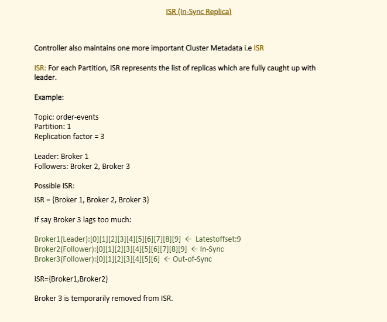


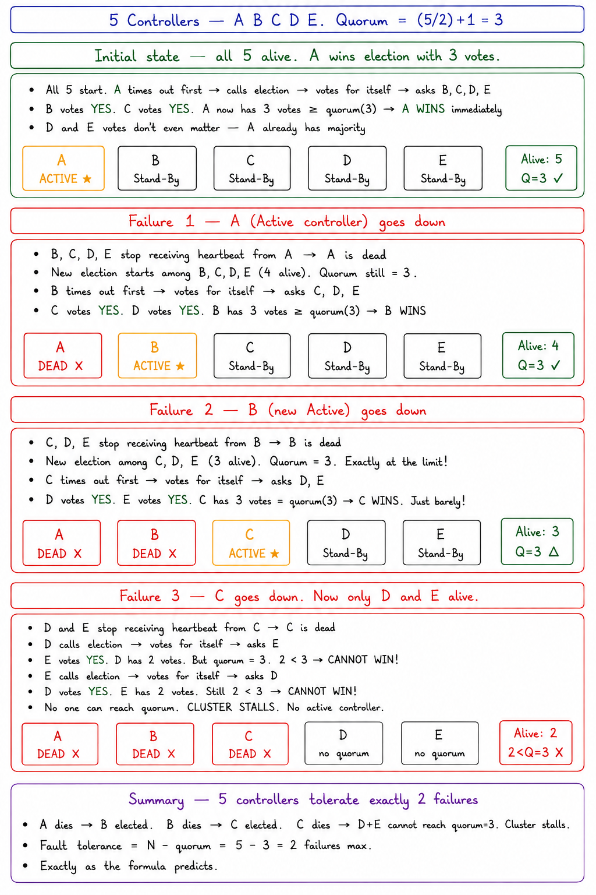


 Let me visualize this with the exact example from your notes.Your notes nailed it. Here is the complete explanation:

---

### What ISR is `[Part3 ~20:04]`

```
ISR = In-Sync Replica
    = the list of replicas that are fully caught up with the leader

Controller maintains this list as part of cluster metadata.
It is updated dynamically as followers fall behind or catch up.
```

---

### Your exact example from the notes `[Part3 ~20:04–23:25]`

```
Topic: order-events   Partition: 1   RF: 3
Leader: Broker1       Followers: Broker2, Broker3

Broker1(Leader):  [0][1][2][3][4][5][6][7][8][9]  ← latest offset: 9
Broker2(Follower):[0][1][2][3][4][5][6][7][8][9]  ← fully caught up → In-Sync ✓
Broker3(Follower):[0][1][2][3][4][5][6]            ← missing 7,8,9  → Out-of-Sync ✗

ISR = {Broker1, Broker2}
Broker3 temporarily removed.
```

---

### The config that controls removal `[Part3 ~23:25–26:46]`

```java
# application.properties (broker config)
replica.lag.time.max.ms = 10000  # default 10 seconds

If a follower hasn't caught up within 10 seconds → removed from ISR
If it catches up again → automatically added back to ISR
```

---

### Why ISR is the most important safety mechanism `[Part3 ~23:25–26:46]`

```
Leader B1 crashes. Controller must elect new leader.
Controller checks ISR = {B1, B2}   (B3 not eligible)

CORRECT: B2 elected → has offsets 0-9 → zero data loss ✓

WRONG (if B3 was allowed):
  B3 elected → only has offsets 0-6
  Offsets 7, 8, 9 = gone forever
  3 events lost that producers thought were safely written
```

This is exactly why Kafka never elects a leader from outside the ISR. The ISR is the **safety guarantee** that any new leader always has all committed data.


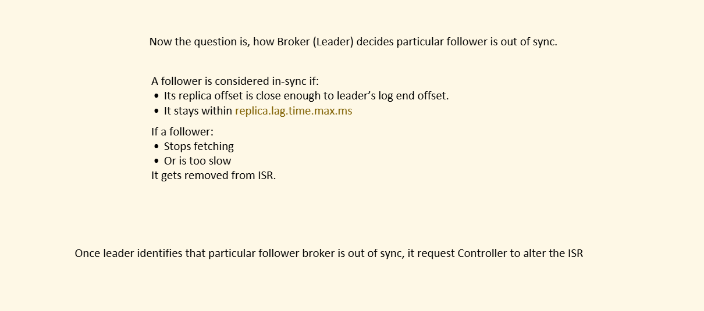

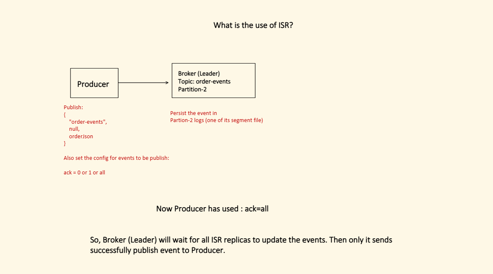

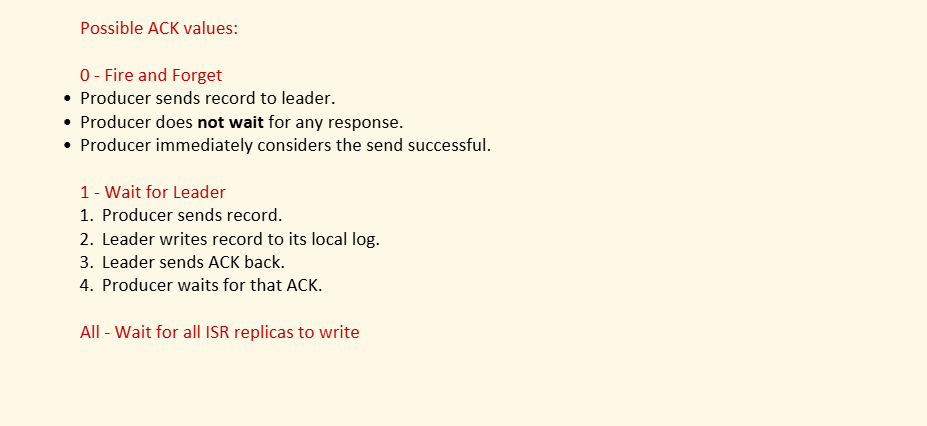


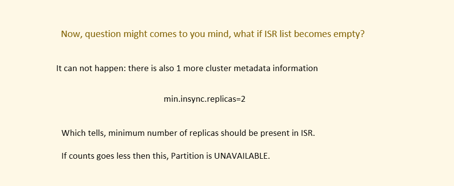


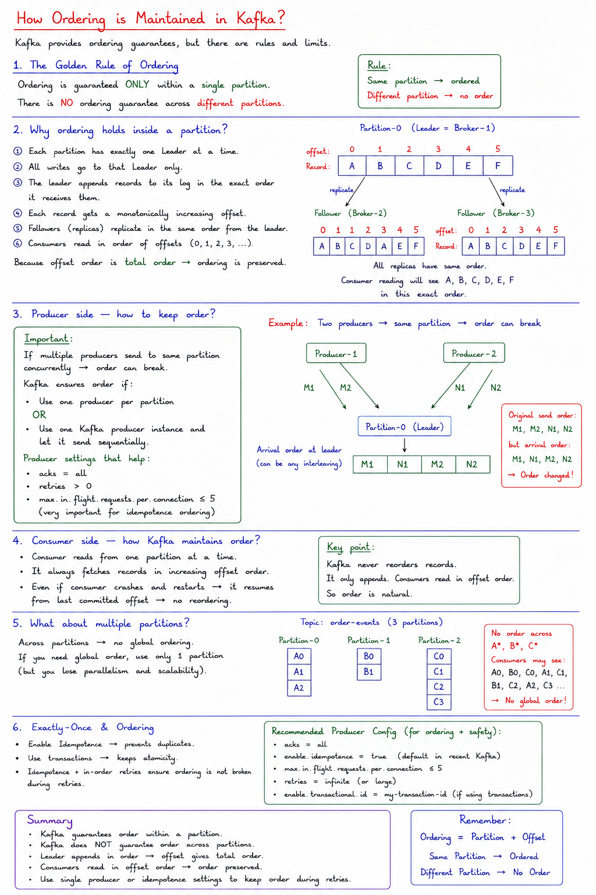


---

### Image 1 — How leader detects out-of-sync `[Part3 ~26:46]`

```java
// Broker config
replica.lag.time.max.ms = 10000  // 10 seconds

// Leader checks every follower:
// "Has this follower fetched recently AND is its offset close to mine?"

// If follower stops fetching OR takes > 10s to catch up:
// Leader → requests Controller: "Remove B3 from ISR"
// Controller → updates _cluster_metadata.log
// ISR shrinks: {B1,B2,B3} → {B1,B2}
```

Important — the **leader detects** but the **controller decides and updates** ISR. Leader never edits ISR directly.

---

### Image 2 — Why ISR matters for producers `[Part3 ~26:46–30:07]`

```
ack=all means:
"Don't tell producer success until ALL ISR members have written the event"

ISR={B1,B2,B3} → all 3 must write → then ACK sent to producer
ISR={B1,B2}    → only 2 must write → B3 is excluded (already removed)

This is why ISR exists — it defines WHO must confirm for ack=all
```

---

### Image 3 — Three ACK values `[Part3 ~30:07–32:22]`

```
ack=0:   Producer fires and forgets. No wait. Fastest. Can lose data.
         Use: metrics, logs where occasional loss is acceptable

ack=1:   Leader writes → sends ACK. Followers may not have it yet.
         Leader crashes before replication → data lost.
         Use: moderate risk tolerance

ack=all: ALL ISR members write → then ACK.
         Zero data loss even if leader crashes immediately after.
         Use: payments, orders, anything critical
```

---

### Image 4 — min.insync.replicas prevents silent failure `[Part3 ~32:22–33:27]`

```
Problem without min.insync.replicas:
  RF=3, but B2 and B3 both crash
  ISR = {B1} (only leader)
  ack=all → leader writes → only 1 ISR member wrote → ACK sent!
  Producer thinks it is safe. But if B1 crashes → data gone.
  ack=all became meaningless!

Solution — min.insync.replicas=2:
  ISR={B1} → 1 < min.insync.replicas(2)
  → partition UNAVAILABLE
  → producer gets NotEnoughReplicasException
  → producer knows something is wrong → can retry or alert

Better to fail loudly than lose data silently.
```

---

### The golden production config `[Part3 ~32:22–33:27, leads straight into Part4]`

```java
# application.properties — production standard
spring.kafka.producer.acks=all
spring.kafka.producer.retries=3

# Broker config
min.insync.replicas=2       # at least 2 ISR members required
replication.factor=3        # 3 copies of each partition
replica.lag.time.max.ms=10000  # 10s before follower removed from ISR

# This combination means:
# - You need at least 2 brokers alive and in-sync
# - If only 1 broker left → partition unavailable → loud error
# - Zero silent data loss
```


