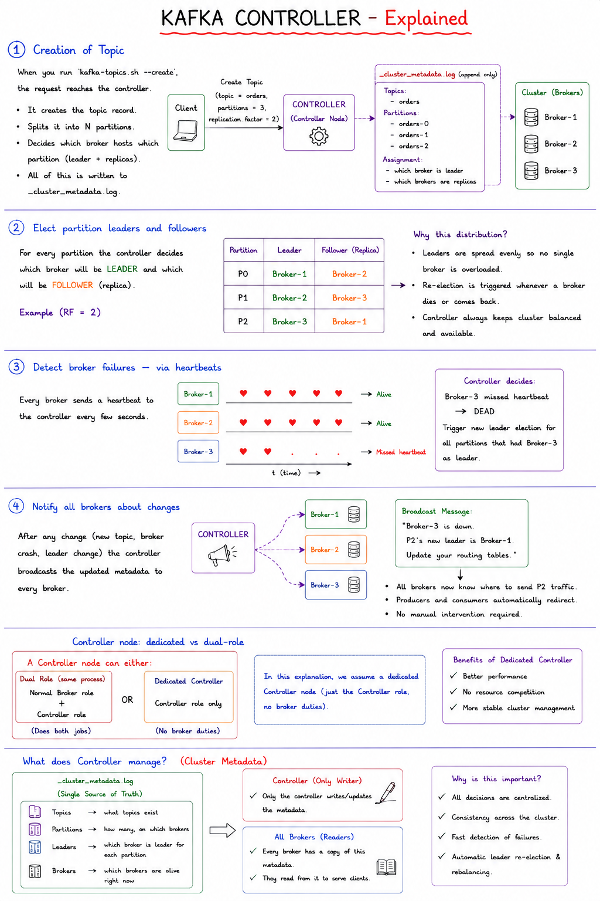
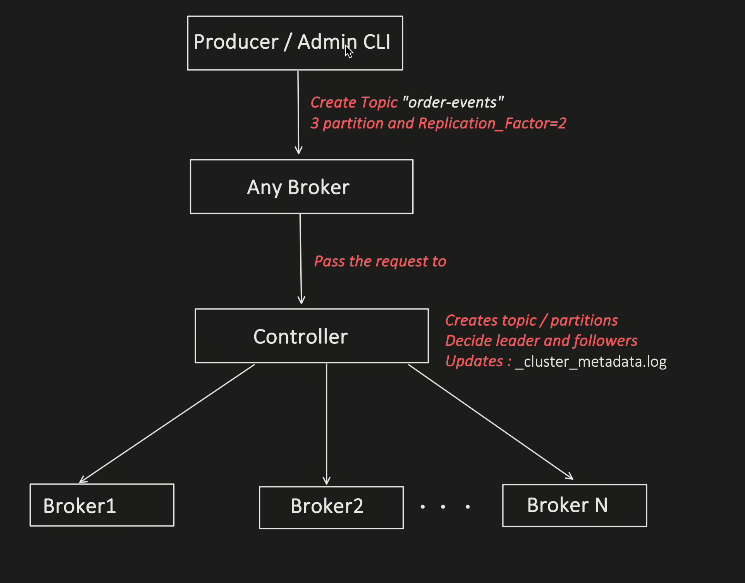
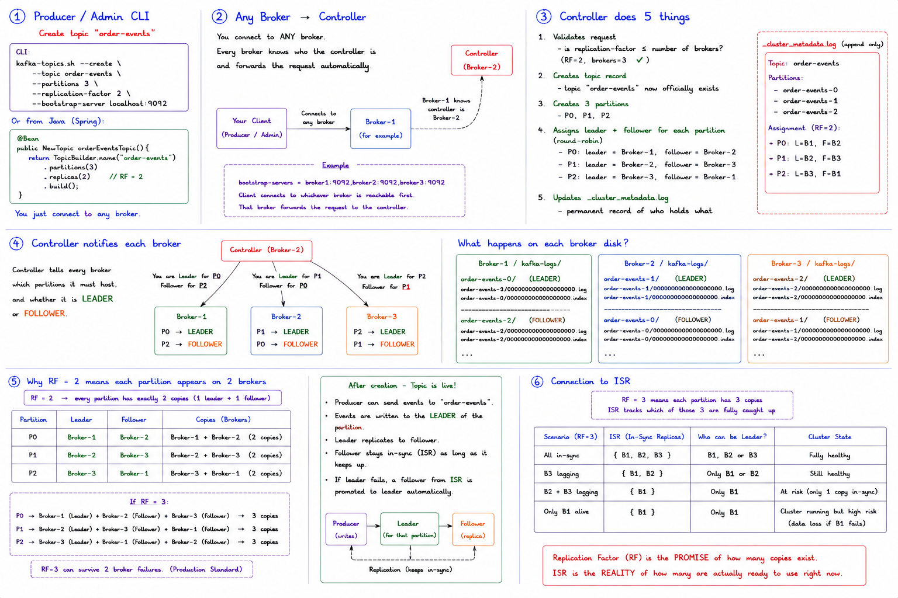
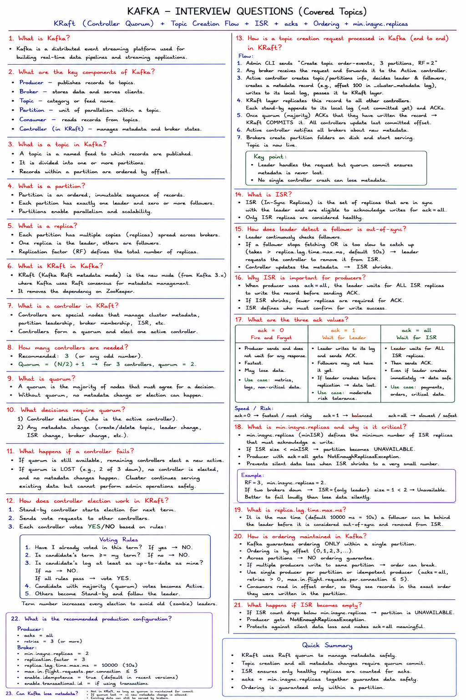

We choosing controller having 1 responsibility so see below


Here controller has only one responsibility i.e. Controlling the broker!!

All clsuter info is stored in `cluster_metadata.log`


## RF--> Replication factor

**Replication Factor = how many copies of each partition exist across the cluster.**

> **Replication Factor = how many total copies of each partition exist** across the cluster. 1 copy is the leader, the rest are followers.

---

### In code — where you set it

```bash
# When creating a topic via CLI
kafka-topics.sh --create \
  --topic order-events \
  --partitions 3 \
  --replication-factor 3    # ← set RF here
  --bootstrap-server localhost:9092
```

```java
// Or via Spring Boot
@Bean
public NewTopic orderEventsTopic() {
    return TopicBuilder.name("order-events")
        .partitions(3)
        .replicas(3)          // ← replication factor = 3
        .build();
}
```

---

### The critical rule

```
RF cannot be greater than number of brokers

RF=3, brokers=3 → OK ✓ (each partition on a different broker)
RF=3, brokers=2 → ERROR ✗
  "Replication factor: 3 larger than available brokers: 2"

You need AT LEAST RF brokers in your cluster.
```

---

### RF vs fault tolerance

```
Fault tolerance = RF - 1

RF=1 → can lose 0 brokers → useless for production
RF=2 → can lose 1 broker  → risky (losing 1 of 2 = 50% gone)
RF=3 → can lose 2 brokers → production standard
RF=5 → can lose 4 brokers → mission critical systems

Most companies use RF=3. It is the sweet spot between
safety and storage cost (3x data stored vs 1x).
```


### Connection to ISR

```
RF=3 means each partition has 3 copies
ISR tracks which of those 3 are fully caught up

RF=3, all in sync:    ISR = {B1, B2, B3}  → any can be elected leader
RF=3, B3 lagging:     ISR = {B1, B2}      → only B1 or B2 can be leader
RF=3, B2+B3 lagging:  ISR = {B1}          → only B1 can be leader
                                            (cluster still works but at risk)
```

Replication factor is the **promise** of how many copies exist. ISR is the **reality** of how many are actually ready to use at any moment.





Who handles multiple controller?

add one more controller 


so who manage that ??

so thats the loop.


will not cover Zookeeper, as it becomes deprecated in latest versions of Kafka (>=3.x). And its been replaced with KRaft. 

Both helps Kafka to manage cluster metadata (topics, partition, broker, controller election). 

 
Zookeeper is an external distributed system, which Kafka has to: 

- Deployed separately 

- Monitored separately 

- And maintained separately from Kafka 

 

Whereas KRaft (Kafka Raft) is inbuilt in Kafka. So less overhead to manage an external system. 

---

Both Zookeeper and KRaft uses Consensus algorithm: 

 

- Zookeeper: uses Zab Consensus 

- KRaft: uses Raft Consensus  


When a create topic topic request comes,it comes to any broker.

Then it goes to active controller/leader.


ISR is imporatnt cluster Metadata


