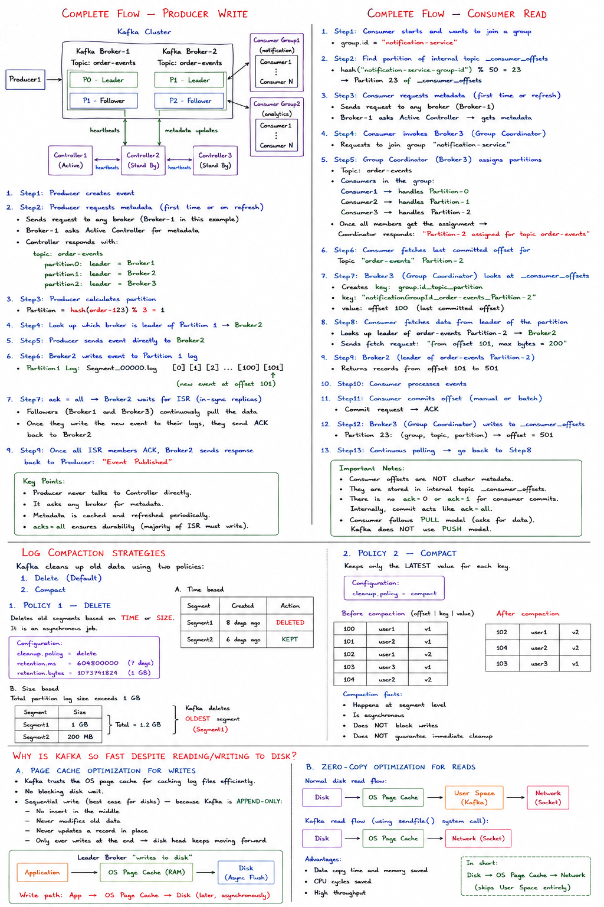
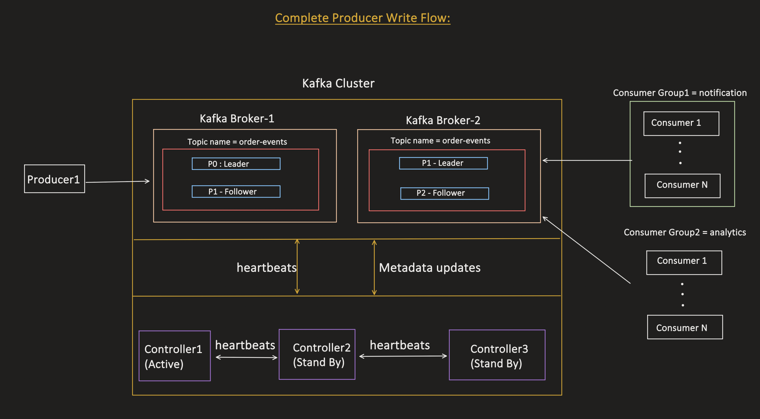
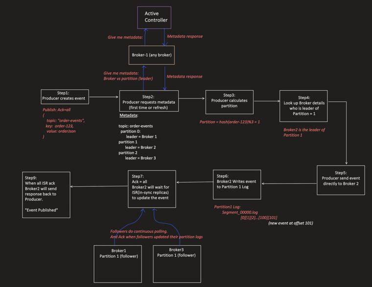
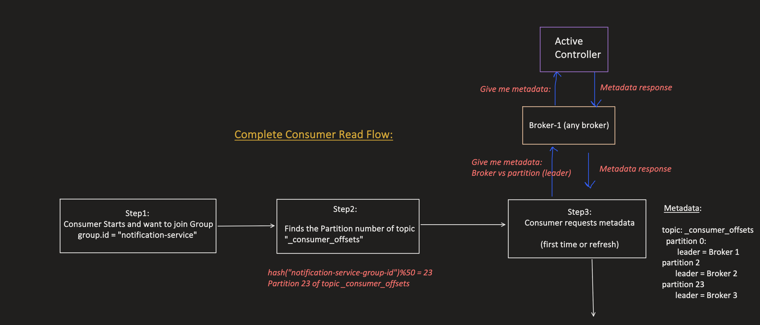
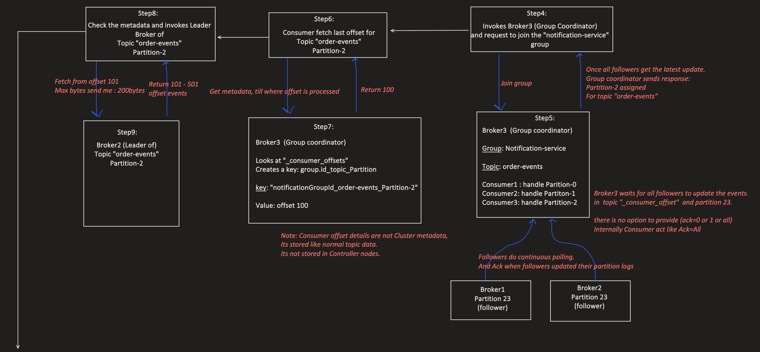
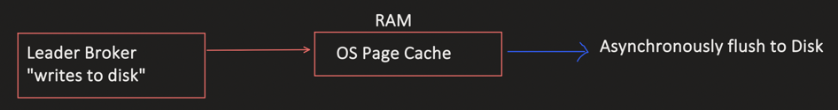
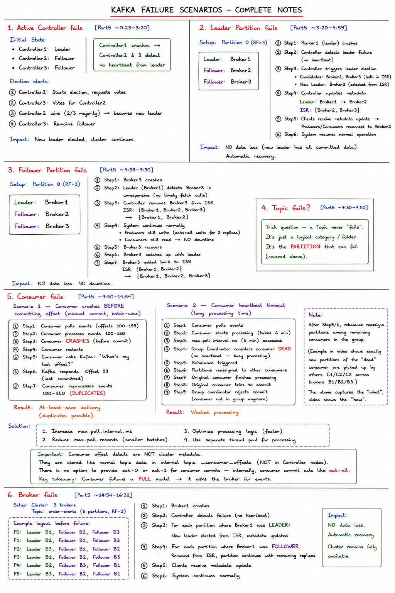

 


## Complete Flow — Producer Write(video-5)



By this point: Topic is created, Leader/Follower assignment is decided, and all Brokers have been updated with Cluster Metadata (via the Controller). 


This is the full picture — Producer1 writes to Broker-1 (P0 leader), Broker-2 holds P1 leader + P2 follower, Controllers exchange heartbeats/metadata updates, and two independent Consumer Groups (notification, analytics) read from the brokers.



### Step-by-step — Producer Write Flow

```
Step1: Producer creates event
Step2: Producer requests metadata to any broker (first time or on refresh)
       → Broker-1 (any broker) asks Active Controller: "give me metadata"
       → Controller responds with metadata:
         topic: order-events
           partition0: leader = Broker1
           partition1: leader = Broker2
           partition2: leader = Broker3
Step3: Producer calculates partition
       Partition = hash(order-123) % 3 = 1
Step4: Look up which broker is leader of Partition 1 → Broker2
Step5: Producer sends event directly to Broker2
Step6: Broker2 writes event to Partition 1 log
       Partition1 Log: Segment_00000.log [0][1][2]...[100][101] (new event at offset 101)
Step7: Ack=all → Broker2 waits for ISR (in-sync replicas) to update the event
       Broker1 (follower) and Broker3 (follower) continuously poll and ACK once
       they've updated their partition logs
Step9: Once all ISR members ACK, Broker2 sends response back to Producer:
       "Event Published"
```

Note: the producer never needs to know which broker is the controller — it just asks any broker, and metadata is cached/refreshed as needed.

---

## Complete Flow — Consumer Read 



```
Step1: Consumer starts, wants to join Group
       group.id = "notification-service"
Step2: Finds the Partition number of internal topic "_consumer_offsets"
       hash("notification-service-group-id") % 50 = 23
       → Partition 23 of topic _consumer_offsets
Step3: Consumer requests metadata it asks any broker (first time or refresh)
       → Broker-1 (any broker) asks Active Controller → gets metadata back
```
 Everything is handled by kafka .producer and consumer are clients



In case of consumer Leader is called as `Group coordinator`

```
Step4: Invokes Broker3 (Group Coordinator) and requests to join the
       "notification-service" group

Step5: Broker3 (group coordinator):
         Group: notification-service
         Topic: order-events
         Assigns partitions to consumers in the group:
           Consumer1 → handles Partition-0
           Consumer2 → handles Partition-1
           Consumer3 → handles Partition-2
       Once all followers get the latest update, Group Coordinator responds:
       "Partition-2 assigned for topic order-events". we need all followers 
       to acknowledge . There is no option for `ack=0` for consumer

Step6: Consumer fetches last committed offset for 
       Topic "order-events"              
       Partition-2.So it goes to Group coordinator

Step7: Broker3 (Group Coordinator) looks at "_consumer_offsets"
       Creates a key: group.id_topic_partition
       key: "notificationGroupId_order-events_Partition-2" and get value
       `value: offset 100` So we have read till 100 ,we need to start from 101

Step8: Check the metadata and invoke Leader Broker of Topic "order-events"
       Partition-2 → fetch from offset 101, max bytes send: 200bytes

Step9: Broker2 (leader of Topic "order-events" Partition-2) returns offset
       101-501 events
```


```
Step10: Consumer processes events
Step11: Consumer commits offset (manual, batch-wise) → Commit → ACK
Step12: Broker3 (Group Coordinator) writes to _consumer_offsets, Partition23:
        (group, topic, partition) → offset processed till = 501
Step13: Continuous Polling → move back to Step 8
```

Note:

```
Consumer offset details are NOT cluster metadata.
They are stored like normal topic data (_consumer_offsets), NOT in Controller nodes.
There is no option to provide ack=0 or ack=1 for consumer commits —
internally, consumer commit acts like ack=all.
```

**Key takeaway from the full flow:** Consumer follows a **PULL model** — it asks the broker for events. Kafka does **not** use a PUSH model.

---

## Log Compaction Strategies

Two policies control how Kafka cleans up old log segments:

```
Policy 1: Delete (Default)
Policy 2: Compact
```

### Policy 1 — Delete

```
Delete old segments based on TIME or SIZE.
It's an async job.

Configuration:
cleanup.policy = delete
retention.ms    = 604800000   (7 days)
retention.bytes = 1073741824  (1 GB)
```

**Behavior — time based:**

```
Segment1: Created 8 days ago → DELETED
Segment2: Created 6 days ago → KEPT
```

**Behavior — size based:**

```
Total partition log size exceeds 1GB:
Segment1: 1GB
Segment2: 200MB
Total: 1.2GB → Kafka deletes the OLDEST segment (Segment1)
```

### Policy 2 — Compact

```
Keep only the LATEST value for each key.

Configuration:
cleanup.policy = compact
```

Before compaction (offset | key | record):

```
100  user1  v1
101  user2  v1
102  user1  v2
103  user3  v1
104  user2  v2
```
 duplicates key old key values deleted
After compaction — only the latest value per key survives:

```
102  user1  v2
104  user2  v2
103  user3  v1
```

**Compaction facts:**

```
Happens at segment level
Is asynchronous
Does NOT block writes
Does NOT guarantee immediate cleanup
```

---

## Why is Kafka so fast despite reading/writing to disk? `


### Page Cache Optimization for Writes

```
Kafka trusts the OS for caching log files efficiently.
No blocking disk wait.
Sequential write (best case for disks) — because Kafka is APPEND-ONLY:
  No insert in the middle
  Never modifies old data
  Never updates a record in place
  Only ever writes at the end → disk head keeps moving forward
```


```
Leader Broker "writes to disk" → RAM (OS Page Cache) → Asynchronously flush to Disk
```

### Zero-Copy Optimization for Reads

Normal disk read flow:

```
Disk → OS Page Cache → User Space → Network
```

Kafka's flow (using the `sendfile()` system call):

```
Disk → OS Page Cache → Network   (skips User Space entirely)
```
kafka do not use data to User Space,No copy is maintained in kafka JVM
```
Advantages:
  Data copy time and memory saved
  CPU cycles saved
  High throughput
```

---

## Edge Cases and Failure Scenarios (video-6)



### 1. Active Controller fails 

```
Initial State:
  Controller1: Leader
  Controller2: Follower
  Controller3: Follower

Controller1 crashes → Controller2 & 3 detect no heartbeat from leader

Election starts:
  Controller2: Starts election, requests votes
  Controller3: Votes for Controller2
  Controller2 wins (2/3 majority) → becomes new leader
  Controller3: Remains follower

Impact: New leader elected, cluster continues.
```

### 2. Leader Partition fails 

```
Setup: Partition 0 (RF=3)
  Leader: Broker1
  Follower: Broker2
  Follower: Broker3

Step1: Broker1 (leader) crashes
Step2: Controller detects leader failure (no heartbeat)
Step3: Controller triggers leader election
       Candidates: Broker2, Broker3 (both in ISR)
       New Leader: Broker2 (selected from ISR)
Step4: Controller updates metadata
       Leader: Broker1 → Broker2
       ISR: {Broker2, Broker3}
Step5: Clients receive metadata update → Producers/Consumers reconnect to Broker2
Step6: System resumes normal operation

Impact: NO data loss (new leader has all committed data). Automatic recovery.
```

### 3. Follower Partition fails 

```
Setup: Partition 0 (RF=3)
  Leader: Broker1
  Follower: Broker2
  Follower: Broker3

Step1: Broker3 crashes
Step2: Leader (Broker1) detects Broker3 is unresponsive (no timely fetch calls)
Step3: Controller removes Broker3 from ISR
       ISR: {Broker1, Broker2, Broker3} → {Broker1, Broker2}
Step4: System continues normally
       Producers still write (acks=all waits for 2 replicas)
       Consumers still read — NO downtime
Step5: Broker3 recovers
Step6: Broker3 catches up with leader
Step7: Broker3 added back to ISR
       ISR: {Broker1, Broker2} → {Broker1, Broker2, Broker3}

Impact: NO data loss. NO downtime.
```

### 4. Topic fails? 

```
Trick question — a Topic never "fails". It's just a logical category/folder.
It's the PARTITION that can fail (covered above).
```

### 5. Consumer fails 

**Scenario 1 — Consumer crashes BEFORE committing offset (manual commit, batch-wise):** 

```
Step1: Consumer polls events (offsets 100-199)
Step2: Consumer processes events 100-150
Step3: Consumer CRASHES (before commit)
Step4: Consumer restarts
Step5: Consumer asks Kafka: "What's my last offset?"
Step6: Kafka responds: Offset 99 (last committed)
Step7: Consumer reprocesses events 100-150 (DUPLICATES)

Result: At-least-once delivery (duplicates possible).
```

**Scenario 2 — Consumer heartbeat timeout (long processing time):** 

```
Step1: Consumer polls events
Step2: Consumer starts processing (takes 6 minutes)
Step3: max.poll.interval.ms (5 minutes) exceeded
Step4: Group Coordinator considers consumer DEAD (no heartbeat — busy processing)
Step5: Rebalance triggered
Step6: Partitions reassigned to other consumers
Step7: Original consumer finishes processing
Step8: Original consumer tries to commit
Step9: Group coordinator rejects commit (consumer not in group anymore)

Result: Wasted processing.
```

*Note (added from video, `[Part5 ~11:36–13:15]`): after Step5/6, the video walks through a worked example on the whiteboard of exactly how the rebalance reassigns partitions — consumers C1/C2/C3 and partitions across brokers B1/B2/B3 get re-mapped so the partitions previously owned by the "dead" consumer are picked up by the remaining consumers in the group. The notes above already capture the "what" (rebalance triggers, partitions get reassigned); this is just the concrete walk-through of the "how," not a new concept.

```

Solution:
  1. Increase max.poll.interval.ms
  2. Reduce max.poll.records (process smaller batches)
  3. Optimize processing logic (faster processing)
  4. Use a separate thread pool for processing
```

### 6. Broker fails 

```
Setup: Cluster: 3 brokers. Topic: order-events (6 partitions, RF=3)

Step1: Broker1 crashes
Step2: Controller detects failure (no heartbeat)
Step3: For each partition where Broker1 was LEADER:
         New leader elected from ISR, metadata updated
Step4: For each partition where Broker1 was FOLLOWER:
         Removed from ISR, partition continues with remaining replicas
Step5: Clients receive metadata update
Step6: System continues normally

Impact: NO data loss. Automatic recovery.
```
