# Kafka Cluster Setup 
Target cluster for this exercise — 2 Controllers + 2 Brokers:

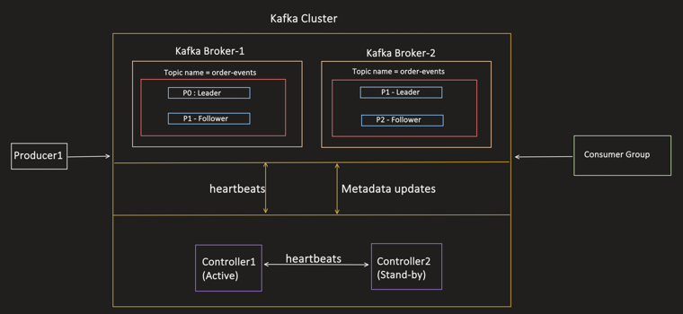

```
Kafka Cluster
  Broker-1: Topic order-events → P0(Leader), P1(Follower)
  Broker-2: Topic order-events → P1(Leader), P2(Follower)
  Controller1 (Active) ←heartbeats→ Controller2 (Stand-by)
  Producer1 → writes in
  Consumer Group → reads out
```

---

## Step 1 — Download Kafka Binary [00:49]

```
Download latest Kafka Binary from the official Downloads page.
Version used here: 4.2.0 (released 17th Feb 2026)

Alternative: Kafka Docker Image (not covered here — Binary is a better way
to actually understand the moving parts; once understood, Docker is trivial).

Download gives: kafka_2.13-4.2.0.tgz (+ .asc, .sha512 for verification)
```

## Step 2 — Understand each sub-folder [02:04]

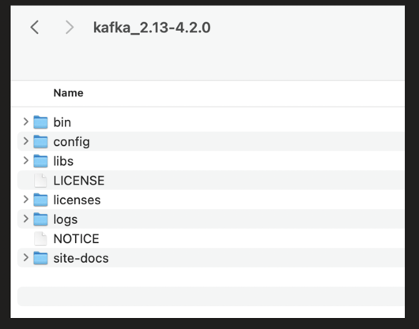

```
kafka_2.13-4.2.0/
  bin/        executable shell scripts (wrappers around Kafka's internal
              Java APIs) — used to start controller/broker, create/delete
              topic, publish/consume messages, etc. Lets you manage Kafka
              from the CLI.
  config/     ALL configuration for Controller and Broker nodes (most
              important folder for setup)
  libs/       Kafka jar files + dependencies (scripts in bin/ use these)
  logs/       Kafka runtime/application logs (INFO, WARN, ERROR) generated
              when brokers/controllers start and run
```

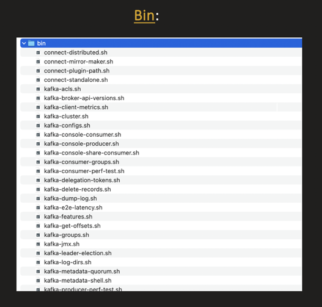

Some of the key scripts inside `bin/`: `kafka-server-start.sh`, `kafka-topics.sh`,
`kafka-console-producer.sh`, `kafka-console-consumer.sh`, `kafka-storage.sh`,
`kafka-metadata-quorum.sh`, `kafka-consumer-groups.sh`, `kafka-leader-election.sh`, etc.

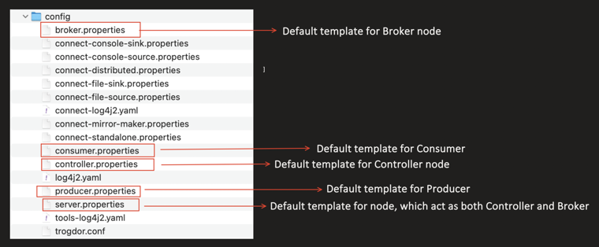

```
config/
  broker.properties      → default template for Broker node
  controller.properties  → default template for Controller node
  consumer.properties    → default template for Consumer
  producer.properties    → default template for Producer
  server.properties      → default template for a node acting as BOTH
                            Controller and Broker
```

---

## Step 3 — Write the configuration for Controllers [05:20]

`controller1.properties`

```properties
process.roles=controller
node.id=1
listeners=CONTROLLER://:9093
controller.listener.names=CONTROLLER
controller.quorum.voters=1@localhost:9093,2@localhost:9193

# PLAINTEXT (no encryption). In production, we should use SSL.
listener.security.protocol.map=CONTROLLER:PLAINTEXT

log.dirs=/tmp/controller1-logs

# Default partitions when creating a topic without specifying
num.partitions=3
default.replication.factor=2
```

`controller2.properties` (same idea, different identity)

```properties
process.roles=controller
node.id=2
listeners=CONTROLLER://:9193
controller.listener.names=CONTROLLER
controller.quorum.voters=1@localhost:9093,2@localhost:9193

listener.security.protocol.map=CONTROLLER:PLAINTEXT
log.dirs=/tmp/controller2-logs

num.partitions=3
default.replication.factor=2
```

### Config field meanings [06:29]

```
process.roles → tells Kafka what role this node performs:
  controller           → only controller tasks
  broker               → only broker tasks
  controller, broker   → both (combined node)

node.id → unique id for the node within the cluster

listeners → list of ports this node opens, each with a logical name.
  Internally: new ServerSocket(9093) — a TCP socket waiting for connections.

  listeners=CONTROLLER://:9093
    "CONTROLLER" = logical name (label) for this socket
    ":9093"      = if IP omitted, Kafka listens on every IP on the machine
                   (specific IP example: CONTROLLER://192.168.1.10:9093)

  A node can open multiple named sockets at once, e.g.:
  listeners=CONTROLLER://:9093,BROKER://:9092
  listeners=CONTROLLER://:9093,INTERNAL://:9092,EXTERNAL://:9094

controller.listener.names → of all listeners defined, which one to use for
  controller-to-controller communication (here: "CONTROLLER")

controller.quorum.voters → each controller keeps a static list of nodes that
  act as controllers:
  controller.quorum.voters=1@localhost:9093,2@localhost:9193

listener.security.protocol.map → which security protocol to use per listener:
  PLAINTEXT → no encryption, no authentication (local/dev use)
  SSL       → TLS encryption (production use)
  listener.security.protocol.map=CONTROLLER:PLAINTEXT

log.dirs → directory where this node stores its data

num.partitions → default partition count used when a topic is created
  without the CLI/producer specifying one

default.replication.factor → default RF used for new partitions

offsets.topic.replication.factor → default RF for the internal
  __consumer_offsets topic
```

---

## Step 4 — Write the configuration for Brokers [15:45]

`broker1.properties`

```properties
process.roles=broker
node.id=3

# WHERE to fetch metadata from (which controllers to connect to)
controller.quorum.voters=1@localhost:9093,2@localhost:9193

# This is where our Spring Boot apps (producer/consumer) will connect
listeners=BROKER://:9092

# passed to controller to store in its cluster metadata
advertised.listeners=BROKER://localhost:9092

# internally, when a follower broker fetches from the leader, which listener to use
inter.broker.listener.name=BROKER

# when broker talks to the controller, which listener name to use
controller.listener.names=CONTROLLER

listener.security.protocol.map=CONTROLLER:PLAINTEXT,BROKER:PLAINTEXT

log.dirs=/tmp/broker1-logs

# Keep messages for 7 days (168 hours)
log.retention.hours=168

# Max size of a single log segment file (1GB)
log.segment.bytes=1073741824

# __consumer_offsets topic RF
offsets.topic.replication.factor=2
```

`broker2.properties` (same idea, different identity/port)

```properties
process.roles=broker
node.id=4

controller.quorum.voters=1@localhost:9093,2@localhost:9193

listeners=BROKER://:9192
advertised.listeners=BROKER://localhost:9192

inter.broker.listener.name=BROKER
controller.listener.names=CONTROLLER
listener.security.protocol.map=CONTROLLER:PLAINTEXT,BROKER:PLAINTEXT

# Directory in which this node's data will persist
log.dirs=/tmp/broker2-logs

log.retention.hours=168
log.segment.bytes=1073741824
offsets.topic.replication.factor=2
```

### Config field meanings [16:15]

```
controller.quorum.voters → each broker also maintains the static list of
  controller nodes

listeners → opens up the port and names it BROKER

advertised.listeners → this address is passed to the Controller, which
  stores it in cluster metadata. When a producer wants to push to
  Topic-A/Partition0, it asks ANY broker → that broker asks the Controller →
  Controller returns metadata (who's the leader for that partition + its
  advertised address) → producer calls that specific broker directly.

inter.broker.listener.name → among all listeners defined, which one to use
  for broker-to-broker communication (followers fetch data from the leader
  broker using this)

controller.listener.names → 2 uses:
  1. Broker uses this name to map the security protocol
  2. Broker fetches the controller listener from cluster metadata — e.g. if
     the broker decides it needs to talk to Controller ID:1 (the ACTIVE one),
     it picks the listener named "CONTROLLER".
     This is also why all controllers share the same listener name.
```

### Log retention deletes whole segments — missing from notes [24:50]

Kafka stores topic data in log-segment files. Retention cleanup does not delete
events one by one. When a segment becomes eligible for retention cleanup, Kafka
deletes the complete segment. `log.segment.bytes=1073741824` limits each segment
to 1 GB; after a segment rolls, Kafka writes subsequent events to a new segment.

---

## Step 5 — Map all nodes (2 brokers + 2 controllers) to 1 Kafka Cluster [26:50]

Generate a cluster ID using the script in `/bin`:

```bash
bin/kafka-storage.sh random-uuid
# Sample output: zJVVVZAkS9aIBfjY0BlYJA
```

### Clean previous local node data before re-formatting — missing from notes [28:00]

In the video demo, the previously running local Kafka nodes are stopped and the
old broker/controller log directories are removed before the nodes are formatted
again. This prevents persisted metadata from an older local run from conflicting
with the new cluster ID. This cleanup is only for a disposable local rerun; it is
not required for a fresh setup, and real cluster data must not be deleted.

Format/map each node with this cluster ID:

```bash
# 1. Controller1
bin/kafka-storage.sh format -t zJVVVZAkS9aIBfjY0BlYJA -c config/controller1.properties

# 2. Controller2
bin/kafka-storage.sh format -t zJVVVZAkS9aIBfjY0BlYJA -c config/controller2.properties

# 3. Broker1
bin/kafka-storage.sh format -t zJVVVZAkS9aIBfjY0BlYJA -c config/broker1.properties

# 4. Broker2
bin/kafka-storage.sh format -t zJVVVZAkS9aIBfjY0BlYJA -c config/broker2.properties
```

This creates a `meta.properties` file inside each node's `log.dirs` path:

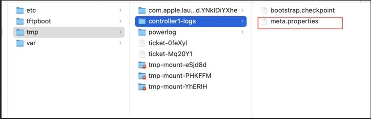

```properties
#Thu Feb 26 22:04:56 IST 2026
cluster.id=zJVVVZAkS9aIBfjY0BlYJA
directory.id=LYSuEbfGps8gnV7YsC9JHA
node.id=1
version=1
```

Every node's `meta.properties` shares the same `cluster.id` — that's what binds them into one cluster. Kafka also writes internal metadata under `__cluster_metadata-0/`, including a `quorum-state` file:

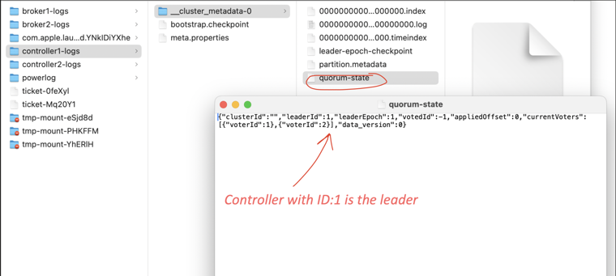

```json
{"clusterId":"","leaderId":1,"leaderEpoch":1,"votedId":-1,"appliedOffset":0,
 "currentVoters":[{"voterId":1},{"voterId":2}],"data_version":0}
```

→ tells us Controller with ID:1 is the leader.

---

## Step 6 — Start all the node servers [31:15]

```
Order matters: start Controllers FIRST, then Brokers.
(Brokers call the Controller to load cluster metadata on startup.)
```

```bash
# Controller1
bin/kafka-server-start.sh config/controller1.properties

# Controller2
bin/kafka-server-start.sh config/controller2.properties

# Broker1
bin/kafka-server-start.sh config/broker1.properties

# Broker2
bin/kafka-server-start.sh config/broker2.properties
```

Both brokers come up cleanly and transition to READY/STARTED:

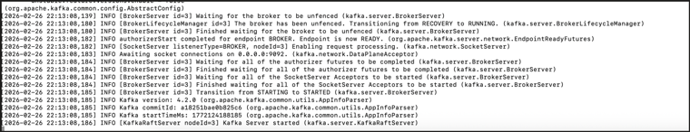

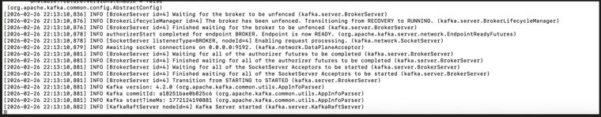

Check the cluster/quorum status:

```bash
bin/kafka-metadata-quorum.sh --bootstrap-controller localhost:9093 describe --status
```

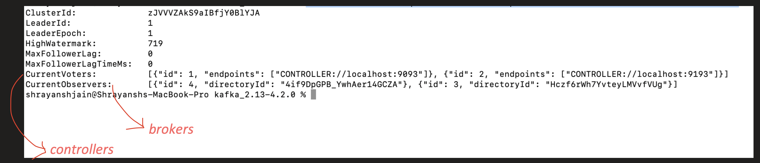

```
ClusterId:          zJVVVZAkS9aIBfjY0BlYJA
LeaderId:           1
LeaderEpoch:        1
HighWatermark:      719
MaxFollowerLag:     0
MaxFollowerLagTimeMs: 0
CurrentVoters:      [{id:1, CONTROLLER://localhost:9093}, {id:2, CONTROLLER://localhost:9193}]
CurrentObservers:   [{id:4, ...}, {id:3, ...}]   ← these are the brokers
```

(Voters = controllers; Observers = brokers watching the metadata log.)

---

## Step 7 — Create a test topic [36:40]

```bash
bin/kafka-topics.sh --bootstrap-server localhost:9092 \
  --create --topic order-events-topic
```

```
Partitions/RF not specified → Active Controller applies its own defaults.

--bootstrap-server localhost:9092 is only needed for the FIRST request —
the request goes to some broker, and that broker forwards it to the
Leader Controller.
```

Check topic status:

```bash
bin/kafka-topics.sh --bootstrap-server localhost:9092 \
  --describe --topic order-events-topic
```

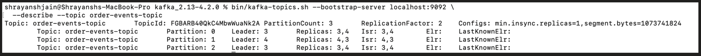

```
Topic: order-events-topic   TopicId: FGBARB4OQkC4MbwWuaNk2A
PartitionCount: 3   ReplicationFactor: 2
Configs: min.insync.replicas=1, segment.bytes=1073741824

  Partition 0: Leader 3   Replicas 3,4   Isr 3,4
  Partition 1: Leader 4   Replicas 4,3   Isr 4,3
  Partition 2: Leader 3   Replicas 3,4   Isr 3,4
```

---

## Step 8 — Producer test [39:45]

```bash
bin/kafka-console-producer.sh --bootstrap-server localhost:9092 \
  --topic order-events-topic
```

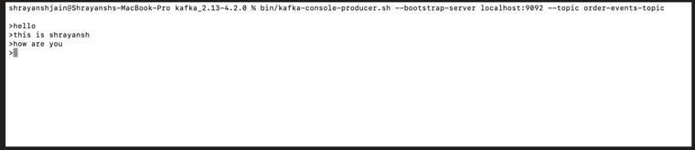

```
> hello
> this is shrayansh
> how are you
```

## Step 9 — Consumer test 

```bash
bin/kafka-console-consumer.sh --bootstrap-server localhost:9092 \
  --topic order-events-topic --from-beginning
```

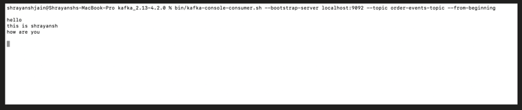

```
hello
this is shrayansh
how are you
```

Cluster is fully set up — 2 Controllers (KRaft quorum) + 2 Brokers — and producer/consumer round-trip confirmed end to end.
