Cluster we already set up (2 Brokers + 2 Controllers), producer/consumer sit outside it:

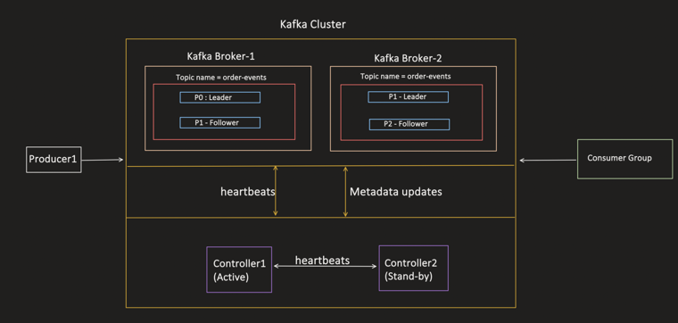

Generally for producer we don't need to do anything ,just add `KafkaTemplate` and use `send()` Api of that

When a producer calls `send()`, the message does **not** go straight to a broker over the network. It passes through several internal stages inside the producer first:

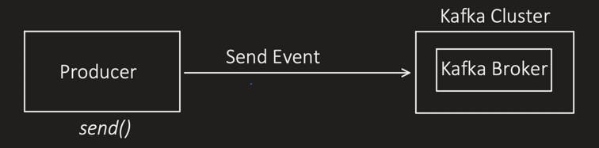

```
Producer.send() ---Send Event---> Kafka Cluster (Kafka Broker)
```

---

## Stage 1 — Serializer 

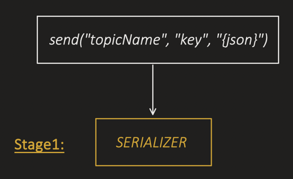

```
Our message (event) is a Java Object, but Kafka only understands bytes.
That's why a Serializer is required.

Kafka doesn't know the data type of our message (Integer, String, custom
POJO, JSON, etc.) — we must choose the right serializer.

If serialization fails, the message never moves to the next stage.
```
Key and value both are serialized

Every serializer implements this interface:

```java
public interface Serializer<T> {
    byte[] serialize(String topic, T data);
}
```

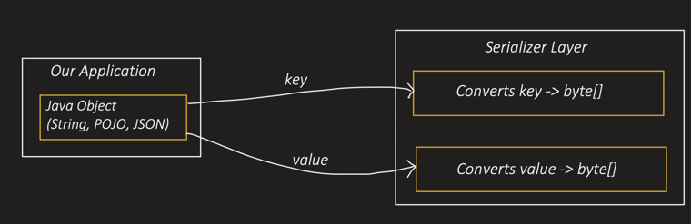

Built-in serializers:

```
StringSerializer   → String
IntegerSerializer  → Integer
LongSerializer     → Long
DoubleSerializer   → Double
FloatSerializer    → Float
ShortSerializer    → Short
JsonSerializer     → any POJO (most useful — converts Java object to bytes)
Custom Serializer  → when we want full control:
                    - encrypt data before byte conversion
                    - remove sensitive fields before sending
                    - etc.
```

---

## Stage 2 — Partitioner 

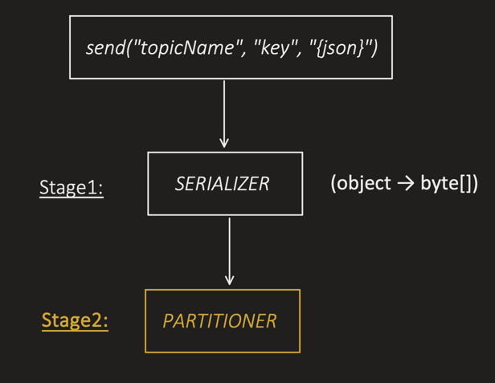

At this stage the producer decides: **"Which partition should this message go to?"**

```java
public interface Partitioner {
    int partition(
        String topic,
        Object key,
        byte[] keyBytes,
        Object value,
        byte[] valueBytes,
        Cluster cluster
    );  // returns partition number
}
```

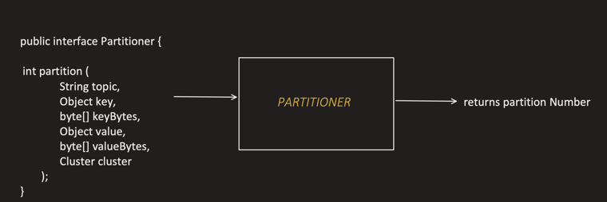

### Case 1 — Partition explicitly provided [07:20]

```java
// KafkaTemplate.java
@Override
public CompletableFuture<SendResult<K,V>> send(String topic, Integer partition, K key, @Nullable V data) {
    ProducerRecord<K,V> producerRecord = new ProducerRecord<>(topic, partition, key, data);
    return observeSend(producerRecord);
}
```

Partitioner does nothing here — we already told it the partition.

### Case 2 — Key is provided [07:50]

```java
@Override
public CompletableFuture<SendResult<K,V>> send(String topic, K key, @Nullable V data) {
    ProducerRecord<K,V> producerRecord = new ProducerRecord<>(topic, key, data);
    return observeSend(producerRecord);
}
```

```
Kafka ensures the same key ALWAYS goes to the same partition:
partition = hash(keyBytes) % numberOfPartitions
```

### Case 3 — No key is provided [08:40]

```java
@Override
public CompletableFuture<SendResult<K,V>> send(String topic, @Nullable V data) {
    ProducerRecord<K,V> producerRecord = new ProducerRecord<>(topic, data);
    return observeSend(producerRecord);
}
```

```
Pre Kafka 2.4:      Round Robin Partitioning Strategy
From Kafka 2.4 on:  Sticky Partitioning Strategy
```

---

## Stage 3 — Record Accumulator [10:11]

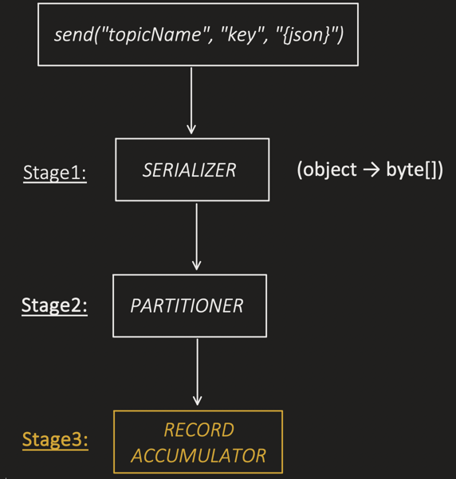

```
Record Accumulator = in-memory buffer inside the Kafka Producer that
collects events per topic-partition and groups them into batches.

This is exactly why Kafka Producer achieves very high throughput
(ability to transmit large volumes of data within a given timeframe).
```

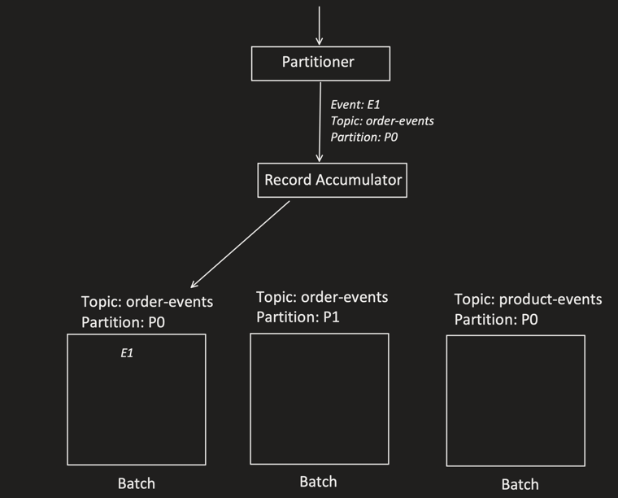

Producer always maintains a topic-partition-wise batch, and sends **batches** to the broker — not individual events.

### Round Robin vs Sticky Partitioning (the "no key" case, revisited) [13:30]

**Round Robin (pre Kafka 2.4):**

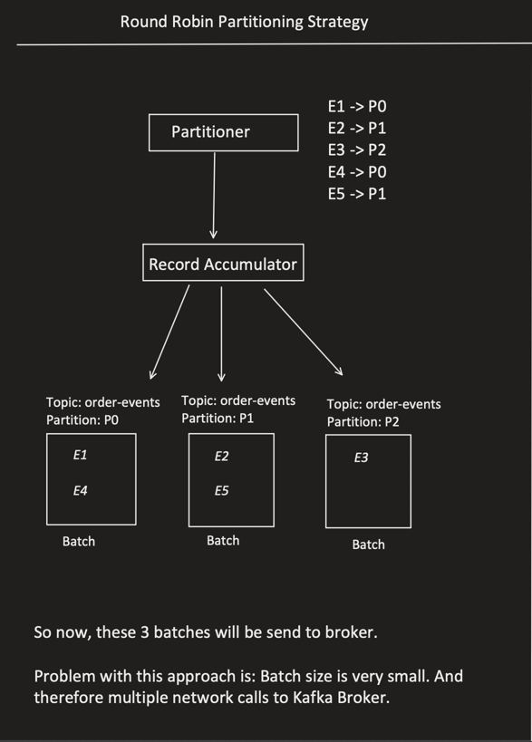

```
Topic: order-events, Key=null, Value=E1..E5
Partitions: [P0, P1, P2]

E1 -> P0   E2 -> P1   E3 -> P2   E4 -> P0   E5 -> P1

Result: 3 small batches, sent as 3 separate network calls.
Problem: batch size stays small → too many network calls to the broker.
```

**Sticky Partitioning (Kafka 2.4+):**

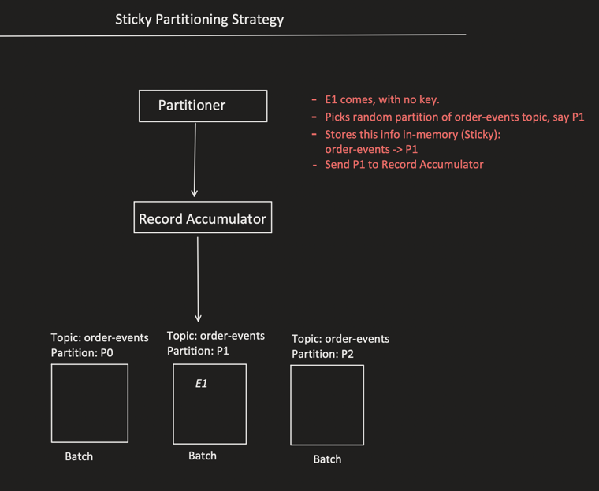

```
E1 comes with no key.
Partitioner picks a random partition of order-events topic, say P1.
Stores this in-memory ("sticky"): order-events -> P1
Sends E1 to Record Accumulator (P1's batch).
```

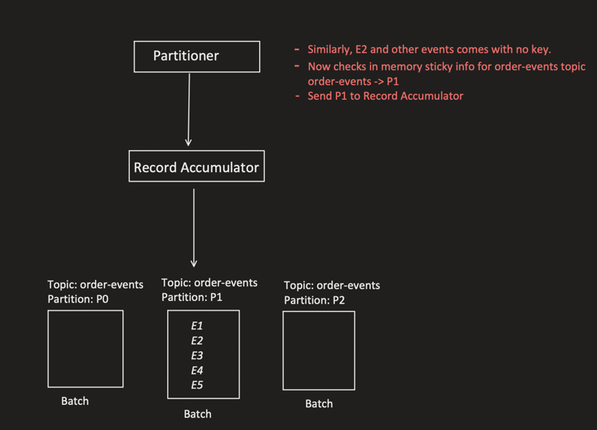

```
E2, E3, E4, E5 also arrive with no key.
Partitioner checks the in-memory sticky info: order-events -> P1
Sends all of them to the SAME batch (P1) too.

Result: all 5 events land in ONE batch on P1 instead of being spread
across 3 small batches.
```

```
Advantage: events stick to the same partition until the CURRENT batch is
closed or a new batch needs to be created.
→ fewer batches → fewer network calls.
```

### Controlling batch size [21:50]

```
Two knobs control the batch:

1. batch.size = 16384 (16KB, default)
   Maximum memory allocated per partition batch.
   e.g. if 1 event = 1KB, a batch holds ~16 messages.
   Once the limit is hit, the batch is closed and ready to send.

2. linger.ms = 10ms
   Maximum time the producer waits for more records to fill a batch.
   Ensures the producer doesn't wait indefinitely when traffic is low.

   Example: batch.size=16KB, event size=1KB (holds 16 msgs), but traffic
   is low and only 5 events arrived. Producer waits up to 10ms for more —
   if nothing else arrives, it closes the batch after 10ms and sends it.
```

---

## Stage 4 — Compression [24:15]

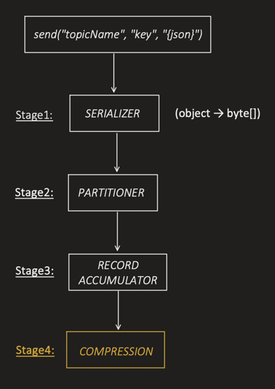

```
Batches that are ready to send get COMPRESSED to reduce network usage
and achieve higher throughput.

Example: Batch before compression = 64KB → after compression = 18KB

Kafka also stores these compressed batches on disk → saves disk space too.
```

(Compression codec is configured in producer properties — shown in Setup below.)

---

## Stage 5 — Sender Thread [27:25]

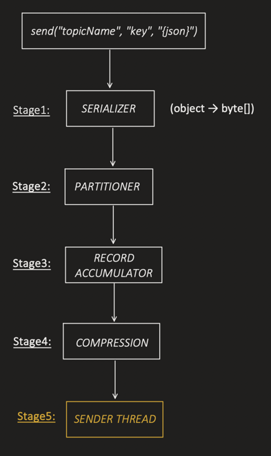

```
The Application thread NEVER sends data to the Kafka broker directly.
Application thread's job ends at writing the record to the Record
Accumulator — after that, the background Sender Thread takes over.
```

### Sender Thread responsibilities [29:10]

```
1. Check Record Accumulator for batches that are ready
2. Group batches by broker LEADER, e.g.:
     Batch for TopicA-Partition0 -> Leader is Broker1
     Batch for TopicA-Partition5 -> Leader is Broker1
     Batch for TopicB-Partition1 -> Leader is Broker1
   → groups these by broker, wraps them into ONE ProduceRequest,
     and sends it in ONE network call.
3. Send the request using NetworkClient
4. Process responses (acks, retries)
5. Handle retries if needed
6. Complete the future and invoke callbacks
```

```
Can we control the number of Sender Threads? NO — Kafka manages this
internally.

What we CAN control: per-connection in-flight requests.

Example: 3 Brokers → Sender Thread opens 3 TCP connections (one per broker).

max.in.flight.requests.per.connection = 5 (default)
→ max unacknowledged requests allowed on a single connection before blocking.
→ with 3 connections, up to 15 requests can be in-flight across the
  cluster at once.
```

### ⚠️ Message reordering risk [41:11]

```
IF max.in.flight.requests.per.connection > 1  AND  retries > 0
→ risk of message reordering:

  Request A → in-flight
  Request B → in-flight
  Request A → fails
  Request B → success (written to partition)
  Request A → retries and succeeds (written AFTER Request B)

  → B ends up before A in the partition log, even though A was sent first.
```

This risk is resolved by setting **idempotency = true** (covered separately, in the idempotency notes).

---

## Video 2 — Kafka Producer Setup (Spring Boot) [00:00]

### Step 1 — Dependency [00:17]

```xml
<!-- pom.xml -->
<dependency>
    <groupId>org.springframework.kafka</groupId>
    <artifactId>spring-kafka</artifactId>
</dependency>
```

```
This single dependency pulls in:

spring-kafka = Spring wrapper layer + Kafka client dependency
  Spring wrapper layer gives us:
    KafkaTemplate → to send messages
    KafkaAdmin    → to manage topics
    (Spring abstractions built on top of the Apache Kafka client)
  It also brings the actual Kafka client library — the real implementation
  that KafkaTemplate/KafkaAdmin use underneath.
```

### Step 2 — Add Bootstrap Brokers [01:30]

```properties
server.port=8081
spring.application.name=kafka-producer-service

# Both brokers: if one is down, producer connects to the other
spring.kafka.bootstrap-servers=localhost:9092,localhost:9192

# Metadata refresh interval, default is 5 minutes
spring.kafka.producer.properties.metadata.max.age.ms=300000
```

```
Why bootstrap servers are needed:
  Producer initially doesn't know which broker is leader for which
  partition, and can't talk to the controller directly for topic creation.
  It needs ONE starting communication point.

  Topic creation request → that broker forwards it to the Active Controller.
  Metadata fetch → broker serves it if it has it, else fetches from the
                   controller and returns it.

  Producer caches this metadata in-memory and refreshes it every 5 minutes
  (default) or whenever there's an issue connecting to a partition's leader.
```

### Step 3 — Topic Creation [05:12]

```
Same as in Cluster Setup: if partitions/RF aren't specified at topic
creation, controller's default values are used. Segment size, cleanup
policy etc. can similarly default from broker properties — OR be
explicitly overridden per topic via TopicBuilder.
```

#### Demo of Topic Creation [10:30]

```java
@Configuration
public class KafkaProducerConfig {

    @Bean
    public NewTopic orderEventsTopic() {
        return TopicBuilder.name("order-events")
            .partitions(3)
            .replicas(2)
            // if not provided here, picked from broker properties
            .config(TopicConfig.RETENTION_MS_CONFIG, "604800000")
            .config(TopicConfig.CLEANUP_POLICY_CONFIG, "delete")
            .config(TopicConfig.MIN_IN_SYNC_REPLICAS_CONFIG, "2")
            .config(TopicConfig.SEGMENT_BYTES_CONFIG, "1073741824")
            .build();
    }
}
```

```
On application startup, Spring checks if this topic already exists —
if not, it sends the create-topic request.
```

### Step 4 — Send Event [14:14]

#### Use case 1 — Send WITH key (JsonSerializer) [14:14]

```
SERIALIZER:    Key = String, Value = JSON
PARTITIONER:   send with key → related events go to the same partition
RECORD ACCUMULATOR:
   Max batch size = 32KB
   Linger = 20ms
   Overall buffer for batches = 32MB
   When buffer is full → send() waits up to 60s, then throws exception
COMPRESSION:   snappy (or gzip, lz4, zstd, ...)
SENDER THREAD: in-flight requests per connection = 5, retries = 3 on
               transient failures
```

```java
// OrderController.java
@RestController
@RequestMapping("/api/orders")
public class OrderController {

    @Autowired
    OrderProducerService orderProducerService;

    @PostMapping("/with-key")
    public ResponseEntity<String> sendWithKey(@RequestBody Order order) {
        orderProducerService.sendWithKey(order);
        return ResponseEntity.accepted().body("Order created and event published!");
    }
}
```

```java
// OrderProducerService.java
@Service
public class OrderProducerService {

    @Autowired
    private KafkaTemplate<String, Order> kafkaTemplate;

    public void sendWithKey(Order order) {
        String key = order.getOrderId();

        CompletableFuture<SendResult<String, Order>> future =
            kafkaTemplate.send("order-events", key, order);

        future.whenComplete((result, ex) -> {
            if (ex == null) {
                System.out.println("Order event sent successfully");
                System.out.println("Partition: " + result.getRecordMetadata().partition());
                System.out.println("Offset: " + result.getRecordMetadata().offset());
            } else {
                System.out.println("Failed to send order event: " + ex.getMessage());
            }
        });
    }
}
```

```java
// Order.java (POJO)
public class Order {
    private String orderId;
    private String customerId;
    private String productId;
    private Integer quantity;
    private Double totalAmount;
    private String status;
    // getters and setters
}
```

```properties
# application.properties
server.port=8081
spring.application.name=kafka-producer-service

# Both brokers listed for redundancy
spring.kafka.bootstrap-servers=localhost:9092,localhost:9192

# Metadata refresh interval (default 5 min)
spring.kafka.producer.properties.metadata.max.age.ms=300000

# Ask broker to reply only when all ISR successfully got the event
spring.kafka.producer.acks=all

#---------------SERIALIZER-------------
# Key needs to be String
spring.kafka.producer.key-serializer=org.apache.kafka.common.serialization.StringSerializer
# Value: JsonSerializer, auto-converts Java objects to JSON bytes
spring.kafka.producer.value-serializer=org.springframework.kafka.support.serializer.JsonSerializer

#---------------RECORD ACCUMULATOR-------
# Batching, wait 20ms to collect more messages before sending
spring.kafka.producer.properties.linger.ms=20
# Max batch size, send when batch reaches 32KB (even if linger.ms hasn't expired)
spring.kafka.producer.properties.batch.size=32768
# Total buffer memory for all batches: 32MB (if full, send() blocks till space frees up or max block time)
spring.kafka.producer.properties.buffer.memory=33554432
# Max time send() blocks if buffer is full (default 60s); after that send() fails immediately
spring.kafka.producer.properties.max.block.ms=60000

#---------------COMPRESSION-------
# compresses entire batch before sending
spring.kafka.producer.properties.compression.type=snappy

#---------------SENDER THREAD-------
# Retry on transient failures (network timeout, leader change, etc.)
spring.kafka.producer.retries=3
# Max in-flight requests
spring.kafka.producer.properties.max.in.flight.requests.per.connection=5
```

#### Use case 2 — Send WITHOUT key (Custom Serializer, Sticky Partitioning) [28:02]

```
SERIALIZER:   Key = String, Value = Custom Serializer
PARTITIONER:  send without key → Sticky Partitioning
Rest same as use case 1.
```

```java
// OrderController.java
@RestController
@RequestMapping("/api/orders")
public class OrderController {

    @Autowired
    OrderProducerService orderProducerService;

    @PostMapping("/with-no-key")
    public ResponseEntity<String> sendWithoutKey(@RequestBody Order order) {
        orderProducerService.sendWithoutKey(order);
        return ResponseEntity.accepted().body("Order created and event published!");
    }
}
```

```java
// OrderProducerService.java
@Service
public class OrderProducerService {

    @Autowired
    private KafkaTemplate<String, Order> kafkaTemplate;

    public void sendWithoutKey(Order order) {
        String key = order.getOrderId();

        CompletableFuture<SendResult<String, Order>> future =
            kafkaTemplate.send("order-events", order);

        future.whenComplete((result, ex) -> {
            if (ex == null) {
                System.out.println("Order event sent successfully");
                System.out.println("Partition: " + result.getRecordMetadata().partition());
                System.out.println("Offset: " + result.getRecordMetadata().offset());
            } else {
                System.out.println("Failed to send order event: " + ex.getMessage());
            }
        });
    }
}
```

```java
// OrderSummarySerializer.java — custom serializer
public class OrderSummarySerializer implements Serializer<Order> {

    private final ObjectMapper objectMapper;

    public OrderSummarySerializer() {
        this.objectMapper = new ObjectMapper();
    }

    @Override
    public byte[] serialize(String topic, Order order) {
        if (order == null) {
            return null;
        }
        try {
            // Build a map with only the fields we want to expose; rest removed
            Map<String, Object> summary = new LinkedHashMap<>();
            summary.put("orderId", order.getOrderId());
            summary.put("productId", order.getProductId());
            return objectMapper.writeValueAsBytes(summary);
        } catch (JsonProcessingException e) {
            throw new RuntimeException("Failed to serialize Order summary", e);
        }
    }
}
```

```properties
# application.properties (value-serializer swapped to custom serializer)
spring.kafka.producer.value-serializer=com.eda.producer.serializer.OrderSummarySerializer
# everything else (bootstrap-servers, acks, batching, compression, retries...) same as use case 1
```

### Multiple producers needing different serializers? [36:52]

```
Problem: some producers need JsonSerializer, some need a custom
serializer. But application.properties only lets us set ONE
value-serializer globally. How do we handle both?

Solution: define a second KafkaTemplate bean that overrides ONLY the
value serializer, reusing everything else from application.properties.
```

```java
@Bean
public KafkaTemplate<String, Order> customSerializerKafkaTemplate(KafkaProperties kafkaProperties) {

    // Start with all producer properties from application.properties
    Map<String, Object> props =
        new HashMap<>(kafkaProperties.buildProducerProperties(null));

    // Override ONLY the value serializer — everything else stays the same
    props.put(ProducerConfig.VALUE_SERIALIZER_CLASS_CONFIG, OrderSummarySerializer.class);

    DefaultKafkaProducerFactory<String, Order> factory =
        new DefaultKafkaProducerFactory<>(props);

    return new KafkaTemplate<>(factory);
}
```

```java
@Service
public class OrderProducerService {

    @Autowired
    private KafkaTemplate<String, Order> kafkaTemplate;  // default (JsonSerializer)

    @Autowired
    @Qualifier("customSerializerKafkaTemplate")
    private KafkaTemplate<String, Order> customSerializerKafkaTemplate;

    public void sendWithoutKey(Order order) {
        String key = order.getOrderId();

        CompletableFuture<SendResult<String, Order>> future =
            customSerializerKafkaTemplate.send("order-events", order);

        future.whenComplete((result, ex) -> {
            if (ex == null) {
                System.out.println("Order event sent successfully");
                System.out.println("Partition: " + result.getRecordMetadata().partition());
                System.out.println("Offset: " + result.getRecordMetadata().offset());
            } else {
                System.out.println("Failed to send order event: " + ex.getMessage());
            }
        });
    }
}
```

```
application.properties keeps the default "JsonSerializer" for the
default KafkaTemplate; the @Qualifier-ed bean uses OrderSummarySerializer
instead — both coexist in the same app.
```

---

## Closing thread — message reordering risk (recap)

```
When:
  max.in.flight.requests.per.connection > 1   AND   retries > 0
→ risk of message reordering:

  Request A → in-flight
  Request B → in-flight
  Request A → fails
  Request B → success
  Request A → retries and succeeds (lands AFTER B)

How to resolve this risk? → set idempotency = true.
(Covered in the separate idempotency notes.)
```
