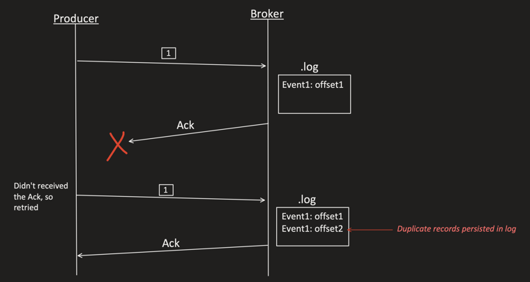
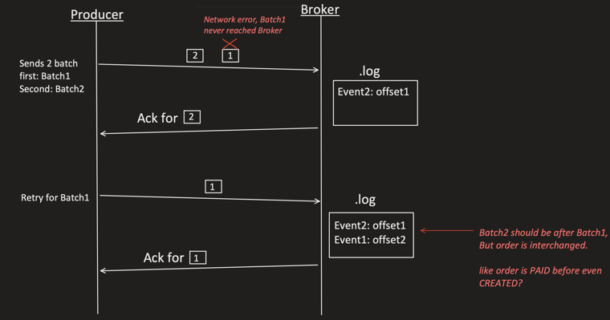
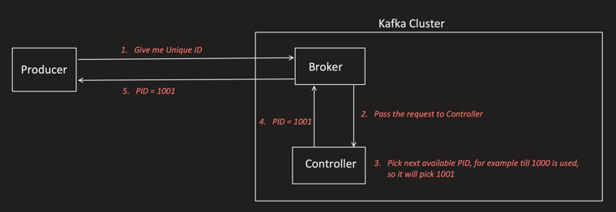
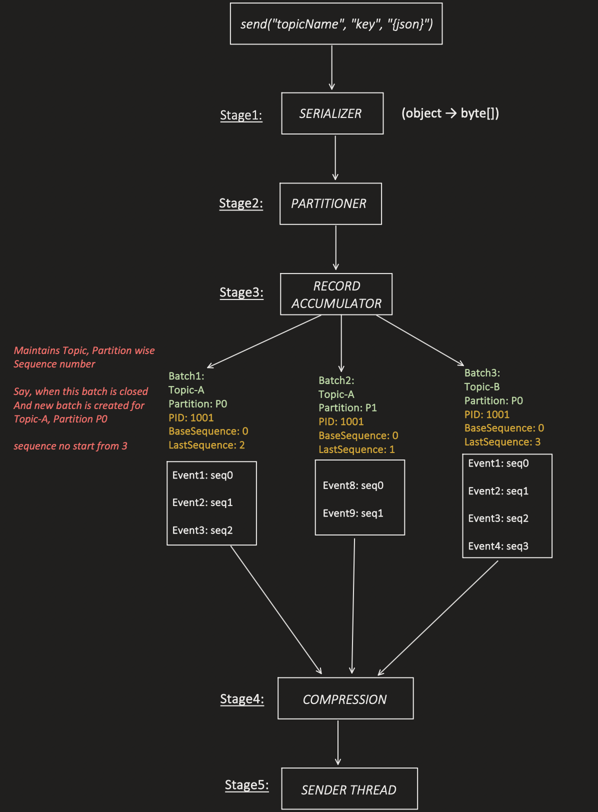
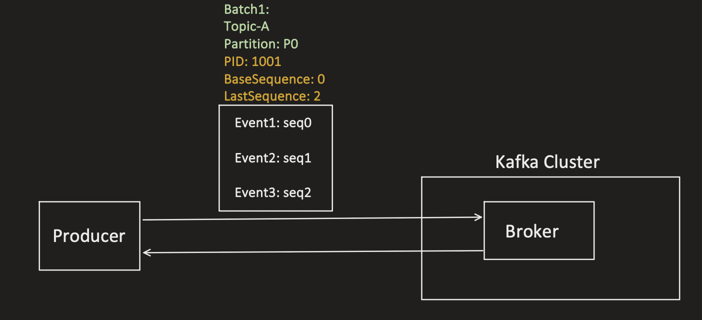
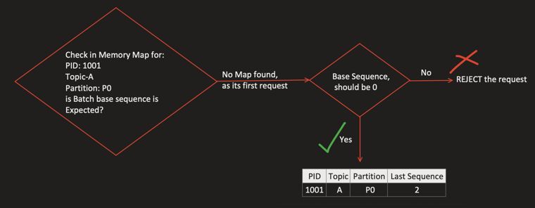
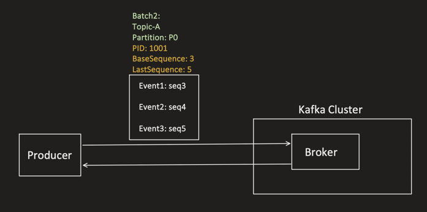
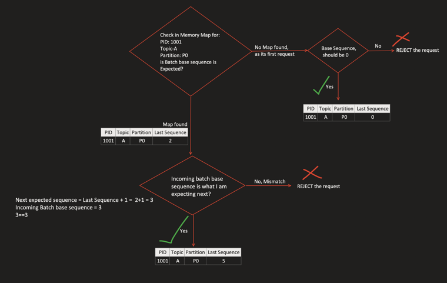
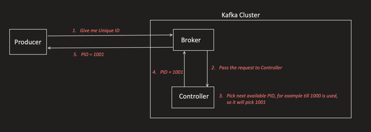
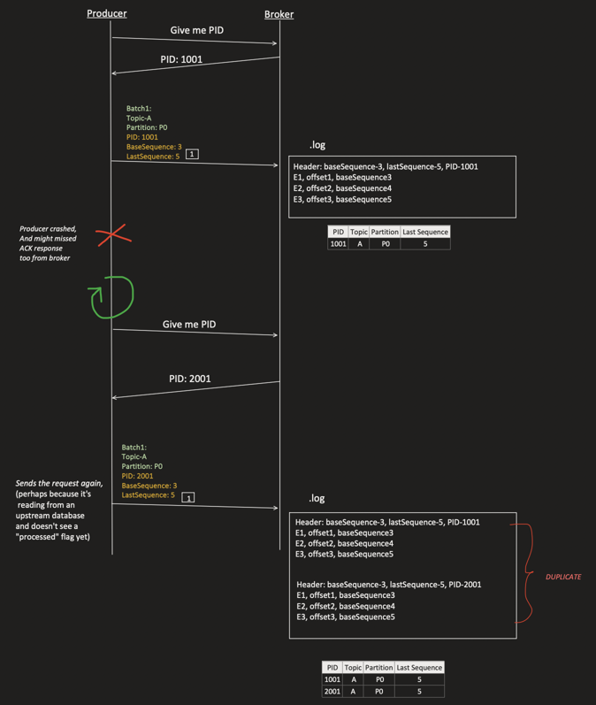

Recall the setup that causes trouble:

```
max.in.flight.requests.per.connection > 1
and
retries > 0
```

This combination creates two problems.

---

## Problem 1 — Duplicate Messages [00:24]



```
Producer sends Event1 (seq 1) → Broker persists it at offset1
Broker sends Ack → Ack lost in network (producer never receives it)
Producer thinks the send failed → retries → sends Event1 (seq 1) again
Broker persists it AGAIN, now at offset2

Result: same event persisted twice → Event1: offset1 AND Event1: offset2
```

## Problem 2 — Message Reordering [01:38]



```
Producer sends Batch2 then Batch1 is retried (Batch1 hit a network error
and never reached the broker the first time; Batch2 got there and was
ack'd first)

Broker log ends up as: Event2: offset1, Event1: offset2
→ Batch2 should have come AFTER Batch1, but order is interchanged.
→ e.g. an "order PAID" event lands before the "order CREATED" event!
```

---

## Solution — Idempotency = true [04:03]

```properties
spring.kafka.producer.properties.enable.idempotence=true
```

```
Kafka version < 3.0  → default is FALSE
Kafka version >= 3.0 → default is TRUE
```

### How it works [04:36]

**Step 1 — Producer application startup [04:52]:** producer asks the cluster for a unique Producer ID (PID).



```
1. Producer → Broker: "Give me Unique ID"
2. Broker passes the request to the Controller
3. Controller picks the next available PID
   (e.g. if PIDs up to 1000 are used, it picks 1001)
4. Controller → Broker: PID = 1001
5. Broker → Producer: PID = 1001
```

**Step 2 — Producer sends requests [06:00]:** every batch built at the Record Accumulator now also carries the PID plus a base/last sequence number, tracked per Topic-Partition.



```
Record Accumulator maintains a Topic+Partition-wise sequence number.

Batch1: Topic-A, Partition P0, PID:1001, BaseSequence:0, LastSequence:2
  Event1: seq0, Event2: seq1, Event3: seq2

Batch2: Topic-A, Partition P1, PID:1001, BaseSequence:0, LastSequence:1
  Event8: seq0, Event9: seq1

Batch3: Topic-B, Partition P0, PID:1001, BaseSequence:0, LastSequence:3
  Event1: seq0, Event2: seq1, Event3: seq2, Event4: seq3

Note: when a batch is closed and a NEW batch is created for the SAME
Topic+Partition, the sequence numbering continues from where it left off
(doesn't restart at 0).
```

**Step 3 — First request received by Broker [09:30]**



```
Batch1: Topic-A, Partition P0, PID:1001, BaseSequence:0, LastSequence:2
  Event1: seq0, Event2: seq1, Event3: seq2
```

Broker-side validation logic:



```
Check in-memory map for: PID:1001, Topic-A, Partition:P0
  "Is this batch's base sequence expected?"

  No map found (first request) → Base Sequence should be 0
    Yes → ACCEPT → store: {PID:1001, Topic:A, Partition:P0, LastSequence:2}
    No  → REJECT the request
```

**Step 4 — Second request received by Broker [12:30]**



```
Batch2: Topic-A, Partition P0, PID:1001, BaseSequence:3, LastSequence:5
  Event1: seq3, Event2: seq4, Event3: seq5
```



```
Check in-memory map for: PID:1001, Topic-A, Partition:P0
  Map found → LastSequence = 2

  Next expected sequence = LastSequence + 1 = 2 + 1 = 3
  Incoming batch's base sequence = 3
  3 == 3 → Match!

  Yes → ACCEPT → update map: {PID:1001, Topic:A, Partition:P0, LastSequence:5}
  No, mismatch → REJECT the request
```

```
With this mechanism, BOTH duplicate messages and message reordering are
fixed:
  - Duplicates are rejected because a retried batch's base sequence will
    already be <= LastSequence recorded for that PID+Topic+Partition.
  - Reordering is rejected because the broker only accepts a batch whose
    base sequence exactly matches (LastSequence + 1) — an out-of-order
    retry simply gets REJECTED until it arrives in the right order.
```

### Live idempotency demo — missing from notes [14:38]

The video then verifies the same mechanism on a running Kafka cluster:

1. The controller defaults are updated to create **4 partitions** with **2 replicas**, and the controllers and brokers are started.
2. The producer is run with `enable.idempotence=true`, and records are sent to the topic.
3. The topic/partition details and broker logs are inspected. The batch metadata contains the Producer ID together with its base and last sequence numbers.
4. The first inspected batch shows `BaseSequence: 0` and `LastSequence: 9`. Sending again continues the sequence instead of restarting it, demonstrating that Kafka tracks and increments the sequence for subsequent batches from that producer.

---

## The loophole — Controller doesn't remember PID-to-Producer mapping [22:23]

```
Look again at Step 1: the Controller does NOT store PID information in
its cluster metadata. It only hands out the NEXT available PID whenever
asked — it never remembers "Producer-X has PID-1001".
```



So if the producer restarts, it re-asks "Give me Unique ID" and gets a **brand-new PID**, not its old one:



```
Producer sends Batch1 (PID:1001, BaseSequence:3, LastSequence:5)
  → Broker persists E1,E2,E3 and records {PID:1001, A, P0, LastSequence:5}

Producer crashes and misses the ACK from the broker
Producer restarts → asks "Give me PID" again
Broker/Controller has no memory of PID:1001 → issues a NEW PID: 2001

Producer resends the same logical batch, now tagged PID:2001,
BaseSequence:3, LastSequence:5 (e.g. because it's reading from an
upstream DB/queue and doesn't see a "processed" flag yet)

Broker has never seen PID:2001 before → treats it as a brand-new
producer → ACCEPTS it → writes E1,E2,E3 AGAIN

Result: DUPLICATE — same 3 events persisted twice, under two different
PIDs (1001 and 2001), because idempotency is scoped per-PID and PIDs
aren't stable across producer restarts.
```

**This is where TRANSACTIONS come in** (covered later, after Consumer and Consumer Group setup). One advantage of Transactions: even when the producer restarts, the Controller always returns the **same PID** — closing this exact loophole.

---

## Recommended settings when using Idempotency [29:07]

### 1. `spring.kafka.producer.acks=all` [29:15]

```
Why? Say acks=1: leader persists the event at seq no 1 but crashes BEFORE
followers pull it. A new leader gets elected for that partition — but it
doesn't have the event with seq no 1.

Producer retries → request goes to the new (different) leader → which
has never seen seq 1 → it accepts and writes it (no way to detect a
"duplicate" because its in-memory sequence map is fresh).

That's why acks=all is recommended — it ensures the event is
replicated to all ISR members before being acknowledged, so a leader
crash can never cause this gap.
```

### 2. `spring.kafka.producer.retries=MAX_INT` [30:51]

```
With idempotency enabled, retries are SAFE (broker de-dupes based on
PID + sequence number) — so the earlier restriction on retry count is
lifted. Retry as many times as needed.
```

### 3. `spring.kafka.producer.properties.max.in.flight.requests.per.connection <= 5` [31:18]

```
Kafka can only guarantee idempotency up to 5 in-flight sequence numbers
(tracked per Topic, Partition, and PID).

In other words: the broker maintains a max buffer of only 5 sequence
numbers for each (topic, partition, PID) combination — so this value
must be kept <= 5 for idempotency guarantees to hold.
```

## Closing notes — missing from notes [33:01]

Idempotency prevents duplicates and reordering while the producer keeps the same PID. The recommended combination is `acks=all`, maximum retries, and no more than 5 in-flight requests per connection. A producer restart can receive a new PID, so the later Transactions section addresses that remaining restart loophole.
