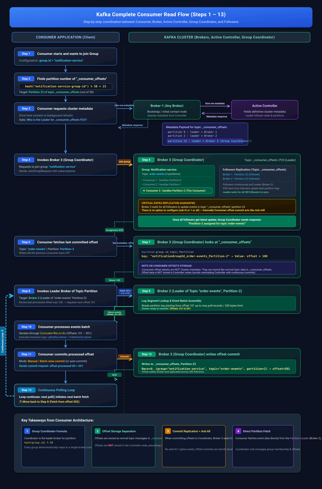
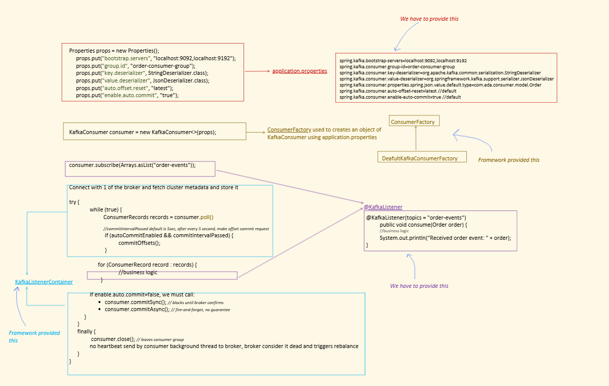
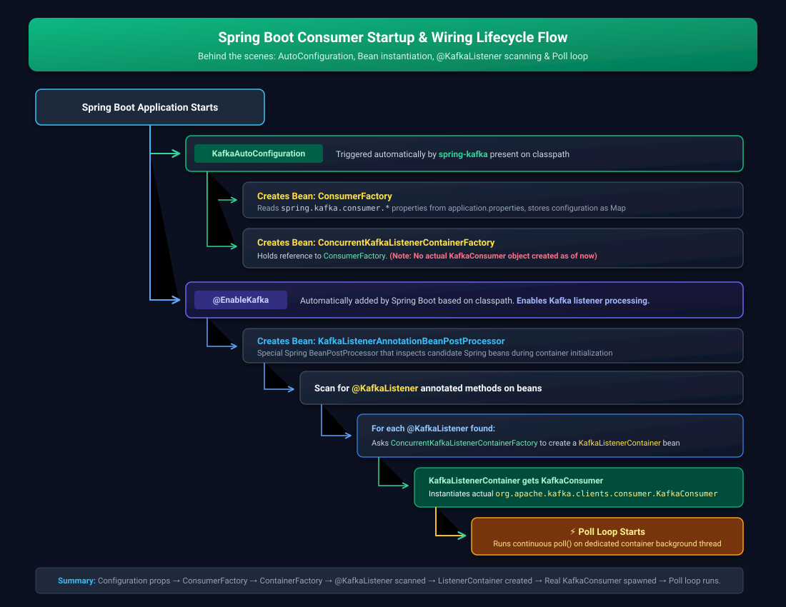
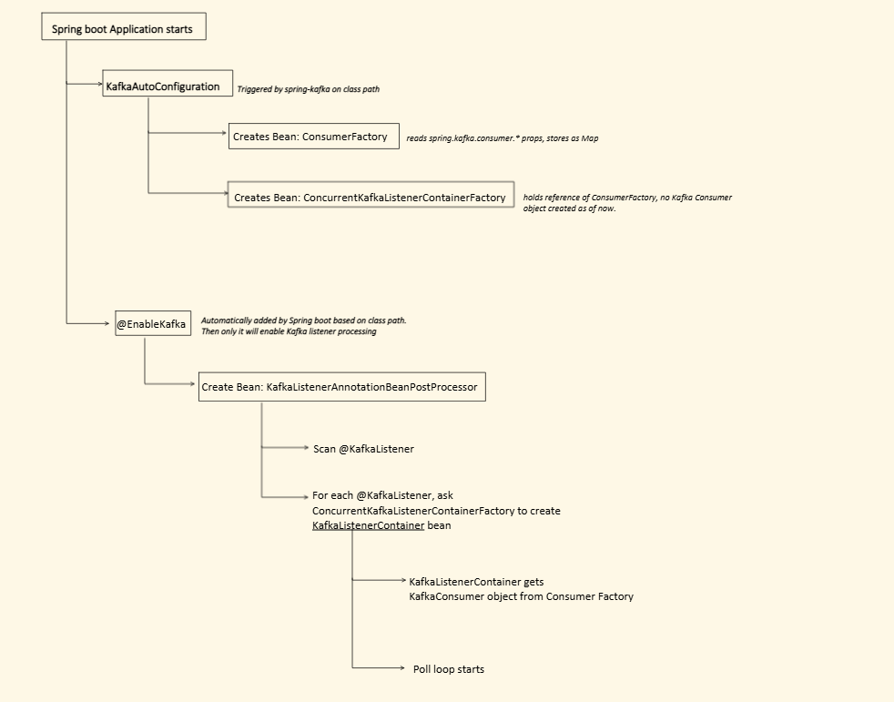

# Consumer Setup — Part 1

## Complete Consumer Read Flow (recap, step by step)



### What / Who is the Group Coordinator?
The **Group Coordinator** is one of the Kafka **brokers** in the cluster designated to manage a specific consumer group. 
- Specifically, it is the **Leader Broker** of the partition in the internal `__consumer_offsets` topic that corresponds to that consumer group.
- **How it is selected**:
  ```text
  Partition Number = Math.abs(group.id.hashCode()) % 50
  ```
  *(Assuming default 50 partitions for `__consumer_offsets`).*
  Whichever broker is currently the **Leader** for that partition automatically becomes the **Group Coordinator** for that `group.id`.

> [!IMPORTANT]
> **Common Doubt: "A group reads many partitions, each having a different Leader broker. Who will be the Group Coordinator then?"**
> 
> You must separate **Application Topic Partitions** from the **`__consumer_offsets` Partition**:
> 
> 1. **Application Topic Partitions (e.g. `order-events` P0, P1, P2)**:
>    - Your application topic may have 10 partitions, and their leader replicas might be on Broker 1, Broker 2, Broker 3, etc.
>    - **None of these brokers are the Group Coordinator** just because they lead a data partition.
>    - Consumers ONLY contact these brokers to **fetch actual message records** (`poll()`).
> 
> 2. **Internal Topic (`__consumer_offsets`) Partition**:
>    - A consumer group has **only ONE `group.id`** string (e.g., `"notification-service"`).
>    - The formula `Math.abs(hash("notification-service")) % 50` produces **EXACTLY ONE partition number** (e.g., Partition 23).
>    - Partition 23 of `__consumer_offsets` has **only ONE Leader Broker** in the whole cluster (e.g., Broker 3).
>    - Therefore, **Broker 3 is the ONLY Group Coordinator** for that entire group, regardless of how many data topics/partitions the group consumes from!

### Summary of the 3 Key Roles (Don't Confuse Them):
| Role | What Entity Is It? | Primary Responsibility |
| :--- | :--- | :--- |
| **Group Coordinator** | **Kafka Broker** (Leader of the group's assigned partition in `__consumer_offsets`) | Manages membership, tracks heartbeats, coordinates rebalances, and stores/retrieves committed offsets. |
| **Group Leader** | **Consumer Instance** (First consumer to join the group) | Executes the partition assignment strategy (e.g., Range, RoundRobin) to decide which consumer gets which partition, then sends the assignment back to the Coordinator. |
| **Topic Partition Leaders** | **Kafka Brokers** (Leaders of the data partitions, e.g., `order-events` P0, P1, P2) | Serve the actual business event data to consumers during `poll()`. |

### Where does the Internal Topic (`__consumer_offsets`) reside on normal brokers?
- **It is stored on normal Kafka brokers**: Despite being an internal topic (indicated by `__`), it is physically treated like any standard Kafka topic. It does **NOT** reside in ZooKeeper, and does **NOT** reside only on KRaft Controllers.
- **Physical Disk Location (`log.dirs`)**:
  On every standard broker's filesystem, inside the directory configured by `log.dirs` (e.g., `/var/lib/kafka/data` or `C:\tmp\kafka-logs`), you will find the actual partition folders alongside regular topics:
  ```text
  <log.dirs>/
    ├── order-events-0/
    ├── order-events-1/
    ├── __consumer_offsets-0/
    ├── __consumer_offsets-1/
    ├── ...
    ├── __consumer_offsets-23/
    │    ├── 00000000000000000000.log          <-- commit logs (key: group+topic+partition, val: offset)
    │    ├── 00000000000000000000.index
    │    └── 00000000000000000000.timeindex
    └── __consumer_offsets-49/
  ```
- **Distribution & Replication across Normal Brokers**:
  - By default, it has **50 partitions** (`offsets.topic.num.partitions=50`) and a replication factor of **3** (`offsets.topic.replication.factor=3`).
  - These 50 partitions are distributed across all regular brokers in your cluster.
  - *Example*: For Partition 23:
    - **Broker 3**: Leader replica folder `__consumer_offsets-23` (Broker 3 is the **Group Coordinator**).
    - **Broker 1 & Broker 2**: Follower replicas holding copies of `__consumer_offsets-23` for fault tolerance.
- **Log Compaction (`cleanup.policy=compact`)**:
  - Kafka automatically compacts this topic. It purges obsolete earlier commits and only retains the latest committed offset for each `[group_id, topic, partition]` key.
- **In-Memory Cache for Blazing-Fast Lookups**:
  - When a broker becomes the Leader for a `__consumer_offsets` partition, it loads that partition's offset data from disk into an **in-memory hash table**.
  - Offset fetches (`OffsetFetchRequest`) are served instantly from RAM, while offset commits are appended to the log file on disk, replicated, and updated in the cache.

### Does each group have a Group Coordinator? And is its info stored in `__consumer_offsets`?

1. **Yes, every consumer group has exactly ONE Group Coordinator**:
   - Each unique `group.id` is assigned to a specific broker as its Coordinator.
   - Multiple different consumer groups might hash to the same partition (and thus share the same Coordinator broker), but a single consumer group has **only one** Coordinator at any given time.

2. **Is the Coordinator's info stored *inside* `__consumer_offsets`?**:
   - **No**: The Coordinator's identity (e.g., "Broker 3 is the coordinator") is **NOT** a data record stored inside `__consumer_offsets`.
   - Instead, the Coordinator **IS the Broker that happens to be the Leader of that group's partition** in `__consumer_offsets`.
   - **How does a consumer find its Coordinator?**
     - The consumer sends a `FindCoordinatorRequest(group.id)` to **any bootstrap broker** it connects to.
     - That broker looks up cluster metadata: *"Which broker is the leader for partition `Math.abs(hash(group.id)) % 50` of topic `__consumer_offsets`?"*
     - The broker replies: *"Broker 3 (host:port) is the Leader of Partition 23, so Broker 3 is your Group Coordinator."*
     - The consumer then connects directly to Broker 3.

3. **What IS actually stored inside `__consumer_offsets`?**:
   The internal topic stores two types of records:
   - **Committed Offsets**:
     - **Key**: `[group.id, topic, partition]`
     - **Value**: `[offset, commit_timestamp, metadata]`
   - **Group Metadata (Group State & Active Members)**:
     - **Key**: `[group.id]`
     - **Value**: `[group_state (Stable/CompletingRebalance/Empty), generation_id, protocol, group_leader_id, members: [member_id, client_id, client_host, partition_assignment]]`

### Why is it Needed? (Core Responsibilities)
1. **Managing Group Membership & Heartbeats**:
   - It receives heartbeats from consumers to ensure they are alive and healthy.
   - If a consumer fails to send heartbeats within `session.timeout.ms` (or doesn't poll within `max.poll.interval.ms`), the coordinator marks it dead and removes it from the group.
2. **Orchestrating Rebalances**:
   - When a new consumer joins, an existing one leaves, or a consumer dies, the coordinator triggers a **Consumer Group Rebalance**.
   - It designates one consumer as the *Group Leader* to compute partition assignments, then distributes the final partition assignments to all members.
3. **Offset Management & Retrieval**:
   - Acts as the central point for writing and reading committed offsets to/from the `__consumer_offsets` topic.
   - When a consumer commits an offset, the coordinator persists it. When a consumer boots up or a rebalance happens, it queries the coordinator to know where to resume reading.

```
Step1: Consumer starts, wants to join Group
       group.id = "notification-service"

Step2: hash("notification-service-group-id") % 50 = 23
       → Partition 23 of internal topic "_consumer_offsets"
       Total 50 partition we have.

Step3: Consumer requests metadata (first time or refresh)
       Finds the partition number of topic "_consumer_offsets"

       Broker-1 (any broker) → Active Controller: "Give me metadata:
         Broker vs partition (leader)"
       Active Controller → Metadata response:
         topic: _consumer_offsets
           partition 0:  leader = Broker 1
           partition 2:  leader = Broker 2
           partition 23: leader = Broker 3

Step4: Invokes Broker3 (Group Coordinator) and requests to join the
       "notification-service" group

Step5: Broker3 (Group Coordinator)
         Group: notification-service
         Topic: order-events
           Consumer1: handle Partition-0
           Consumer2: handle Partition-1
           Consumer3: handle Partition-2
       "Join group" — once all followers get the latest update, Group
       Coordinator responds: "Partition-2 assigned for topic order-events"

       Broker1 → Partition 23 (follower)
       Broker2 → Partition 23 (follower)
       Followers do continuous polling and ACK once they've updated
       their partition logs.

       Broker3 waits for ALL followers to update the events in topic
       "_consumer_offsets" partition 23. There is NO option to configure
       ack=0/1/all for this — internally consumer commit behaves like
       ack=all.

Step6: Consumer fetches last committed offset for Topic "order-events"
       Partition-2

Step7: Broker3 (Group Coordinator) looks at "_consumer_offsets"
       Creates a key: group.id_topic_Partition
       key: "notificationGroupId_order-events_Partition-2"
       value: offset 100

       Note: Consumer offset details are NOT cluster metadata. They're
       stored like normal topic data — NOT in Controller nodes.

       Gets metadata (till where offset is processed) → returns 100

Step8: Checks the metadata and invokes the Leader Broker of Topic
       "order-events" Partition-2

Step9: Broker2 (leader of Topic "order-events" Partition-2)
       Fetch from offset 101, max bytes: 200 bytes
       Returns offset 101-501 events

Step10: Consumer processes events

Step11: Consumer commits offset (manual, batch-wise)

Step12: Broker3 (Group Coordinator) writes to _consumer_offsets,
        Partition 23: (group, topic, partition) → offset processed
        till = 501. Commit → ACK.

Step13: Continuous polling — move back to Step 8
```

Now let us do setup

---

## Step 1 — Dependency

```xml
<!-- pom.xml -->
<dependency>
    <groupId>org.springframework.kafka</groupId>
    <artifactId>spring-kafka</artifactId>
</dependency>
```

## Step 2 — application.properties 

This is 5 minmum config we need

```properties
server.port=8082
spring.application.name=kafka-consumer-service
spring.kafka.bootstrap-servers=localhost:9092,localhost:9192

# Which group this consumer needs to join
spring.kafka.consumer.group-id=order-consumer-group

spring.kafka.consumer.key-deserializer=org.apache.kafka.common.serialization.StringDeserializer
spring.kafka.consumer.value-deserializer=org.springframework.kafka.support.serializer.JsonDeserializer

# Since we selected JsonDeserializer, we must tell it the default type(if dont find any serialise to this)
# to convert the JSON into
spring.kafka.consumer.properties.spring.json.value.default.type=com.eda.consumer.model.Order
```

```
group-id → should match whatever grouping we intend (independent of
producer, but the topic must match what the Producer publishes to).

value-deserializer=JsonDeserializer → needs
spring.json.value.default.type so it knows which POJO to deserialize
JSON into.
```

```java
// Order.java (POJO)
public class Order {
    private String orderId;
    private String customerId;
    private String productId;
    private Integer quantity;
    private Double totalAmount;
    private String status;
    // getters and setters
}
```
## Step 3 — Which topic to listen to + business logic 

```java
@Component
public class OrderEventListener {

    @KafkaListener(topics = "order-events")
    public void consume(Order order) {
        // business logic
        System.out.println("Received order event: " + order.getOrderId());
    }
}
```

```
@KafkaListener(topics = "order-events") → topic the consumer is
interested in. 

For each record (event) on that topic, this method
gets executed automatically.
```

see here method which is listening it has `Order order` as paramter so first kafka tries to serilize to this else fallback to mentioned in `application.properties`.

## Consumer setup demo  

The video verifies the configuration against the running Kafka cluster:

1. Start the controllers and brokers, then start the consumer service containing the `@KafkaListener`.
2. Describe the `order-events` topic to verify its partitions and leaders.
3. Publish an order event (the demo uses order ID `32700`) and inspect the relevant partition log.
4. The listener receives the newly published event and runs its business logic.
5. For a brand-new consumer group with no committed offset, `auto.offset.reset=latest` starts from the latest position. Existing older records are not replayed; new records published after the consumer starts are consumed.

---

## What Spring Kafka does for us under the hood (conceptually, without Spring Boot) 

```java
Properties props = new Properties();
props.put("bootstrap.servers", "localhost:9092,localhost:9192");
props.put("group.id", "order-consumer-group");
props.put("key.deserializer", StringDeserializer.class);
props.put("value.deserializer", JsonDeserializer.class);
props.put("auto.offset.reset", "latest");
props.put("enable.auto.commit", "true");

KafkaConsumer consumer = new KafkaConsumer<>(props);
consumer.subscribe(Arrays.asList("order-events"));
// Connect with 1 of the brokers and fetch cluster metadata, store it

try {
    while (true) {
      //consumer is polling
        ConsumerRecords records = consumer.poll();

        // commitIntervalPassed default is 5 sec — after every 5s,
        // an offset commit request is made
        if (autoCommitEnabled && commitIntervalPassed) {
            commitOffsets();
        }

        for (ConsumerRecord record : records) {
            // business logic
        }

        // If enable.auto.commit=false, we must call manually:
        //   consumer.commitSync();  // blocks until broker confirms
        //   consumer.commitAsync(); // fire-and-forget, no guarantee
    }
} finally {
    consumer.close(); // leaves consumer group
    // No heartbeat is sent by the consumer's background thread while
    // closing → broker considers it dead → triggers rebalance
}
```

### What `poll()` actually does internally 

```
If it's the FIRST call:
  1. Sends JoinGroupRequest to Group Coordinator
  2. Receives partition assignment
  3. Requests last committed offset for the assigned partition(s)
     from the group coordinator
  4. Group coordinator reads from _consumer_offsets and returns the
     offset that needs to be read
  5. Sends FetchRequest to partition leaders with the offset it wants
     to read

If NOT the first call:
  → For subsequent calls, sends FetchRequest for new data
    (continuously increasing offsets)
```

```
Auto-commit behavior:
  If auto-commit is enabled, then after a specific time interval
  (commitIntervalPassed, default 5s), the offset is committed —
  regardless of whether the fetched/polled records were successfully
  processed or not!

  If auto-commit is false, we must manually call commitSync() or
  commitAsync() after processing.


  consumer.commitSync();  // blocks until broker confirms
  consumer.commitAsync(); // fire-and-forget, no guarantee
```

autocommit() is not used in production as autocommit commits whether you have processed or not,if you have not processed and it is autocommit() then offset is committed and next time you restart consumer it will start from next offset so it will skip the missed records.

---

## The Spring Boot way — same properties, but framework does the wiring 

```properties
# application.properties
spring.kafka.bootstrap-servers=localhost:9092,localhost:9192
spring.kafka.consumer.group-id=order-consumer-group
spring.kafka.consumer.key-deserializer=org.apache.kafka.common.serialization.StringDeserializer
spring.kafka.consumer.value-deserializer=org.springframework.kafka.support.serializer.JsonDeserializer
spring.kafka.consumer.properties.spring.json.value.default.type=com.eda.consumer.model.Order
spring.kafka.consumer.auto-offset-reset=latest    # default
spring.kafka.consumer.enable-auto-commit=true     # default
```


We provide `application.properties` from that map is filled of Properties by springboot

Then a KafkaConsumer is created by springboot by filling the properties map,`ConsumerFactory` is used to do that .
```
Building blocks (who provides what):

  ConsumerFactory
    → We provide config (via application.properties)
    → DefaultKafkaConsumerFactory uses it to create a KafkaConsumer
      object under the hood

  ConcurrentKafkaListenerContainerFactory → Framework provided
    → holds a reference to ConsumerFactory

  @KafkaListener → We provide (on our method)
    → For each record (event), this annotated method gets invoked

  KafkaListenerContainer → Framework provided
    → gets the actual KafkaConsumer object from the ConsumerFactory
    → runs the poll loop internally
```


---

## Going 1 level deeper — what happens behind the scenes on startup 






```
1. Spring Boot Application starts
2. KafkaAutoConfiguration is triggered (because spring-kafka is on the classpath)
3. Creates Bean: ConsumerFactory
     → reads spring.kafka.consumer.* properties, stores them as a Map
4. Creates Bean: ConcurrentKafkaListenerContainerFactory
     → holds a reference to ConsumerFactory
     → NO actual KafkaConsumer object is created yet at this point
5. @EnableKafka is automatically added by Spring Boot (based on classpath)
     → only then Kafka listener processing gets enabled
6. Creates Bean: KafkaListenerAnnotationBeanPostProcessor
     → scans the app for @KafkaListener annotations
7. For each @KafkaListener found, it asks
   ConcurrentKafkaListenerContainerFactory to create a
   KafkaListenerContainer bean
8. KafkaListenerContainer gets an actual KafkaConsumer object from the
   ConsumerFactory
9. Poll loop starts
```
1 Ksfka Listener creates 1 KafkaListenerContainer which makes 1 consumer so for 2 consumers we have 2 KafkaListenerContainers internally.

## Closing notes 

The consumer setup is now complete: configuration creates the `ConsumerFactory`, Spring builds a listener container for `@KafkaListener`, the container obtains the real `KafkaConsumer`, and its poll loop performs group joining, offset lookup, fetching, processing, and offset commits. The following consumer lessons build further on these properties and behaviors.
