# Consumer Setup 

Recap of the Basic Consumer setup from Part 1:

```java
@Component
public class OrderEventListener {
    @KafkaListener(topics = "order-events")
    public void consume(Order order) {
        // business logic
        System.out.println("Received:" + order.getOrderId());
    }
}
```

```properties
server.port=8082
spring.application.name=kafka-consumer-service
spring.kafka.bootstrap-servers=localhost:9092,localhost:9192
spring.kafka.consumer.group-id=order-consumer-group
spring.kafka.consumer.key-deserializer=org.apache.kafka.common.serialization.StringDeserializer
spring.kafka.consumer.value-deserializer=org.springframework.kafka.support.serializer.JsonDeserializer
spring.kafka.consumer.properties.spring.json.value.default.type=com.eda.consumer.model.Order
```

```
Startup sequence (from Part 1):
Spring Boot startup → @EnableKafka → KafkaListenerAnnotationBeanPostProcessor
scans @KafkaListener → for each one, asks
ConcurrentKafkaListenerContainerFactory to create a KafkaListenerContainer
bean → container gets a KafkaConsumer object from the ConsumerFactory →
poll loop starts.
```

## What the basic setup actually achieves 

```
Topic: order-events → partitions P0, P1, P2

Consumer Group 1:
  C1 (only 1 consumer in the group) → ALL 3 partitions assigned to C1
  → C1 reads P0, P1, P2

while (true) {
    ConsumerRecords records = consumer.poll();
    for (ConsumerRecord record : records) {
        // business logic
    }
}
```


So far we've only seen 1 consumer reading 1 topic. Three more interesting scenarios:

```
1. 1 consumer wants to join MORE THAN 1 topic
2. Multiple consumers in a group, each joining a DIFFERENT topic
3. Multiple consumers in a group, joining the SAME topic
```

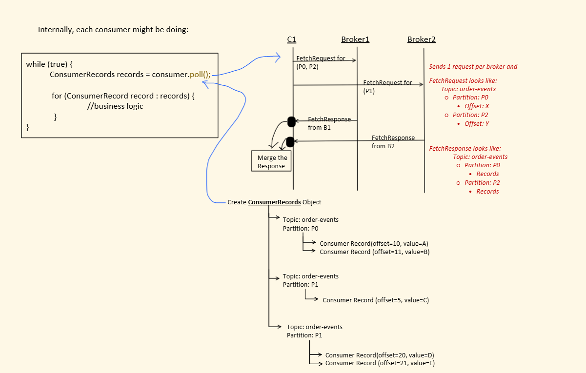

Inside Poll ,for each broker ,this consumer has opened one connection on that fetch request is made.
It do not send multiple request ,each broker has got one reuqest.


When consumer get the response from the broker then it merges the response.and then iterate over the response


```
Partition → Leader Broker
  P0 → B1
  P1 → B2
  P2 → B1

Internally, C1 does:
  FetchRequest for (P0, P2) → sent to Broker1  (1 request per broker)
  FetchRequest for (P1)     → sent to Broker2

FetchRequest shape:
  Topic: order-events
    Partition: P0, Offset: X
    Partition: P2, Offset: Y

FetchResponse shape:
  Topic: order-events
    Partition: P0, Records
    Partition: P2, Records

Consumer merges the FetchResponses from B1 and B2 into ONE
ConsumerRecords object:

  Topic: order-events, Partition P0:
    ConsumerRecord(offset=10, value=A)
    ConsumerRecord(offset=11, value=B)
  Topic: order-events, Partition P1:
    ConsumerRecord(offset=5, value=C)
  Topic: order-events, Partition P1:
    ConsumerRecord(offset=20, value=D)
    ConsumerRecord(offset=21, value=E)
```


---

## Scenario 1 : 1 consumer subscribed to multiple topics 

```
Topic: order-events (P0)   ─┐
                            ├─→ Consumer Group 1 → C1
Topic: payment-events (P0) ─┘
```

### Approach 1 : Manual JSON-to-object mapping 


```properties
server.port=8082
spring.application.name=kafka-consumer-service
spring.kafka.bootstrap-servers=localhost:9092,localhost:9192
spring.kafka.consumer.group-id=order-consumer-group
spring.kafka.consumer.key-deserializer=org.apache.kafka.common.serialization.StringDeserializer
spring.kafka.consumer.value-deserializer=org.apache.kafka.common.serialization.StringDeserializer
```

```
List multiple topics in @KafkaListener(topics = {...}).
Here we accept the record AS-IS (raw String) and take deserialization
into our own hands — that's why value-deserializer is StringDeserializer,
not JsonDeserializer. We branch on record.topic() and manually map JSON
to the right class ourselves.

also here we will manaually serialize we do not need spring.kafka.consumer.properties.spring.json.value.default.type ,only needed when we use JSonSerializer

```


```java
@Component
public class OrderEventListener {

    @Autowired
    ObjectMapper objectMapper;

    @KafkaListener(topics = {"order-events", "payment-events"})
    public void consume(ConsumerRecord<String, String> record) {
      //this record has every information so to get topic-name use record.topic()
        if ("order-events".equals(record.topic())) {
            Order order = objectMapper.readValue(record.value(), Order.class);
            //record.value() gets the value of record and then we manually serialize here
            // business logic for order
        } else if ("payment-events".equals(record.topic())) {
            Payment payment = objectMapper.readValue(record.value(), Payment.class);
            // business logic for payment
        }
    }
}
```
objectMapper comes from Jackson


### Manual-mapping demo 

The video runs the manual approach end to end:

1. Subscribe the same listener to both `order-events` and `payment-events`.
2. Keep the consumer value deserializer as `StringDeserializer`, so the listener receives the raw JSON value.
3. Check `record.topic()` and use `ObjectMapper` to convert the value to either `Order` or `Payment`.
4. Publish events to both topics and verify that the corresponding branch and business logic execute.

### Understanding the JSON deserialization flow (important — where people get confused) 

**Producer side (during JSON serialization) :**

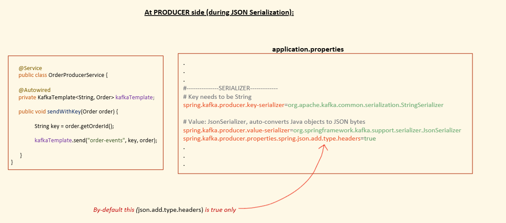

```java
@Service
public class OrderProducerService {
    @Autowired
    private KafkaTemplate<String, Order> kafkaTemplate;

    public void sendWithKey(Order order) {
        String key = order.getOrderId();
        kafkaTemplate.send("order-events", key, order);
    }
}
```
`
KafkaTemplate sends in key,value format. That we get in record in ConsumerRecord`

```properties
#---------------SERIALIZER-------------
spring.kafka.producer.key-serializer=org.apache.kafka.common.serialization.StringSerializer
spring.kafka.producer.value-serializer=org.springframework.kafka.support.serializer.JsonSerializer
spring.kafka.producer.properties.spring.json.add.type.headers=true   # true by default
```

```
When the producer sends the event, it ALSO adds a header:
  __TypeId__ = com.eda.producer.model.Order
This tells type Class of event

But it's NOT always guaranteed that the producer adds __TypeId__, even
though add.type.headers is true (default)!
```

Broker log dump — when using `KafkaTemplate<String, Order>` (specific type), NO `__TypeId__` header gets added:

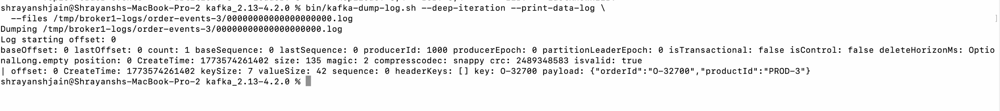

```
headerKeys: []   ← empty! Because KafkaTemplate<String, Order> uses a
SPECIFIC value type (Order), the producer client doesn't bother adding
__TypeId__.
```

But if instead we use `KafkaTemplate<String, Object>` (generic Object type), the producer DOES add `__TypeId__`:

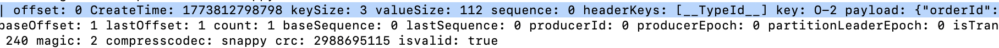

```
headerKeys: [__TypeId__]   ← present! Because the value type is Object,
Kafka's JSON serializer can't infer the concrete class from the generic
type alone, so it stamps __TypeId__ = com.eda.producer.model.Order into
the header, to help the consumer deserialize correctly later.

This is internal logic of the Kafka JSON serializer: whenever value type
is generic (Object) AND spring.json.add.type.headers=true (default),
it adds __TypeId__. When the value type is a specific class, it's
already known — so no header needed.
```

**Consumer side (during JSON deserialization) — the decision flow :**

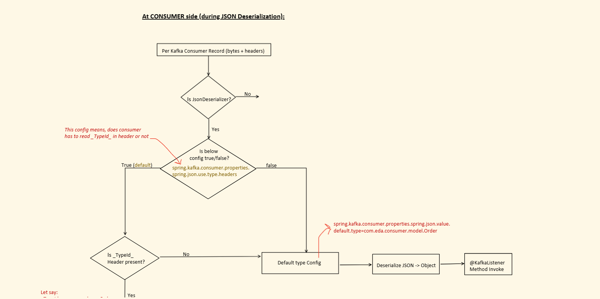

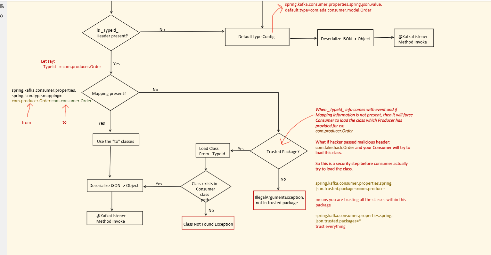
```
For each Kafka ConsumerRecord (bytes + headers):

  Is JsonDeserializer being used?
    No  → (not this flow)
    Yes → check: spring.kafka.consumer.properties.spring.json.use.type.headers
                 (should consumer read __TypeId__ from header or not?)

          false → go straight to Default Type Config:
                    spring.kafka.consumer.properties.spring.json.value.default.type
                    → Deserialize JSON -> Object (using default type)
                    → @KafkaListener method invoked

          true (default) → Is __TypeId__ header present?
            No  → fall back to Default Type Config → deserialize → invoke listener
            Yes → let __TypeId__ = com.producer.Order (example)

                  Is a type mapping present?
                    spring.kafka.consumer.properties.spring.json.type.mapping=
                      com.producer.Order:com.consumer.Order
                    (Very imp config,we tell which object of producer to convert to which object of consumer )


                    Yes → use the "to" class (com.consumer.Order)
                          → Deserialize JSON -> Object → invoke listener

                    No  → forces the consumer to load the EXACT class named
                          in __TypeId__ (e.g. com.producer.Order)

                          SECURITY CHECK — Is it a Trusted Package?
                            spring.kafka.consumer.properties.spring.json.trusted.packages=com.producer
                              → trusts everything under com.producer
                            spring.kafka.consumer.properties.spring.json.trusted.packages=*
                              → trusts everything (use with caution!)

                          Why this check exists: if __TypeId__ info comes
                          with the event and there's no mapping, the
                          consumer would blindly try to load whatever class
                          name the producer (or an attacker!) put in the
                          header — e.g. a malicious header like
                          com.fake.hack.Order. Trusted-packages is the
                          safety gate before the consumer attempts to load
                          that class.

                          No (not trusted) → IllegalArgumentException:
                                              "not in trusted package"
                          Yes → Load Class from __TypeId__
                                  Class exists on consumer classpath?
                                    No  → ClassNotFoundException
                                    Yes → Deserialize JSON -> Object
                                          → @KafkaListener method invoked
```

### Approach 2 — AUTO mapping (JSON to object conversion, no manual work) 

```properties
spring.kafka.consumer.group-id=order-consumer-group
spring.kafka.consumer.key-deserializer=org.apache.kafka.common.serialization.StringDeserializer
spring.kafka.consumer.value-deserializer=org.springframework.kafka.support.serializer.JsonDeserializer
spring.kafka.consumer.properties.spring.json.type.mapping=com.eda.producer.model.Order:com.eda.consumer.model.Order,com.eda.producer.model.Payment:com.eda.consumer.model.Payment
spring.kafka.consumer.properties.spring.json.value.default.type=com.eda.consumer.model.Order
```
Here we are providing mapping of producer class to consumer class,see above application.properties.

Now at consumer side we just typecast record.value to whatevr it is deserialized to.

```java
@Component
public class OrderEventListener {
    @KafkaListener(topics = {"order-events", "payment-events"})
    public void consume(ConsumerRecord<String, Object> record) {
        if ("order-events".equals(record.topic())) {
            Order order = (Order) record.value();
            // business logic for order
        } else if ("payment-events".equals(record.topic())) {
            Payment payment = (Payment) record.value();
            // business logic for payment
        }
    }
}
```
`ConsumerRecord<String, Object> record` as using JSonSerializer and Deserializer.

When you provide mapping then no need of trusted package.

```
No manual mapping needed — the type.mapping property tells
JsonDeserializer exactly which producer class name maps to which
consumer class, so it deserializes to the correct type automatically
based on the __TypeId__ header.
```

Producer/consumer POJOs used in these examples:

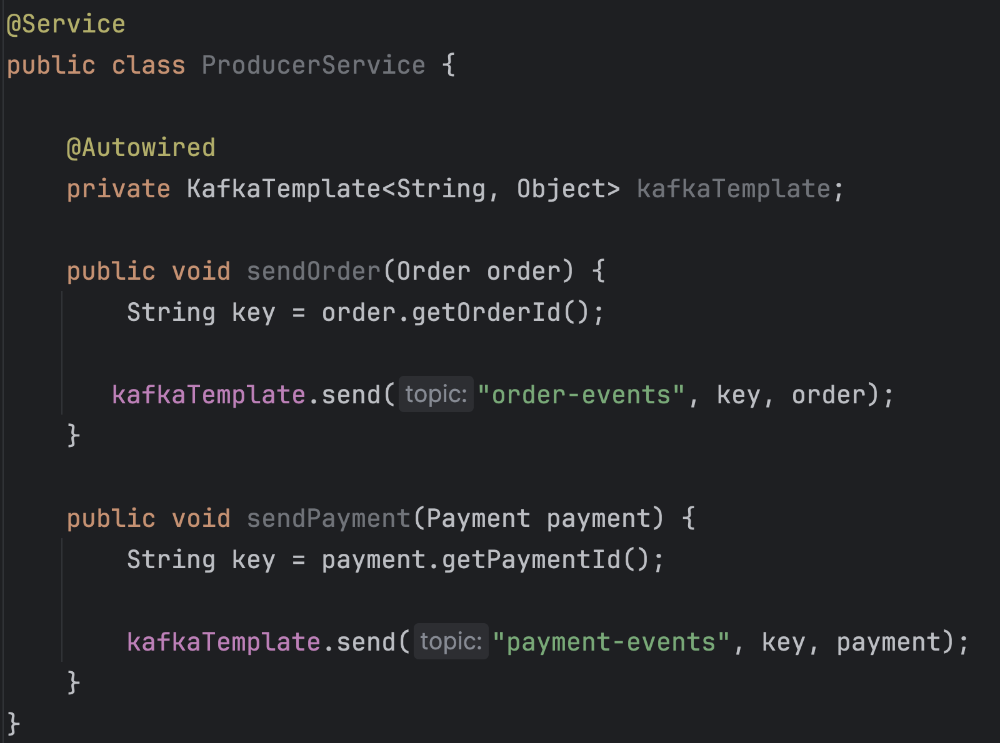

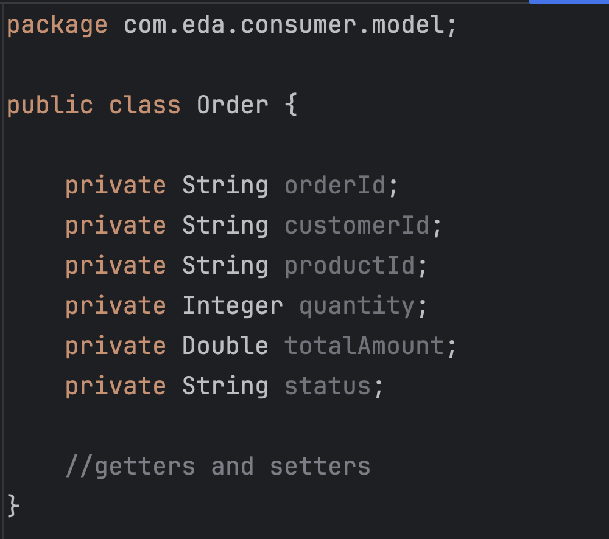

Example producer sending to both topics with a generic `KafkaTemplate<String, Object>` (which is what makes `__TypeId__` get added):

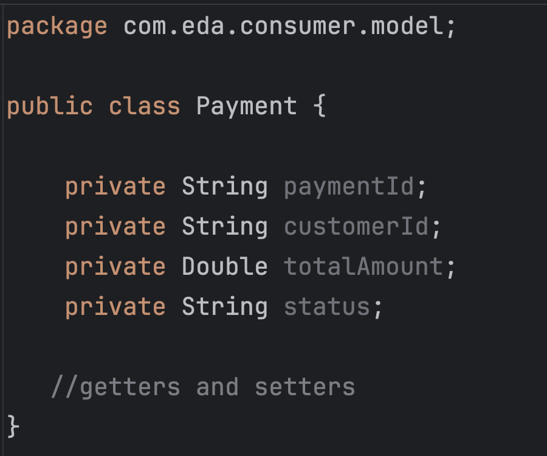

### Automatic-mapping demo — missing from notes 

The video switches from manual `ObjectMapper` conversion to automatic deserialization:

1. Use `KafkaTemplate<String, Object>` so the producer's JSON serializer includes the concrete `__TypeId__` header.
2. Configure `spring.json.type.mapping` to map the producer-side `Order` and `Payment` class names to their consumer-side equivalents.
3. Keep `JsonDeserializer` on the consumer. It reads the type header, applies the mapping, and creates the correct object automatically.
4. Publish order and payment events and verify that the listener receives the appropriate object type without manually parsing JSON.

---

## Scenario 2 — Multiple consumers in a group, each joining a DIFFERENT topic [

```
Topic: order-events (P0)   → Consumer Group 1 → C1
Topic: payment-events (P0) → Consumer Group 1 → C2
```

### Approach 1 — Two separate consumer applications 

```
Simplest option: create 2 different Spring Boot consumer applications.
Whatever we've seen in the Basic Consumer setup just works, since each
application creates its own single Consumer.
```

### Approach 2 — Both consumers inside ONE application

```
For each @KafkaListener, Spring creates 1 KafkaConsumer.
```

```java
@Component
public class EventListener {

    @KafkaListener(topics = "order-events")
    public void consumeOrder(Order order) {
        System.out.println("Received:" + order.getOrderId());
    }

    @KafkaListener(topics = "payment-events")
    public void consumePayment(Payment payment) {
        System.out.println("Received:" + payment.getPaymentId());
    }
}
```

There are 2 ways to configure the deserialization for this:

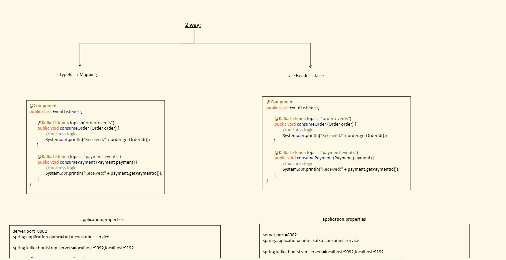

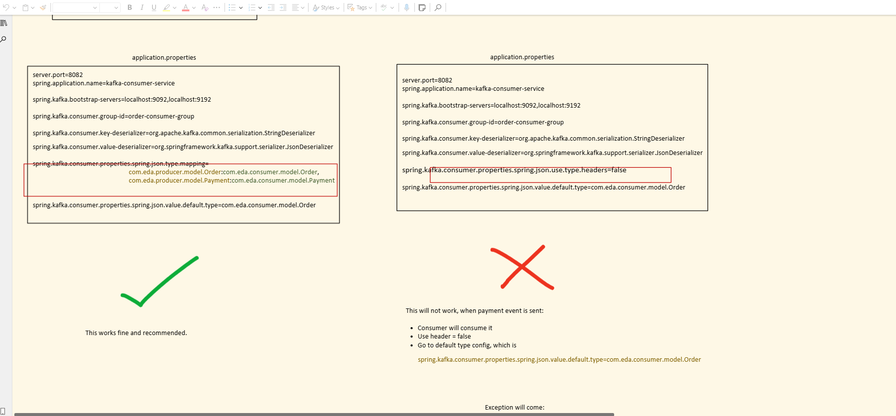

**Way 1 — `__TypeId__` + type mapping :**

Producer sending `TypeId` and consumer is doing `mapping`

```properties
spring.kafka.consumer.key-deserializer=org.apache.kafka.common.serialization.StringDeserializer
spring.kafka.consumer.value-deserializer=org.springframework.kafka.support.serializer.JsonDeserializer
spring.kafka.consumer.properties.spring.json.type.mapping=com.eda.producer.model.Order:com.eda.consumer.model.Order,com.eda.producer.model.Payment:com.eda.consumer.model.Payment
spring.kafka.consumer.properties.spring.json.value.default.type=com.eda.consumer.model.Order
```

**Way 2 — `use.type.headers=false`, relying on default type **

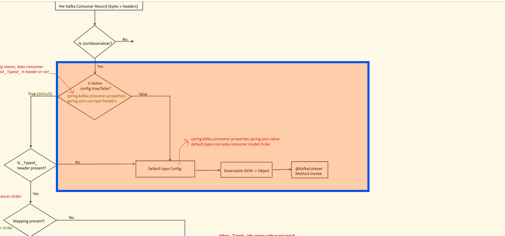

see orange part

```properties
spring.kafka.consumer.key-deserializer=org.apache.kafka.common.serialization.StringDeserializer
spring.kafka.consumer.value-deserializer=org.springframework.kafka.support.serializer.JsonDeserializer
spring.kafka.consumer.properties.spring.json.use.type.headers=false
spring.kafka.consumer.properties.spring.json.value.default.type=com.eda.consumer.model.Order
```

```
This will work for Order event as every event be deserializes to Order by default

⚠️ But This (Way 2, as configured above) will NOT work when a payment event
arrives, because it always deserializes using the single default type
(Order):

Caused by: org.springframework.messaging.converter.MessageConversionException:
Cannot convert from [com.eda.consumer.model.Order] to
[com.eda.consumer.model.Payment] for GenericMessage[payload=Order{...}, ...]
```

### Why this breaks — root cause 

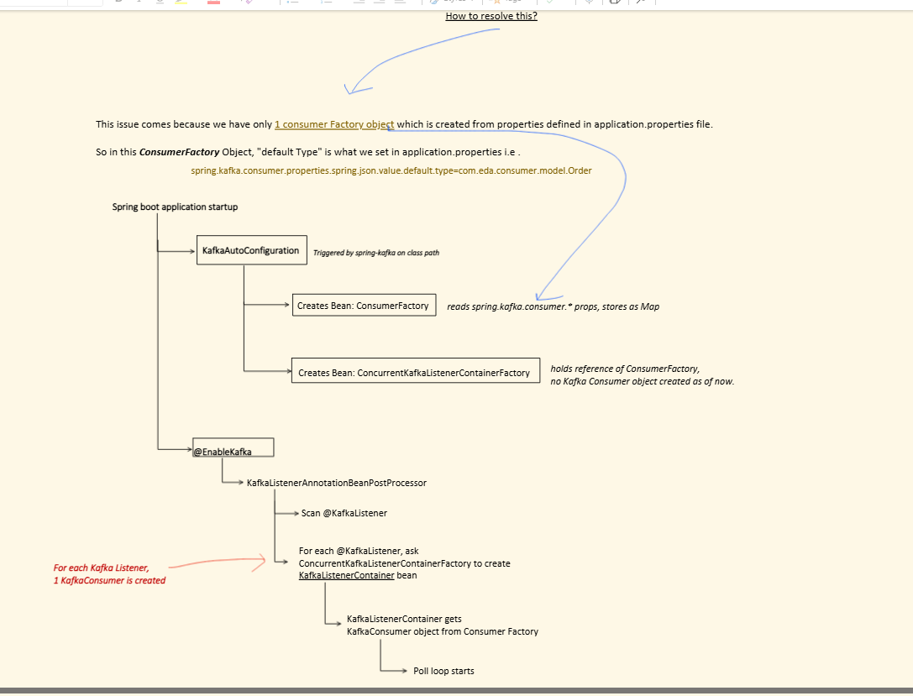

```
This happens because there's only ONE ConsumerFactory object, built
from the properties in application.properties. Its "default type" is
fixed to whatever we set:
  spring.kafka.consumer.properties.spring.json.value.default.type=com.eda.consumer.model.Order

The SAME ConsumerFactory object is used to create BOTH KafkaConsumers
(order + payment) — so both consumers inherit "default type = Order",
which breaks the Payment listener.
```

### The fix — separate ConsumerFactory per event type 

```java
package com.eda.consumer.config;

import com.eda.consumer.model.Order;
import com.eda.consumer.model.Payment;
import org.springframework.boot.autoconfigure.kafka.KafkaProperties;
import org.springframework.context.annotation.Bean;
import org.springframework.context.annotation.Configuration;
import org.springframework.kafka.config.ConcurrentKafkaListenerContainerFactory;
import org.springframework.kafka.core.ConsumerFactory;
import org.springframework.kafka.core.DefaultKafkaConsumerFactory;
import org.springframework.kafka.support.serializer.JsonDeserializer;
import java.util.Map;

@Configuration
public class ConsumerConfig {

    @Bean
    public ConsumerFactory<String, Order> orderConsumerFactory(KafkaProperties props) {
        Map<String, Object> config = props.buildConsumerProperties();
        config.put(JsonDeserializer.VALUE_DEFAULT_TYPE, Order.class.getName());
        return new DefaultKafkaConsumerFactory<>(config);
    }

    @Bean
    public ConsumerFactory<String, Payment> paymentConsumerFactory(KafkaProperties props) {
        Map<String, Object> config = props.buildConsumerProperties();
        config.put(JsonDeserializer.VALUE_DEFAULT_TYPE, Payment.class.getName());
        return new DefaultKafkaConsumerFactory<>(config);
    }

    @Bean
    public ConcurrentKafkaListenerContainerFactory<String, Order> orderKafkaListenerFactory(
            ConsumerFactory<String, Order> orderConsumerFactory) {
        ConcurrentKafkaListenerContainerFactory<String, Order> factory =
            new ConcurrentKafkaListenerContainerFactory<>();
        factory.setConsumerFactory(orderConsumerFactory);
        return factory;
    }

    @Bean
    public ConcurrentKafkaListenerContainerFactory<String, Payment> paymentKafkaListenerFactory(
            ConsumerFactory<String, Payment> paymentConsumerFactory) {
        ConcurrentKafkaListenerContainerFactory<String, Payment> factory =
            new ConcurrentKafkaListenerContainerFactory<>();
        factory.setConsumerFactory(paymentConsumerFactory);
        return factory;
    }
}
```

Now we are telling which factory to use

```java
@Component
public class EventListener {

    @KafkaListener(topics = "order-events", containerFactory = "orderKafkaListenerFactory")
    public void consumeOrder(Order order) {
        System.out.println("Received:" + order.getOrderId());
    }

    @KafkaListener(topics = "payment-events", containerFactory = "paymentKafkaListenerFactory")
    public void consumePayment(Payment payment) {
        System.out.println("Received:" + payment.getPaymentId());
    }
}
```

```
Each listener now points at its OWN containerFactory, backed by its own
ConsumerFactory with the correct default type. Order events use the
Order default type; Payment events use the Payment default type. No
more mismatch exception.
```

### Multiple-consumer and multiple-topic demo — missing from notes 

The video verifies both listeners in one Spring Boot application. Spring creates a separate Kafka consumer for each `@KafkaListener`; the order listener subscribes to `order-events`, while the payment listener subscribes to `payment-events`. Publishing to both topics shows that each event reaches the correct listener and uses its configured container/consumer factory.

---

## Scenario 3 — Multiple consumers in a group, joining the SAME topic 

which partition you will get is not in your hand here. it will be assigned by kafka

```
Topic: order-events (P0, P1) → Consumer Group 1 → C1, C2
```

```java
@Component
public class EventListener {
    @KafkaListener(topics = "order-events")
    public void consumeOrder(Order order) {
        System.out.println("Received:" + order.getOrderId());
    }
}
```

```properties
spring.kafka.consumer.key-deserializer=org.apache.kafka.common.serialization.StringDeserializer
spring.kafka.consumer.value-deserializer=org.springframework.kafka.support.serializer.JsonDeserializer
spring.kafka.consumer.properties.spring.json.use.type.headers=false
spring.kafka.consumer.properties.spring.json.value.default.type=com.eda.consumer.model.Order

spring.kafka.listener.concurrency=3
```
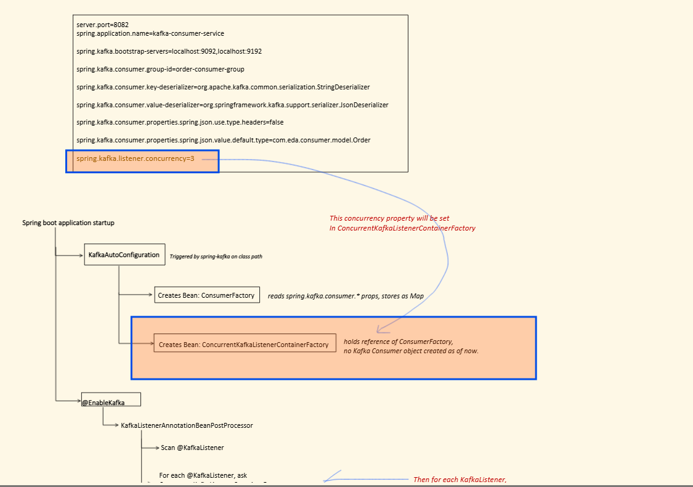


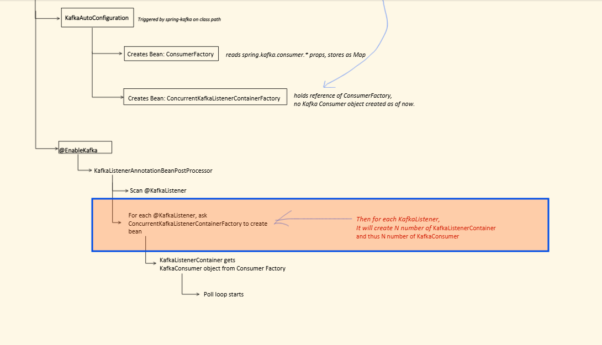

```
concurrency=3 gets set on the ConcurrentKafkaListenerContainerFactory.
For that @KafkaListener, Spring then creates N (here: 3)
KafkaListenerContainer instances → and therefore N KafkaConsumer
instances — all part of the SAME consumer group, sharing the
partitions of order-events between them.


which partition is alloted is defined by Group Coordinator.

```

## Closing notes — missing from notes 

`spring.kafka.listener.concurrency` controls how many listener-container/Kafka-consumer instances Spring creates for the listener. Consumers in the same group divide the topic partitions among themselves; creating more consumers than available partitions leaves the extra consumers idle. The following lessons continue with polling, fetching, heartbeat, and other consumer configuration details.
