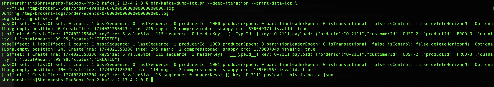
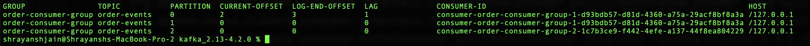
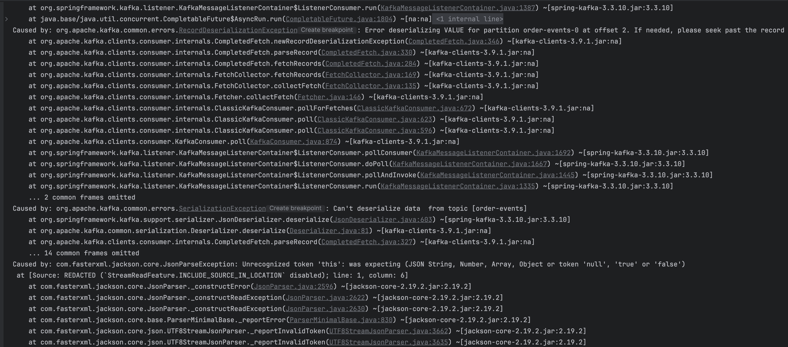
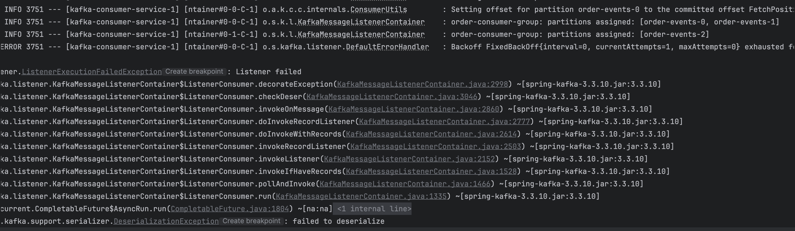
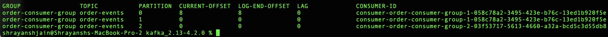
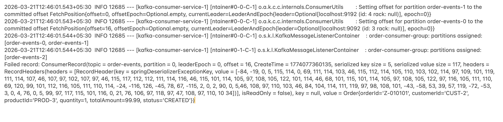

# Consumer Setup: Exception Handling

Consumer processes events, and there are exactly **2 places** an exception can happen:

```
1. Exception during Deserialization (of key or value)
2. Exception during Processing the record (inside the listener)
```

### High level flow

```
poll()
  → deserialize() each record
  → For each record: invoke listener and process the record
  → Commit offset

1st place exception can come:  during deserialization of key or value
2nd place exception can come:  during processing the record (event)
```

---

## 1. Exception during Deserialization

### The problem — Infinite Loop

```
Producer sends: Value = String
Consumer expects: Value = Json

Broker offsets for topic order-events, partition 0:
  Offset 0: value is json
  Offset 1: value is json
  Offset 2: value is String   ← the buggy message

Consumer flow:
  poll() → fetches event at offset 2 → Deserialization exception
         → prints error stack trace → next offset to read still = 2

INFINITE LOOP: even if we stop and restart the consumer, it restarts
from offset 2 and gets stuck again, forever.
```

Broker log dump confirming the buggy record at offset 2:



```
Offset 0 & 1: normal JSON payloads (producerId 1000)
Offset 2: producerId 1001, payload: "this is not a json"  ← the culprit
```

Consumer group status shows the stuck lag:



```
order-consumer-group / order-events / Partition 0:
  CURRENT-OFFSET: 2   LOG-END-OFFSET: 3   LAG: 1
  → 1 offset (the buggy one) is never successfully processed/committed.
```

### Solution — Error Handling wrapper

```
Flow with the wrapper:

Deserialization logic → Deserialization Exception?
  Yes → ErrorHandler is invoked
  No  → For each record, invoke listener and process the record → Commit offset

Default config of ErrorHandler:
  0 retries — it's treated as a FATAL exception (no matter how many
  times you retry, it will fail the same way)
  No failure event stored in DLT — just error logging
  → offset is still committed after logging
```

Add the deserializer wrapper (Consumer `application.properties`):

```properties
# Use wrapper
spring.kafka.consumer.key-deserializer=org.springframework.kafka.support.serializer.ErrorHandlingDeserializer
spring.kafka.consumer.value-deserializer=org.springframework.kafka.support.serializer.ErrorHandlingDeserializer

# wrapper wraps the actual delegate deserializer class
spring.kafka.consumer.properties.spring.deserializer.key.delegate.class=org.apache.kafka.common.serialization.StringDeserializer
spring.kafka.consumer.properties.spring.deserializer.value.delegate.class=org.springframework.kafka.support.serializer.JsonDeserializer
```

```
At this point we haven't added a custom Error Handler bean — we're
relying on the framework's DefaultErrorHandler. That's it: the wrapper
plus the default handler is all managed by the framework.

DefaultErrorHandler gets invoked; for deserialization errors it uses
FixedBackOff with maxAttempts = 0 → do not retry if it fails once.
```

The actual exception chain seen in logs (RecordDeserializationException → SerializationException → JsonParseException):



The DefaultErrorHandler exhausting its (zero) backoff and failing the listener invocation:



```
No lag afterwards — meaning the consumer DID commit the offset for the
record that failed deserialization. So the consumer isn't stuck anymore,
BUT we permanently lost that event/record.

In production we should NOT rely on DefaultErrorHandler for this.
Instead, we should use our own Error Handler that stores the failed
event in a DLT (Dead Letter Topic), so that after a fix, it can be
replayed (or some other action taken on it).
```

### Retry strategies — configuring the Error Handler Bean

```java
@Bean
public DefaultErrorHandler errorHandler() {
    DefaultErrorHandler handler = new DefaultErrorHandler(
        new FixedBackOff(1000L, 2));
    return handler;
}
```

```
FixedBackOff(1000L, 2): wait 1000ms (1 sec) before retrying, max 2 retries.

Attempt1: fail
Wait 1 sec
Attempt2 (Retry-1): fail
Wait 1 sec
Attempt3 (Retry-2): fail
```

```java
@Bean
public DefaultErrorHandler errorHandler() {
    ExponentialBackOffWithMaxRetries backOff = new ExponentialBackOffWithMaxRetries(5);
    backOff.setInitialInterval(1000L);
    backOff.setMultiplier(2.0);
    backOff.setMaxInterval(10000L);

    DefaultErrorHandler handler = new DefaultErrorHandler(backOff);
    return handler;
}
```

```
Two retry strategies:
  1. FixedBackOff
  2. ExponentialBackOffWithMaxRetries

ExponentialBackOffWithMaxRetries(5):
  First retry after 1s delay, each subsequent retry doubles the wait (*2)
    Retry 1: 1s wait
    Retry 2: 2s wait
    Retry 3: 4s wait
    Retry 4: 8s wait
  Max delay capped at 10s (if multiplied delay > 10s, use 10s instead)
  Max retries = 5 only
```

### Recoverer — what happens after ALL retries are exhausted?

```
ConsumerRecordRecoverer            (Functional Interface)
  void accept(T t, U u);

  extends → ConsumerAwareRecordRecoverer   (Functional Interface)
              void accept(ConsumerRecord<?, ?> record, Exception exception)

  implements → DeadLetterPublishingRecoverer   (Class, framework-provided)
                 void accept(ConsumerRecord<?, ?> record, Exception exception) {
                     // logic to insert record in DLT
                 }
```

### How DLT actually works internally



```
Consumer group status after the DLT fix: lag = 0, all partitions caught
up (compare to the earlier stuck-at-offset-2 screenshot).
```

```
Deserialization issue happens
  → ErrorHandler wrapper intercepts:
      - Creates a DeserializationException object (full exception details)
      - Creates a ConsumerRecord with:
          Value = null (if value deserialization failed) else actual data
          Key   = null (if key deserialization failed) else actual data
          Header contains the exception + RAW bytes:
            springDeserializerExceptionKey   = key raw bytes
            springDeserializerExceptionValue = value raw bytes
          (whichever side failed has its raw bytes stashed in a header)

  → DeadLetterPublishingRecoverer.accept(record, exception) is called:

      public void accept(ConsumerRecord<?, ?> record, Exception exception) {
          // 1. Find the raw bytes from the exception
          byte[] rawKeyBytes = ((DeserializationException) exception)
              .getHeader("springDeserializerExceptionKey");
          byte[] rawValueBytes = ((DeserializationException) exception)
              .getHeader("springDeserializerExceptionValue");

          // 2. Create a NEW record for the DLT topic
          ProducerRecord<Object, Object> dltRecord = new ProducerRecord<>(
              record.getTopic() + "-dlt",                                  // destination topic
              record.key()   != null ? record.key()   : rawKeyBytes,       // fallback to raw bytes if key failed
              record.value() != null ? record.value() : rawValueBytes);    // fallback to raw bytes if value failed

          // 3. send it
          kafkaTemplate.send(dltRecord);
      }

Example 1 — value deserialization failed:
  ConsumerRecord: Value = null, Key = "O-111"
  Header: springDeserializerExceptionValue = bytes[]

Example 2 — key deserialization failed:
  ConsumerRecord: Value = Order Object, Key = null
  Header: springDeserializerExceptionKey = bytes[]
```

### Wiring up the DLT feature

```java
@Bean
public NewTopic orderDltEventsTopic() {
    return TopicBuilder.name("order-events-dlt").build();
}

@Bean
public DeadLetterPublishingRecoverer deadLetterPublishingRecoverer(KafkaTemplate<Object, Object> template) {
    return new DeadLetterPublishingRecoverer(template);
}

@Bean
public DefaultErrorHandler errorHandler(DeadLetterPublishingRecoverer recoverer) {
    DefaultErrorHandler handler = new DefaultErrorHandler(recoverer,
        new FixedBackOff(1000L, 2));
    return handler;
}
```

```
- Created a DLT topic ("order-events-dlt") to store failed events.
- Created a DeadLetterPublishingRecoverer bean — this framework class
  already has all the code needed to push failed records to the DLT.
  All we need to give it is a KafkaTemplate (its serializers etc. come
  from application.properties).
- Now the Error Handler has BOTH a Retry feature AND a DLT fallback:
    after all retries are exhausted, the handler invokes the
    Recoverer's accept(record, exception) method.

    public DefaultErrorHandler(ConsumerRecordRecoverer recoverer, BackOff backOff) { ... }

- DeadLetterPublishingRecoverer is the framework-provided implementation.
  We can also write our OWN recoverer instead — e.g. insert the failed
  record into a DB instead of a DLT, or send an alert.
```

### The tricky part — what serializer to use for the DLT topic?

```
Usecase 1 — value deserialization failed:
  ConsumerRecord: Value = null, Key = "O-111"
  Header: springDeserializerExceptionValue = value bytes[]

  ProducerRecord<Object, Object> dltRecord = new ProducerRecord<>(
      "order-events-dlt", "O-111", valueBytes);

  # Serializers needed:
  spring.kafka.producer.key-serializer=org.apache.kafka.common.serialization.StringSerializer
  spring.kafka.producer.value-serializer=org.apache.kafka.common.serialization.ByteArraySerializer

Usecase 2 — key deserialization failed:
  ConsumerRecord: Value = Order Object, Key = null
  Header: springDeserializerExceptionKey = key bytes[]

  ProducerRecord<Object, Object> dltRecord = new ProducerRecord<>(
      "order-events-dlt", keyBytes, Order);

  # Serializers needed:
  spring.kafka.producer.key-serializer=org.apache.kafka.common.serialization.ByteArraySerializer
  spring.kafka.producer.value-serializer=org.springframework.kafka.support.serializer.JsonSerializer
```

```
Challenge: usecase 1 and usecase 2 need DIFFERENT serializer configs for
key vs value — but we can only configure ONE pair of serializers
globally in application.properties.

Pragmatic take: most of the time the KEY is a plain String, so
deserialization issues on the key are rare. Deserialization issues
mostly happen on the VALUE (JSON parsing). So this combination usually
works fine:

  spring.kafka.producer.key-serializer=org.apache.kafka.common.serialization.StringSerializer
  spring.kafka.producer.value-serializer=org.apache.kafka.common.serialization.ByteArraySerializer

But if the KEY can also be an Object, the issue could be on:
  - only key
  - only value
  - both

Then choosing between ByteArraySerializer and JsonSerializer up front
becomes genuinely hard.

Best answer: override the recoverer's record-creation method and ALWAYS
convert both key and value to bytes before publishing to the DLT — then
use ByteArraySerializer for BOTH key and value, unconditionally:

  spring.kafka.producer.key-serializer=org.apache.kafka.common.serialization.ByteArraySerializer
  spring.kafka.producer.value-serializer=org.apache.kafka.common.serialization.ByteArraySerializer
```

```java
@Bean
public DeadLetterPublishingRecoverer deadLetterPublishingRecoverer(KafkaTemplate<Object, Object> template) {

    DeadLetterPublishingRecoverer recoverer = new DeadLetterPublishingRecoverer(template) {

        // Just override this method and convert key and value to bytes
        @Override
        protected ProducerRecord<Object, Object> createProducerRecord(
                ConsumerRecord<?, ?> record, TopicPartition tp, Headers headers,
                byte[] key, byte[] value) {

            Object finalKey   = (key   != null) ? key   : objectMapper.writeValueAsBytes(record.key());
            Object finalValue = (value != null) ? value : objectMapper.writeValueAsBytes(record.value());

            return new ProducerRecord<>(tp.topic(), tp.partition(), finalKey, finalValue, headers);
        }
    };
    return recoverer;
}

@Bean
public DefaultErrorHandler errorHandler(DeadLetterPublishingRecoverer recoverer) {
    DefaultErrorHandler handler = new DefaultErrorHandler(recoverer, new FixedBackOff(1000L, 2));
    return handler;
}
```

---

## 2. Exception during Processing the record

```
Flow: Producer → Broker → Consumer deserializes fine → poll() →
Process record → throws exception (e.g. NullPointerException)
```

Custom retryer added straight into the Error Handler (instead of a DLT recoverer):

```java
@Bean
public DefaultErrorHandler errorHandler(DeadLetterPublishingRecoverer recoverer) {
    DefaultErrorHandler handler = new DefaultErrorHandler(
        (record, exception) -> {
            System.out.println("Failed record: " + record);
        },
        new FixedBackOff(1000L, 2));
    return handler;
}
```

Log output when this custom recoverer fires (failed record printed with full detail, including headers):



```
Default Error Handler behavior for a processing exception:
  - Logs it
  - Commits the offset (so the consumer doesn't get stuck)

Key difference from deserialization errors:
  - For deserialization issues, we MUST add the ErrorHandlingDeserializer
    wrapper ourselves for the DefaultErrorHandler to even kick in.
  - For processing exceptions, the DefaultErrorHandler is active by
    default — no wrapper needed.

If we want Retry + a final action once retries are exhausted (like DLT)
for processing exceptions too — it's exactly the same setup we already
did for deserialization (FixedBackOff / ExponentialBackOffWithMaxRetries
+ a Recoverer bean, whether that's DeadLetterPublishingRecoverer or a
custom one).
```
