## Lets understand the need for Transaction in Kafka

Producer uses ProducerID and Sequence number to maintain ordering and to maintain duplicate 

but that producerID is not stored anywhere so when producer crashes and get back it will get a new ProducerID(PID)

### 1. Problem with Idempotency - Producer side Problem

So, when Producer restart, it will send request again "Give me Unique ID" and since Controller (in case of Idempotency) do not store any producer and PID mapping info, so it will always generate new PID and revert back.

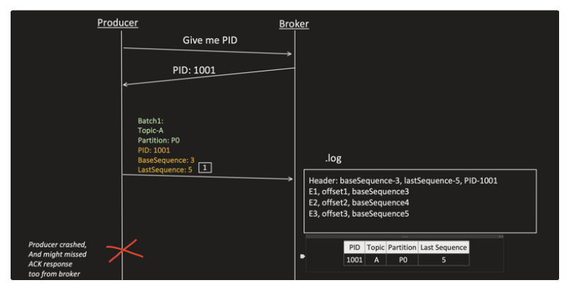

Since the producer crashed and might have missed the ACK response from the broker too, on restart it has no memory of its old PID and requests a brand new one.

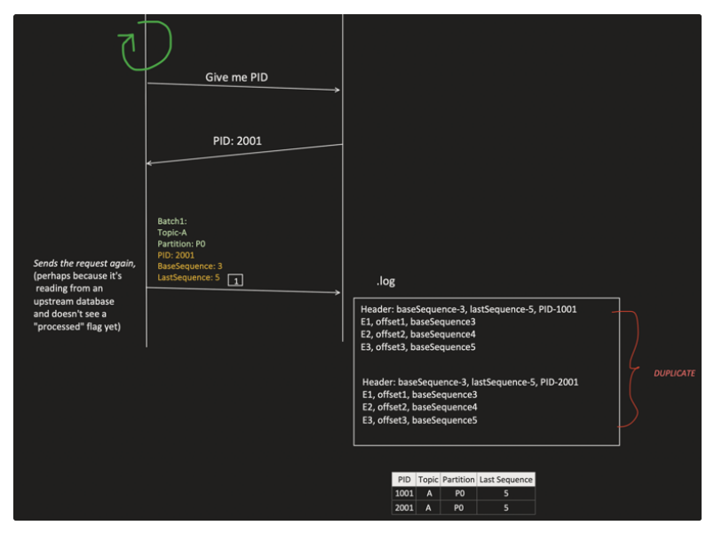

Because the Controller has no producer <-> PID mapping, the same logical batch gets written twice under two different PIDs (1001 and 2001) - a **duplicate**.

### 2. Partial Writes - Producer side problem

```java
//success
kafkaTemplate.send("order-events", order);

//success
kafkaTemplate.send("payment-events", payment);

//Fails(broker down or network issue)
kafkaTemplate.send("inventory-events", stock);
```

**Outcome:**

"order-events" and "payment-events" have records, but "inventory-events" does NOT.

Consumers see partial data which could led to INCONSISTENT STATE.

Payment made but stock not RESERVED.I want all 3 should happen at once.Even one is failing is inconsistent state.It should follow Transaction.

### 3. Duplicate Processing (Read-process-Write) - Consumer side problem

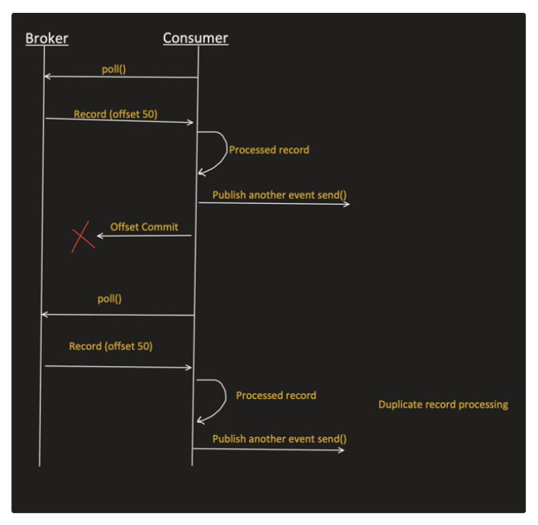

consumer is publishing another event based on event it received.

---

## SOLUTION: TRANSACTION in Kafka(Very important in interviews and frequently used)

### Step1: Transaction Id

- Each producer assign themselves unique transaction id.
- If Producer application has multiple instances, then each instance should have different unique id.
- Unique id should be stable, means if application restarts this id should not be changed.

**application.properties**

```properties
spring.kafka.producer.transaction-id-prefix=order-serv-${HOSTNAME}-
```
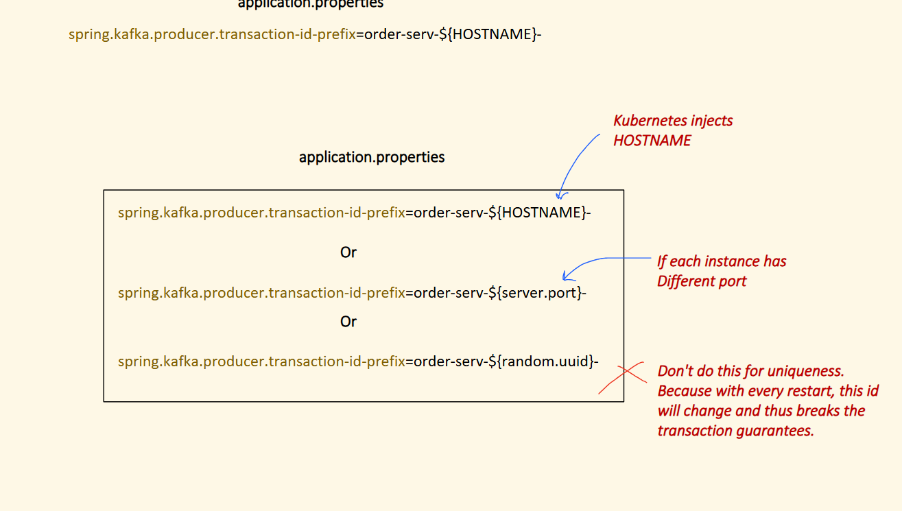
```xml
<!--
Kubernetes injects HOSTNAME
-->
spring.kafka.producer.transaction-id-prefix=order-serv-${HOSTNAME}-

Or

<!--
If each instance has
Different port
-->

spring.kafka.producer.transaction-id-prefix=order-serv-${server.port}-

Or
<!--
Don't do this for uniqueness.
Because with every restart, this id will change and thus breaks
the transaction guarantees.
-->
spring.kafka.producer.transaction-id-prefix=order-serv-${random.uuid}-
```

Now question might have come, why each instance of Producer application, need to have unique id?

This is needed to Avoid: **ZOMBIE FENCING**

We will get to know about this "Zombie Fencing" soon as we proceed further in this topic, because at this point it will be too early to cover this and it will make things complicated.

### Step2: Find the Transaction Coordinator
- Transaction coordinator is Considered it as the brain of transactions.
- `__transaction_state` topic holds the transaction related information.

- This topic `__transaction_state` has 50 partitions. These partitions are divided among different brokers.

> **Who is the Transaction Coordinator?**
> - It is **not a separate service or daemon**, but simply **one of the regular Kafka brokers** in the cluster.
> - Specifically, it is the broker that is the **leader of the partition** of `__transaction_state` that the producer maps to.
> - **Responsibilities:**
>   - Assigns Producer ID (PID) & Producer Epoch (prevents zombie instances).
>   - Tracks transaction states (`Ongoing`, `PrepareCommit`, `CompleteCommit`, `PrepareAbort`, `CompleteAbort`) inside the `__transaction_state` log.
>   - Writes commit/abort control markers to the actual target topic partitions during the two-phase commit.

```
Topic: __transaction_state
Partition:
P0 - Leader Broker1
P1 - Leader Broker2
P2 - Leader Broker3
.
P49 - Leader Broker1
```

Particular Producer transactions goes to specific partition of `__transaction_state` topic only.

**For example:**

```
Producer Transaction-id = "order-serv-0" is sent to any broker


then broker do calculation

Partition calculation = hash("order-serv-0") % 50 = Partition23
Then it see leader of partition 23 ans then it tells to producer this is your coordinator

Leader of Partition23 of topic __transaction_state = Broker2
```

So Broker2 is considered as "Transaction Coordinator" for Producer with Transaction-id = "order-serv-0"

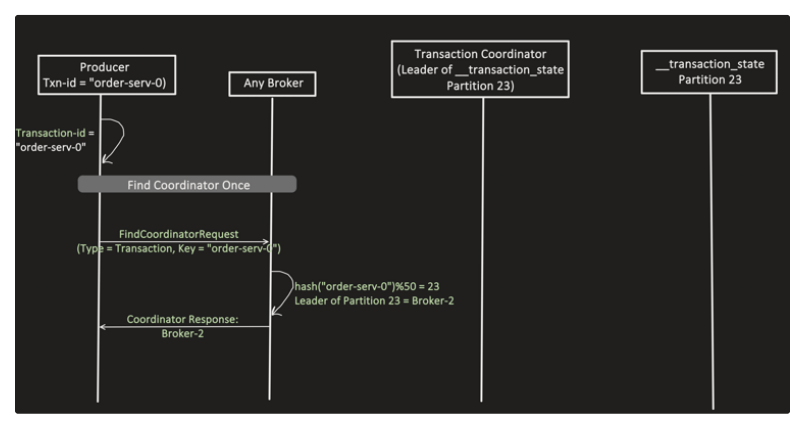

### Step3: Get Producer ID and Version

- When we use Transaction in Kafka, internally it also enables Idempotency too.so no need to set idempotency true explicitly.
- And idempotency need PID (Producer ID).


In short: Idempotent producer ensures no duplicates (even with retries) and ordering per partition (via sequence no).

And transaction need idempotency because it want retries to be safe (to avoid duplicates).

**Get the Producer ID and Version**

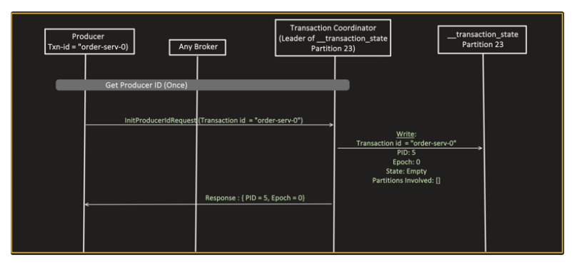

Now get producerId request goes to Transaction Coordinator.

**From Idempotency topic, if we recall:**

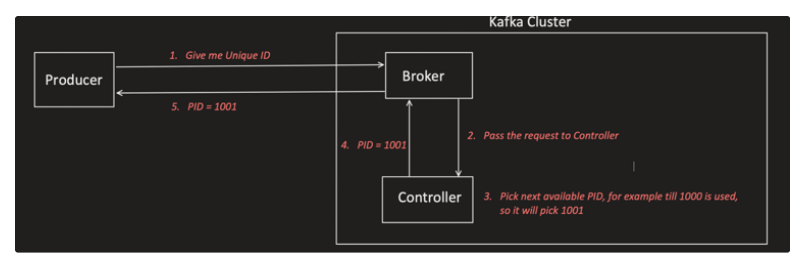

So, when Producer restart, it will send request again "Give me Unique ID" and since Controller (in case of Idempotency) do not store any producer and PID mapping info, so it will always generate new PID and revert back.

This issue is resolved in Transaction, as `__transaction_state` topic, holds the mapping.

**`__transaction_state`:**

```
Transaction Id -> {
    PID,
    Epoch,
    State,
    Partitions involved,
    Timeout,
}
```

- **PID**: this is unique Producer ID
- **Epoch**: consider it as Producer Version number (0 or 1 or 2 likewise),whenever producer restarts it will get epoch++ each time ,so that it can know how many tims producer restarted .producer is identified by transaction id ,on first time when producer joins epoch value is 0
- **State**: Transaction state (EMPTY, ONGOING, PREPARE_COMMIT, PREPARE_ABORT, COMMIT, ABORT)

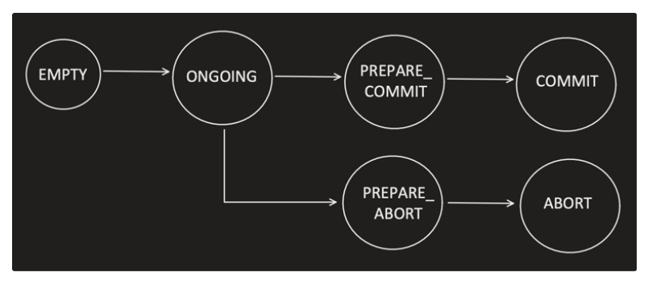

> **Transaction States Explained:**
> 1. **EMPTY**:
>    - Initial state after producer initialization (`initTransactions()`) where PID and Epoch are assigned, but no active transaction is running.
>    - Also returns to this state after a transaction finishes (committed or aborted), waiting for the next transaction.
> 2. **ONGOING**:
>    - The producer called `beginTransaction()`, registered destination partitions with the coordinator (`AddPartitionsToTxnRequest`), and is actively sending messages.
> 3. **PREPARE_COMMIT**:
>    - Producer called `commitTransaction()`. Coordinator logs `PREPARE_COMMIT` to `__transaction_state`.
>    - **Phase 1 of 2PC**: The decision to commit is now durable and locked. Coordinator begins writing commit markers to all involved topic partitions.
> 4. **COMMIT** *(Complete Commit)*:
>    - Coordinator successfully wrote commit markers to all involved topic partition leaders.
>    - Transaction is completed, and messages become visible to consumers with `isolation.level=read_committed`.
> 5. **PREPARE_ABORT**:
>    - Triggered if producer calls `abortTransaction()` (due to an error) OR if the transaction times out (`Timeout` reached in `ONGOING` state).
>    - Coordinator logs `PREPARE_ABORT` in `__transaction_state` and begins writing abort markers to all involved topic partitions.
> 6. **ABORT** *(Complete Abort)*:
>    - Coordinator successfully wrote abort markers to all involved topic partitions.
>    - The transaction is aborted; messages will be filtered out and skipped by `read_committed` consumers.


After 3 and 5 state,Commit and abort will happen ,even if network goes down or snything ,when the network will be up it will happen.

- **Partitions Involved:** in partition ongoing transaction, what all partitions are involved. Like `[{Topic-A, Parition2}, {Topic-B, Partition1}]`
- **Timeout**: Maximum time this Transaction can remain in ONGOING state, after that transaction coordinator will ABORT it.

**Advantage of keeping information like this:**

1. Producer with same Transaction Id, will always get the same PID (even when they restart). So problem with Idempotency (duplicate issue when producer restarts, as they get new PID) is now resolved with this.
2. PID + Epoch helps in ZOMBIE FENCING.

**Lets understand what is Zombie Fencing**

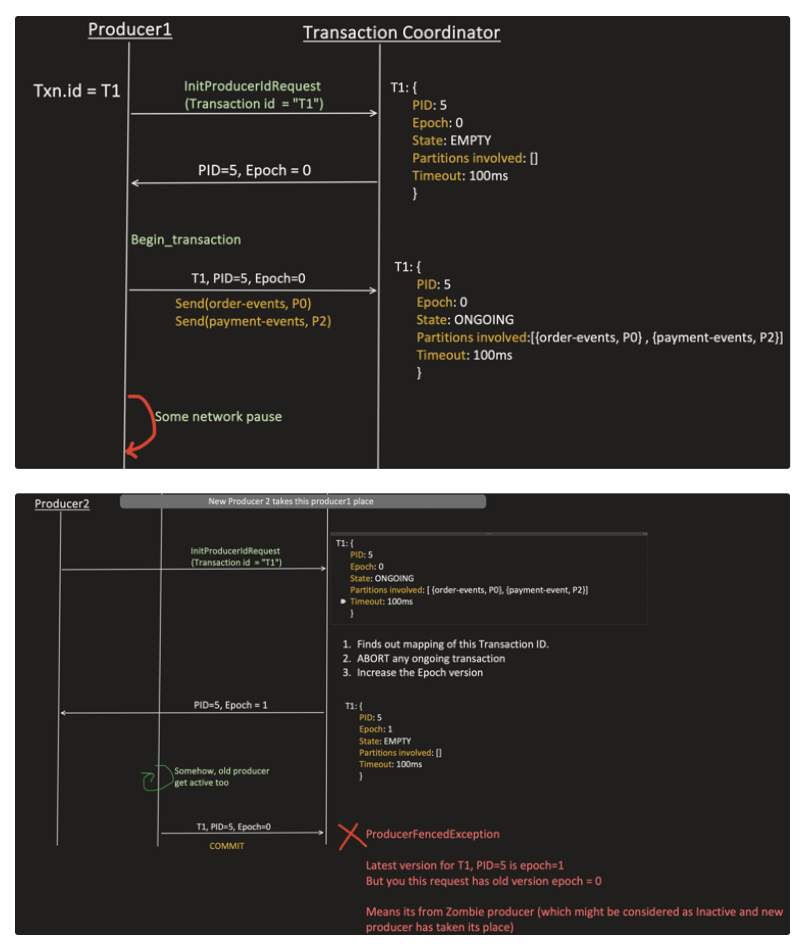

Producer1 begins a transaction (T1, PID=5, Epoch=0) and sends to order-events and payment-events, then hits a network pause. Meanwhile Producer2 comes up with the same transaction id T1. The coordinator:

1. Finds out mapping of this Transaction ID.
2. ABORTs any ongoing transaction.
3. Increases the Epoch version (now Epoch=1).

If the old (zombie) Producer1 somehow gets active again and tries to commit with the old Epoch=0, it gets a `ProducerFencedException` - the coordinator knows the latest epoch for PID=5 is 1, so a request carrying epoch=0 must be from a zombie producer that's already been replaced.

### Step4: Begin Transaction and Send Events

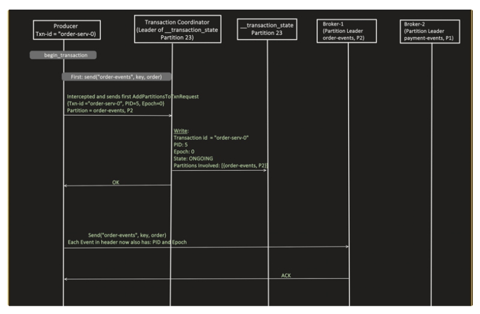

Before send() Producer send request to Transaction Coordinator that i'm going to touch these topic and partition


Transaction Coordinator do  epoch checks and then update the state to ONGOING in __transaction_state

Then trsnacrion Coordinator sends OK to Producer and then send() is called by producer.


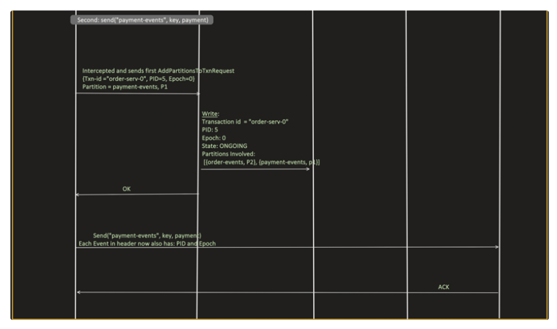

### Step5: Two Phase Protocol

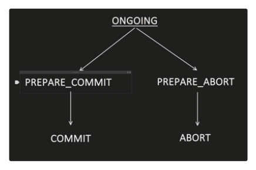

**1st: ONGOING to PREPARE_COMMIT phase**

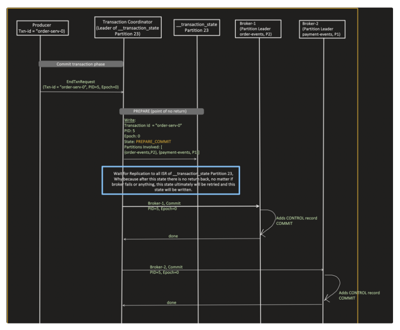

**Steps in Commit Phase (`PREPARE_COMMIT`):**

1. **Producer Sends `EndTxnRequest`:**
   - Once the producer finishes producing messages, it calls `commitTransaction()`.
   - It sends an `EndTxnRequest` containing its `Txn-id ("order-serv-0")`, `PID (5)`, and `Epoch (0)` to the **Transaction Coordinator**.

2. **Coordinator Writes `PREPARE_COMMIT` (Point of No Return):**

   - The coordinator writes a log record to its partition in `__transaction_state` (Partition 23):
     - `Transaction id`: `"order-serv-0"`
     - `PID`: `5`
     - `Epoch`: `0`
     - `State`: `PREPARE_COMMIT`
     - `Partitions Involved`: `[{order-events, P2}, {payment-events, P1}]`
   - **Why is it called the "Point of No Return"?**  
     Once `PREPARE_COMMIT` is written to the log, this transaction **guaranteed to commit**. Even if the coordinator broker crashes or network fails, whichever broker takes over as the new coordinator will see `PREPARE_COMMIT` in `__transaction_state` and resume completing the commit. There is no going back to abort.

3. **Wait for Replication across all ISRs:**
   - The coordinator waits until the `PREPARE_COMMIT` entry is successfully replicated to all In-Sync Replicas (ISR) of `__transaction_state` Partition 23 for durability.

4. **Coordinator Commands Each Participating Broker to Commit:**
   - **For Broker-1** (Leader of `order-events, P2`): Coordinator tells Broker-1 to commit for `PID=5, Epoch=0`. Broker-1 appends a special **CONTROL record (COMMIT marker)** into that partition's log and sends back a `done` response.
   - **For Broker-2** (Leader of `payment-events, P1`): Coordinator tells Broker-2 to commit for `PID=5, Epoch=0`. Broker-2 appends a **CONTROL record (COMMIT marker)** into that partition's log and sends back a `done` response.

*(Note: These CONTROL records tell `read_committed` consumers that the preceding transactional messages are committed and now safe to consume).*

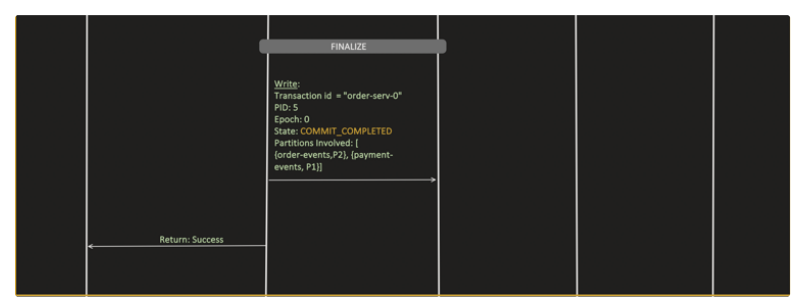

**Steps in Finalize Phase (`COMMIT_COMPLETED`):**

1. **Coordinator Writes `COMMIT_COMPLETED` to `__transaction_state`:**
   - Once the coordinator receives `done` acknowledgments from all participating brokers (Broker-1 and Broker-2 confirming they appended the COMMIT control markers), it updates `__transaction_state` (Partition 23):
     - `Transaction id`: `"order-serv-0"`
     - `PID`: `5`
     - `Epoch`: `0`
     - `State`: `COMMIT_COMPLETED`
     - `Partitions Involved`: `[{order-events, P2}, {payment-events, P1}]`
   - This officially closes the transaction in the coordinator's log.

2. **Return `Success` to Producer:**
   - The Transaction Coordinator sends a `Success` response back to the Producer.
   - The producer's blocking `commitTransaction()` call finishes successfully.
   - The state transitions back to `EMPTY`, and the producer is now ready to begin the next transaction.

**2nd: ONGOING to PREPARE_ABORT phase**

Same as COMMIT, no difference, only thing is instead of:

First, PREPARE_ABORT is made and when all partitions involved in transactions successfully writes ABORT control record, then COMPLETED_ABORT state is updated.

And when another new transaction started: the whole process repeats from Step4.

---

Remember Transaction in Producer is single Threaded.

One Transaction is going on another cannot start in between so all are serialized

## Implementation

**application.properties**

```properties
spring.kafka.producer.transaction-id-prefix=order-serv-
#60sec timeout for transaction
spring.kafka.producer.properties.transaction.timeout.ms=60000
```

**Just a Controller method:**

```java
@PostMapping("/txn-commit")
public ResponseEntity<String> txnCommit(@RequestBody Order order) {

    Payment payment = new Payment("PAY-" + order.getOrderId(),
        order.getCustomerId(), order.getTotalAmount(), "PAID");
    String result = orderProducerService.sendTransactionalCommit(order, payment);
    return ResponseEntity.ok(result);
}
```

**OrderProducerService.java**

now not using send ,we using exceuteInTransaction()

```java
@Autowired
KafkaTemplate<String, Object> kafkaTemplate;

public String sendTransactionalCommit(Order order, Payment payment) {

    return kafkaTemplate.executeInTransaction(ops -> {

        // Send 1: order-events
        /*
         This join() is important too, because we know that send() is async.
         */
        SendResult<String, Object> orderResult =
            ops.send("order-events", order.getOrderId(), order).join();

        // Send 2: payment-events (same transaction)
        SendResult<String, Object> paymentResult =
            ops.send("payment-events", payment.getPaymentId(), payment).join();

        return "COMMITTED";
    });
}
```

`kafkaTemplate.executeInTransaction(...)`

All `send()` which need to be atomic, must happen within the same transaction i.e "executeInTransaction".

**In "executeInTransaction" - just a sample of the Java method:**

```java
public <T> T executeInTransaction(OperationsCallback<K, V, T> callback) {

    producer = producerFactory.createProducer(this.transactionIdPrefix);

    producer.beginTransaction();

    try {
        T result = callback.doInOperations(this);//your function will execute here

        producer.commitTransaction();
        return result;
    }
    catch (Exception ex) {
        producer.abortTransaction();
        throw ex;
    }
}
```
Functional Interface so we use Lambda.


**Recall from Producer setup topic** - what `send()` does internally, and where the application thread's work ends:


Application Thread works till step 3 and after that Sender thread works

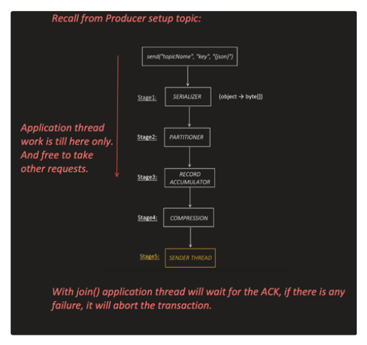

But With `join()`, the application thread will wait for the ACK; if there is any failure, it will abort the transaction.

We wait for send() to complete,if any issue abort

---

## Verifying in logs

**order-events logs:**

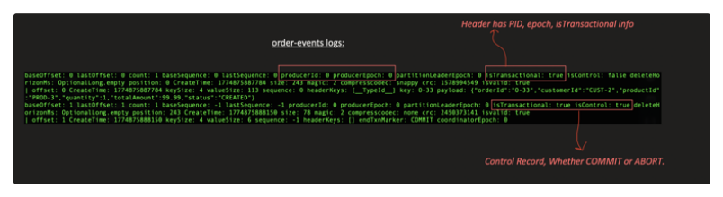

The header has PID, epoch, isTransactional info. The second entry (`isControl: true`, `endTxnMarker: COMMIT`) is the **Control Record**, indicating whether the transaction was COMMIT or ABORT.

**payment-events logs:**

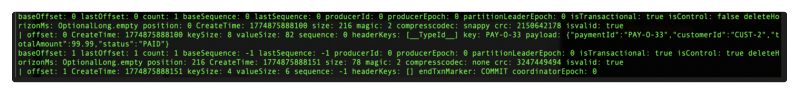


