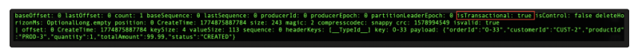
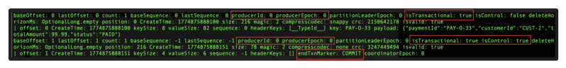
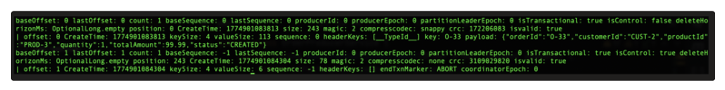
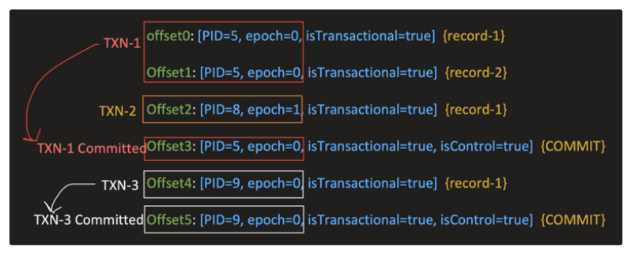
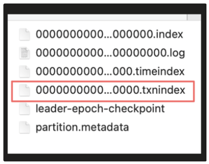
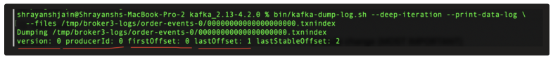
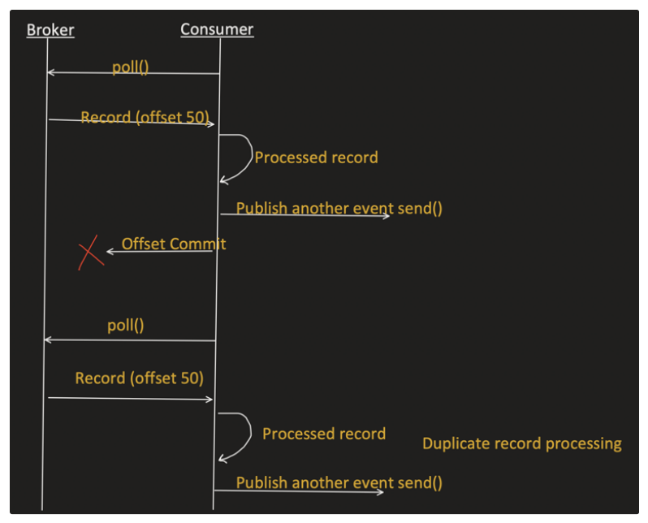

Broker has the records, and below are the 3 possible use cases:

### 1. Transaction status: ONGOING



There is no Control Record for it yet, so means its still in ONGOING state.

### 2. Transaction status: COMMIT



### 3. Transaction status: ABORT



## Concept of LSO (Last Stable Offset)

LSO -> offset of the first message that belongs to an OPEN (ongoing) Transaction.

A "read_committed" consumer CAN NOT read past the LSO. Even if there are committed or non transaction records.

**Example:**

Topic: Order-events
Partition: P2

Logs:



LSO=2 (first record in an open transaction). Maintained by broker and keep it in-memory.

## Consumer

In Consumer, there are 2 parts:

1. `read_uncommitted` (default)
2. `read_committed`

```properties
spring.kafka.consumer.properties.isolation.level=read_committed / read_uncommitted (default)
```

### Now in read_uncommitted (default)

Reads everything expect *control records (isControl=true)*:

- Ongoing transactional records
- Committed transactional records
- Aborted transactional records
- Non-transaction records

**For above example, consumer will read:**

- Offset0 - part of committed txn-1
- Offset1 - part of committed txn-1
- Offset2 - Open (ongoing) txn-2
- Offset4 - part of committed txn-3

**Skips:**

- Offset3 - Control record for Txn-1
- Offset5 - Control record for Txn-3

### Now in read_committed

**Reads:**

- Committed transactional records
- Non-transactional records
- Skips Aborted transactional records
- Stops at LSO
- Skips control records (isControl = true) (Broker itself do not return it)

**For above example, consumer will read:**

- Offset0 - part of committed txn
- Offset1 - part of committed txn

LSO = 2, so consumer can not read it, as it denotes this Txn is still open.

Notice: even though Txn-3 is committed but consumer can not read it, because of LSO. This ensures that consumer never sees partially completed transactions, preserving both ordering and atomicity guarantees.

## How Consumer with "read_committed" skips ABORTED records?

This is interesting: Aborted records are not filtered at Broker layer. Its filtered at Consumer layer.

But question is: how does consumer know which offsets need to be skipped?

```
offset0: [PID=5, epoch=0, isTransactional=true]  {record-1}
Offset1: [PID=5, epoch=0, isTransactional=true]  {record-2}
Offset2: [PID=8, epoch=1, isTransactional=true]  {record-1}
Offset3: [PID=5, epoch=0, isTransactional=true, isControl=true]  {COMMIT}
Offset4: [PID=9, epoch=0, isTransactional=true]  {record-1}
Offset5: [PID=9, epoch=0, isTransactional=true, isControl=true]  {COMMIT}
Offset6: [PID=8, epoch=1, isTransactional=true, isControl=true]  {ABORT}
Offset7: [PID=8, epoch=1, isTransactional=true]  {record-1} (committed)
Offset8: [PID=8, epoch=1, isTransactional=true, isControl=true]  {COMMIT}
```

Here for a "read_committed" consumer, broker will return:

- offset0: [PID=5, epoch=0] {record-1} (committed)
- Offset1: [PID=5, epoch=0] {record-2} (committed)
- Offset2: [PID=8, epoch=1] {record-1} (Aborted)
- Offset4: [PID=9, epoch=0] {record-1} (committed)
- Offset7: [PID=8, epoch=1] {record-1} (committed)

**Skips Control records:** Offset3, Offset5, Offset6, Offset8.

Now how does consumer filter out this Aborted record? Also notice: there are 2 records with the **same PID and epoch** - Offset2 and Offset7 are both `[PID=8, epoch=1]`, yet only Offset2 should be skipped, not Offset7.

The answer is provided by the Broker itself: for every transaction that is ABORTED, the broker maintains a separate index file:

**`00000000000000000000.txnindex`**

```json
[
  {
    PID: 8,
    Epoch: 1,
    First offset Index: 2,
    Control record offset (last offset): 6
  }
]
```

So, Consumer uses this file to know what all records are aborted and skips them:

![Matching logic: offset0, offset1 accepted (PID/epoch don't match); offset2 skipped (PID=8, epoch=1, and offset 2 is within range [2-6]); offset4 accepted; offset7 accepted (same PID=8, epoch=1, but offset 7 is not in range [2-6])](images/05-aborted-record-skip-logic.png)

The `.txnindex` file sits alongside the other segment files on the broker's disk:



Dumping this file with `kafka-dump-log.sh` shows the aborted transaction's PID, first offset, last offset, and the last stable offset:



So this one problem we discussed exists at Consumer side.

## Duplicate Processing (Read-Process-Write) - Consumer side problem



This is core **EOS (Exactly Once Semantics)** problem:

```
read -> process -> write -> commit offset
```

The above problem happens because: Write and Commit Offset is a separate step. So if any crash happens, could result in duplicate writes.

That's where the name comes: EOS (Exactly once), no duplicates.

So in this use-case:

Read -> Process -> Write -> Commit offset

**EOS achieved = read_committed Consumer + Idempotency + Transaction**

In simple term, with the help of EOS, write and commit offset step is made atomic.

Read -> Process -> Write -> Commit offset

Any failure, write and commit offset will not happen.

## Implementation

**application.properties**

```properties
.
. (other consumer properties)
.

spring.kafka.consumer.properties.isolation.level=read_committed
spring.kafka.consumer.enable-auto-commit=false


spring.kafka.producer.transaction-id-prefix=order-serv-
spring.kafka.producer.acks=all
spring.kafka.producer.enable-idempotence=true
```

```java
@Component
public class OrderEventListener {

    @Autowired
    private KafkaTemplate<String, Object> kafkaTemplate;

    @KafkaListener(topics = "order-events")
    public void process(ConsumerRecord<String, Object> record) {

        kafkaTemplate.executeInTransaction(ops -> {

            // 1. READ happened and a record is received in this method
            String key = record.key();
            Object value = record.value();

            // 2. PROCESS, any business logic here if you want

            // 3. WRITE (to another topic)
            ops.send("payment-events", key, result);

            // 4. SEND OFFSET TO TRANSACTION, we are just buffering
            // the offsets which need to be Committed when this txn is committed.
            Map<TopicPartition, OffsetAndMetadata> offsets = new HashMap<>();
            offsets.put(
                new TopicPartition(record.topic(), record.partition()),
                new OffsetAndMetadata(record.offset() + 1)
            );

            ops.sendOffsetsToTransaction(offsets, "order-group");

            return null;
        });
    }
}
```

---
*Concept & Coding - By Shrayansh*
