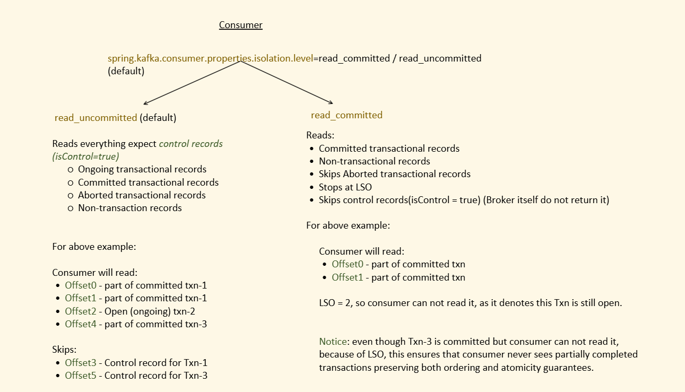
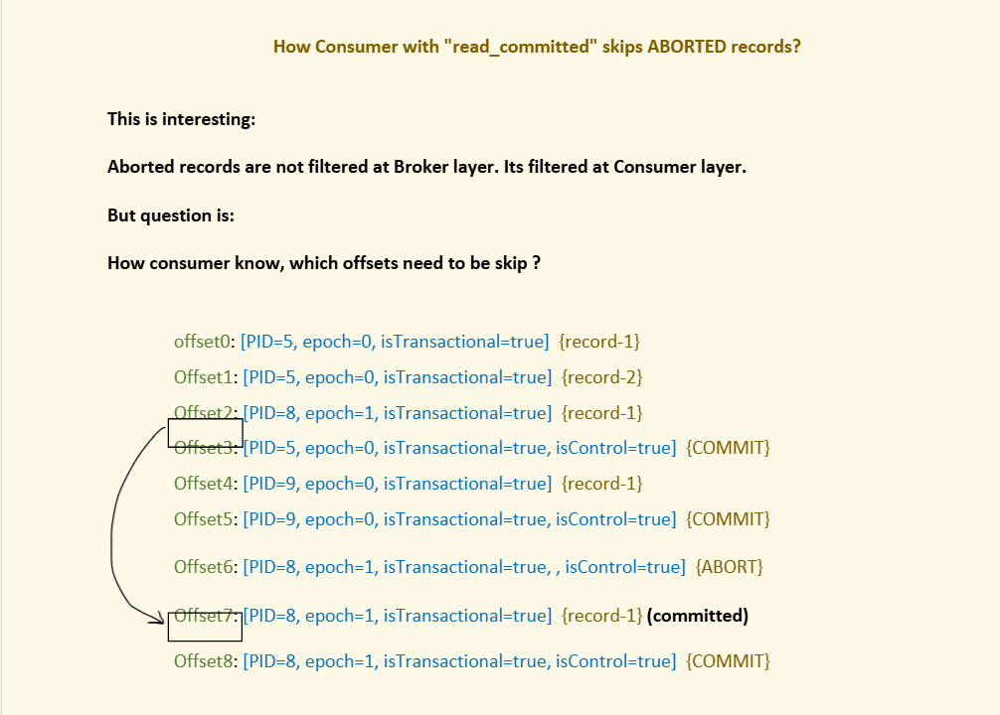
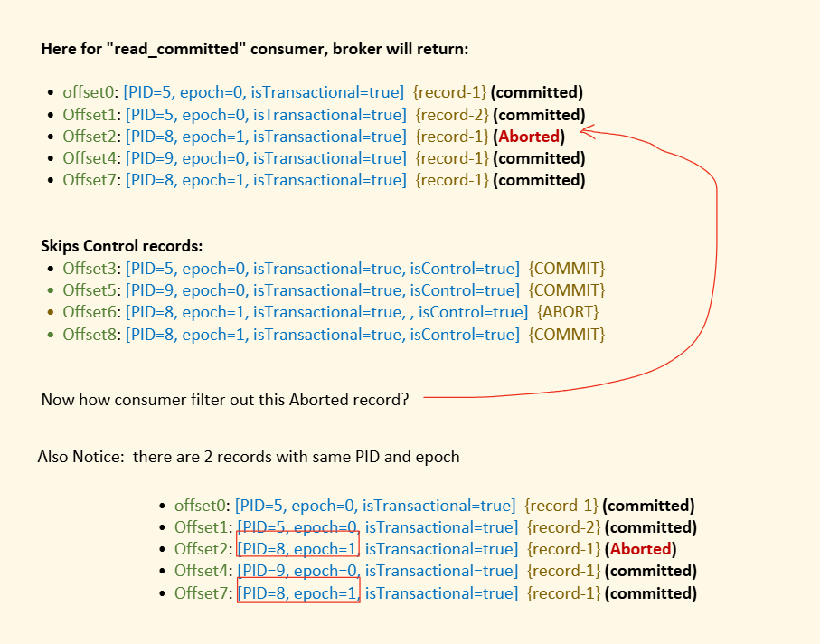
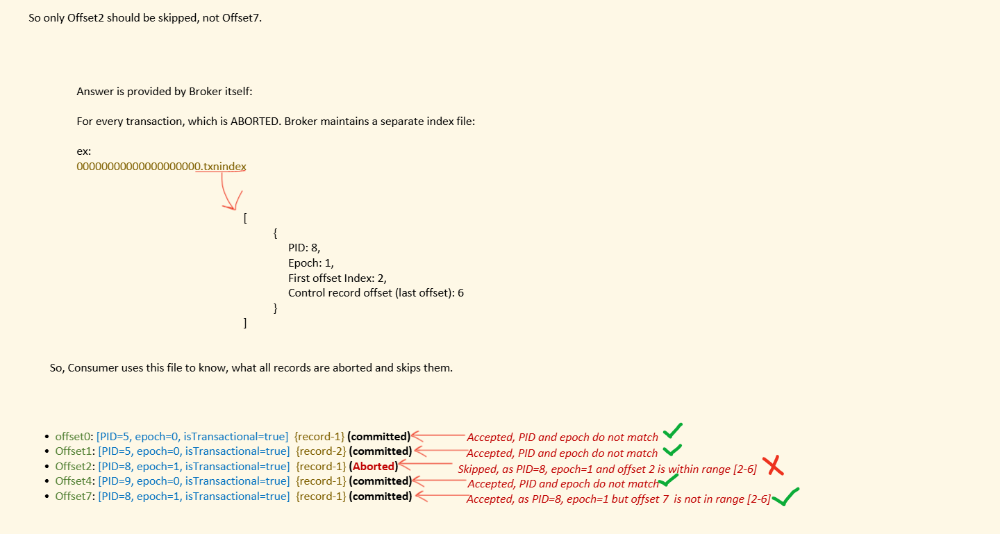

Broker has the records, and below are the 3 possible states of a record:

### 1. Transaction status: ONGOING


There is no Control Record for it yet, so means its still in ONGOING state.

### 2. Transaction status: COMMIT


here we have control record which says commit

### 3. Transaction status: ABORT


here we have control record which says abort

Transaction in a producer is single threaded ,if one transaction is opened by producer you cannot open another transaction.Soa fter comimit and abort we can have another control record .


How consumer know what to do with OPEN,COMMIT and ABORT transaction.

## Concept of LSO (Last Stable Offset)

LSO -> offset of the first message that belongs to an OPEN (ongoing) Transaction.


LSO=2 (first record in an open transaction). Maintained by broker and keep it in-memory.


## Consumer

consumer reads in order.


Broker never returns control records . It is filtered out at broker level so consumer never sees it.

In Consumer, there are 2 parts:

1. `read_uncommitted` (default)
2. `read_committed`

```properties
spring.kafka.consumer.properties.isolation.level=read_committed / read_uncommitted (default)

```



A "read_committed" consumer CAN NOT read past the LSO. Even if there are committed or non transaction records.

---

### In read_uncommitted (default)

Reads everything expect *control records (isControl=true)*:

- Ongoing transactional records
- Committed transactional records
- Aborted transactional records
- Non-transaction records

**For above example, consumer will read:**

- Offset0 - part of committed txn-1
- Offset1 - part of committed txn-1
- Offset2 - Open (ongoing) txn-2
- Offset4 - part of committed txn-3

**Skips:**

- Offset3 - Control record for Txn-1
- Offset5 - Control record for Txn-3

These two are skipped as control records


---

### Now in read_committed

**Reads:**

- Committed transactional records
- Non-transactional records
- Skips Aborted transactional records
- Stops at LSO
- Skips control records (isControl = true) (Broker itself do not return it)

**For above example, consumer will read:**

- Offset0 - part of committed txn
- Offset1 - part of committed txn

LSO = 2, so consumer can not read it, as it denotes this Txn is still open.

>Notice: even though Txn-3 is committed but consumer can not read it, because of LSO. This ensures that consumer never sees partially completed transactions, preserving both ordering and atomicity guarantees.


## Why not read after LSO in 'read-committed"?

Because if we read after LSO then we will be reading out of order as there is chnace that after some time offset at LSO might also get committed and we will read it later but `Kafka guarantees order within partition` so no read after LSO.


## How Consumer with "read_committed" skips ABORTED records?

We skip ongoing by LSO but how to skip aborted recprds?



### Understanding the Diagram (Interleaved Transactions & Control Records)

In the diagram above, multiple transactional producers (`PID=5`, `PID=8`, `PID=9`) are sending messages to the same partition.

Here is the step-by-step breakdown of what the partition log contains:

| Offset | Producer ID & Epoch | Record Type | Description |
|---|---|---|---|
| **Offset 0** | PID=5, epoch=0 | Data `{record-1}` | Message 1 of Producer 5's transaction |
| **Offset 1** | PID=5, epoch=0 | Data `{record-2}` | Message 2 of Producer 5's transaction |
| **Offset 2** | PID=8, epoch=1 | Data `{record-1}` | Message 1 of Producer 8's 1st transaction |
| **Offset 3** | PID=5, epoch=0 | **Control `{COMMIT}`** | Producer 5 commits its transaction (covers Offsets 0 & 1) |
| **Offset 4** | PID=9, epoch=0 | Data `{record-1}` | Message 1 of Producer 9's transaction |
| **Offset 5** | PID=9, epoch=0 | **Control `{COMMIT}`** | Producer 9 commits its transaction (covers Offset 4) |
| **Offset 6** | PID=8, epoch=1 | **Control `{ABORT}`** | Producer 8 aborts its 1st transaction (aborts Offset 2) |
| **Offset 7** | PID=8, epoch=1 | Data `{record-1}` | Message 1 of Producer 8's **2nd transaction** |
| **Offset 8** | PID=8, epoch=1 | **Control `{COMMIT}`** | Producer 8 commits its 2nd transaction (commits Offset 7) |

---

### Important Questions & Clarifications:

#### 1. Why do Offset 0 and Offset 1 have the same PID? Shouldn't there be a control record (commit/abort) between them?
> **Because a single transaction can contain multiple records!**
>
> A transaction is **NOT** limited to 1 message = 1 transaction. In Kafka, you typically bundle multiple messages into one atomic transaction:
>
> ```java
> producer.beginTransaction();
> producer.send(new ProducerRecord<>("topic", "record-1")); // -> Lands at Offset 0 (PID=5, epoch=0)
> producer.send(new ProducerRecord<>("topic", "record-2")); // -> Lands at Offset 1 (PID=5, epoch=0)
> producer.commitTransaction();                             // -> Writes Control Record at Offset 3 {COMMIT}
> ```
>
> - Between Offset 0 and Offset 1, the transaction is **still ongoing**.
> - Kafka only appends a **Control Record** (`COMMIT` or `ABORT`) when `commitTransaction()` or `abortTransaction()` is called by the application at the end of the transaction block.
> - That is why there is **no control record between Offset 0 and Offset 1** — both records belong to the exact same transaction session of Producer PID=5, which completes at Offset 3.

#### 2. If a Producer is single-threaded, why are records from different PIDs interleaved?
> Even though an individual producer client is single-threaded (it can only run one open transaction at a time), **multiple independent producers** can publish to the same topic-partition concurrently!
>
> In this scenario:
> - **Producer A** (`PID=5`) starts a transaction and sends records at Offset 0 and Offset 1.
> - While Producer A is still running its transaction, **Producer B** (`PID=8`) sends a record at Offset 2.
> - Then Producer A finishes and commits at Offset 3.
> - Meanwhile, **Producer C** (`PID=9`) sends a record at Offset 4 and commits at Offset 5.
>
> Kafka appends records to the partition log in the exact order they arrive at the broker, causing records from different producers to interleave.

#### 3. Does a Producer get a new PID for every transaction? Why do Offset 2 and Offset 7 have the same PID (`PID=8, epoch=1`)?
> **No, PID is the identity of the Producer instance, NOT the transaction!**
>
> - When a transactional producer starts up, it calls `producer.initTransactions()`. The Transaction Coordinator assigns it a `PID` (Producer ID) and an `epoch` tied to its `transactional.id`.
> - The producer keeps and reuses this same `PID` across subsequent transactions as long as the producer instance lives.
> - Look at the arrow in the diagram between **Offset 2** and **Offset 7**:
>   1. Producer 8 sends Offset 2, then aborts at Offset 6 (**Transaction 1 ended as ABORTED**).
>   2. Producer 8 begins another transaction (`beginTransaction()`), sends Offset 7, and commits at Offset 8 (**Transaction 2 ended as COMMITTED**).
>   3. Both transactions were produced by the **same producer**, so both have `PID=8, epoch=1`!

#### 4. The Core Dilemma shown in the Image:
> Notice the puzzle this creates for a consumer:
> - **Offset 2** has `PID=8, epoch=1` and was **ABORTED**.
> - **Offset 7** has `PID=8, epoch=1` and was **COMMITTED**.
>
> If a consumer in `read_committed` mode only checked the `PID` and `epoch` of incoming records, **it wouldn't be able to tell which records from PID=8 were aborted and which were committed**, because both transactions share the exact same `PID` and `epoch`!
>
> This brings up the question: *How does the consumer know which specific offsets to skip?*.



To consumer know about aborted transaction ,broker gives a file of aborted recprds to consumer.



see producer is single threded so once a transaction is started you cannot open another transaction ,so there cannot be more then one control record for a transaction.

So after a PID and epoch you see another Same PID and epoch that means a new transaction has been started.


![Matching logic: offset0, offset1 accepted (PID/epoch don't match); offset2 skipped (PID=8, epoch=1, and offset 2 is within range [2-6]); offset4 accepted; offset7 accepted (same PID=8, epoch=1, but offset 7 is not in range [2-6])](images/05-aborted-record-skip-logic.png)

The `.txnindex` file sits alongside the other segment files on the broker's disk:


Dumping this file with `kafka-dump-log.sh` shows the aborted transaction's PID, first offset, last offset, and the last stable offset:


So this one problem we discussed exists at Consumer side.


>`LSO and txnIndex are very important`


## Duplicate Processing (Read-Process-Write) - Consumer side problem


Here we might publish same event again.So we need to solve it.

Suppose processing means send an email so on effset 50 we sent email and offset not committed and then again we got offset 50 and then again we send email .If this is internal to kafka then it can be solved like on processing send another event but sending mail cant be solved as mail is external system.


This is core **EOS (Exactly Once Semantics)** problem:

```
read -> process -> write -> commit offset
```

The above problem happens because: Write and Commit Offset is a separate step. So if any crash happens, could result in duplicate writes.

That's where the name comes: EOS (Exactly once), no duplicates in consumer.

So in this use-case:

Read -> Process -> Write -> Commit offset

**EOS achieved = read_committed Consumer + Idempotency + Transaction**

>See here consumer is publishing event too so here we saying idempotency and transaction to be enbled at consumer level as it is acting as producer for publishing event


In simple term, with the help of EOS, publish another event and commit offset step is made atomic.Both in an transaction

Read -> Process -> Write -> Commit offset

Any failure, write and commit offset will not happen.

## Implementation

**application.properties**

```properties
.
. (other consumer properties)
.

spring.kafka.consumer.properties.isolation.level=read_committed
spring.kafka.consumer.enable-auto-commit=false


spring.kafka.producer.transaction-id-prefix=order-serv-


# these two are already set for transactions so no need to set explicitly
spring.kafka.producer.acks=all
spring.kafka.producer.enable-idempotence=true
```

```java
@Component
public class OrderEventListener {

    @Autowired
    private KafkaTemplate<String, Object> kafkaTemplate;

    @KafkaListener(topics = "order-events")
    public void process(ConsumerRecord<String, Object> record) {

        //executing in transaction
        kafkaTemplate.executeInTransaction(ops -> {

            // 1. READ happened and a record is received in this method
            String key = record.key();
            Object value = record.value();

            // 2. PROCESS, any business logic here if you want

            // 3. WRITE (to another topic)
            ops.send("payment-events", key, result);

            // 4. SEND OFFSET TO TRANSACTION, we are just buffering
            // the offsets which need to be Committed when this txn is committed.
            //not committing yet we putting that offset=offset+1 in buffer
            Map<TopicPartition, OffsetAndMetadata> offsets = new HashMap<>();
            offsets.put(
                new TopicPartition(record.topic(), record.partition()),
                new OffsetAndMetadata(record.offset() + 1)
            );

            ops.sendOffsetsToTransaction(offsets, "order-group");

            return null;
        });
    }
}
```
offset will be updated only on commit and not on aborted
