# 17: Schema Registry

## PROBLEM

Till now, Producer and Consumer talk over JSON with a hand-shared `Order.java` class:

```
Order.java - Version1
String orderId;
String customerId;
int quantity;
double totalAmount;
```

```
Producer -> Json Serializer -> bytes -> Kafka -> bytes -> Json Deserializer -> Consumer
```

This works fine... until the Producer or Consumer changes its version of `Order.java` independently. Below are 5 production use-cases that break this setup.

### Usecase1: Addition of new field

- Producer upgraded to newer version of `Order.java` and added a new field `shippingAddress`.
- Consumer is still on older version of `Order.java`, has no knowledge of `shippingAddress`.

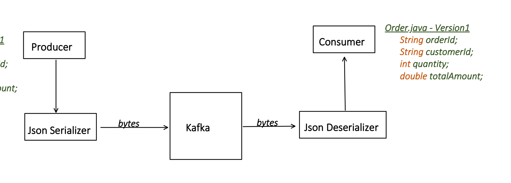

Jackson might ignore this unknown `shippingAddress` field.

If Strict mode is enabled, it will not ignore but throw a runtime exception:

```java
ObjectMapper mapper = new ObjectMapper();
mapper.configure(DeserializationFeature.FAIL_ON_UNKNOWN_PROPERTIES, true);
```

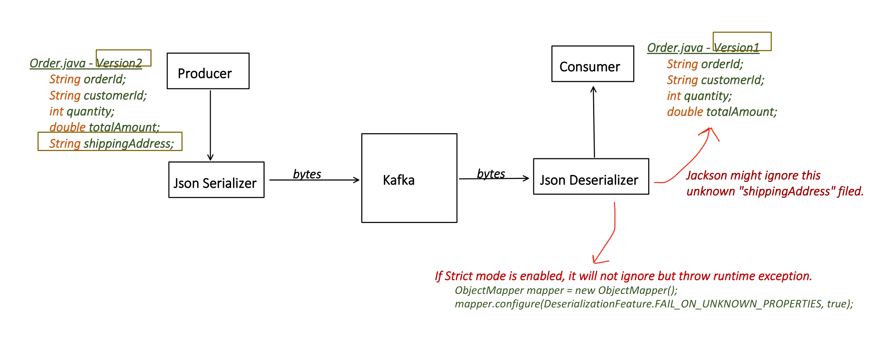

### Usecase2: Removal of existing fields

- Producer upgraded to newer version of `Order.java` and removed an old field `totalAmount`.
- Consumer is still on older version of `Order.java` and expects the field `totalAmount`.

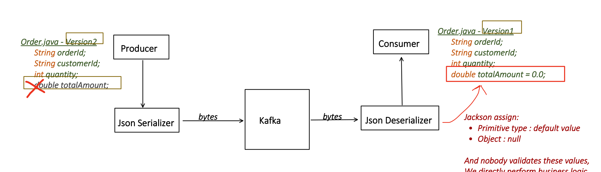

Jackson assigns:
- Primitive type -> default value
- Object -> null

And nobody validates these values — we directly perform business logic on these.

Say for `int`, default value = 0. Our business logic will run on this assuming it's a valid value, but in reality this field's data is missing and should be caught in validation.

**This is too risky.**

### Usecase3: Rename a field

- Producer upgraded to newer version of `Order.java` and renames an old field from `totalAmount` to `amount`.
- Consumer is still on older version of `Order.java` and expects the field `totalAmount`.

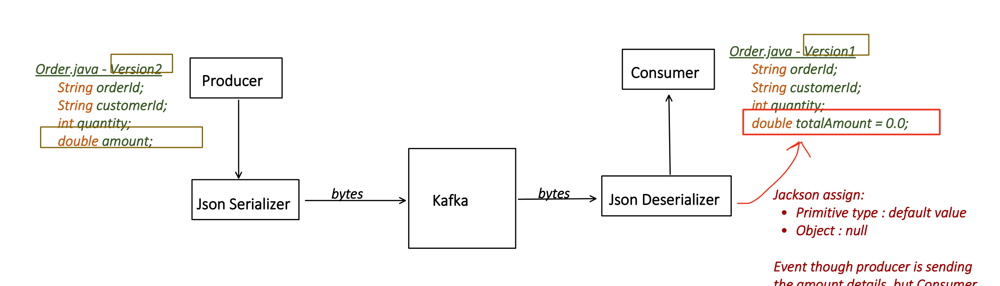

Even though the producer is sending the amount details, the Consumer is still looking for the old field name — it's a **silent loss of data**.

### Usecase4: Change of field type

- Producer upgraded to newer version of `Order.java` and changes `quantity` type from `int` to `String`.
- Consumer is still on older version of `Order.java` and expects `quantity` as `int`.

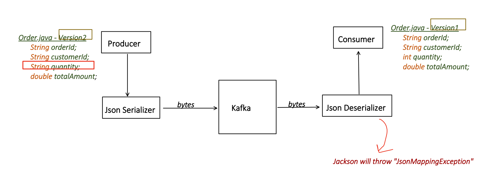

Jackson will throw `JsonMappingException`.

### Usecase5: Multiple Consumers, different expectations

```
Consumer1 wants: all fields
Consumer2 wants: only orderId and totalAmount
Consumer3 wants: only orderId and shippingAddress
```

In such a scenario, this can create chaos when there is no Contract between producer and consumer on the Event schema.

Because the producer will keep changing/updating event fields based on every consumer's needs, without knowing whether that change breaks some other consumer.

As JSON is schema-less, a producer can send any JSON — without any version, validation, or compatibility checks.

---

## SOLUTION: Schema Registry

**Schema**: a formal definition of the structure of your data.

- Avro (most popular with Kafka)
- Protobuf
- JSON Schema

*Added by Claude — not in original notes: a quick comparison of the three, since the notes list them but don't say why Avro tends to be picked for Kafka:*

```
Avro:
  - Binary format, compact on the wire (no field names repeated per message)
  - Schema travels separately (via Schema Registry), not embedded per record
  - Native support for schema evolution rules (this is what this whole topic covers)
  - Most tightly integrated with the Kafka ecosystem / Confluent tooling
  - Slight downside: not human-readable on the wire, needs the registry to decode

Protobuf:
  - Also binary + compact, widely used outside Kafka too (gRPC etc.)
  - Slightly more verbose schema evolution rules than Avro
  - Good choice if your org already standardized on Protobuf for gRPC services

JSON Schema:
  - Human-readable JSON on the wire (bigger payload than Avro/Protobuf)
  - Easiest to debug by eye, easiest to adopt incrementally from plain JSON
  - Weakest compaction / throughput of the three

Why Avro is "most popular with Kafka" specifically: Kafka + Confluent Schema
Registry were designed together with Avro as the first-class citizen, so the
serializer/deserializer, compatibility-check APIs, and tooling are most mature
for Avro. Protobuf and JSON Schema support were added to Schema Registry later
and work almost the same way, just with a different serializer/deserializer.
```

**Schema Registry:**
- Maintains Schema, and its version.
- Any change in Schema performs a compatibility check, etc.

Very high level: Schema Registry brings validation *before* the Producer sends (publishes) an event.

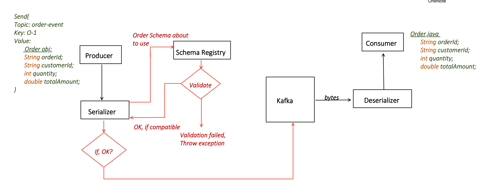

---

## BUT HOW? Let's go deeper

### Step1: Download Schema Registry and run

There are many providers:
- Confluent Schema Registry (most popular)
- AWS Glue Schema Registry
- Azure Schema Registry
- etc.

Proceeding with: **Confluent Schema Registry** (most popular)

Download any latest version:

```bash
curl -O https://packages.confluent.io/archive/8.2/confluent-community-8.2.0.tar.gz
```

Open: `confluent-8.2.0/etc/schema-registry/schema-registry.properties`

### Step2: Producer creates the Contract (Schema)

`order.avsc` — in `.avsc`, we define the schema. It's a **CONTRACT** between producer and consumer.

Update `schema-registry.properties`:

```properties
# schema registry port number
listeners=http://0.0.0.0:8085

# bootstrap servers to connect with Kafka brokers
kafkastore.bootstrap.servers=PLAINTEXT://localhost:9092, PLAINTEXT://localhost:9192

kafkastore.topic=_schemas
```

That's after starting the Controllers and Brokers — then start the Schema Registry:

```bash
/confluent-8.2.0/bin/schema-registry-start /confluent-8.2.0/etc/schema-registry/schema-registry.properties
```

Validate if Schema Registry is up and running (should return `[]`):

```bash
curl http://localhost:8085/subjects
```

**order.avsc:**

```json
{
  "type": "record",
  "name": "Order",
  "namespace": "com.eda.schema",
  "fields": [
    { "name": "orderId", "type": "string" },
    { "name": "customerId", "type": "string" },
    { "name": "productId", "type": "string" },
    { "name": "quantity", "type": "int" },
    { "name": "totalAmount", "type": "double" }
  ]
}
```

Consider `"record"` as an Object. This `.avsc` will be used to generate a Java class named `Order`:

```java
public class Order extends SpecificRecordBase {

    String orderId;
    String customerId;
    int quantity;
    double totalAmount;

    Schema getSchema() { . . . }
}
```

And it's not a normal POJO — it has additional functionality like `getSchema()`, which is used by the Serializer.

Dependencies needed:

```xml
<dependency>
    <groupId>io.confluent</groupId>
    <artifactId>kafka-avro-serializer</artifactId>
    <version>${confluent.version}</version>
</dependency>

<dependency>
    <groupId>org.apache.avro</groupId>
    <artifactId>avro</artifactId>
    <version>${avro.version}</version>
</dependency>
```

Maven plugin (generates Java code from `.avsc` at compile time):

```xml
<plugin>
    <groupId>org.apache.avro</groupId>
    <artifactId>avro-maven-plugin</artifactId>
    <version>${avro.version}</version>
    <executions>
        <execution>
            <phase>generate-sources</phase>
            <goals>
                <goal>schema</goal>
            </goals>
            <configuration>
                <sourceDirectory>${project.basedir}/src/main/avro</sourceDirectory>
                <outputDirectory>${project.build.directory}/generated-sources/avro</outputDirectory>
            </configuration>
        </execution>
    </executions>
</plugin>
```

- Parses schema `.avsc`
- Calls Schema Registry via REST
- Generates Java code from `.avsc` — reads from source directory, generates Java code in output directory during compile

### Step3: Producer makes first send() to Kafka

`mvn clean compile` — this generates the Java `Order` class from `.avsc`.

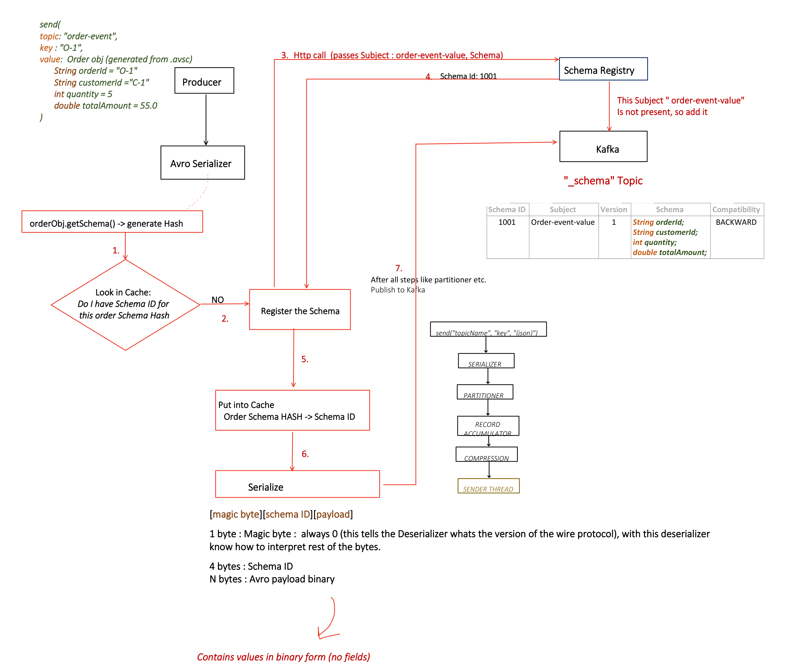

```
1. orderObj.getSchema() -> generate Hash
2. Look in Cache: Do I have Schema ID for this order Schema Hash? -> NO
3. Http call (passes Subject: order-event-value, Schema) -> Schema Registry
   - This Subject "order-event-value" is not present, so add it
4. Schema Registry responds: Schema Id: 1001
5. Put into Cache: Order Schema HASH -> Schema ID
6. Serialize
7. After all steps like partitioner etc. -> Publish to Kafka
```

`"_schema"` Topic (internal), one row per registered schema version:

| Schema ID | Subject | Version | Schema | Compatibility |
|---|---|---|---|---|
| 1001 | Order-event-value | 1 | `String orderId; String customerId; int quantity; double totalAmount;` | BACKWARD |

**Wire format — `[magic byte][schema ID][payload]`:**

```
1 byte : Magic byte — always 0 (tells the Deserializer what version of the
         wire protocol this is; with this, deserializer knows how to
         interpret the rest of the bytes)
4 bytes: Schema ID
N bytes: Avro payload binary — contains VALUES only, no field names

Below is just for representation, internally stored as binary:
[0][1001][O-1 C-1 5 55.0]
```

**Why this works?** Because with the Schema ID, we can look up the schema, and from the schema we know the fields and their order — so the binary payload only needs to carry values, not field names.

*Added by Claude — not in original notes: this is exactly why the wire format is so compact compared to plain JSON — a JSON payload repeats every field name (`"orderId":`, `"customerId":`, ...) on every single message, while Avro sends only 5 bytes of overhead (1 magic byte + 4-byte schema ID) plus raw values, because the field names/order live once in the registry instead of in every record.*

Normal `send()` pipeline for reference:

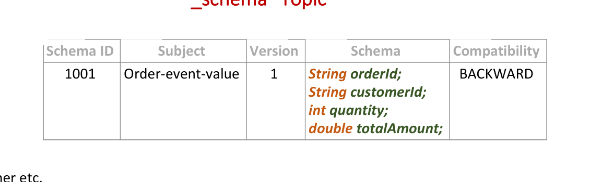

**Producer application.properties:**

```properties
server.port=8083
spring.application.name=schema-registry-producer

spring.kafka.bootstrap-servers=localhost:9092,localhost:9192

spring.kafka.producer.key-serializer=org.apache.kafka.common.serialization.StringSerializer
spring.kafka.producer.value-serializer=io.confluent.kafka.serializers.KafkaAvroSerializer
spring.kafka.producer.properties.schema.registry.url=http://localhost:8085
```

*Added by Claude — not in original notes: the `-value` suffix on the Subject name (`order-event-value`) isn't arbitrary — it comes from Schema Registry's default "TopicNameStrategy" for naming subjects: `<topic-name>-value` for the record value's schema, and `<topic-name>-key` for the record key's schema (if the key is also Avro-encoded). This is why you'll see both `order-events-value` and, in some setups, `order-events-key` as separate subjects for the same topic.*

### Step4: Producer makes second send() call after changing the schema

**order.avsc** (changed `quantity` from `int` to `string`):

```json
{
  "type": "record",
  "name": "Order",
  "fields": [
    { "name": "orderId", "type": "string" },
    { "name": "customerId", "type": "string" },
    { "name": "productId", "type": "string" },
    { "name": "quantity", "type": "string" },
    { "name": "totalAmount", "type": "double" }
  ]
}
```

`mvn clean compile`, then try to publish again — now the Producer sends `quantity` as a string.

**OUTPUT: Throws Exception**

```
io.confluent.kafka.schemaregistry.client.rest.exceptions.RestClientException:
Schema being registered is incompatible with an earlier schema for subject
"order-events-value", details:
[{errorType:'TYPE_MISMATCH', description:'The type (path '/fields/3/type') of
a field in the new schema does not match with the old schema',
additionalInfo:'reader type: STRING not compatible with writer type: INT'},
{oldSchemaVersion: 1}, {oldSchema: '...'},
{validateFields: 'false', compatibility: 'BACKWARD'}]; error code: 40901
```

```
1. orderObj.getSchema() -> generate Hash (type changed -> hash is different now)
2. Look in Cache: NO -> Register the Schema
3. Http call (passes Subject: order-event-value, Schema) -> Schema Registry
4. Subject "order-event-value" present? Yes -> Fetch subject "order-event-value"
5. Do Compatibility Check -> FAILED
6. Throw exception
```

| Schema ID | Subject | Version | Schema | Compatibility |
|---|---|---|---|---|
| 1001 | Order-event-value | 1 | `String orderId; String customerId; int quantity; double totalAmount;` | BACKWARD |
| 1002 | Order-event-value | 2 | *New schema changes* — `String orderId; . . .` | BACKWARD |

One question might come up: what is this Compatibility Check? Covered below, after the complete flow (including the consumer side).

### Step5: Consumer reads the event

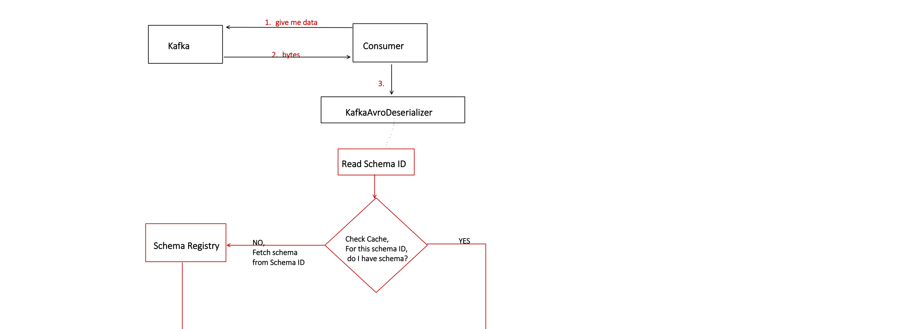

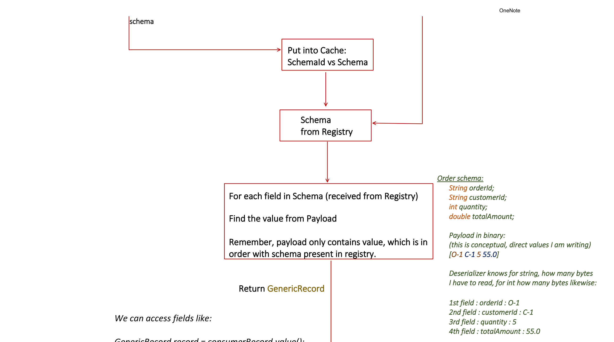

```
1. Consumer: "give me data"
2. Kafka -> bytes -> Consumer
3. Consumer -> KafkaAvroDeserializer
4. Read Schema ID
5. Check Cache: for this schema ID, do I have the schema?
   NO -> Fetch schema from Schema Registry (by Schema ID) -> put into Cache
   YES -> use cached schema
6. For each field in Schema (received from Registry): find the value from Payload
   (payload only contains values, in the same order as the schema)

Order schema:
  String orderId; String customerId; int quantity; double totalAmount;

Payload in binary (conceptual — direct values shown here):
  [O-1 C-1 5 55.0]

Deserializer knows for string how many bytes to read, for int how many bytes
to read, and so on:
  1st field: orderId    : O-1
  2nd field: customerId : C-1
  3rd field: quantity   : 5
  4th field: totalAmount: 55.0

7. Return GenericRecord
```

We can access fields like:

```java
GenericRecord record = consumerRecord.value();
String orderId = record.get("orderId").toString(); // O-1
```

When this config is true:

```properties
spring.kafka.consumer.properties.specific.avro.reader=true
```

...then the Deserializer looks at `name: Order` and `Namespace: com.eda.schema` in the schema coming from the Registry, and tries to find the `Order` class in the same namespace (`com.eda.schema.Order`, auto-generated from `.avsc`):

```
If found -> Return the specific Order object (typed)
Each field of schema coming from registry maps by name:
  "orderId"    from schema registry -> "orderId"    on Consumer's Order class
  "customerId" from schema registry -> "customerId" on Consumer's Order class
  ...
If not found -> falls back to GenericRecord
```

Dependencies (same as Producer):

```xml
<dependency>
    <groupId>io.confluent</groupId>
    <artifactId>kafka-avro-serializer</artifactId>
    <version>${confluent.version}</version>
</dependency>

<dependency>
    <groupId>org.apache.avro</groupId>
    <artifactId>avro</artifactId>
    <version>${avro.version}</version>
</dependency>
<!-- this also brings the deserializer -->
```

**Consumer application.properties:**

```properties
server.port=8084
spring.application.name=schema-registry-consumer

spring.kafka.bootstrap-servers=localhost:9092,localhost:9192
spring.kafka.consumer.group-id=order-avro-consumer-group

spring.kafka.consumer.key-deserializer=org.apache.kafka.common.serialization.StringDeserializer
spring.kafka.consumer.value-deserializer=io.confluent.kafka.serializers.KafkaAvroDeserializer

spring.kafka.consumer.properties.schema.registry.url=http://localhost:8085

# required if we want GenericRecord converted to a specific Java Object,
# else Avro Deserializer returns GenericRecord only
spring.kafka.consumer.properties.specific.avro.reader=true
```

**order.avsc** (same contract):

```json
{
  "type": "record",
  "name": "Order",
  "namespace": "com.eda.schema",
  "fields": [
    { "name": "orderId", "type": "string" },
    { "name": "customerId", "type": "string" },
    { "name": "productId", "type": "string" },
    { "name": "quantity", "type": "int" },
    { "name": "totalAmount", "type": "double" }
  ]
}
```

```java
@Component
public class OrderAvroListener {

    @KafkaListener(topics = "order-events")
    public void consumeOrder(ConsumerRecord<String, Order> record) {
        Order order = record.value();
        System.out.println("orderId:" + order.getOrderId());
    }
}
```

---

## How does Schema Registry do the Compatibility Check?

Now that we know the complete flow, let's come back to the open question: how does Schema Registry decide whether the event schema a Producer is about to publish is compatible or not?

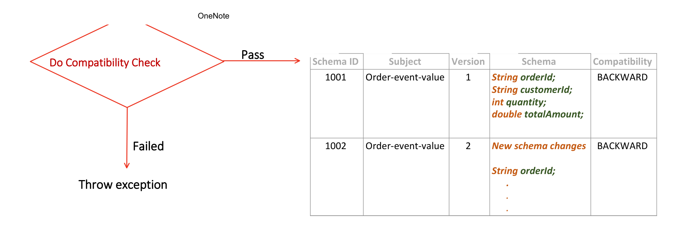

In the `"_schemas"` topic, there's a field called **Compatibility**, which can be:

- BACKWARD
- FORWARD
- FULL
- BACKWARD_TRANSITIVE
- FORWARD_TRANSITIVE
- FULL_TRANSITIVE

### BACKWARD (default)

**Meaning:** Consumer with the newer schema version -> can read Old schema events.

Example:

```
Schema Registry - V1: { "name": "orderId", "type": "int" }

Producer sends event with new schema:
Schema Registry - V2: { "name": "orderId", "type": "int" },
                       { "name": "status", "type": "string", "default": "PENDING" }
```

Schema Registry's reasoning: if a Consumer on V2 pulls a message that was written with V1, there should be no crash.

**Usecase1 — Added new field with default:**

```
V1: { "name": "orderId", "type": "int" }
V2: { "name": "orderId", "type": "int" },
    { "name": "status", "type": "string", "default": "PENDING" }
```

Old Kafka msgs: `{ order_id }` — Consumer with new schema V2 expects `int orderId, String status`.

This is **SAFE** — in the old-schema message `status` will be missing, so the default value is used.

**Usecase2 — Add new field WITHOUT default:**

```
V1: { "name": "orderId", "type": "int" }
V2: { "name": "orderId", "type": "int" },
    { "name": "status", "type": "string" }
```

**Not allowed** — in the old schema, `status` will be missing and there's no default value to fall back to.

**Usecase3 — Remove field:**

```
V1: { "name": "orderId", "type": "int" }, { "name": "status", "type": "string" }
V2: { "name": "orderId", "type": "int" }
```

This is **SAFE** — the old schema's `status` will just be extra data in the old message, which is ignored.

### FORWARD

**Meaning:** Consumer with the Old schema -> can read New schema events.

Example:

```
V1: { "name": "orderId", "type": "int" }
V2: { "name": "orderId", "type": "int" },
    { "name": "status", "type": "string", "default": "PENDING" }
```

Schema Registry's reasoning: if a Consumer on V1 pulls a message written with V2, there should be no crash.

**Usecase1 — Add a new field:**

```
V1: { "name": "orderId", "type": "int" }
V2: { "name": "orderId", "type": "int" }, { "name": "status", "type": "string" }
```

**SAFE** — in the new-schema message, `status` will be extra, which the old-schema consumer can ignore.

**Usecase2 — Remove field WITH default:**

```
V1: { "name": "orderId", "type": "int" }, { "name": "status", "type": "string", "default": "PENDING" }
V2: { "name": "orderId", "type": "int" }
```

**SAFE** — in the new-schema message, `status` will be missing, which the old-schema consumer expects, but since it's not present, the default is used.

**Usecase3 — Remove field WITHOUT default:**

```
V1: { "name": "orderId", "type": "int" }, { "name": "status", "type": "string" }
V2: { "name": "orderId", "type": "int" }
```

**NOT ALLOWED** — in the new-schema message, `status` will be missing, which the old-schema consumer expects, but there's no default value either.

### FULL

**(Backward + Forward)** — run the rules from both the BACKWARD and FORWARD perspective. Both must pass.

### BACKWARD_TRANSITIVE / FORWARD_TRANSITIVE / FULL_TRANSITIVE

Do NOT just compare against the last version — check against **all previous versions**, not only the immediately preceding one.

```
New Kafka msg (V2): { order_id, status }
Consumer with old Schema Version - V1: int orderId
```

*Added by Claude — not in original notes: why the non-transitive vs transitive distinction matters in practice — plain BACKWARD only guarantees V3 is compatible with V2. It does NOT guarantee V3 is compatible with V1. If your consumers can lag several versions behind (common in real deployments where not every service redeploys at the same time), a chain of "safe" single-step changes can still break an old consumer several versions back. BACKWARD_TRANSITIVE closes this gap by checking the new schema against every prior version, not just the last one — the tradeoff is it's stricter and can reject changes that BACKWARD alone would have allowed.*

---

## How to set the Compatibility Level

**GLOBAL** — acts as the fallback when compatibility level is missing for any subject:

```properties
# schema-registry.properties
listeners=http://0.0.0.0:8085
kafkastore.bootstrap.servers=PLAINTEXT://localhost:9092, PLAINTEXT://localhost:9192
kafkastore.topic=_schemas

compatibility.level=FORWARD
```

**Per-subject override**, via REST API:

```
PUT /config/order-events-value
{
  "compatibility": "FULL"
}
```

---

## Added by Claude

*Not covered in the original notes — a couple of operational gaps worth knowing about:*

**Schema Registry as a single point of failure:** the notes walk through Schema Registry as if it's one box, but in production you'd run multiple Schema Registry instances pointed at the same `_schemas` topic (they use Kafka itself for leader election / storage, similar in spirit to how the Controller quorum works). Only one instance is "master" (handles writes/registrations) at a time; the others can still serve reads. If Schema Registry is fully down and a Producer's local cache doesn't already have the schema ID it needs, `send()` will fail/block on that HTTP call — so it's a real availability dependency, not just a nice-to-have validation layer.

**Client-side caching cuts the HTTP round-trip on the hot path:** both the Producer's serializer and the Consumer's deserializer cache `schema hash -> schema ID` and `schema ID -> schema` locally in memory (visible in the "Look in Cache" / "Check Cache" diamonds in the diagrams above). This means the REST call to Schema Registry only happens once per distinct schema version per client instance — not on every single message — which is why Schema Registry being briefly unavailable often doesn't stop already-running producers/consumers from processing messages with schemas they've already cached.
