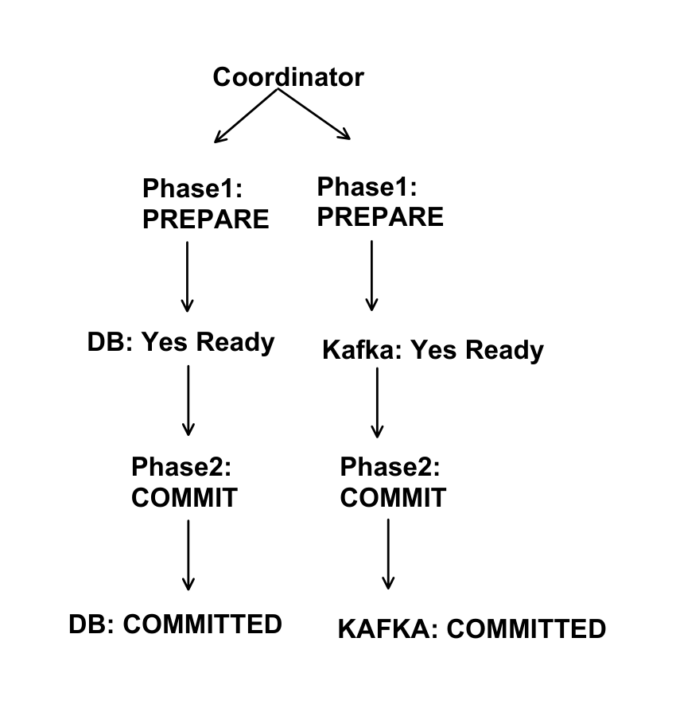
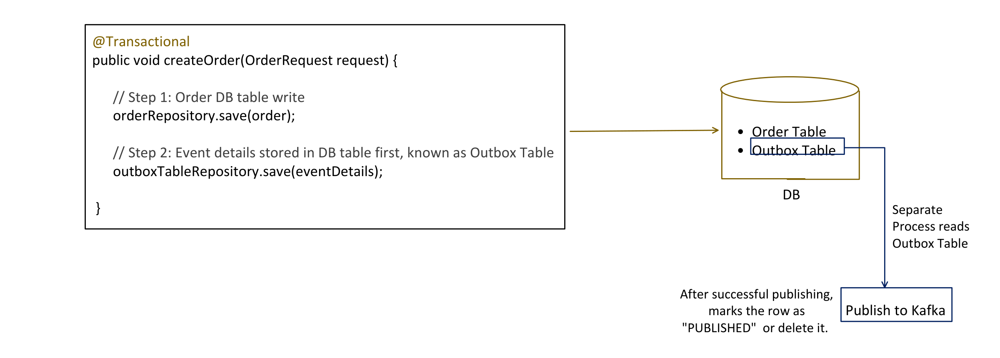
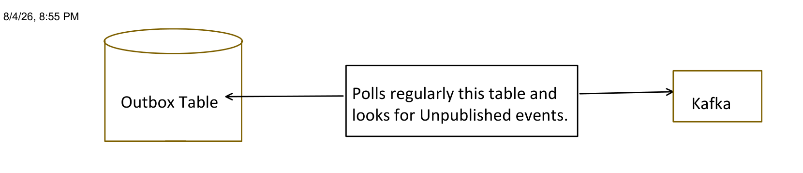
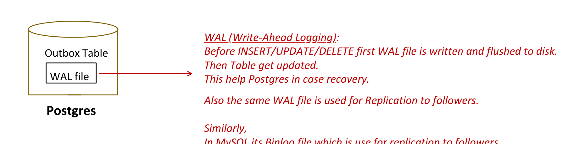
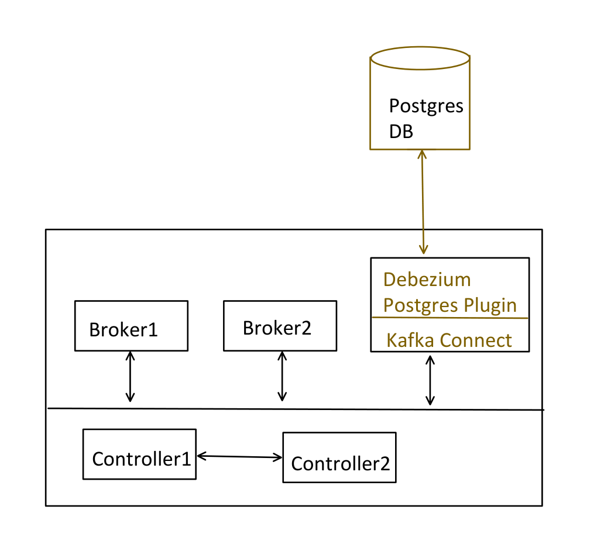
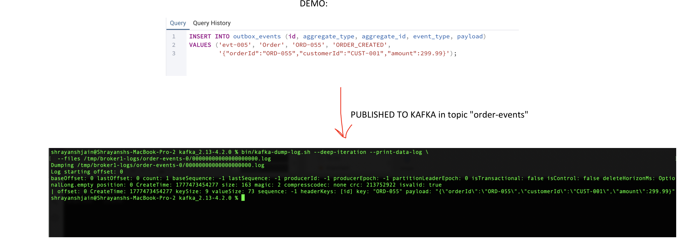

# 18: Outbox Pattern

## Before we go deep — understand the PROBLEM

```java
@PostMapping("/api/orders")
public ResponseEntity<String> createOrder(@RequestBody Order order) {

    // Step1: Save to Database
    orderRepository.save(order);

    // Step2: Publish event to Kafka
    kafkaTemplate.send("order-events", order.getOrderId(), order);

    return ResponseEntity.ok("Order created");
}
```

Above code has one MAJOR FLAW: we are writing to 2 separate independent systems (DB and Kafka), and there is no transaction that spans both.

### Failure Scenario 1: DB succeeds, Kafka fails

```java
orderRepository.save(order);        // Saved to DB
kafkaTemplate.send("order-events"); // Kafka is down
```

Result:
- Order exists in DB, but NO event published.
- Payment service never gets notified.
- Inventory never decremented.

This is **DATA INCONSISTENCY**.

### Failure Scenario 2: Kafka succeeds, DB fails

```java
kafkaTemplate.send("order-events"); // Kafka event published
orderRepository.save(order);        // DB connection lost
```

Result:
- Event published but order doesn't exist in DB.
- Payment service processes a non-existent order.
- Inventory decremented for an order which does not exist in DB.

This is **DATA INCONSISTENCY** and has more impact than Scenario 1.

This problem is known as the **DUAL WRITE problem**.

---

## Solutions generally proposed during interviews (and why they don't work)



### Attempt 1: `@Transactional` + Manual Exception Throw

```java
@Transactional
public void createOrder(OrderRequest request) {

    // Step 1: DB write
    orderRepository.save(order);

    try {
        // Step 2: Kafka send, but in try/catch — if kafka fails, DB is also rolled back
        kafkaTemplate.send("order-events", event).get();
    }
    catch (Exception e) {
        throw new RuntimeException("Kafka failed, rolling back!"); // rolls back DB
    }
}
```

This might look correct at first glance, but the loophole is: **what if the Kafka publish actually succeeded, but we *think* it failed?**

Timeline:

```
10:00  DB write -> success
10:05  kafkaTemplate.send() -> message sent to Kafka broker
10:06  Kafka broker receives message -> WRITES to partition
10:07  Kafka broker sends ACK back to your app
10:08  NETWORK ISSUE -> ACK packet lost in transit
10:09  Our app: "I never got ACK -> must have failed"
10:10  throw RuntimeException -> @Transactional rolls back DB
```

Result:

```
DB:    Order DOES NOT exist   (rolled back)
Kafka: Order event EXISTS
```

Still inconsistent — just flipped.

### Attempt 2: 2PC (Two Phase Commit)

```
Coordinator
  -> Phase1: PREPARE  -> DB:    Yes Ready
  -> Phase1: PREPARE  -> Kafka: Yes Ready
  -> Phase2: COMMIT   -> DB:    COMMITTED
  -> Phase2: COMMIT   -> Kafka: COMMITTED
```

This might look like a solution, but for 2PC to work, **all participants need to understand the protocol** — and **Kafka does not support 2PC**.

So the pros/cons of this solution don't even matter, because Kafka can't participate in 2PC — it doesn't understand PREPARE/COMMIT commands from a coordinator.

---

## Solution: OUTBOX PATTERN

Idea:
- Don't write directly to Kafka.
- Write to DB first, then a **separate process** reads the DB and publishes to Kafka.

```java
@Transactional
public void createOrder(OrderRequest request) {

    // Step 1: Order DB table write
    orderRepository.save(order);

    // Step 2: Event details stored in a DB table first, known as the Outbox Table
    outboxTableRepository.save(eventDetails);
}
```



Both writes (`orders` table + `outbox_events` table) are now just two tables in the **same database** — so they *can* be part of one local DB transaction. No Kafka publish happens inside this transaction at all.

### Outbox Table Schema

- It's just a regular DB table in our application.
- Contains columns required to successfully publish an event.

**Most Common Schema Sample:**

| Id | Aggregate_type | Event_type | Aggregate_id | payload | Created_At | Is_published |
|---|---|---|---|---|---|---|
| 101 | Order | ORDER_CREATED | ORD-1 | {…} | | false |

- **Id**: unique id for this event. Since a producer can publish the same event multiple times, this can be used for idempotency.
- **Aggregate_type**: what entity this event is about, e.g. `"ORDER"` or `"PAYMENT"`. Used to determine which Kafka topic to publish to.
- **Event_type**: tells what happened to the entity — `ORDER_CREATED`, `ORDER_CANCELLED`, etc.
- **Aggregate_id**: used as the Kafka message Key. Since all related events should go to the same partition, this plays a major role in maintaining order.
- **Payload**: the actual data.
- **Created_At**: when the event was created.
- **Is_published** (optional): `false` -> not yet sent to Kafka, `true` -> sent to Kafka (row can be cleaned up later).

**The Outbox Table is consumed in 2 ways:**

1. **Polling** — `Is_published` column is required.
2. **CDC (Change Data Capture)** — `Is_published` column is not required.

---

## Approach 1: Polling



**OrderController.java**

```java
@RestController
@RequestMapping("/api/orders")
public class OrderController {

    @Autowired
    private OrderService orderService;

    @PostMapping
    public String createOrder(@RequestBody Order order) {
        orderService.createOrder(order);
        return "Order created";
    }
}
```

**OrderService.java** *(no Kafka publish here — only DB tables touched, which can be part of 1 transaction)*

```java
@Service
public class OrderService {

    @Autowired
    private OrderRepository orderRepository;

    @Autowired
    private OutboxRepository outboxRepository;

    @Transactional
    public Order createOrder(Order order) {

        // Step 1: save to orders table
        Order savedOrder = orderRepository.save(order);

        // Step 2: Create outbox event IN THE SAME TRANSACTION
        OutboxEvent outboxEvent = new OutboxEvent();
        outboxEvent.setAggregateType("Order");
        outboxEvent.setAggregateId(savedOrder.getOrderId());
        outboxEvent.setEventType("ORDER_CREATED");
        // Payload: JSON string of the event data
        String payload = String.format(
            "{\"orderId\":\"%s\"," +
            "\"quantity\":%d," +
            "\"totalAmount\":%.2f}",
            savedOrder.getOrderId(),
            savedOrder.getQuantity(),
            savedOrder.getTotalAmount()
        );
        outboxEvent.setPayload(payload);
        outboxRepository.save(outboxEvent);
        return savedOrder;
    }
}
```

**OrderRepository.java / OutboxRepository.java**

```java
@Repository
public interface OrderRepository extends JpaRepository<Order, Long> {
}

@Repository
public interface OutboxRepository extends JpaRepository<OutboxEvent, String> {

    @Query(value = """
        SELECT * FROM outbox_events
        WHERE published = false
        ORDER BY created_at ASC
        LIMIT :batchSize
        """, nativeQuery = true)
    List<OutboxEvent> findUnpublishedEvents(int batchSize);
}
```

**Order.java (Entity)**

```java
@Entity
@Table(name = "orders")
public class Order {
    @Id
    @GeneratedValue(strategy = GenerationType.IDENTITY)
    private Long id;

    @Column(name = "order_id")
    private String orderId;

    @Column
    private Integer quantity;

    @Column(name = "total_amount")
    private Double totalAmount;

    // Getters and Setters
}
```

**OutboxEvent.java (Entity)**

```java
@Entity
@Table(name = "outbox_events")
public class OutboxEvent {

    @Id
    @Column
    private String id;

    @Column(name = "aggregate_type", nullable = false)
    private String aggregateType;

    @Column(name = "aggregate_id", nullable = false)
    private String aggregateId;

    @Column(name = "event_type", nullable = false)
    private String eventType;

    @Column(nullable = false, columnDefinition = "TEXT")
    private String payload;

    @Column(nullable = false)
    private boolean published;

    @Column(name = "created_at", nullable = false)
    private Instant createdAt;

    @Column(name = "published_at")
    private Instant publishedAt;

    public OutboxEvent() {
        this.id = UUID.randomUUID().toString();
        this.published = false;
        this.createdAt = Instant.now();
    }

    // --- Getters and Setters ---
}
```

**OutboxPoller.java (the poller)**

```java
@Component
public class OutboxPoller {

    @Autowired
    private OutboxRepository outboxRepository;

    @Autowired
    private KafkaTemplate<String, String> kafkaTemplate;

    @Value("${outbox.polling.batch-size}")
    private int batchSize;

    // This poller job runs every 2 seconds (interval configured in properties file)
    @Scheduled(fixedRateString = "${outbox.polling.interval-ms}")
    @Transactional
    public void pollAndPublish() {

        // Step 1: Fetch unpublished events (fetches 10 records in 1 go, per batchSize)
        List<OutboxEvent> events = outboxRepository.findUnpublishedEvents(batchSize);
        if (events.isEmpty()) {
            return;
        }

        for (OutboxEvent event : events) {
            try {
                String topic = event.getAggregateType().toLowerCase() + "-events";
                kafkaTemplate.send(topic, event.getAggregateId(), event.getPayload())
                    .get();
                event.setPublished(true);
                event.setPublishedAt(Instant.now());
                outboxRepository.save(event);
            }
            catch (Exception e) {
                // BREAK to preserve ordering!
                // If event1 fails, we must NOT skip to event2 — that would break ordering.
                break;
            }
        }
    }
}
```

This scheduler is just one example of a poller — you could also have a completely separate application that keeps polling the outbox table, and once it finds events, simply invokes the publisher method.

**application.properties**

```properties
server.port=8085
spring.application.name=outbox-polling-demo

# PostgreSQL Connection
spring.datasource.url=jdbc:postgresql://localhost:5432/orderdb
spring.datasource.username=postgres
spring.datasource.password=postgres
spring.datasource.driver-class-name=org.postgresql.Driver

# JPA / Hibernate
spring.jpa.hibernate.ddl-auto=update
spring.jpa.show-sql=true
spring.jpa.properties.hibernate.format_sql=true
spring.jpa.properties.hibernate.dialect=org.hibernate.dialect.PostgreSQLDialect

# Kafka Producer Config
spring.kafka.bootstrap-servers=localhost:9092
spring.kafka.producer.key-serializer=org.apache.kafka.common.serialization.StringSerializer
spring.kafka.producer.value-serializer=org.apache.kafka.common.serialization.StringSerializer
spring.kafka.producer.acks=all

# Outbox Poller Config (custom property)
outbox.polling.interval-ms=2000
outbox.polling.batch-size=10
```

### Disadvantages of Polling

1. **Multi-Instance handling**: when we have multiple instances (i.e. multiple pollers), this could lead to:
   - **Duplicate processing of rows** — needs a locking mechanism like `SELECT ... FOR UPDATE SKIP LOCKED`.
   - **Ordering risk** — what if 2 pollers pick different rows, breaking ordering?
   - **ShedLock** — to preserve ordering across multiple instances, we need something like the ShedLock technique.

   *Added by Claude — not in original notes, since both terms are named but not explained:*

   ```
   SELECT ... FOR UPDATE SKIP LOCKED:
     A SQL row-locking clause. When Poller-A runs this query, it locks the
     rows it selects. If Poller-B runs the same query at the same time,
     SKIP LOCKED tells it to simply skip any row that's already locked by
     Poller-A, instead of blocking/waiting on it. Net effect: two pollers
     running concurrently will grab DIFFERENT rows instead of both grabbing
     (and later double-publishing) the same row.

   ShedLock:
     A small Java/Spring library that provides a distributed lock backed by
     a DB table (or Redis/ZooKeeper/etc.). You annotate a @Scheduled method
     with @SchedulerLock(name = "outboxPoller"), and ShedLock guarantees that
     even if the same scheduled job is running on 5 instances of your app,
     only ONE instance actually executes it at a time. This is a stronger
     guarantee than SELECT ... FOR UPDATE SKIP LOCKED (which still lets
     multiple pollers run concurrently on different rows, risking
     out-of-order publishes) — ShedLock instead makes sure only a single
     poller instance is active at all, which is what fully preserves
     ordering across a multi-instance deployment.
   ```

2. **Polling Gap**: event created at 10:00:00 but poll runs at 10:00:02 -> 2 sec delay.

3. **Constant DB load**: even when there are no events, the poller has to continuously query the DB. This causes extra CPU + IO overhead.

4. **DB clean up**: the outbox events table needs to be cleaned up regularly, as its size will grow rapidly.

5. **Duplicate processing**: event published to Kafka, but the `published=true` update failed. So on the next run, the same event might get published again — the **Consumer must be IDEMPOTENT**.

   *Added by Claude — not in original notes, since "Consumer must be idempotent" is stated but not explained: the usual way to make a consumer idempotent here is to track processed event IDs (the outbox row's `Id` column travels with the event) — e.g. a `processed_events` table keyed by event id, or a unique constraint downstream, so that if the same `evt-005` arrives twice, the second processing is a harmless no-op (INSERT ... ON CONFLICT DO NOTHING, or an early "already processed?" check) instead of double-charging a payment or double-decrementing inventory.*

---

## Approach 2: CDC (Change Data Capture)

Another, more scalable solution: **CDC (Change Data Capture)**.

```
CDC (Change Data Capture)
    -> Debezium (Tool which implements CDC)
```

**CDC**: don't ask the Database for changes — the database will tell you.



**WAL (Write-Ahead Logging):** before INSERT/UPDATE/DELETE, the WAL file is written and flushed to disk first. Then the table gets updated. This helps Postgres in case of recovery.

Also, the same WAL file is used for replication to followers.

Similarly, in MySQL it's the **Binlog** file which is used for replication to followers.

CDC reads these log files only from the DB.

### Setting up CDC with Debezium (Postgres)

**Step1: Download Postgres and start the server** ([postgresql.org/download](https://www.postgresql.org/download/)) — pgAdmin (UI for Postgres) comes automatically when you download Postgres. While downloading, it asks for a password; the same is needed for connecting.

Run, then restart Postgres:

```sql
ALTER SYSTEM SET wal_level = 'logical';
```

Need to change from `Replica` to `Logical` for CDC to work.

```
Replica: WAL data is stored in binary form only
  e.g. "page5, offset 120 -> changed from X to Y"
  This is of no use for CDC — CDC needs more info like which table, column, etc.

Logical: WAL data is still binary form + extra metadata for decoding
  e.g. "Table = order, Row id = 1, Column 'Amount' changed from 100 to 200"
  Now CDC can publish the event properly.
```

**Step2: Create our DB**

```sql
CREATE DATABASE outbox_cdc;
```

**Step3: Create our tables**

```sql
CREATE TABLE orders (
    id SERIAL PRIMARY KEY,
    order_id VARCHAR(255) UNIQUE NOT NULL,
    quantity INT NOT NULL,
    total_amount DOUBLE PRECISION NOT NULL,
    created_at TIMESTAMPTZ NOT NULL DEFAULT NOW()
);

CREATE TABLE outbox_events (
    id VARCHAR(36) PRIMARY KEY,
    aggregate_type VARCHAR(255) NOT NULL,
    aggregate_id VARCHAR(255) NOT NULL,
    event_type VARCHAR(255) NOT NULL,
    payload TEXT NOT NULL,
    created_at TIMESTAMPTZ NOT NULL DEFAULT NOW()
);
```

**Step4: Create Publication**

```sql
CREATE PUBLICATION cdc_publication FOR TABLE public.outbox_events;
```

Now PostgreSQL knows:

```
INSERT into orders         -> NOT in publication -> skip
INSERT into outbox_events  -> IN publication     -> stream it
UPDATE users                -> NOT in publication -> skip
```

**Step5: Download the CDC tool (Debezium Postgres plugin) and add it to Kafka Connect**



Download Debezium Postgres plugin: `debezium-connector-postgres-3.5.0.Final-plugin.tar.gz` from `https://repo1.maven.org/maven2/io/debezium/debezium-connector-postgres/3.5.0.Final/`

Extract this Debezium plugin into the `plugins` folder inside the Kafka directory. Update `connect-standalone.properties`:

```properties
plugin.path=/Users/shrayanshjain/Downloads/kafka_2.13-4.2.0/plugins
```

Create `kafka/config/debezium-postgres-connector.properties` — this connects the Debezium plugin to the DB:

```properties
# unique name for this connector
name=outbox-connector

# Which Debezium plugin to use (Postgres, MySql etc.)
connector.class=io.debezium.connector.postgresql.PostgresConnector

# Database connection
database.hostname=localhost
database.port=5432
database.user=postgres
database.password=cdctest
database.dbname=outbox_cdc

# {prefix}.{schema}.{table}
topic.prefix=cdc

# Only watch the outbox_events table (ignore orders table)
table.include.list=public.outbox_events

# Replication slot name (Postgres will create this)
slot.name=debezium_slot

# Postgres used field that decodes the WAL before it's sent to Debezium
plugin.name=pgoutput

# Start with a snapshot of existing data, then stream
snapshot.mode=initial

publication.autocreate.mode=disabled
publication.name=cdc_publication

# any name we can give to the transform: event router
transforms=outbox
# Debezium built-in class for event routing
transforms.outbox.type=io.debezium.transforms.outbox.EventRouter

# unique field in outbox_events table, used as the Kafka message id
transforms.outbox.table.field.event.id=id

# which column to use for the Kafka message key
transforms.outbox.table.field.event.key=aggregate_id

# which column to use for the payload
transforms.outbox.table.field.event.payload=payload

# read column aggregate_type
transforms.outbox.route.by.field=aggregate_type
# in topic name, we can add a suffix
transforms.outbox.route.topic.replacement=${routedByValue}-events
```

*Added by Claude — not in original notes: what `snapshot.mode=initial` actually does. When the Debezium connector starts for the very first time, the `outbox_events` table may already have existing rows sitting in it (created before the connector was ever running). `snapshot.mode=initial` tells Debezium to first take a one-time consistent snapshot of the current table contents and emit those as events, and only after that switch over to tailing the WAL for new changes. Without this, any rows already in the table before the connector started would be silently missed — the connector would only see changes going forward.*

**Start everything:**

```
Start:
  - Controller
  - Broker
  - Kafka Connect:

bin/connect-standalone.sh config/connect-standalone.properties config/debezium-postgres-connector.properties
```

When we start the Kafka Connect server, **Debezium registers itself as a follower at runtime**, using the replication protocol.

### DEMO

```sql
INSERT INTO outbox_events (id, aggregate_type, aggregate_id, event_type, payload)
VALUES ('evt-005', 'Order', 'ORD-055', 'ORDER_CREATED',
        '{"orderId":"ORD-055","customerId":"CUST-001","amount":299.99}');
```



This row gets **published to Kafka** in topic `"order-events"` — visible via `bin/kafka-dump-log.sh --deep-iteration --print-data-log`, showing the payload landing in the Kafka log file, keyed by `ORD-055`.

---

## Added by Claude

*Not covered in the original notes — a quick side-by-side, since Polling and CDC are presented sequentially but never directly compared:*

| | Polling | CDC (Debezium) |
|---|---|---|
| Extra DB load when idle | Yes — constant query even with no new events | No — reads WAL only, no polling queries |
| Publish latency | Bound by polling interval (e.g. 2s gap) | Near real-time (streams as WAL is written) |
| Multi-instance safety | Needs manual locking (`SKIP LOCKED`) or ShedLock | Handled by the connector — single connector task per table |
| `Is_published` column needed | Yes | No — WAL position tracks what's been streamed |
| Extra infra required | None beyond the app/DB | Kafka Connect + Debezium plugin + WAL access on the DB |
| Cleanup burden | Outbox table needs periodic purging | Outbox table can grow unless purged separately, but it's decoupled from "did we publish it" logic |
| Operational complexity | Low — just a scheduled job | Higher — replication slots, WAL retention, connector configs, monitoring lag |

**Why the consumer must still be idempotent either way:** both approaches only guarantee **at-least-once** delivery, never exactly-once. Polling can double-publish if the `published=true` update fails after a successful Kafka send (explicitly called out in the notes). CDC can also redeliver on connector restarts if the last-committed WAL offset wasn't flushed yet. In both cases, the downstream consumer needs to dedupe using the event's unique `Id` — the pattern guarantees the event *will* arrive, not that it will arrive *exactly once*.
