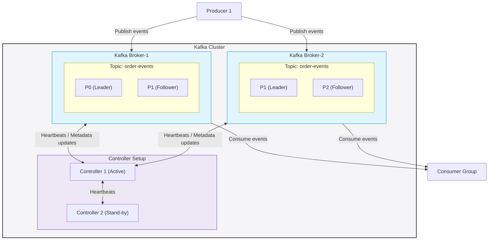
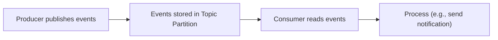
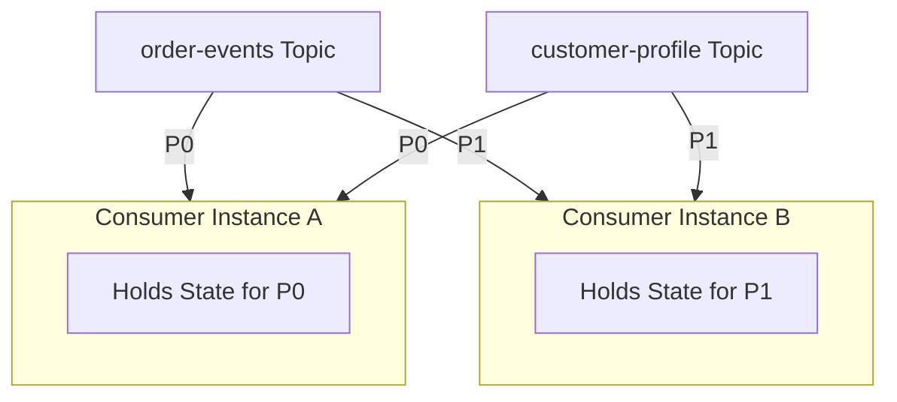

# Need for Kafka Stream (KStream)

To understand why we need **Kafka Streams (KStream)**, we must first look at the traditional Kafka architecture and analyze where the standard producer/consumer model falls short when processing data.

---

## 1. Traditional Kafka Architecture (Stateless Processing)

In a typical Kafka setup, we have Producers, a Kafka Cluster, and Consumer Groups.

### Kafka Cluster & Client Flow Diagram



### The Current Flow:
1. **Producer** publishes events.
2. **Events** are stored in a particular Topic Partition.
3. **Consumer** reads the events from the partition.
4. **Consumer** processes them (e.g., sends a notification).



### Key Observations of Stateless Processing:
* **Independence**: In a standard Kafka Consumer, each event is processed independently. No memory of previous events/messages is needed.
* **Direct Dependency**: Output depends entirely and solely on the current event.
* **No History**: There is no requirement to remember anything from previous events or messages.

> [!NOTE]
> This is known as **STATELESS** processing.

---

## 2. The Challenge: What if we need STATEFUL Processing?

**Stateful processing** means:
1. The output depends on the current event **and** previous events/messages.
2. We must remember (or maintain states) across messages.

> [!WARNING]
> Attempting stateful processing using the plain consumer API breaks the design model, as the Kafka Consumer APIs are optimized primarily for stateless consumption.

### Real-World Use Cases for Stateful Processing:
1. **Real-time Aggregation**: 
   * *Real-time total revenue per customer* (e.g., `Customer1: $100`, `Customer2: $150`).
   * *Real-time Leaderboards* (e.g., `UserC: 50 pts`, `UserA: 35 pts`, `UserB: 15 pts`).
2. **Window Operations**:
   * Calculating total revenue in the *last 5 minutes*.
3. **Joining Multiple Topics**:
   * Joining an `order-events` stream (containing `customer_id`) with a `customer-profile` stream to enrich the event with the customer's name.

---

## 3. Naive Approaches & Their Problems

If we try to implement stateful processing using a standard Kafka Consumer, we run into severe limitations.

### Approach 1: Storing State In-Memory
We store the running aggregation in an in-memory data structure (like a `ConcurrentHashMap`).

```java
@Component
public class RevenueConsumer {
    private final Map<String, Double> revenueMap = new ConcurrentHashMap<>();

    @KafkaListener(topics = "order-events")
    public void consume(OrderEvent event) {
        revenueMap.merge(
            event.getCustomerId(),
            event.getAmount(),
            Double::sum
        );
    }
}
```

#### The Problems with Approach 1:
1. **Application Crashes (Loss of State)**: If the application crashes, the in-memory map is completely lost. To rebuild the state, we must replay all messages from offset 0, which could be millions of records.
2. **Multiple Instances (Partial Data)**: When scaling out, each consumer instance only reads from its assigned partitions. Therefore, each instance only holds a **partial** view of the total state.

---

### Approach 2: Storing State in a Relational Database (e.g., MySQL)
To prevent state loss and partial state issues, we write the state to a database for every incoming event.

```java
@KafkaListener(topics = "order-events")
public void consume(OrderEvent event) {
    CustomerRevenue revenue = repository.findById(event.getCustomerId());
    revenue.setAmount(revenue.getAmount() + event.getAmount());
    repository.save(revenue);
}
```

#### The Problems with Approach 2:
* **Database Bottleneck**: For every single Kafka event, we must execute a `SELECT` query followed by an `UPDATE` query. 
* If the stream throughput is **100,000 events/sec**, the database must handle **100,000 SELECTs** and **100,000 UPDATEs** per second. The database will quickly become a performance bottleneck.

---

## 4. Advanced Stateful Requirements

As business requirements grow, the complexity of managing state manually multiplies:

### A. Window Operations
* **Use Case**: Track total revenue in the **last 5 minutes**.
* **Challenges with a plain consumer**:
  1. We must manually track timestamps of incoming messages.
  2. We must manually handle the expiration and eviction of old records out of the window.
  3. Across multiple scaled instances, each consumer instance still only sees a partial partition of the windowed data.

### B. Joining Two Topics
* **Use Case**: Join `order-events` (has `customer_id`) with `customer-profile` (has customer name).
* **Challenges with a plain consumer**:
  1. We must maintain a cache of customer profiles.
  2. If the cache is lost during a crash, it must be reconstructed by replaying from offset 0.
  3. **Partition Co-location and State Sharing**: 
     If Consumer-A processes Partition 0 (`P0`) for both topics, and Consumer-B processes Partition 1 (`P1`) for both topics:
     

     
What if Consumer-A needs to access profile information or state residing on Consumer-B? We would have to build a complex, custom **Distributed State Sharing** mechanism.

---

## 5. The Need for a Stream Processing Framework

If we try to manually solve all these stateful processing issues, we will end up building our own distributed stream processing framework from scratch. A complete stream processing framework must handle:

* **State Management**: Efficiently storing and retrieving state locally.
* **Windowing**: Managing time-based or event-based windows and evicting expired records.
* **Stream Joins**: Joining multiple data streams/topics out-of-the-box.
* **Crash Recovery**: Automatically checkpointing and rebuilding state without replaying all messages from offset 0.
* **Scaling & Partitioning**: Seamlessly distributing and sharing state across multiple worker nodes.

This is exactly why **Kafka Streams (KStream)** was created. It provides all of these capabilities natively, letting developers focus on business logic rather than complex distributed state infrastructure.
