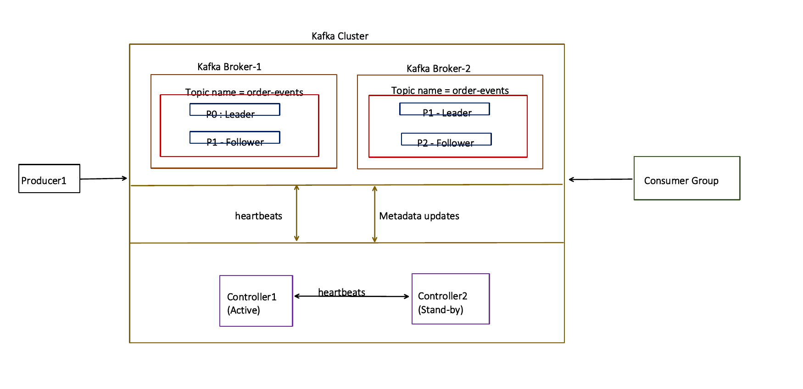
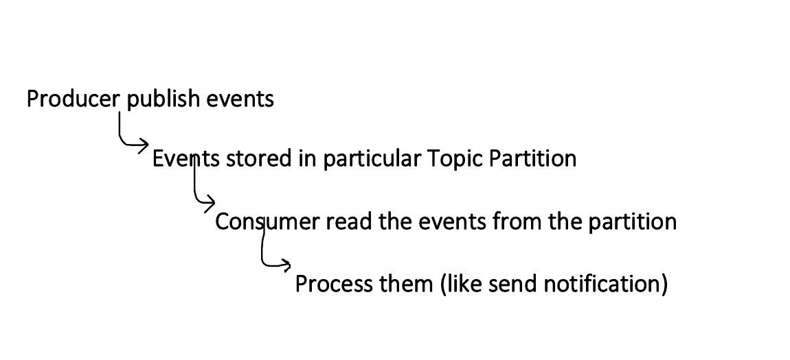

# Need for Kafka Streams (`KStream`)

## What we have covered so far

Before Kafka Streams, the basic Kafka flow consists of:

- Kafka Producer
- Kafka Cluster
- Kafka Consumer and Consumer Groups

A typical cluster contains brokers that host topic partitions and controllers that manage cluster metadata. Producers publish records to topic partitions, while consumers belonging to a consumer group read and process those records.



*Kafka cluster layout from the PDF.*

```text
Producer publishes events
        -> Events are stored in a topic partition
        -> Consumer reads events from the partition
        -> Consumer processes them, for example by sending notifications
```



*Current producer-to-consumer processing flow from the PDF.*

## Stateless processing with a plain Kafka Consumer

In the basic consumer flow:

- Each event is processed independently.
- The output depends only on the current event.
- The consumer does not need to remember earlier events or messages.

This is called **stateless processing**.

## Why stateful processing is different

In **stateful processing**:

- The output also depends on previous events or messages.
- The application must remember or maintain state across messages.

Although state can be managed manually with the Kafka Consumer API, doing so introduces difficult problems involving recovery, scaling, windowing, and joins.

## Real-world problem 1: Real-time aggregation

Examples of real-time aggregation include:

- Total revenue per customer
  - Customer 1: `$100`
  - Customer 2: `$150`
- A real-time leaderboard
  - User C: `50` points
  - User A: `35` points
  - User B: `15` points

The result for each new event depends on values accumulated from earlier events, so the processing is stateful.

### Approach 1: Store state in memory

```java
@Component
public class RevenueConsumer {

    private final Map<String, Double> revenueMap =
            new ConcurrentHashMap<>();

    @KafkaListener(topics = "order-events")
    public void consume(OrderEvent event) {
        revenueMap.merge(
                event.getCustomerId(),
                event.getAmount(),
                Double::sum
        );
    }
}
```

#### Problems with in-memory state

1. **Application crash**
   - The in-memory map is lost.
   - The state may need to be rebuilt by replaying millions of messages from offset `0`.

2. **Multiple application instances**
   - Each instance reads different partitions.
   - Consequently, every instance maintains only a partial view of the overall state.

### Approach 2: Store state in MySQL

```java
@KafkaListener(topics = "order-events")
public void consume(OrderEvent event) {
    CustomerRevenue revenue =
            repository.findById(event.getCustomerId());

    revenue.setAmount(
            revenue.getAmount() + event.getAmount()
    );

    repository.save(revenue);
}
```

#### Problems with database-backed state

Every Kafka event requires database operations:

```text
Kafka event -> SELECT -> UPDATE
```

At `100,000` events per second, this can produce approximately:

- `100,000` `SELECT` queries per second
- `100,000` `UPDATE` queries per second

The database can therefore become the processing bottleneck.

## Real-world problem 2: Window operations

Example requirement:

> Calculate total revenue during the last five minutes.

With a plain Kafka consumer, the application must manually:

1. Track event timestamps.
2. Expire entries that fall outside the window.
3. Combine partial window state maintained by multiple consumer instances.

## Real-world problem 3: Joining two topics

Example requirement:

> An `order-events` record contains `customer_id`. Join it with the corresponding record in `customer-profile` to obtain the customer's name.

### Problems with a manual consumer-based join

1. The application must maintain an in-memory map of customer profiles.
2. If the application crashes, that map is lost and may have to be rebuilt by replaying records from offset `0`.
3. With multiple consumer instances, each instance can hold only part of the required state.

For example:

```text
Consumer A:
  order-events-P0
  customer-profile-P0

Consumer B:
  order-events-P1
  customer-profile-P1
```

If an order handled by Consumer A requires a customer-profile entry held by Consumer B, the application needs **distributed state sharing**.

## Why Kafka Streams is needed

Solving these problems manually would mean building a stream-processing framework inside the consumer application. Such a framework would need to provide:

- State management
- Windowing
- Topic joins
- Crash recovery and state rebuilding
- Scaling by distributing partitions among multiple worker instances

Kafka Streams provides these stream-processing capabilities so applications do not have to implement all of this infrastructure manually.
