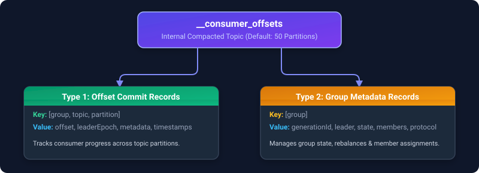
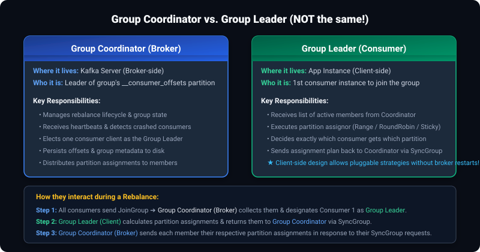
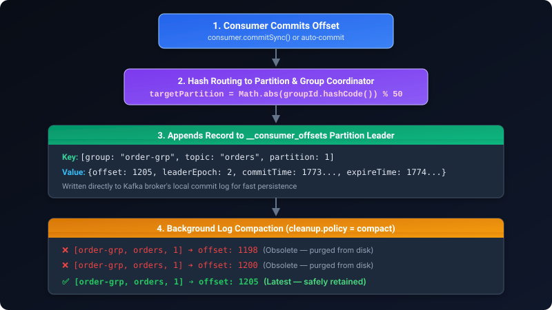
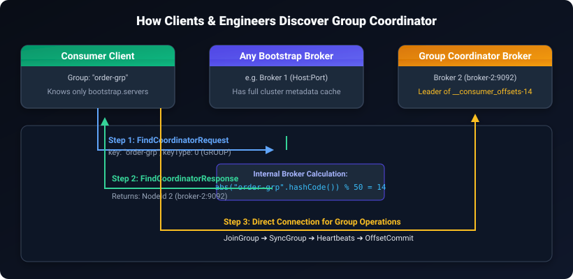
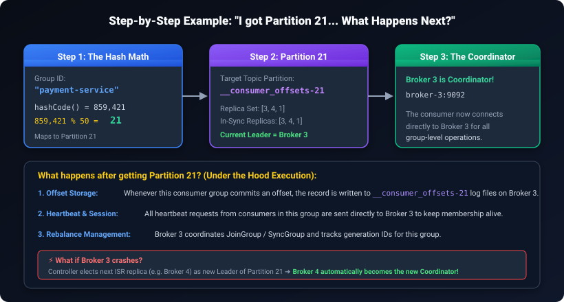

## Q1 How Controller elects from ISR who will be nect leader??


**Complete process: how the Controller elects a new partition leader from the ISR**

**Background setup**
- Every partition has a set of replicas (say Partition 0 of `orders` topic has replicas on Brokers 1, 2, 3).
- One of them is the **leader** (handles all reads/writes), the others are **followers**.
- The **ISR (In-Sync Replicas)** is the subset of these replicas that are fully caught up with the leader — this list is maintained dynamically and stored in cluster metadata.
- One broker in the cluster is elected as the **Controller** — it's responsible for all leader elections across every partition in the cluster (a special coordination role, not tied to any single partition).

**Step-by-step election process when a leader fails**

**1. Failure detection**
- The Controller maintains a live session/heartbeat with every broker (via ZooKeeper session in older Kafka, or via the Raft-based metadata quorum in KRaft/modern Kafka).
- When Broker 1 (the current leader of Partition 0) crashes or becomes unreachable, its session expires/times out. The Controller detects this — either via a ZooKeeper watch notification, or via the KRaft controller quorum noticing the broker stopped sending heartbeats/fetch requests.

**2. Controller identifies all affected partitions**
- Broker 1 might have been the leader for many partitions across many topics, not just Partition 0 of `orders`. The Controller compiles the full list of partitions that had Broker 1 as their leader.

**3. For each affected partition, the Controller looks at the ISR**
- For Partition 0, the Controller checks the current ISR list — say it's `[Broker1, Broker2, Broker3]` before the failure. Since Broker 1 just died, the Controller removes it, leaving `[Broker2, Broker3]` as the eligible candidates.
- **Only replicas in the ISR are eligible** — this is the core guarantee: any replica in the ISR is, by definition, fully caught up with all committed messages, so promoting one of them guarantees zero data loss.

**4. Controller picks the new leader**
- Typically, the Controller picks the **first replica in the ISR list** (often the "preferred replica" — the first replica in the partition's originally assigned replica list, if it's still in the ISR) as the new leader. Say Broker 2 is chosen.
- This isn't a complex voting process — the Controller unilaterally decides, since it's the single source of truth for cluster metadata.

**5. Controller updates and propagates the new state**
- The Controller writes the updated partition state — new leader = Broker 2, new ISR = `[Broker2, Broker3]`, and increments the **leader epoch** (a monotonically increasing number that prevents stale leader confusion — if Broker 1 somehow comes back thinking it's still leader, its epoch is now outdated and it gets rejected).
- This updated metadata is persisted (ZooKeeper znode update in older Kafka, or committed to the KRaft metadata log in modern Kafka).
- The Controller then sends a `LeaderAndIsr` request directly to all replicas of that partition (Broker 2 and Broker 3), informing Broker 2: "you are now the leader," and Broker 3: "Broker 2 is your new leader, start following it."

**6. Clients discover the new leader**
- Producers and consumers don't get pushed this info directly — they discover it the next time they send a request and get a `NotLeaderForPartition` error (if they were still targeting the dead Broker 1), which triggers them to refresh their metadata via a `Metadata` request to any live broker. This returns the updated leader info (Broker 2), and they redirect future requests there.

**Visual summary:**
```
Broker 1 (leader) crashes
        ↓
Controller detects failure (session timeout / heartbeat miss)
        ↓
Controller checks ISR for each affected partition: [Broker1, Broker2, Broker3] → remove dead Broker1 → [Broker2, Broker3]
        ↓
Controller picks new leader from remaining ISR (e.g., Broker2)
        ↓
Controller increments leader epoch, updates metadata (ZooKeeper/KRaft log)
        ↓
Controller sends LeaderAndIsr request to Broker2 (become leader) and Broker3 (follow Broker2)
        ↓
Producers/Consumers get NotLeaderForPartition error on stale requests → refresh metadata → discover Broker2 is new leader
```

**One-line interview answer:**
"When the Controller detects a broker failure via missed heartbeats, it looks at the ISR for every partition that broker led, removes the dead broker, and picks a new leader from the remaining in-sync replicas — guaranteeing no committed data is lost. It then increments the leader epoch to invalidate any stale leader claims, persists the new state to cluster metadata, and notifies the new leader and followers directly via a LeaderAndIsr request; clients discover the change lazily when their next request to the old leader fails and they refresh their metadata."


---

## Q2  What information does the `__consumer_offsets` topic hold?

### 1. High-Level Overview
- `__consumer_offsets` is an **internal Kafka topic** created automatically by Kafka to persist consumer group state.
- **History context:** Before Kafka 0.9, offsets were stored in ZooKeeper, which created huge read/write load bottlenecks on ZK. Kafka replaced this by storing offsets inside Kafka itself as messages in `__consumer_offsets`.
- **Topic Configuration Defaults:**
  - **Partitions:** 50 (`offsets.topic.num.partitions = 50`)
  - **Replication Factor:** 3 (`offsets.topic.replication.factor = 3` in multi-broker setups)
  - **Cleanup Policy:** `compact` (`cleanup.policy = compact`) — Kafka keeps only the latest status for each key and discards older, obsolete entries.

---

### 2. The Two Primary Types of Information Stored

Each message in `__consumer_offsets` is a key-value pair encoded with Kafka's internal binary schema. There are two major types of messages:



---

#### Type 1: Offset Commit Records (Track Consumer Progress)

Every time a consumer commits an offset (either auto-commit via `enable.auto.commit=true` or manual `commitSync()` / `commitAsync()`), a record is appended to `__consumer_offsets`:

* **Key (Compound identifier):**
  - **`Group ID`** (String) — The consumer group name (e.g., `"payment-service-group"`).
  - **`Topic`** (String) — The topic being consumed (e.g., `"orders"`).
  - **`Partition`** (Integer) — The partition number (e.g., `0`).
  - *(Together: `[Group, Topic, Partition]` uniquely identifies the stream position.)*

* **Value (Offset payload & metadata):**
  - **`Offset`** (Long) — The next offset the consumer expects to read (i.e., last processed offset + 1).
  - **`Leader Epoch`** (Integer) — The epoch of the partition leader when the offset was committed. (Used by Kafka to detect partition truncation or log divergence).
  - **`Metadata`** (String) — Optional custom string sent by the consumer during commit (e.g., application checkpoint data, host details).
  - **`Commit Timestamp`** (Long) — Timestamp when the offset was committed.
  - **`Expire Timestamp`** (Long) — When the offset record should expire if no new offsets are committed (governed by `offsets.retention.minutes`, default 7 days).

```json
// Conceptual representation of an Offset Commit record:
{
  "key": {
    "group": "order-consumer-group",
    "topic": "orders",
    "partition": 2
  },
  "value": {
    "offset": 450123,
    "leaderEpoch": 4,
    "metadata": "worker-node-03",
    "commitTimestamp": 1773794400000,
    "expireTimestamp": 1774399200000
  }
}
```

---

#### Type 2: Group Metadata Records (Track Consumer Group Membership & State)

`__consumer_offsets` does NOT just store offset numbers. It also serves as the **write-ahead state store for the Group Coordinator** to manage rebalances and group membership.

* **Key:**
  - **`Group ID`** (String) — E.g., `"order-consumer-group"`.

* **Value (Group state machine & member registry):**
  - **`Protocol Type`** (String) — Usually `"consumer"`.
  - **`Generation ID`** (Integer) — A monotonic counter incremented on every rebalance. Used to fence "zombie" consumers sending stale requests.
  - **`Current State`** (String) — Group state: `Empty`, `PreparingRebalance`, `CompletingRebalance`, `Stable`, or `Dead`.
  - **`Leader ID`** (String) — Member ID of the elected consumer group leader (the consumer client responsible for calculating partition assignments — *Note: Group Leader is NOT the same as Group Coordinator; see Section 3 below*).
  - **`Protocol`** (String) — Chosen partition assignment strategy (e.g., `range`, `roundrobin`, `cooperative-sticky`).
  - **`Members List`**: Detailed state for each active member in the group:
    - **`member_id`** (UUID string generated by broker, e.g., `order-consumer-group-1-987abc...`)
    - **`group_instance_id`** (Optional static member ID if using static membership)
    - **`client_id`** & **`client_host`** (IP and host of the consumer instance)
    - **`session_timeout_ms`** & **`rebalance_timeout_ms`**
    - **`subscription`** (Topics the member is subscribed to)
    - **`assignment`** (Topic partitions currently assigned to this member)

---

#### Type 3: Tombstones (Null Value Deletion Markers)
- When a consumer group is manually deleted, or an offset expires past `offsets.retention.minutes`, Kafka writes a record with the same key and a **`null` value**.
- During the next log compaction run, the cleaner thread sees the tombstone and purges the key and all previous historical records from disk completely.

---

### 3. Are "Group Coordinator" and "Group Leader" the Same? (Crucial Distinction)

> **Short Answer: NO! They are completely different entities living on opposite sides of the client-server boundary.**



| Dimension | **Group Coordinator** | **Group Leader** |
| :--- | :--- | :--- |
| **What is it?** | A **Kafka Broker** (Server-side) | A **Consumer Client instance** (Client-side application) |
| **Where does it run?** | Inside the Kafka broker cluster | In one of your consumer application JVMs/pods |
| **How is it chosen?** | **Deterministic Hash:** Broker hosting the leader of partition `Math.abs(groupId.hashCode()) % 50` of `__consumer_offsets` | **Coordinator elects it:** Typically the **first consumer instance** to send a `JoinGroup` request |
| **Core Role** | Manages group lifecycle, heartbeats, member sessions, and persistence to `__consumer_offsets` | Runs the client-side partition assignment algorithm (`Range`, `RoundRobin`, `Sticky`) |
| **Partition Assignment** | **Coordinates only:** Collects subscriptions from members, passes them to Leader, and fans out Leader's assignment | **Calculates the assignments:** Decides exactly which consumer gets which partition |

#### Step-by-Step Rebalance Collaboration:
1. **`JoinGroup` Phase:** Every consumer client sends a `JoinGroup` request to the **Group Coordinator (Broker)**.
2. **Election:** The **Group Coordinator** designates the first responder as the **Group Leader (Client)** and sends it the list of all active members and their topic subscriptions.
3. **Assignment Calculation:** The **Group Leader (Client)** executes the configured `ConsumerPartitionAssignor` (e.g., `CooperativeStickyAssignor`) to assign partitions to each member.
4. **`SyncGroup` Phase:** The **Group Leader** sends the computed assignment back to the **Group Coordinator** in a `SyncGroupRequest`. Other members send empty `SyncGroupRequest`s.
5. **Distribution:** The **Group Coordinator** responds to each member's `SyncGroupRequest` with their individually assigned partitions.

#### Why does Kafka separate these two roles? (Architecture Reason)
- **Zero Broker Re-deployments:** By delegating partition assignment to the client (Group Leader), developers can implement custom partition assignors or change assignment strategies completely on the client side without needing to change, restart, or recompile Kafka brokers.
- **Offloading Compute:** Brokers only coordinate network heartbeats and group state transitions, keeping broker CPU free for high-throughput I/O.

---

### 4. How Kafka Finds the Right Partition & Coordinator

How does a consumer know which broker handles its offsets?

1. **Partition Selection Formula:**
   ```java
   Math.abs(groupId.hashCode()) % numPartitions; // default numPartitions is 50
   ```
2. **Finding the Group Coordinator:**
   - The broker hosting the **Leader replica** of that specific `__consumer_offsets` partition is designated as the **Group Coordinator** for that consumer group.
   - When a consumer starts up, it sends a `FindCoordinatorRequest` to any bootstrap broker, which runs the hash formula and replies with the coordinator's broker address.

---

### 5. Why is `__consumer_offsets` Log-Compacted?

- Over time, billions of offset commits are produced. If stored as a regular topic, disk space would quickly run out.
- With **Log Compaction** (`cleanup.policy = compact`):
  - Kafka periodically cleans log segments.
  - For each `[Group, Topic, Partition]` key, Kafka retains **only the most recent committed offset**.
  - All older offset commits for that exact key are safely deleted.

---

### Visual Summary:


---

### One-line interview answer:
"`__consumer_offsets` is an internal, log-compacted Kafka topic with 50 partitions that holds two main things: (1) **Offset Commit records**, keyed by `[Group, Topic, Partition]` with values containing the committed offset, leader epoch, commit timestamp, and optional metadata; and (2) **Group Metadata records**, keyed by `[Group]` storing rebalance state, generation ID, member lists, and partition assignments for the Group Coordinator."


---

## Q3 Where and how do we get Group Coordinator information?

Group Coordinator information is accessed in two major scenarios:
1. **Automatically by Kafka Clients (Consumers & Producers):** Discovered dynamically over the network on startup.
2. **Manually by Engineers / Operators / Monitoring:** Inspected via Kafka CLI commands, the AdminClient API, or direct partition math.



---

### 1. How Kafka Clients Discover the Coordinator (Internal Protocol)

A consumer client does not need the Group Coordinator broker's IP or port in its configuration. It only needs `bootstrap.servers`.

#### The 3-Step Discovery Lifecycle:
1. **Client sends `FindCoordinatorRequest`:**
   - On startup (or after coordinator disconnection), the consumer establishes a connection to **any available bootstrap broker**.
   - It issues a `FindCoordinatorRequest` with:
     - `key`: The Consumer Group ID (e.g., `"order-consumer-group"`).
     - `keyType`: `0` (representing `GROUP` coordinator; `1` is for `TRANSACTION` coordinator).
2. **Broker Computes Partition & Reads Cluster Metadata:**
   - The recipient broker calculates the target partition on `__consumer_offsets`:
     $$\text{Partition} = |\text{groupId.hashCode()}| \pmod{50}$$
   - The broker checks its metadata cache to determine which broker is currently the **Leader replica** for that partition of `__consumer_offsets`.
3. **Broker replies with `FindCoordinatorResponse`:**
   - The broker sends back the coordinator's node details: **Node ID, Hostname, and Port** (e.g., `Node 2 @ broker-2:9092`).
   - The consumer then opens a dedicated socket connection directly to Broker 2 to perform all group operations:
     - `JoinGroup` / `SyncGroup` (rebalances)
     - `Heartbeat` requests
     - `OffsetCommit` / `OffsetFetch` requests

> **Automatic Failover:** If the coordinator broker dies, the Controller / KRaft quorum promotes an in-sync replica (ISR) to become the new leader of that `__consumer_offsets` partition. The consumer receives a `NOT_COORDINATOR` or `COORDINATOR_NOT_AVAILABLE` exception, which automatically triggers a new `FindCoordinatorRequest` to reconnect to the new leader broker seamlessly.

---

### 2. How Engineers / Operators Get Coordinator Information

#### Method A: Using Kafka CLI (`kafka-consumer-groups.sh`)
The standard and quickest command-line inspection tool:

```bash
kafka-consumer-groups.sh --bootstrap-server localhost:9092 \
  --describe --group order-consumer-group --state
```

**Example Output:**
```text
GROUP                 COORDINATOR (ID)          ASSIGNMENT-STRATEGY  STATE           #MEMBERS
order-consumer-group  broker-2:9092 (2)         range                Stable          3
```
*The `COORDINATOR (ID)` column shows the exact host, port, and broker node ID (`broker-2:9092 (2)`).*

---

#### Method B: Programmatically via `AdminClient` (Java / Python / Go)
To inspect the coordinator inside health checks, microservices, or custom dashboards:

```java
Properties props = new Properties();
props.put(AdminClientConfig.BOOTSTRAP_SERVERS_CONFIG, "localhost:9092");

try (AdminClient admin = AdminClient.create(props)) {
    ConsumerGroupDescription desc = admin.describeConsumerGroups(
            Collections.singletonList("order-consumer-group")
    ).describedGroups().get("order-consumer-group").get();

    org.apache.kafka.common.Node coordinator = desc.coordinator();
    System.out.println("Coordinator Broker ID: " + coordinator.id());
    System.out.println("Coordinator Host: " + coordinator.host());
    System.out.println("Coordinator Port: " + coordinator.port());
}
```

---

#### Method C: Manual Calculation (Under the Hood Verification)
You can manually determine the coordinator in 2 quick steps:

1. **Calculate the partition number:**
   ```java
   int partition = Math.abs("order-consumer-group".hashCode()) % 50; 
   // e.g., result is 14
   ```
2. **Describe partition 14 of `__consumer_offsets`:**
   ```bash
   kafka-topics.sh --bootstrap-server localhost:9092 \
     --describe --topic __consumer_offsets --partition 14
   ```
   **Output:**
   ```text
   Topic: __consumer_offsets  Partition: 14  Leader: 2  Replicas: 2,3,1  Isr: 2,3,1
   ```
   *The broker listed as `Leader` (Broker 2) is the Group Coordinator!*

---

### 3. Detailed Example: How `Partition = |groupId.hashCode()| % 50` Works ("Suppose I get Partition 21, then what?")

Let's walk through a concrete, end-to-end example.



#### Step 1: The Math Breakdown
Suppose your consumer group is named `"payment-service"`.

1. **Calculate Java Hash Code:**
   In Java, every `String` has a deterministic 32-bit signed integer hash code computed from its characters:
   ```java
   "payment-service".hashCode(); // Returns integer: 859421
   ```
2. **Take Absolute Value:**
   Hash codes can be negative (e.g., `-1048596829`). A negative partition index is invalid, so Kafka takes the absolute value:
   ```java
   Math.abs(859421); // = 859421
   ```
   *(Note: Kafka's internal utility `Utils.abs()` additionally handles `Integer.MIN_VALUE` by mapping it to 0, since `Math.abs(Integer.MIN_VALUE)` overflows back to negative in Java).*
3. **Modulo 50 (Total Partitions in `__consumer_offsets`):**
   ```java
   859421 % 50 = 21; // Remainder is 21
   ```
   **Result:** This consumer group maps to **Partition 21** of `__consumer_offsets`.

---

#### Step 2: "Suppose I get Partition 21... Then what happens?"

> **Important Realization:** Getting Partition 21 does **NOT** mean "Broker 21" is your coordinator (you might only have 3 or 5 brokers in your entire cluster!).

Here is what happens under the hood:

1. **Kafka Inspects Cluster Metadata for `__consumer_offsets-21`:**
   In a cluster (say 5 brokers: Brokers 1, 2, 3, 4, 5), the 50 partitions of `__consumer_offsets` are distributed evenly across the brokers.
   
   If you describe Partition 21 using the Kafka CLI:
   ```bash
   kafka-topics.sh --bootstrap-server localhost:9092 \
     --describe --topic __consumer_offsets --partition 21
   ```
   **Output:**
   ```text
   Topic: __consumer_offsets  Partition: 21  Leader: 3  Replicas: 3,4,1  Isr: 3,4,1
   ```
   - Partition 21 has replicas stored on **Broker 3, Broker 4, and Broker 1**.
   - **The current Leader replica is on Broker 3.**

2. **Broker 3 is Officially Designated as the Group Coordinator:**
   Because **Broker 3** is currently hosting the **Leader replica** of Partition 21, **Broker 3 automatically and officially becomes the Group Coordinator** for `"payment-service"`.

3. **What Happens During Runtime?**
   - **All Group Communication routes to Broker 3:** The consumer connects to `broker-3:9092` for `JoinGroup`, `SyncGroup`, and `HeartbeatRequest`.
   - **Offset Commits are written to Partition 21 on Broker 3:** When the consumer calls `commitSync()`, the committed offset message is appended to the local disk log file `__consumer_offsets-21/` on Broker 3, and replicated to followers (Broker 4 & Broker 1).

4. **What if Broker 3 Crashes? (Seamless Failover):**
   - The Kafka Controller detects Broker 3 has failed.
   - The Controller checks the ISR for Partition 21 (`[Broker 4, Broker 1]`) and elects **Broker 4** as the new Leader of Partition 21.
   - **Instantly, Broker 4 becomes the new Group Coordinator for `"payment-service"`!**
   - When the consumer's next heartbeat to Broker 3 times out or fails with `NOT_COORDINATOR`, the consumer automatically asks any bootstrap broker for the coordinator again (`FindCoordinatorRequest`).
   - The broker replies with **Broker 4**, and the consumer resumes normal operation without any lost committed offsets!

---

### One-line interview answer:
"Clients discover the Group Coordinator dynamically by sending a `FindCoordinatorRequest` to any bootstrap broker, which calculates `Math.abs(groupId.hashCode()) % 50` and returns the leader broker of that `__consumer_offsets` partition; operators inspect it via `kafka-consumer-groups.sh --describe --group <name> --state` or `AdminClient.describeConsumerGroups()`."

---

## Q4 What are Message Delivery Semantics in Kafka? (At-Most-Once, At-Least-Once, Exactly-Once)

In distributed streaming systems, message delivery guarantees describe how the system behaves when failures (network timeouts, broker crashes, or consumer crashes) occur.

---

### High-Level Comparison Table

| Semantic | Delivery Guarantee | Potential Risk | Producer Settings | Consumer Behavior | Typical Use Case |
|---|---|---|---|---|---|
| **At-Most-Once** | Messages delivered **0 or 1 time** | **Data Loss** (no duplicates) | `acks=0` (or `retries=0`) | Commits offset **before** processing records | High-volume logs, metrics, telemetry where speed > completeness |
| **At-Least-Once** *(Default)* | Messages delivered **1 or more times** | **Duplicate Messages** (no data loss) | `acks=all` (or `1`), `retries > 0` | Commits offset **after** processing records | Order processing, billing, payments (with idempotent sink) |
| **Exactly-Once (EOS)** | Messages delivered & processed **effectively 1 time** | Minor latency overhead | `enable.idempotence=true`, `transactional.id` | `isolation.level=read_committed`, atomic offset commits | Read-Process-Write stream pipelines, financial ledgers |

---

### 1. At-Most-Once (No Duplicates, Possible Data Loss)

> **Core Philosophy:** "Fire and forget — if a message fails, let it go; never send or process it twice."

#### How It Happens:
1. **Producer Side:**
   - Producer sets `acks=0` (doesn't wait for broker acknowledgment) or `retries=0`.
   - If the network drops or the broker crashes before persisting the message, the message is **lost permanently**.
2. **Consumer Side:**
   - The consumer reads a batch (e.g., offsets 100 to 105).
   - **Immediately commits offset 106 to Kafka *before* processing the records.**
   - If the consumer worker crashes or throws an exception while processing offset 102:
     - On restart, the consumer resumes from committed offset **106**.
     - Offsets **102, 103, 104, and 105 are permanently lost**.

#### Consumer Code Pattern:
```java
ConsumerRecords<String, String> records = consumer.poll(Duration.ofMillis(100));
consumer.commitSync(); // ⚠️ Offset committed BEFORE processing!

for (ConsumerRecord<String, String> record : records) {
    process(record);   // If this crashes, records are lost!
}
```

---

### 2. At-Least-Once (No Data Loss, Possible Duplicates) — Kafka's Default

> **Core Philosophy:** "Guarantee every message arrives at all costs — if something goes wrong, retry even if it creates duplicates."

#### How It Happens:
1. **Producer Side:**
   - Producer sets `acks=all` (or `acks=1`) and `retries > 0`.
   - The producer sends a message. The broker writes it to disk, but the network connection drops *before* the ACK reaches the producer.
   - The producer assumes failure and **retries sending the message**.
   - Result: The broker now has **two identical copies** of the message.
2. **Consumer Side:**
   - The consumer reads records with offsets 100 to 105.
   - The consumer **processes all records first**.
   - The consumer **commits offset 106 *after* processing**.
   - If the consumer crashes *after* processing record 104 but *before* the commit succeeds:
     - On restart, the consumer starts from the last committed offset (say 100).
     - It re-processes records 100 through 104, resulting in **duplicate processing**.

#### Consumer Code Pattern:
```java
ConsumerRecords<String, String> records = consumer.poll(Duration.ofMillis(100));

for (ConsumerRecord<String, String> record : records) {
    process(record);   // Process first
}

consumer.commitSync(); // ✅ Commit offset AFTER processing completes
```

#### How to Handle Duplicates in At-Least-Once:
Since duplicates can occur, downstream applications use **Idempotency**:
- **Unique Constraint / Dedup Table:** Storing the message key or ID in a cache (Redis) or DB unique column.
- **Idempotent Upserts:** `INSERT ... ON DUPLICATE KEY UPDATE` or Elasticsearch doc indexing by deterministic ID.

---

### 3. Exactly-Once Semantics (EOS)

> **Core Philosophy:** "Even if brokers crash, networks retry, or consumers fail, every message is processed as if it occurred exactly once."

Kafka achieves Exactly-Once via two distinct layers:

#### Layer A: Idempotent Producer (`enable.idempotence=true`)
* **Solves:** Producer-to-broker duplicates caused by network retries.
* **Mechanism:**
  - Broker assigns the producer an internal **PID** (Producer ID) via `InitProducerId`.
  - For each partition, the producer tags every batch with a monotonically increasing **Sequence Number** (0, 1, 2, ...).
  - The broker stores the highest sequence number written per PID.
  - If the broker receives a duplicate sequence number on retry (e.g., Sequence 5 again), it discards the duplicate write but returns an `ACK` to the producer.
* **Scope:** Guarantees exactly-once writes for a **single producer session to a single partition**.

#### Layer B: Transactions & Read-Process-Write (End-to-End within Kafka)
* **Solves:** Atomic state transitions when consuming from one topic, doing transformations, and producing to another topic.
* **Mechanism:**
  1. Producer is configured with a stable `transactional.id`.
  2. The producer coordinates with the **Transaction Coordinator** broker.
  3. The producer sends the outgoing records AND sends the consumer offset to the transaction via `sendOffsetsToTransaction()`.
  4. Producer calls `commitTransaction()`:
     - The coordinator writes a commit marker (`isControl=true`) to both the output topic and `__consumer_offsets`.
     - Output messages and offset commits become effective **atomically**.
  5. Downstream consumers configure `isolation.level=read_committed`:
     - Consumers only read messages whose transaction has successfully committed.
     - Aborted messages are skipped using the broker's `.txnindex`.
     - Uncommitted messages are held behind the **LSO (Last Stable Offset)**.

#### Read-Process-Write Code Structure:
```java
producer.initTransactions();

while (true) {
    ConsumerRecords<String, String> records = consumer.poll(Duration.ofMillis(100));
    
    producer.beginTransaction(); // Start atomic boundary
    try {
        for (ConsumerRecord<String, String> record : records) {
            String transformed = process(record.value());
            producer.send(new ProducerRecord<>("output-topic", transformed));
        }
        
        // Atomically commit consumer offsets within the SAME transaction!
        producer.sendOffsetsToTransaction(
            getOffsetsToCommit(consumer), 
            consumer.groupMetadata()
        );
        
        producer.commitTransaction(); // Both output & offsets committed together!
    } catch (Exception e) {
        producer.abortTransaction();  // Rollback everything on failure!
    }
}
```

---

### One-line interview answer:
"At-most-once guarantees no duplicates but risks message loss by committing offsets before processing; at-least-once prevents data loss by retrying and committing after processing but can produce duplicates; and Exactly-Once (EOS) combines idempotent producers (PID + sequence numbers) with transactional Read-Process-Write (`sendOffsetsToTransaction` and `read_committed`) to guarantee messages are produced and consumed effectively once with zero loss and zero duplicates."

---

## Q5 Can Kafka guarantee Exactly-Once delivery if the downstream sink is an external database (e.g., MySQL, Elasticsearch)?

### Short Direct Answer:
> **No, Kafka alone cannot guarantee Exactly-Once delivery to external systems.**
> 
> Kafka's built-in transactions and Exactly-Once Semantics (EOS) are strictly **Kafka-to-Kafka** (producing from Kafka topics, processing, and writing back to Kafka topics + `__consumer_offsets`). 
> 
> However, you can achieve **effectively exactly-once processing** by coordinating Kafka with the target database using specific design patterns.

---

### 1. Why Kafka Cannot Do It Alone (The Dual-Write Problem)

Writing to an external database and committing an offset back to Kafka are **two separate, independent network operations across two different distributed systems**.

```
[Consumer] ─── (Step 1: Write Data) ───► [External DB (MySQL/ES)]
    │
    └───────── (Step 2: Commit Offset) ──► [Kafka (__consumer_offsets)]
```

Because there is no built-in distributed Two-Phase Commit (2PC / XA) transaction manager spanning both Kafka and external databases, failures cause inconsistencies:

1. **Failure Scenario 1 (Duplicate Writes):**
   - Step 1 succeeds: Data is inserted into MySQL.
   - Step 2 fails: Consumer crashes or network times out before committing offset to Kafka.
   - **Result:** The new consumer restarts from the old offset, re-reads the same record, and inserts it into MySQL again (**Duplicate record!**).

2. **Failure Scenario 2 (Data Loss):**
   - If you reverse the order (commit offset to Kafka first, then write to DB):
   - Offset commit succeeds in Kafka.
   - DB insert fails (DB down, constraint violation, crash).
   - **Result:** The record is marked as consumed in Kafka, but never made it into the database (**Data lost permanently!**).

---

### 2. How to Achieve Exactly-Once with External Systems in Production

To overcome this, engineers use one of three proven architectural patterns:

#### Pattern 1: Idempotent Consumer / Idempotent Writes (Industry Standard & Most Common)
Instead of trying to ensure a message is delivered strictly once, we accept **At-Least-Once delivery** from Kafka, but make the database operation **Idempotent** (performing it multiple times produces the exact same state as performing it once).

* **Relational Databases (MySQL / PostgreSQL):**
  Use the Kafka message key or business unique ID as the primary/unique key and execute an `UPSERT`:
  ```sql
  INSERT INTO orders (order_id, user_id, amount, status)
  VALUES ('ORD-12345', 'user-99', 250.00, 'CONFIRMED')
  ON DUPLICATE KEY UPDATE
      amount = VALUES(amount),
      status = VALUES(status);
  ```

* **Document Stores / Search Engines (Elasticsearch / MongoDB):**
  Use deterministic document IDs with `PUT` instead of `POST`:
  ```http
  PUT /orders/_doc/ORD-12345
  {
    "user_id": "user-99",
    "amount": 250.00,
    "status": "CONFIRMED"
  }
  ```
  *(Indexing by specific ID is naturally idempotent. Re-indexing the same message simply overwrites with identical values without creating duplicates).*

---

#### Pattern 2: Atomic Transaction Storing Offsets in the Target Database
If the target sink is an ACID-compliant relational database (like PostgreSQL or MySQL), you can **bypass Kafka's `__consumer_offsets` completely** and store the Kafka offset directly inside the target database within the same local ACID transaction!

1. Create a dedicated table in MySQL:
   ```sql
   CREATE TABLE kafka_consumer_offsets (
       topic VARCHAR(255),
       partition_id INT,
       consumer_group VARCHAR(255),
       committed_offset BIGINT,
       PRIMARY KEY (topic, partition_id, consumer_group)
   );
   ```
2. For each message (or batch of messages), save business records AND the offset in a **single atomic database transaction**:
   ```sql
   START TRANSACTION;

   -- 1. Insert business payload
   INSERT INTO orders (order_id, user_id, amount) VALUES ('ORD-12345', 'user-99', 250.00);

   -- 2. Update consumer offset in the same DB transaction
   INSERT INTO kafka_consumer_offsets (topic, partition_id, consumer_group, committed_offset)
   VALUES ('orders', 0, 'order-processor-group', 501)
   ON DUPLICATE KEY UPDATE committed_offset = 501;

   COMMIT; -- Both business data and offset commit atomically!
   ```
3. **On Consumer Startup / Rebalance:**
   - Disable automatic commit: `enable.auto.commit=false`.
   - Implement `ConsumerRebalanceListener.onPartitionsAssigned(...)`:
   - Query `kafka_consumer_offsets` table in the database to get the last committed offset, and call `consumer.seek(partition, dbOffset)`.
   - **Result:** Truly 100% Exactly-Once processing guarantee. If the DB transaction rolls back, neither data nor offset is saved!

---

#### Pattern 3: Two-Phase Commit (2PC) with Kafka Connect & Storage Sinks
For object stores or analytical sinks (like AWS S3, HDFS, Snowflake, Delta Lake):
- Sinks like **Kafka Connect S3 Sink** write records to temporary staged files on disk or S3.
- When the Kafka Connect task commits an offset, it flushes the temporary file and executes an atomic metadata rename/commit in S3.
- If a failure happens before the commit, temporary uncommitted files are discarded.

---

### Comparison of Solutions

| Approach | Where is Offset Stored? | Complexity | Supported Databases | Performance |
|---|---|---|---|---|
| **Idempotent Writes (Upsert)** | Kafka (`__consumer_offsets`) | Low | MySQL, Postgres, Elasticsearch, Redis, MongoDB | High (Standard) |
| **Offset in Target DB** | Target DB (`kafka_consumer_offsets`) | Medium | Only ACID SQL Databases (MySQL, Postgres, Oracle) | Slightly lower (DB transaction overhead per batch) |
| **2PC / Atomic Staging** | Kafka + File Metadata | High | Object stores (S3, HDFS), BigQuery, Snowflake | Batch-oriented |

---

### One-line interview answer:
"Kafka alone cannot guarantee Exactly-Once delivery to external sinks because Kafka transactions do not span external systems (the dual-write problem); however, we achieve end-to-end exactly-once semantics either by pairing at-least-once consumption with **idempotent writes (UPSERT / unique document IDs)**, or by committing the Kafka offset inside the target database within the **same local ACID transaction** as the business data."


